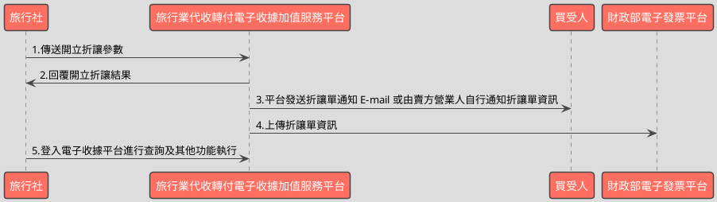

# 折讓電子收據API

> 本文件包含 **AES256 加密、SHA256 簽章** 規格，詳見下方對應章節

---

## API 基本資訊

| 項目 | 內容 |
|:-----|:-----|
| 副標題 | 折讓已開立電子收據 |
| 串接方式 | 幕後 |
| Content-Type | `application/x-www-form-urlencoded` |
| 加密方式 | AES256、SHA256 |
| 正式環境 URL | https://api.travelinvoice.com.tw/allowance_issue |
| 測試環境 URL | https://capi.travelinvoice.com.tw/allowance_issue |

---

## 欄位定義

### Post 參數（請求） [POST]

| 欄位名稱 | 中文說明 | 型別 | 長度 | 必填 | 預設值 | 允許值 | 可為空 | 範例 | 備註 |
|----------|----------|------|------|------|--------|--------|--------|------|------|
| MerchantID_ | 旅行社統一編號 | string | 8 | 必填 |  |  |  | 54352706 | 旅行社統一編號。 |
| PostData_ | 加密資料 | array |  | 必填 |  |  |  |  | 字串欄位組合後做AES256加密，欄位說明如下表 |

### PostData_內含欄位（請求）　AES加密_字串

| 欄位名稱 | 中文說明 | 型別 | 長度 | 必填 | 預設值 | 允許值 | 可為空 | 範例 | 備註 |
|----------|----------|------|------|------|--------|--------|--------|------|------|
| Version | 串接程式版本 | string | 5 | 必填 |  | 1.0 |  | 1.0 | 固定帶 1.0 |
| TimeStamp | 時間戳記 | string | 30 | 必填 |  |  |  | 1400137200 | Unix 時間戳記（秒），即自 1970-01-01 00:00:00 UTC 至今的秒數 例：2014-05-15 15:00:00 這個時間的時間，戳記為 1400137200，建議帶入當前時間 |
| InvoiceNo | 收據號碼 | string | 9 | 必填 |  |  |  | T13671009 | 欲執行折讓之收據號碼。 |
| MerchantOrderNo | 收據自訂編號 | string | 30 | 必填 |  |  |  | Or_5555511 | 於開立收據時，收據所屬的自訂編號。（需藉由InvoiceNo取得該收據的MerchantOrderNo） 注意：這裡是要填寫收據的自訂編號，而不是隨機產一個號碼 |
| ItemName | 摘要（商品名稱） | string | 286 | 必填 |  |  |  | 商品一\|商品二 | 多項商品時，商品名稱以 \| 分隔。例：ItemName=”商品一\|商品二 1.全部商品名稱總字數最多 280 個字。 2.單一品項名稱最多可接受 160 個字,中文、英文、數字符號皆算一個字 3.單一收據最多可接受 7 個品項，品項名稱每超過 40 個字，可輸入的品項就少一個。 |
| ItemCount | 折讓商品數量 | string | 41 | 必填 |  |  |  | 1\|1 | 1. 商品數量為純數字，每項商品最多 5 位數。 2. 多項商品時，商品數量以 \| 分隔。例：ItemCount =”1\|2” |
| ItemUnit | 折讓商品單位 | string | 20 | 必填 |  |  |  | 個\|公斤 | 1. 內容如：個、件、本、張…..。 2. 多項商品時，商品單位以 \| 分隔。例：ItemUnit =”個\|本” 3. 每個商品最多兩個字。例：ItemUnit =”個\|公斤” |
| ItemPrice | 折讓商品單價 | string | 62 | 必填 |  |  |  | 200\|100 | 1. 單價部分為純數字。 2. 多項商品時，商品單價以 \| 分隔。例：ItemPrice =”200\|100” 3. 每個商品單價金額不能超過 8 位數 |
| ItemAmt | 折讓商品小計 | string | 62 | 必填 |  |  |  | 200\|200 | 1. 小計部分為純數字。 2. 計算方式為：數量 * 單價 = 小計。平台將會檢查數值是否計算正確。 3. 多項商品時，商品小計以 \| 分隔。例：ItemAmt =”200\|200” 4. 每個商品小計金額計算後不能超過 8位數 |
| TotalAmt | 折讓總金額 | int | 8 | 必填 |  |  |  | 400 | 1.此次開立折讓加總金額。總金額不能超過 8 位數。 2.折讓總金額必須小於等於收據總金額。 3.折讓總金額需等於全部折讓商品金額總額。 |
| BuyerEmail | 折讓通知電子信箱 | string | 100 | 選填 |  |  |  | abc@gmail.com | 1. 折讓通知信，平台預設會寄送給買受人 2. 若需帶入多個買受人信箱，請以逗號分隔。 3. 此欄位用於新增更多收件人，若帶入重複信箱，平台會進行過濾避免重複發送。 |
| SellerName | 經辦人名稱 | string | 50 | 必填 |  |  |  | 業務窗口258 | 開立折讓單人員名稱。純記錄，系統不檢核。如未填寫則無法開立成功，系統回覆錯誤代碼。 |
| Status | 確認折讓方式 | int | 1 | 必填 |  | 0,1 |  | 1 | 0=開立等待折讓。 1=立即折讓。 |

### 系統回應訊息（回應）

| 欄位名稱 | 中文說明 | 型別 | 長度 | 範例 | 必回傳 | 備註 |
|----------|----------|------|------|------|--------|------|
| Status | 回傳狀態 | string | 10 | SUCCESS | Y | 1.折讓單開立成功，則回傳 SUCCESS 2.折讓單開立失敗，則回傳錯誤代碼 |
| Message | 回傳訊息 | string | 30 | 成功 | Y | 文字，此次回傳狀態說明 |
| MerchantID | 旅行社代號 | string | 8 | 54352706 |  | 旅行社統一編號 |
| AllowanceNo | 折讓單流水號 | string | 20 | 193060 |  | 此次開立折讓的系統流水號。 |
| InvoiceNumber | 收據號碼 | string | 9 | T13671008 |  | 此次折讓收據或等待折讓的收據號碼。 |
| MerchantOrderNo | 自訂編號 | string | 30 | Or_5555511 |  | 此次開立折讓的收據，於開立收據時，提供之自訂編 號。 |
| AllowanceAmt | 折讓金額 | int | 8 | 400 |  | 此次開立折讓的金額。 |
| RemainAmt | 折讓後剩餘 收據金額 | int | 8 | 600 |  | 確認折讓後，此張收據剩餘之收據金額。 |
| CheckCode | 檢查碼 | string | 150 | 0C69DBB83FD36B6A2B2E9E614DAEA3D91D474C2D8A829870CA91511C55AF2AA |  | 用來檢查此次資料回傳的合法性，串接時可以比對此參數資料，來檢核是否為平台所回傳，檢核方法請參考”SHA256加密說明”。如開立失敗則回傳空值。  CheckCode = 將 InvoiceTransNo, MerchantID, MerchantOrderNo, RandomNum, TotalAmt 依 SHA256 簽章規格計算所得之雜湊值  InvoiceTransNo , RandomNum, TotalAmt不含在此API回應欄位中，需讓程式由InvoiceNumber（收據號碼）於資料庫中來取得這3個欄位資料。 |
| EndStr | 字串結尾 | string | 2 | ## | Y | 固定回傳 ##，使用 String 方式接收資料的用戶，須多判斷 EndStr=##，確保資料傳遞完整。 |

---

## 錯誤代碼

> 以下錯誤代碼均於 **HTTP 200** 回應中回傳，錯誤訊息包含於 response body。

| 代碼 | 說明 |
|------|------|
| KEY10001 | 非旅行社 API 串接 IP |
| KEY10002 | 資料解密錯誤 |
| KEY10003 | 版本錯誤 |
| KEY10004 | 資料不齊全 |
| KEY10006 | 旅行社未申請啟用電子收據 |
| KEY10007 | 頁面停留超過 30 分鐘 |
| KEY10009 | 取不到旅行社統一編號的資料 |
| KEY10010 | 旅行社統一編號空白 |
| KEY10011 | PostData_欄位空白 |
| KEY10012 | 資料傳遞錯誤 |
| KEY10013 | 資料空白 |
| KEY10014 | TimeOut。通常泛指 I/O 上的 time out |
| KEY10015 | 收據金額格式錯誤 |
| KEY10019 | 旅行社已被停權 |
| NOR10001 | 網路連線異常 |
| ALW10002 | 此收據號碼折讓總金額超過開立金額 |
| ALW10003 | 開立折讓失敗 |
| ALW10004 | 觸發折讓狀態失敗 |
| ALW10005 | 已確認折讓，無法再執行取消折讓 |
| ALW10006 | 折讓商品名稱總計超過 280 個字 |
| ALW10007 | 折讓商品名稱超過 7 個商品 |
| ALW10008 | 折讓商品數量非純數字 |
| ALW10009 | 折讓商品單位字數超過 2 個字 |
| ALW10010 | 折讓商品單價超過 8 位數 or 非純數字 |
| ALW10011 | 折讓商品小計超過 8 位數 or 非純數字 |
| ALW10012 | 折讓總金額超過 8 位數 or 非純數字 |
| ALW10013 | 商品資訊的商品小計計算錯誤 |
| ALW10014 | 收據金額驗證錯誤 |
| ALW10015 | 觸發折讓狀態錯誤 |
| ALW10016 | 確認折讓方式錯誤 |
| ALW10017 | 折讓單號錯誤 |

---

## 串接範例

### 請求範例

> 示範用 Key：`12345678901234567890123456789012`（32 bytes）　IV：`1234567890123456`（16 bytes）

> 外層請求參數組合格式：**String**，各必填欄位以 `欄位名稱=值` 形式，以 `&` 符號串接後傳送，簡單字串拼接 key=value&key=value，不做 URL encode

```http
POST https://api.travelinvoice.com.tw/allowance_issue
Content-Type: application/x-www-form-urlencoded

MerchantID_=54352706&PostData_=672781a0cacae60a9e8bf6e0866d113f5b90725edbb2af54aea18d6b41f6d8f3c3fd4ac885d96719d02b8888d49e6b2512e161548f9eccaa19393dba229a8ad3b268f27d8f5d6fbc07855a0772d4410d5d1fffcc3e76d5a527ce88fcbfd0b715832bec873ffcd8ab39f00d20e46ad655b3f354597ccc305c1d5bc5922028f9eb87acd5cdb9d75b633b42173678aae10771a5c624a66843d9482e1b4feba11690532ebf74050cf89b959f35098025733e08f452639c63ab5f511c826a3c4558624427c0c828e78a9f9e170ef00b9e4bd111003323cfbdbcf55c85c934d1ce54898a4f1c304c56224af549276888d9c21044c90d67e2db853834c22a569b767dca
```

**PostData_（AES加密_字串）加密前明文（必填欄位）**

> 加密：AES-256-CBC，輸出：Hex，Key 與 IV 同上
> 欄位組合格式：**String**，各必填欄位以 `欄位名稱=值` 形式，以 `&` 符號串接後加密

```
Version=1.0&TimeStamp=1400137200&InvoiceNo=T13671009&MerchantOrderNo=Or_5555511&ItemName=商品一|商品二&ItemCount=1|1&ItemUnit=個|公斤&ItemPrice=200|100&ItemAmt=200|200&TotalAmt=400&SellerName=業務窗口258&Status=1
```

### 成功回應範例

> 回傳內容為 URL 編碼字串，請先進行 URL 解碼後，依 key=value 格式逐欄解析，各欄位以 & 分隔。

> 外層回應格式：**String**，各欄位以 `欄位名稱=值` 形式，以 `&` 符號串接後回傳

**系統回應**

```
Status=SUCCESS&Message=成功&MerchantID=54352706&AllowanceNo=193060&InvoiceNumber=T13671008&MerchantOrderNo=Or_5555511&AllowanceAmt=400&RemainAmt=600&CheckCode=0C69DBB83FD36B6A2B2E9E614DAEA3D91D474C2D8A829870CA91511C55AF2AA&EndStr=##
```

> 本 API 回應無加密欄位，上方字串即為完整明文。

### 失敗回應範例

> 回傳內容為 URL 編碼字串，請先進行 URL 解碼後，依 key=value 格式逐欄解析，各欄位以 & 分隔。

**系統回應**

```
Status=KEY10001&Message=非旅行社 API 串接 IP&EndStr=##
```

---

## 串接目的

1.串接前請先與客服中心聯繫申請 IP 設定，可設定之 IP 組數為： 10 組，每間旅行社可以設定10組IP，所有API都是同樣的10組。
2.可將狀態為已開立之電子收據進行折讓

## 資料交換方式

1. 旅行社以「HTTP POST」方式傳送折讓資料至電子收據平台進行折讓。 
2. Content-Type 為 application/x-www-form-urlencoded。 
3. 編碼格式為 UTF-8。 
4. 電子收據平台回應格式化的字串。 
5. 各欄位計算單位為字元。中、英、數字、符號都算一個字元。 
6. 各欄位間以「&」作為連接符號，各欄位內不得含有此字元（U+0026）。

## 折讓收據規範

1.收據於開立作廢並經確認後，『不』可執行折讓。
2.預約收據無法折讓，只能發動取消
3.折讓收據後，屆當期上傳排程日(每單月一日)，平台將會把折讓資料上傳至 「財政部電子發票整合服務平台」。
4.折讓收據無期別限制，只要狀態為已開立就可以開立折讓單
5.一張收據可以開立多張折讓單，但已確認折讓單金額加總不得超過收據總金額。

## 名詞定義

折讓單：每一次折讓收據，都會有一筆獨立的折讓記錄，稱之為折讓單或是折讓資料
等待折讓：等待消費者同意折讓前，折讓單稱為等待折讓

## 串接前置作業

（請先完成，否則程式必失敗）

 1. 取得 HashKey / HashIV
- 測試環境：登入測試區後台 → 基本資料 → API 串接設定 → 複製 HashKey 與 HashIV
- 正式環境：登入正式區後台 → 基本資料 → API 串接設定 → 複製 HashKey 與 HashIV

2. 申請 IP 白名單
- 申請窗口：於官網下載申請表單並填寫後，傳送後客服中心（傳真 / Email）
- 最多可設定 10 組 IP
- 需提供：伺服器對外 IP（非內網 IP，可至 https://ifconfig.me 查詢）
- 生效時間：通常 1-2 個工作天

3. 環境網址
-測試環境與正式環境是完全不同的設備，資料不共通，上線前務必要確認已經將串接網址切換至正式區網址

4. 常見「忘記做前置作業」的錯誤訊號
- `KEY10001 非旅行社 API 串接 IP` → IP 白名單未設定或設錯
- `KEY10002 資料解密錯誤` → HashKey / HashIV 不正確或仍是範例值
- `KEY10009 取不到旅行社統一編號的資料` → MerchantID 錯或未啟用

## 開立折讓流程-立即折讓



---

---

## AES256 加密規格

### 加密演算法規格

| 項目 | 規格 |
|:-----|:-----|
| 演算法 | AES |
| 金鑰長度 | 256 bits（32 bytes） |
| 加密模式 | CBC |
| 填充方式 | 類 PKCS7（32-byte 邊界，非標準） |
| 輸出格式 | Hex 十六進位 |
| 輸入編碼 | UTF-8 |
| Key 長度 | 32 bytes |
| IV 長度 | 16 bytes |

> 本文件的「**Key**」即實際串接金鑰 **HashKey**；「**IV**」即 **HashIV**。

> ⚠️ **注意：本 API 採用類 PKCS7 演算法，但以 32 bytes 為填充邊界（非 AES 標準的 16 bytes），必須特別處理**
>
> 標準 PKCS7 以 AES block size（**16 bytes**）為補齊單位；本 API 採用 **32 bytes** 作為填充邊界，屬類 PKCS7 的自訂規格。
> 各語言標準加密函式庫（PHP `openssl`、Node.js `crypto`、Python `pycryptodome`）的預設 PKCS7 均使用 16-byte 邊界，**直接呼叫內建 PKCS7 將產生錯誤的填充**，導致對方解密失敗。
> **實作時必須手動計算 32-byte 邊界填充，並停用函式庫的自動填充**（PHP：`OPENSSL_ZERO_PADDING`；Node.js：`cipher.setAutoPadding(false)`；Python：`pad(..., 32)`）。

### 適用欄位群組

- **PostData_內含欄位**（AES加密_字串）（請求）　傳送欄位名稱：`PostData_`

### 加密範例

> 以下為固定示範數值，**請勿用於正式環境**。
> 本範例已採用類 PKCS7（32-byte 邊界）填充計算，與標準 PKCS7（16-byte 邊界）結果**不同**。

| 項目 | 值 |
|:-----|:---|
| Key（ASCII，32 bytes） | `12345678901234567890123456789012` |
| IV（ASCII，16 bytes） | `1234567890123456` |
| 加密前字串（plaintext） | `Version=1.0&TimeStamp=1400137200&InvoiceNo=T13671009&MerchantOrderNo=Or_5555511&ItemName=商品一|商品二&ItemCount=1|1&ItemUnit=個|公斤&ItemPrice=200|100&ItemAmt=200|200&TotalAmt=400&SellerName=業務窗口258&Status=1` |
| 加密後（Hex 十六進位） | `672781a0cacae60a9e8bf6e0866d113f5b90725edbb2af54aea18d6b41f6d8f3c3fd4ac885d96719d02b8888d49e6b2512e161548f9eccaa19393dba229a8ad3b268f27d8f5d6fbc07855a0772d4410d5d1fffcc3e76d5a527ce88fcbfd0b715832bec873ffcd8ab39f00d20e46ad655b3f354597ccc305c1d5bc5922028f9eb87acd5cdb9d75b633b42173678aae10771a5c624a66843d9482e1b4feba11690532ebf74050cf89b959f35098025733e08f452639c63ab5f511c826a3c4558624427c0c828e78a9f9e170ef00b9e4bd111003323cfbdbcf55c85c934d1ce54898a4f1c304c56224af549276888d9c21044c90d67e2db853834c22a569b767dca` |

> 驗證方法：使用上述 Key / IV 對加密後字串解密，應還原為加密前字串。

---

## SHA256 簽章規格

### 簽章規格

| 項目 | 規格 |
|:-----|:-----|
| 演算法 | SHA-256 |
| 輸出格式 | 十六進位字串（大寫） |
| Key 欄位名稱 | `HashKey` |
| IV 欄位名稱 | `HashIV` |
| 字串組合方式 | **前IV後KEY** |
| 參與簽章欄位 | `InvoiceTransNo,MerchantID,MerchantOrderNo,RandomNum,TotalAmt` |

### 字串組合說明

組合方式：**前IV後KEY**

參與簽章的欄位（依英文字母順序排列）：`InvoiceTransNo`、`MerchantID`、`MerchantOrderNo`、`RandomNum`、`TotalAmt`

> **欄位順序**：組合字串時，請依照**英文字母順序**排列各參與欄位，**不可任意調換**。

```
HashIV={IV值}&{欄位1}={值1}&...&HashKey={Key值}
```

以 `HashIV={iv}` 開頭，接各參與欄位（依序），最後以 `HashKey={key}` 結尾，各段以 `&` 分隔。

### 簽章範例

> 以下為固定示範數值，**請勿用於正式環境**。

| 項目 | 值 |
|:-----|:---|
| HashKey | `abc1234567890def` |
| HashIV | `xyz0987654321uvw` |
| InvoiceTransNo | `SampleValue` |
| MerchantID | `54352706` |
| MerchantOrderNo | `Or_5555511` |
| RandomNum | `SampleValue` |
| TotalAmt | `400` |
| **組合後字串** | `HashIV=xyz0987654321uvw&InvoiceTransNo=SampleValue&MerchantID=54352706&MerchantOrderNo=Or_5555511&RandomNum=SampleValue&TotalAmt=400&HashKey=abc1234567890def` |
| **SHA256 雜湊（大寫）** | `9A764B2F5ECD31C9C404997D689388DC08175DCBEABBC85F24BB111DAD30A17A` |

> 驗證方法：將上述組合後字串進行 SHA256 計算並轉大寫，應得到上方雜湊值。

---

## 加解密程式碼

> 以下僅為加解密／簽章核心程式碼，HTTP 請求與參數組裝請依上方欄位定義自行完成。

### PHP

```php
<?php

// --- AES256 加密/解密 核心函式 ---

/**
 * 手動 PKCS7 填充，填充塊大小為 32 bytes。
 * (根據文件特別指出，即使 AES 本身塊大小為 16 bytes，此處填充需以 32 bytes 為單位)
 *
 * @param string $plaintext 原始明文。
 * @return string 填充後的明文。
 */
function pkcs7_pad_32_bytes($plaintext)
{
    $block_size = 32;
    $pad_length = $block_size - (strlen($plaintext) % $block_size);
    if ($pad_length === 0) {
        $pad_length = $block_size; // 如果剛好是塊大小的倍數，則填充一整個塊
    }
    return $plaintext . str_repeat(chr($pad_length), $pad_length);
}

/**
 * 手動 PKCS7 去填充，填充塊大小為 32 bytes。
 *
 * @param string $padded_plaintext 填充後的明文。
 * @return string|false 去填充後的明文，失敗則回傳 false。
 */
function pkcs7_unpad_32_bytes($padded_plaintext)
{
    $length = strlen($padded_plaintext);
    if ($length === 0) {
        return '';
    }
    $last_char = substr($padded_plaintext, -1);
    $pad_length = ord($last_char);

    // 檢查填充長度是否有效 (必須大於 0 且不大於 32，且不能大於整個字串長度)
    if ($pad_length < 1 || $pad_length > 32 || $pad_length > $length) {
        // 無效的填充長度，可能解密錯誤或數據被篡改
        return false; 
    }

    // 檢查所有填充字節是否都相同
    // 從倒數第 $pad_length 個字節開始檢查
    for ($i = 0; $i < $pad_length; $i++) {
        if (ord(substr($padded_plaintext, $length - 1 - $i, 1)) !== $pad_length) {
            return false; // 填充字節不一致，非標準 PKCS7 填充
        }
    }

    return substr($padded_plaintext, 0, $length - $pad_length);
}

/**
 * 使用 AES-256-CBC 進行加密。
 * 遵循手動 PKCS7 填充 (塊大小 32 bytes) 和 Hex 輸出格式。
 *
 * @param string $plaintext 欲加密的明文 (UTF-8 編碼)。
 * @param string $key AES 金鑰 (32 bytes)。
 * @param string $iv AES IV (16 bytes)。
 * @return string|false 加密後的十六進位字串，失敗則回傳 false。
 */
function encrypt_aes256_cbc_pkcs7_32($plaintext, $key, $iv)
{
    if (strlen($key) !== 32) {
        // 使用 trigger_error 而非 echo，符合只回傳程式碼的要求
        trigger_error("AES key must be 32 bytes long.", E_USER_WARNING);
        return false;
    }
    if (strlen($iv) !== 16) {
        trigger_error("AES IV must be 16 bytes long.", E_USER_WARNING);
        return false;
    }

    $padded_plaintext = pkcs7_pad_32_bytes($plaintext);
    
    // OPENSSL_RAW_DATA 禁用函式庫內建填充
    $ciphertext = openssl_encrypt(
        $padded_plaintext,
        "AES-256-CBC",
        $key,
        OPENSSL_RAW_DATA, 
        $iv
    );

    if ($ciphertext === false) {
        trigger_error("AES encryption failed: " . openssl_error_string(), E_USER_WARNING);
        return false;
    }

    return bin2hex($ciphertext);
}

/**
 * 使用 AES-256-CBC 進行解密。
 * 遵循 Hex 輸入格式和手動 PKCS7 去填充 (塊大小 32 bytes)。
 *
 * @param string $encrypted_hex 欲解密的十六進位字串。
 * @param string $key AES 金鑰 (32 bytes)。
 * @param string $iv AES IV (16 bytes)。
 * @return string|false 解密後的明文，失敗則回傳 false。
 */
function decrypt_aes256_cbc_pkcs7_32($encrypted_hex, $key, $iv)
{
    if (strlen($key) !== 32) {
        trigger_error("AES key must be 32 bytes long.", E_USER_WARNING);
        return false;
    }
    if (strlen($iv) !== 16) {
        trigger_error("AES IV must be 16 bytes long.", E_USER_WARNING);
        return false;
    }

    $ciphertext = hex2bin($encrypted_hex);
    if ($ciphertext === false) {
        trigger_error("Hex2bin conversion failed, invalid hex string: " . $encrypted_hex, E_USER_WARNING);
        return false;
    }

    // OPENSSL_RAW_DATA 禁用函式庫內建填充
    $decrypted_data = openssl_decrypt(
        $ciphertext,
        "AES-256-CBC",
        $key,
        OPENSSL_RAW_DATA, 
        $iv
    );

    if ($decrypted_data === false) {
        trigger_error("AES decryption failed: " . openssl_error_string(), E_USER_WARNING);
        return false;
    }

    $plaintext = pkcs7_unpad_32_bytes($decrypted_data);

    if ($plaintext === false) {
        trigger_error("PKCS7 unpadding failed, data might be corrupt or incorrectly padded.", E_USER_WARNING);
        return false;
    }

    return $plaintext;
}

// --- SHA256 簽章 核心函式 ---

/**
 * 產生 SHA-256 簽章。 (Generation - 由請求發送方生成用於請求，或由 API 平台生成用於回應 CheckCode)
 *
 * @param array $data_fields 參與簽章的欄位值，鍵為欄位英文名稱。
 *                           (InvoiceTransNo,MerchantID,MerchantOrderNo,RandomNum,TotalAmt)
 * @param string $hash_key 簽章金鑰。
 * @param string $hash_iv 簽章 IV。
 * @return string 簽章的十六進位大寫字串。
 */
function generate_sha256_signature($data_fields, $hash_key, $hash_iv)
{
    // 參與簽章欄位，確保只包含規格中列出的欄位
    $signature_keys = array('InvoiceTransNo', 'MerchantID', 'MerchantOrderNo', 'RandomNum', 'TotalAmt');
    
    // 過濾並排序參與簽章的欄位
    $sorted_fields = array();
    foreach ($signature_keys as $key) {
        if (isset($data_fields[$key])) {
            $sorted_fields[$key] = $data_fields[$key];
        }
    }
    ksort($sorted_fields); // 依英文名稱 A -> Z 字母升冪排序

    $string_parts = array();
    $string_parts[] = "HashIV=" . $hash_iv; // 前IV
    foreach ($sorted_fields as $key => $value) {
        $string_parts[] = $key . "=" . $value;
    }
    $string_parts[] = "HashKey=" . $hash_key; // 後KEY

    $raw_string = implode('&', $string_parts);

    return strtoupper(hash('sha256', $raw_string));
}

/**
 * 驗證 SHA-256 簽章。 (Verification - 由接收方使用，比對收到的簽章與自行計算的簽章)
 *
 * @param array $data_fields 參與簽章的欄位值，鍵為欄位英文名稱。
 *                           (InvoiceTransNo,MerchantID,MerchantOrderNo,RandomNum,TotalAmt)
 * @param string $hash_key 簽章金鑰。
 * @param string $hash_iv 簽章 IV。
 * @param string $expected_signature 預期的簽章 (來自回傳資料的 CheckCode)。
 * @return bool 驗證結果。
 */
function verify_sha256_signature($data_fields, $hash_key, $hash_iv, $expected_signature)
{
    $calculated_signature = generate_sha256_signature($data_fields, $hash_key, $hash_iv);
    // 使用 hash_equals 進行時序安全比較，避免時序攻擊
    return hash_equals($calculated_signature, strtoupper($expected_signature));
}


// --- 測試向量示範 ---

echo "--- AES256 加解密測試向量 ---\n";
echo "備註：以下 Key 與 IV 為測試用，正式環境請替換為實際金鑰與向量。\n";
echo "      正式環境 Key 與 IV 應由平台提供並妥善保管。\n";

// 測試用 AES 金鑰 (32 bytes / 256 bits)
$aes_test_key = '0123456789abcdef0123456789abcdef'; 
// 測試用 AES IV (16 bytes)
$aes_test_iv = 'fedcba9876543210';  

// 模擬 PostData_內含欄位 的原始資料陣列
// 這些值將依據 querystring 格式進行 URL 編碼後串接成明文
$plaintext_fields = array(
    'Version' => '1.0',
    'TimeStamp' => '1400137200',
    'InvoiceNo' => 'T13671009',
    'MerchantOrderNo' => 'Or_5555511',
    'ItemName' => '商品一|商品二', 
    'ItemCount' => '1|1',
    'ItemUnit' => '個|公斤', 
    'ItemPrice' => '200|100',
    'ItemAmt' => '200|200',
    'TotalAmt' => '400',
    'BuyerEmail' => 'abc@gmail.com',
    'SellerName' => '業務窗口258', 
    'Status' => '1',
);

// 將欄位值進行 URL 編碼並串接成 querystring 格式的明文字串
$aes_encoded_parts = array();
foreach ($plaintext_fields as $key => $value) {
    // 依據 'key=value&key=value' querystring 格式，對值進行 URL 編碼
    $aes_encoded_parts[] = $key . '=' . urlencode($value);
}
$aes_test_plaintext = implode('&', $aes_encoded_parts);

echo "加密 Plaintext:\n" . $aes_test_plaintext . "\n";
echo "AES Key (Hex):\n" . bin2hex($aes_test_key) . "\n";
echo "AES IV (Hex):\n" . bin2hex($aes_test_iv) . "\n";

// 執行 AES 加密
$aes_expected_ciphertext_hex = encrypt_aes256_cbc_pkcs7_32($aes_test_plaintext, $aes_test_key, $aes_test_iv);

echo "加密 Expected Ciphertext (Hex):\n" . ($aes_expected_ciphertext_hex ?: 'Encryption Failed!') . "\n";

// 執行 AES 解密 (用於驗證加密函數的正確性，並確認是否能成功解密回原始明文)
$decrypted_plaintext = decrypt_aes256_cbc_pkcs7_32($aes_expected_ciphertext_hex, $aes_test_key, $aes_test_iv);
echo "解密後的 Plaintext:\n" . ($decrypted_plaintext ?: 'Decryption Failed!') . "\n";
echo "解密結果與原始明文比對: " . (($decrypted_plaintext === $aes_test_plaintext) ? "成功" : "失敗") . "\n";


echo "\n--- SHA256 簽章測試向量 ---\n";
echo "備註：以下 Hash Key 與 Hash IV 為測試用，正式環境請替換為實際金鑰與向量。\n";
echo "      正式環境 Hash Key 與 Hash IV 應由平台提供並妥善保管。\n";

// 測試用 SHA Hash Key
$sha_test_hash_key = 'SampleHashKeyForSignatureTravelInvoiceAPI'; 
// 測試用 SHA Hash IV
$sha_test_hash_iv = 'SampleHashIVForSig'; 

// 參與簽章的欄位及其值
// (這些欄位值會是來自 API 回應的實際資料，例如 MerchantID, MerchantOrderNo 等)
$sha_test_data_fields = array(
    'InvoiceTransNo' => 'INV1234567890', // 假定由資料庫或前置步驟取得
    'MerchantID' => '54352706',
    'MerchantOrderNo' => 'Or_5555511',
    'RandomNum' => '98765', // 假定由資料庫或前置步驟取得
    'TotalAmt' => '400',
);

echo "SHA HashKey:\n" . $sha_test_hash_key . "\n";
echo "SHA HashIV:\n" . $sha_test_hash_iv . "\n";
echo "簽章輸入欄位:\n";
foreach ($sha_test_data_fields as $key => $value) {
    echo "  " . $key . " = " . $value . "\n";
}

// 根據規格組裝簽章原始字串並示範
// 這部分邏輯需與 generate_sha256_signature 內部一致
$signature_raw_string_parts = array();
$signature_raw_string_parts[] = "HashIV=" . $sha_test_hash_iv;
$signature_keys_for_display = array('InvoiceTransNo', 'MerchantID', 'MerchantOrderNo', 'RandomNum', 'TotalAmt');
$sorted_for_raw_string_display = array();
foreach ($signature_keys_for_display as $key) {
    if (isset($sha_test_data_fields[$key])) {
        $sorted_for_raw_string_display[$key] = $sha_test_data_fields[$key];
    }
}
ksort($sorted_for_raw_string_display); // 確保顯示的順序正確

foreach ($sorted_for_raw_string_display as $key => $value) {
    $signature_raw_string_parts[] = $key . "=" . $value;
}
$signature_raw_string_parts[] = "HashKey=" . $sha_test_hash_key;
$display_raw_string = implode('&', $signature_raw_string_parts);

echo "簽章組合後原始字串 (Raw String):\n" . $display_raw_string . "\n";

// 執行 SHA256 簽章生成 (Generation)
$generated_signature = generate_sha256_signature($sha_test_data_fields, $sha_test_hash_key, $sha_test_hash_iv);
echo "簽章 Expected Signature (Generated):\n" . $generated_signature . "\n";

// 執行 SHA256 簽章驗證 (Verification)
// 假設這是從 API 回應的 CheckCode 欄位中收到的簽章值
$received_check_code = $generated_signature; 

$is_signature_valid = verify_sha256_signature($sha_test_data_fields, $sha_test_hash_key, $sha_test_hash_iv, $received_check_code);
echo "驗證接收到的 CheckCode ('" . $received_check_code . "') 與內部計算比對: " . ($is_signature_valid ? "成功" : "失敗") . "\n";

?>
```

