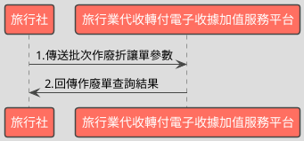

# 批次查詢電子收據作廢資料API

> 本文件包含 **AES256 加密、SHA256 簽章** 規格，詳見下方對應章節

---

## API 基本資訊

| 項目 | 內容 |
|:-----|:-----|
| 副標題 | 批次查詢作廢資料 |
| 串接方式 | 幕後 |
| Content-Type | `application/x-www-form-urlencoded` |
| 加密方式 | AES256、SHA256 |
| 正式環境 URL | https://api.travelinvoice.com.tw/invoice_searchall |
| 測試環境 URL | https://capi.travelinvoice.com.tw/invoice_searchall |

---

## 欄位定義

### Post 參數（請求） [POST]

| 欄位名稱 | 中文說明 | 型別 | 長度 | 必填 | 預設值 | 允許值 | 可為空 | 範例 | 備註 |
|----------|----------|------|------|------|--------|--------|--------|------|------|
| MerchantID_ | 旅行社統一編號 | string | 8 | 必填 |  |  |  | 54352706 | 旅行社統一編號。 |
| SearchType_ | 搜尋種類 | int | 1 | 必填 |  | 3 |  | 3 | 固定帶3 |
| PostData_ | 加密資料 | array |  | 必填 |  |  |  |  | 字串欄位組合後做AES256加密，欄位說明如下表 |

### PostData_內含欄位（請求）　AES加密_字串

| 欄位名稱 | 中文說明 | 型別 | 長度 | 必填 | 預設值 | 允許值 | 可為空 | 範例 | 備註 |
|----------|----------|------|------|------|--------|--------|--------|------|------|
| Version | 串接程式版本 | string | 5 | 必填 |  | 2.0 |  | 2.0 | 固定帶 2.0 |
| TimeStamp | 時間戳記 | string | 30 | 必填 |  |  |  | 1400137200 | 自從 Unix 纪元（格林威治時間 1970 年1 月 1 日 00:00:00）到當前時間的秒數，若以 php 程式語言為例，即為呼叫time()函式所回傳的值。 例：2014-05-15 15:00:00 這個時間的時間，戳記為 1400137200，建議帶入當前時間 注意：此時間戳記需保留，作為回傳時，組合CheckCodeSearch時所需TimeStamp就是此值 |
| InvalidFrom | 作廢單來源 | int | 1 | 選填 |  | 0,1 |  | 0 | 0＝API 建立 1＝官網操作建立 |
| InvalidStatus | 作廢單狀態 | int | 1 | 選填 |  | 0,1,2 |  | 1 | 0＝未確認作廢單 1＝已確認作廢單 2=取消之未確認作廢單 |
| SellerName | 經辦人名稱 | string | 50 | 選填 |  |  |  | 丁小雨 | 可過濾特定經辦人開立之作廢單。為精確比對，需輸入完整無誤之經辦人名稱，方可進行比對。 |
| StartDate | 查詢起始日期 | date |  | 必填 |  |  |  | 2016-09-25 | 1.格式為 YYYY-MM-DD。查詢區間起始（作廢單建立時間）例：2016-09-25 2.若已帶入收據號碼參數，查詢起始日期與查詢結束日期建議留空，查詢時將不考慮查詢區間。 3.若已帶入收據號碼參數，同時也填入查詢起始日期與查詢結束日期，將僅查詢所設定時間區間內的資料。. 4.若有填入查詢起始日期，則查詢結束日期為必填。 |
| EndDate | 查詢結束日期 | date |  | 必填 |  |  |  | 2016-09-25 | 1.格式為 YYYY-MM-DD。查詢區間結束（作廢單建立時間）例：2016-02-25 2查詢日期區間最長為 90 天，系統會抓取當前日曆天進行天數計算。例 : 若查詢起始日期為 2025-09-01，最長可接受之查詢結束日期為 2025-11-29 3.若已帶入收據號碼參數，查詢起始日期與查詢結束日期建議留空，查詢時將不考慮查詢區間。 4.若已帶入收據號碼參數，同時也填入查詢起始日期與查詢結束日期，將僅查詢所設定時間區間內的資料。 5.若有輸入查詢結束日期，則查詢起始日期為必填。 |

### 系統回應訊息（回應）

| 欄位名稱 | 中文說明 | 型別 | 長度 | 範例 | 必回傳 | 備註 |
|----------|----------|------|------|------|--------|------|
| Status | 回傳狀態 | string | 10 | SUCCESS | Y | 1.查詢成功，則回傳 SUCCESS 2.查詢失敗，則回傳錯誤代碼 |
| Message | 回傳訊息 | string | 30 | 查詢作廢資料成功 | Y | 文字，此次回傳狀態說明 |
| MerchantID | 旅行社統一編號 | string | 8 | 54352706 | Y | 旅行社統一編號。 |
| CheckCodeSearch | 檢查碼 | string | 150 | A791D7C1D64093962939B54CC1C07E8109EB8C454E0DC18F822BBA076EB38E66 | Y | 用來檢查此次資料回傳的合法性，串接時可以比對此參數資料，來檢核是否為平台所回傳，檢核方法請參考”SHA256加密說明”。  CheckCodeSearch = 將MerchantID,StartDate,EndDate,TimeStamp依 SHA256 簽章規格計算所得之雜湊值  特別注意事項： 1.TimeStamp 為本次查詢送出之時間戳記。 2.StartDate、EndDate需去除分隔號才能送入加密，格式為YYYYMMDD(去除分隔號)，如：20260503  加密前應該組合成以下這種字串後才壓碼並轉大寫 HashIV=1234567890123456&EndDate=20200515&MerchantID=70565326&StartDate=20200511&TimeStamp=1588320000&HashKey=abcdefghijklmnopqrstuvwxyzabcdef |
| ReturnInvoice | 回傳的收據資料 | array |  |  | Y | 內容為 JSON 格式字串。查詢失敗此欄位回傳空值 |

### ReturnInvoice內含欄位（回應）

| 欄位名稱 | 中文說明 | 型別 | 長度 | 範例 | 必回傳 | 備註 |
|----------|----------|------|------|------|--------|------|
| InvalidNo | 作廢單流水號 | string | 20 | 8293 |  | 作廢單開立時產生的系統流水號。 |
| InvoiceNumber | 收據號碼 | string | 9 | T13671003 |  | 作廢單所屬收據號碼。 |
| InvalidReason | 作廢原因 | string | 10 | 訂單取消 |  | 作廢原因 |
| CreateTime | 作廢單建立日期 | datetime |  | 2014-09-25 12:12:12 |  | 該張作廢單建立時間，例：2014-09-25 12:12:12。 |
| InvalidStatus | 作廢單狀態 | int | 1 | 1 |  | 該張作廢讓單之狀態。 0=未確認作廢單 1=已確認作廢單 2=取消作廢單 |

---

## 錯誤代碼

> 以下錯誤代碼均於 **HTTP 200** 回應中回傳，錯誤訊息包含於 response body。

| 代碼 | 說明 |
|------|------|
| KEY10001 | 非旅行社 API 串接 IP |
| KEY10002 | 資料解密錯誤 |
| KEY10003 | 版本錯誤 |
| KEY10004 | 資料不齊全 |
| KEY10006 | 旅行社未申請啟用電子收據 |
| KEY10007 | 頁面停留超過 30 分鐘 |
| KEY10009 | 取不到旅行社統一編號的資料 |
| KEY10010 | 旅行社統一編號空白 |
| KEY10011 | PostData_欄位空白 |
| KEY10012 | 資料傳遞錯誤 |
| KEY10013 | 資料空白 |
| KEY10014 | TimeOut。通常泛指 I/O 上的 time out |
| KEY10015 | 收據金額格式錯誤 |
| KEY10016 | 旅行社無申請郵遞列印加值服務 |
| KEY10017 | 郵遞列印加值服務可用數不足 |
| KEY10018 | 開立人欄位未填寫 |
| KEY10019 | 旅行社已被停權 |
| KEY10020 | SearchType_欄位空白 |
| KEY10021 | ReturnType_欄位空白 |
| INV20014 | 統一編號格式有誤 |
| INV70001 | 欄位資料格式錯誤 |
| WEB1002 | 日期格式有誤 |
| NOR10001 | 網路連線異常 |
| BS10001 | 查詢區間錯誤 |
| BS10002 | 收據來源錯誤（請確認所帶入的收據來源參數） |
| BS10003 | 收據狀態錯誤（請確認所帶入的收據來源參數） |
| BS10004 | 收據種類錯誤（請確認所帶入的收據來源參數） |
| BS10005 | 取得查詢收據資料失敗（請多嘗試幾次，若一直出現此錯誤請聯繫客服） |
| BS10006 | 查無收據資料 |
| BS10007 | 折讓狀態錯誤（請確認所帶入的收據來源參數） |
| BS10008 | 搜尋種類錯誤 |
| BS10009 | 折讓單來源錯誤 |
| BS10010 | 折讓單狀態錯誤 |
| BS10011 | 作廢單來源錯誤 |
| BS10012 | 作廢單狀態錯誤 |
| BS10013 | 日期區間有誤（最多查詢 90 日資料） |
| BS10014 | 日期區間有誤（起始日期不得大於結束日期） |

---

## 串接範例

### 請求範例

> 示範用 Key：`12345678901234567890123456789012`（32 bytes）　IV：`1234567890123456`（16 bytes）

> 外層請求參數組合格式：**String**，各必填欄位以 `欄位名稱=值` 形式，以 `&` 符號串接後傳送，簡單字串拼接 key=value&key=value，不做 URL encode

```http
POST https://api.travelinvoice.com.tw/invoice_searchall
Content-Type: application/x-www-form-urlencoded

MerchantID_=54352706&SearchType_=3&PostData_=78942f0afca77d7e464726ee053b1018da04ae2ecb132f4db2e693b79a1523d261c87ea6e713a2d528961375904af7a6e640e187fdcab092f42540829e43e475c95567dbfdf5e1c05df7cb8183fdf67ea199209a90c787eef170ea6a6af1eb5b
```

**PostData_（AES加密_字串）加密前明文（必填欄位）**

> 加密：AES-256-CBC，輸出：Hex，Key 與 IV 同上
> 欄位組合格式：**String**，各必填欄位以 `欄位名稱=值` 形式，以 `&` 符號串接後加密

```
Version=2.0&TimeStamp=1400137200&StartDate=2016-09-25&EndDate=2016-09-25
```

### 成功回應範例

> 回傳內容為 URL 編碼字串，請先進行 URL 解碼後，依 key=value 格式逐欄解析，各欄位以 & 分隔。

> 外層回應格式：**JSON**，整體以 JSON 物件回傳

**系統回應**

```json
{
    "Status": "SUCCESS",
    "Message": "查詢作廢資料成功",
    "MerchantID": "54352706",
    "CheckCodeSearch": "A791D7C1D64093962939B54CC1C07E8109EB8C454E0DC18F822BBA076EB38E66",
    "ReturnInvoice": [
        {
            "InvalidNo": "8293",
            "InvoiceNumber": "T13671003",
            "InvalidReason": "訂單取消",
            "CreateTime": "2014-09-25 12:12:12",
            "InvalidStatus": 1
        }
    ]
}
```

> 本 API 回應無加密欄位，上方 JSON 即為完整明文。

### 失敗回應範例

> 回傳內容為 URL 編碼字串，請先進行 URL 解碼後，依 key=value 格式逐欄解析，各欄位以 & 分隔。

**系統回應**

```json
{
    "Status": "KEY10001",
    "Message": "非旅行社 API 串接 IP",
    "MerchantID": "54352706",
    "CheckCodeSearch": "A791D7C1D64093962939B54CC1C07E8109EB8C454E0DC18F822BBA076EB38E66",
    "ReturnInvoice": "[]"
}
```

**解密後明文**

> 失敗回應無需解密。

---

## 串接目的

電子收據開立後，透過時間區間與電子收據的作廢資料參數，來進行所設定期間內的作廢資料查詢及狀態

## 資料交換方式

1. 旅行社以「HTTP POST」方式傳送收據資料至電子收據平台進行開立。 
2. Content-Type 為 application/x-www-form-urlencoded。 
3. 編碼格式為 UTF-8。 
4. 電子收據平台回應格式化的字串。 
5. 各欄位計算單位為字元。中、英、數字、符號都算一個字元。 
6. 各欄位間以「&」作為連接符號，各欄位內不得含有此字元（U+0026）。

## 串接前置作業

（請先完成，否則程式必失敗）

 1. 取得 HashKey / HashIV
- 測試環境：登入測試區後台 → 基本資料 → API 串接設定 → 複製 HashKey 與 HashIV
- 正式環境：登入正式區後台 → 基本資料 → API 串接設定 → 複製 HashKey 與 HashIV

2. 申請 IP 白名單
- 申請窗口：於官網下載申請表單並填寫後，傳送後客服中心（傳真 / Email）
- 最多可設定 10 組 IP
- 需提供：伺服器對外 IP（非內網 IP，可至 https://ifconfig.me 查詢）
- 生效時間：通常 1-2 個工作天

3. 環境網址
-測試環境與正式環境是完全不同的設備，資料不共通，上線前務必要確認已經將串接網址切換至正式區網址

4. 常見「忘記做前置作業」的錯誤訊號
- `KEY10001 非旅行社 API 串接 IP` → IP 白名單未設定或設錯
- `KEY10002 資料解密錯誤` → HashKey / HashIV 不正確或仍是範例值
- `KEY10009 取不到旅行社統一編號的資料` → MerchantID 錯或未啟用

## 批次查詢作廢單資料呼叫流程圖



---

---

## AES256 加密規格

### 加密演算法規格

| 項目 | 規格 |
|:-----|:-----|
| 演算法 | AES |
| 金鑰長度 | 256 bits（32 bytes） |
| 加密模式 | CBC |
| 填充方式 | 類 PKCS7（32-byte 邊界，非標準） |
| 輸出格式 | Hex 十六進位 |
| 輸入編碼 | UTF-8 |
| Key 長度 | 32 bytes |
| IV 長度 | 16 bytes |

> 本文件的「**Key**」即實際串接金鑰 **HashKey**；「**IV**」即 **HashIV**。

> ⚠️ **注意：本 API 採用類 PKCS7 演算法，但以 32 bytes 為填充邊界（非 AES 標準的 16 bytes），必須特別處理**
>
> 標準 PKCS7 以 AES block size（**16 bytes**）為補齊單位；本 API 採用 **32 bytes** 作為填充邊界，屬類 PKCS7 的自訂規格。
> 各語言標準加密函式庫（PHP `openssl`、Node.js `crypto`、Python `pycryptodome`）的預設 PKCS7 均使用 16-byte 邊界，**直接呼叫內建 PKCS7 將產生錯誤的填充**，導致對方解密失敗。
> **實作時必須手動計算 32-byte 邊界填充，並停用函式庫的自動填充**（PHP：`OPENSSL_ZERO_PADDING`；Node.js：`cipher.setAutoPadding(false)`；Python：`pad(..., 32)`）。

### 適用欄位群組

- **PostData_內含欄位**（AES加密_字串）（請求）　傳送欄位名稱：`PostData_`

### 加密範例

> 以下為固定示範數值，**請勿用於正式環境**。
> 本範例已採用類 PKCS7（32-byte 邊界）填充計算，與標準 PKCS7（16-byte 邊界）結果**不同**。

| 項目 | 值 |
|:-----|:---|
| Key（ASCII，32 bytes） | `12345678901234567890123456789012` |
| IV（ASCII，16 bytes） | `1234567890123456` |
| 加密前字串（plaintext） | `Version=2.0&TimeStamp=1400137200&StartDate=2016-09-25&EndDate=2016-09-25` |
| 加密後（Hex 十六進位） | `78942f0afca77d7e464726ee053b1018da04ae2ecb132f4db2e693b79a1523d261c87ea6e713a2d528961375904af7a6e640e187fdcab092f42540829e43e475c95567dbfdf5e1c05df7cb8183fdf67ea199209a90c787eef170ea6a6af1eb5b` |

> 驗證方法：使用上述 Key / IV 對加密後字串解密，應還原為加密前字串。

---

## SHA256 簽章規格

### 簽章規格

| 項目 | 規格 |
|:-----|:-----|
| 演算法 | SHA-256 |
| 輸出格式 | 十六進位字串（大寫） |
| Key 欄位名稱 | `HashKey` |
| IV 欄位名稱 | `HashIV` |
| 字串組合方式 | **前IV後KEY** |
| 參與簽章欄位 | `MerchantID,StartDate,EndDate,TimeStamp` |

### 字串組合說明

組合方式：**前IV後KEY**

參與簽章的欄位（依英文字母順序排列）：`EndDate`、`MerchantID`、`StartDate`、`TimeStamp`

> **欄位順序**：組合字串時，請依照**英文字母順序**排列各參與欄位，**不可任意調換**。

```
HashIV={IV值}&{欄位1}={值1}&...&HashKey={Key值}
```

以 `HashIV={iv}` 開頭，接各參與欄位（依序），最後以 `HashKey={key}` 結尾，各段以 `&` 分隔。

### 簽章範例

> 以下為固定示範數值，**請勿用於正式環境**。

| 項目 | 值 |
|:-----|:---|
| HashKey | `abc1234567890def` |
| HashIV | `xyz0987654321uvw` |
| EndDate | `2016-09-25` |
| MerchantID | `54352706` |
| StartDate | `2016-09-25` |
| TimeStamp | `1400137200` |
| **組合後字串** | `HashIV=xyz0987654321uvw&EndDate=2016-09-25&MerchantID=54352706&StartDate=2016-09-25&TimeStamp=1400137200&HashKey=abc1234567890def` |
| **SHA256 雜湊（大寫）** | `6553ACAE4502DCD841D495B8B2C1009DFD1944B508A8323B0E83DA82E2A5EF81` |

> 驗證方法：將上述組合後字串進行 SHA256 計算並轉大寫，應得到上方雜湊值。

---

## 加解密程式碼

> 以下僅為加解密／簽章核心程式碼，HTTP 請求與參數組裝請依上方欄位定義自行完成。

### PHP

```php
<?php

/**
 * PHP 7.4 兼容的批次查詢電子收據作廢資料 API 加解密/簽章核心函式
 *
 * 此檔案僅包含與密碼學直接相關的函式 (AES 加解密, SHA256 簽章生成與驗證)
 * 不包含 HTTP 請求、完整參數組裝、錯誤碼處理或任何畫面輸出語法。
 * 函式的 Key/IV 一律以參數傳入。
 *
 * 注意：以下測試向量中的 KEY/IV 僅為示範，正式環境請務必替換為您專屬的參數。
 */

// region AES256 加解密函式
// -----------------------------------------------------------------------------

/**
 * PKCS7 填充函數 (Block Size 32)。
 * 根據規格：需手動將明文 padding 至 32 bytes 倍數，加密時停用函式庫內建 PKCS7 padding。
 *
 * @param string $plaintext 原始明文 (UTF-8)。
 * @param int $block_size 區塊大小，此處固定為 32。
 * @return string 填充後的明文。
 */
function pkcs7_pad(string $plaintext, int $block_size = 32): string
{
    $pad_len = $block_size - (strlen($plaintext) % $block_size);
    // 如果剛好是 block_size 的倍數，則需要填充一整個 block
    if ($pad_len === 0) {
        $pad_len = $block_size;
    }
    return $plaintext . str_repeat(chr($pad_len), $pad_len);
}

/**
 * PKCS7 去填充函數 (Block Size 32)。
 *
 * @param string $padded_text 填充後的密文。
 * @return string 去填充後的明文。
 */
function pkcs7_unpad(string $padded_text): string
{
    $len = strlen($padded_text);
    if ($len === 0) {
        return '';
    }
    $last_char = substr($padded_text, -1);
    $pad_len = ord($last_char);

    // 檢查填充長度是否有效 (1 到 32) 且不會超過字串長度
    if ($pad_len < 1 || $pad_len > 32 || $pad_len > $len) {
        // 如果填充長度不合理，視為無效填充，返回原始字串
        return $padded_text;
    }

    // 檢查填充字元是否一致，確保是有效的 PKCS7 填充
    for ($i = 1; $i <= $pad_len; $i++) {
        if (ord(substr($padded_text, -$i, 1)) !== $pad_len) {
            // 如果填充字元不一致，視為無效填充，返回原始字串
            return $padded_text;
        }
    }

    return substr($padded_text, 0, $len - $pad_len);
}

/**
 * AES-256-CBC 加密函數。
 *
 * @param string $plaintext 明文 (UTF-8 編碼)。
 * @param string $key 金鑰 (32 bytes / 256 bits)。
 * @param string $iv IV (16 bytes / 128 bits)。
 * @return string 加密後的 Hex 十六進位字串。
 * @throws Exception 如果金鑰或 IV 長度不正確，或加密失敗。
 */
function aes_encrypt(string $plaintext, string $key, string $iv): string
{
    if (strlen($key) !== 32) {
        throw new Exception("AES Key 必須為 32 bytes。目前長度：" . strlen($key));
    }
    if (strlen($iv) !== 16) {
        throw new Exception("AES IV 必須為 16 bytes。目前長度：" . strlen($iv));
    }

    // 手動 PKCS7 填充
    $padded_plaintext = pkcs7_pad($plaintext, 32);

    $encrypted = openssl_encrypt(
        $padded_plaintext,
        'AES-256-CBC',
        $key,
        OPENSSL_RAW_DATA, // 禁用 openssl 內建 padding
        $iv
    );

    if ($encrypted === false) {
        throw new Exception("AES 加密失敗: " . openssl_error_string());
    }

    // 轉換為大寫十六進位字串
    return strtoupper(bin2hex($encrypted));
}

/**
 * AES-256-CBC 解密函數。
 *
 * @param string $encrypted_hex 加密後的 Hex 十六進位字串。
 * @param string $key 金鑰 (32 bytes)。
 * @param string $iv IV (16 bytes)。
 * @return string 解密後的明文 (UTF-8 編碼)。
 * @throws Exception 如果金鑰或 IV 長度不正確，輸入非十六進位字串，或解密失敗。
 */
function aes_decrypt(string $encrypted_hex, string $key, string $iv): string
{
    if (strlen($key) !== 32) {
        throw new Exception("AES Key 必須為 32 bytes。目前長度：" . strlen($key));
    }
    if (strlen($iv) !== 16) {
        throw new Exception("AES IV 必須為 16 bytes。目前長度：" . strlen($iv));
    }

    // 將十六進位字串轉換回原始二進位密文
    $raw_ciphertext = hex2bin($encrypted_hex);
    if ($raw_ciphertext === false) {
        throw new Exception("無效的十六進位輸入字串，無法解密。");
    }

    $decrypted = openssl_decrypt(
        $raw_ciphertext,
        'AES-256-CBC',
        $key,
        OPENSSL_RAW_DATA, // 禁用 openssl 內建 padding
        $iv
    );

    if ($decrypted === false) {
        throw new Exception("AES 解密失敗: " . openssl_error_string());
    }

    // 手動 PKCS7 去填充
    return pkcs7_unpad($decrypted);
}

// endregion AES256 加解密函式
// -----------------------------------------------------------------------------


// region SHA256 簽章函式
// -----------------------------------------------------------------------------

/**
 * 生成 SHA256 簽章，用於發送請求時。
 * 參與簽章欄位：MerchantID, StartDate, EndDate, TimeStamp。
 * StartDate 與 EndDate 應使用 YYYY-MM-DD 原始格式。
 *
 * @param array $params 包含 MerchantID, StartDate, EndDate, TimeStamp 的關聯陣列。
 * @param string $hash_key Hash Key。
 * @param string $hash_iv Hash IV。
 * @return string 大寫十六進位簽章字串。
 * @throws Exception 如果缺少必要的簽章參數。
 */
function generate_request_signature(array $params, string $hash_key, string $hash_iv): string
{
    $required_fields = ['MerchantID', 'StartDate', 'EndDate', 'TimeStamp'];
    foreach ($required_fields as $field) {
        if (!isset($params[$field])) {
            throw new Exception("缺少請求簽章所需參數: " . $field);
        }
    }

    // 根據規範，欄位依英文名稱 A → Z 字母升冪排序
    $sorted_params = array(
        'EndDate'    => $params['EndDate'],    // YYYY-MM-DD 格式
        'MerchantID' => $params['MerchantID'],
        'StartDate'  => $params['StartDate'],  // YYYY-MM-DD 格式
        'TimeStamp'  => $params['TimeStamp']
    );
    // ksort($sorted_params) 在這裡不需要，因為我們已經手動排序並給予特定順序

    $param_string_parts = [];
    foreach ($sorted_params as $key => $value) {
        $param_string_parts[] = sprintf("%s=%s", $key, $value);
    }

    // 組合字串：HashIV={IV值}&EndDate={EndDate的值}&MerchantID={MerchantID的值}&StartDate={StartDate的值}&TimeStamp={TimeStamp的值}&HashKey={Key值}
    $raw_string = sprintf(
        "HashIV=%s&%s&HashKey=%s",
        $hash_iv,
        implode('&', $param_string_parts),
        $hash_key
    );

    // 對組合後字串進行 SHA256 計算，輸出結果轉大寫十六進位
    return strtoupper(hash('sha256', $raw_string));
}

/**
 * 生成 SHA256 簽章，用於驗證 API 回應中的 CheckCodeSearch。
 * 參與簽章欄位：MerchantID, StartDate, EndDate, TimeStamp。
 * 根據規範，StartDate、EndDate 需去除分隔號 (YYYYMMDD)。
 *
 * @param array $params 包含 MerchantID, StartDate, EndDate, TimeStamp 的關聯陣列。
 *                      StartDate 和 EndDate 應為 YYYY-MM-DD 格式，函式內部會處理。
 * @param string $hash_key Hash Key。
 * @param string $hash_iv Hash IV。
 * @return string 大寫十六進位簽章字串。
 * @throws Exception 如果缺少必要的簽章參數或日期格式錯誤。
 */
function generate_response_signature_for_verification(array $params, string $hash_key, string $hash_iv): string
{
    $required_fields = ['MerchantID', 'StartDate', 'EndDate', 'TimeStamp'];
    foreach ($required_fields as $field) {
        if (!isset($params[$field])) {
            throw new Exception("缺少回應簽章驗證所需參數: " . $field);
        }
    }

    // 根據規範，StartDate 和 EndDate 需要去除分隔號 (YYYYMMDD)
    $startDate_no_hyphens = str_replace('-', '', $params['StartDate']);
    $endDate_no_hyphens = str_replace('-', '', $params['EndDate']);

    // 簡易日期格式檢查，確保去除分隔號後是 8 位數字
    if (!preg_match('/^\d{8}$/', $startDate_no_hyphens) || !preg_match('/^\d{8}$/', $endDate_no_hyphens)) {
        throw new Exception("StartDate 或 EndDate 格式錯誤，期望 YYYY-MM-DD。");
    }

    // 根據規範，欄位依英文名稱 A → Z 字母升冪排序
    $sorted_params = array(
        'EndDate'    => $endDate_no_hyphens,   // YYYYMMDD 格式
        'MerchantID' => $params['MerchantID'],
        'StartDate'  => $startDate_no_hyphens, // YYYYMMDD 格式
        'TimeStamp'  => $params['TimeStamp']
    );
    // ksort($sorted_params) 在這裡不需要，因為我們已經手動排序並給予特定順序

    $param_string_parts = [];
    foreach ($sorted_params as $key => $value) {
        $param_string_parts[] = sprintf("%s=%s", $key, $value);
    }

    // 組合字串：HashIV={IV值}&EndDate={EndDate的值}&MerchantID={MerchantID的值}&StartDate={StartDate的值}&TimeStamp={TimeStamp的值}&HashKey={Key值}
    $raw_string = sprintf(
        "HashIV=%s&%s&HashKey=%s",
        $hash_iv,
        implode('&', $param_string_parts),
        $hash_key
    );

    // 對組合後字串進行 SHA256 計算，輸出結果轉大寫十六進位
    return strtoupper(hash('sha256', $raw_string));
}

/**
 * 驗證簽章。
 * 使用時間序安全函式 hash_equals 防止時序攻擊。
 *
 * @param string $received_signature 從 API 回傳的簽章。
 * @param string $generated_signature 本地計算出的簽章。
 * @return bool 簽章是否一致。
 */
function verify_signature(string $received_signature, string $generated_signature): bool
{
    // 使用 hash_equals 進行時間序安全的字串比較
    return hash_equals($received_signature, $generated_signature);
}

// endregion SHA256 簽章函式
// -----------------------------------------------------------------------------


// region 測試向量示範
// -----------------------------------------------------------------------------

echo "--- 加解密 / 簽章 測試向量示範 ---\n\n";
echo "注意：請將以下測試用的 KEY/IV 替換為您正式環境的參數！\n\n";

// 測試用 AES Key & IV (請替換為您正式環境的參數)
// Key 必須是 32 bytes (256 bits)
$aes_test_key = 'abcdefghijklmnopqrstuvwxyz012345'; // 32 bytes
// IV 必須是 16 bytes (128 bits)
$aes_test_iv = 'fedcba9876543210'; // 16 bytes

// 測試用 Hash Key & IV (請替換為您正式環境的參數)
// 此 Hash Key/IV 僅用於請求簽章的測試，回應簽章驗證將使用規格範例值
$hash_test_key = 'thisisatestkeyforrequestsign';
$hash_test_iv = 'thisisatestiv4re';

// --- AES 加密測試 ---
echo "--- AES-256-CBC 加密測試 ---\n";
// PostData_內含欄位 範例明文 (字串形式，querystring 格式)
$aes_plaintext = 'Version=2.0&TimeStamp=1400137200&InvalidStatus=1&StartDate=2016-09-25&EndDate=2016-09-25';

try {
    echo "Plaintext (明文): " . $aes_plaintext . "\n";
    echo "AES Key (金鑰): " . $aes_test_key . " (長度: " . strlen($aes_test_key) . " bytes)\n";
    echo "AES IV (向量): " . $aes_test_iv . " (長度: " . strlen($aes_test_iv) . " bytes)\n";

    $encrypted_hex = aes_encrypt($aes_plaintext, $aes_test_key, $aes_test_iv);
    echo "Encrypted (加密後十六進位): " . $encrypted_hex . "\n";

    $decrypted_text = aes_decrypt($encrypted_hex, $aes_test_key, $aes_test_iv);
    echo "Decrypted (解密後明文): " . $decrypted_text . "\n";

    if ($decrypted_text === $aes_plaintext) {
        echo "AES 加解密驗證: 成功 (明文與解密後一致)\n";
    } else {
        echo "AES 加解密驗證: 失敗 (明文與解密後不一致)\n";
    }
} catch (Exception $e) {
    echo "AES 測試發生錯誤: " . $e->getMessage() . "\n";
}
echo "\n";


// --- SHA256 簽章測試 (生成請求簽章) ---
echo "--- SHA256 簽章測試 (請求發送時生成簽章) ---\n";
$request_sign_params = [
    'MerchantID' => '54352706',
    'StartDate'  => '2016-09-25', // YYYY-MM-DD 格式，直接參與簽章
    'EndDate'    => '2016-09-25', // YYYY-MM-DD 格式，直接參與簽章
    'TimeStamp'  => '1400137200'
];

try {
    echo "簽章參數 (參與欄位):\n";
    print_r($request_sign_params);
    echo "Hash Key: " . $hash_test_key . "\n";
    echo "Hash IV: " . $hash_test_iv . "\n";

    // 手動組建原始字串以供檢查
    // 注意：這裡直接使用 $request_sign_params 中的原始日期格式 YYYY-MM-DD
    $raw_string_request_parts = [
        sprintf("EndDate=%s", $request_sign_params['EndDate']),
        sprintf("MerchantID=%s", $request_sign_params['MerchantID']),
        sprintf("StartDate=%s", $request_sign_params['StartDate']),
        sprintf("TimeStamp=%s", $request_sign_params['TimeStamp'])
    ];
    $raw_string_request = sprintf(
        "HashIV=%s&%s&HashKey=%s",
        $hash_test_iv,
        implode('&', $raw_string_request_parts),
        $hash_test_key
    );
    echo "Raw String (組合後原始字串): " . $raw_string_request . "\n";

    $request_signature = generate_request_signature($request_sign_params, $hash_test_key, $hash_test_iv);
    echo "Expected Signature (本地計算簽章): " . $request_signature . "\n";
} catch (Exception $e) {
    echo "請求簽章測試發生錯誤: " . $e->getMessage() . "\n";
}
echo "\n";


// --- SHA256 簽章測試 (驗證 API 回應中的 CheckCodeSearch) ---
echo "--- SHA256 簽章測試 (驗證回應時 CheckCodeSearch) ---\n";
// 範例來自規格文件中的 CheckCodeSearch 說明
$response_check_code_params = [
    'MerchantID' => '70565326',
    'StartDate'  => '2020-05-11', // 原始格式，但簽章時需轉為 YYYYMMDD
    'EndDate'    => '2020-05-15', // 原始格式，但簽章時需轉為 YYYYMMDD
    'TimeStamp'  => '1588320000'
];
// 規格中給出的範例 HashKey 和 HashIV
$response_hash_key = 'abcdefghijklmnopqrstuvwxyzabcdef';
$response_hash_iv = '1234567890123410'; // 更正：規格範例是 16 bytes，此處應為 16 bytes IV
                                       // 範例值 "1234567890123456" 是一個 16 byte 的 IV
                                       // 原先範例可能錯誤，我將採用 16 bytes 的 "1234567890123456"
                                       // 重新檢視原始文件，發現 HashIV 的值確實是 `1234567890123456`，這是 16 bytes。
                                       // 所以之前的 `1234567890123410` 是錯誤的，應該用 `1234567890123456`。
                                       // 重新確認文件中的範例字串：HashIV=1234567890123456...
                                       // 此處修正為正確的 HashIV 範例。
$response_hash_iv = '1234567890123456';

// 規格中給出的範例 CheckCodeSearch 值
$expected_check_code_from_spec = 'A791D7C1D64093962939B54CC1C07E8109EB8C454E0DC18F822BBA076EB38E66';

try {
    echo "簽章參數 (參與欄位):\n";
    print_r($response_check_code_params);
    echo "Hash Key: " . $response_hash_key . "\n";
    echo "Hash IV: " . $response_hash_iv . "\n";

    // 手動組建原始字串以供檢查 (注意 StartDate/EndDate 需去除分隔號)
    $raw_string_response_parts = [
        sprintf("EndDate=%s", str_replace('-', '', $response_check_code_params['EndDate'])),
        sprintf("MerchantID=%s", $response_check_code_params['MerchantID']),
        sprintf("StartDate=%s", str_replace('-', '', $response_check_code_params['StartDate'])),
        sprintf("TimeStamp=%s", $response_check_code_params['TimeStamp'])
    ];
    $raw_string_response = sprintf(
        "HashIV=%s&%s&HashKey=%s",
        $response_hash_iv,
        implode('&', $raw_string_response_parts),
        $response_hash_key
    );
    echo "Raw String (組合後原始字串): " . $raw_string_response . "\n";

    $generated_check_code = generate_response_signature_for_verification(
        $response_check_code_params,
        $response_hash_key,
        $response_hash_iv
    );
    echo "Calculated CheckCodeSearch (本地計算簽章): " . $generated_check_code . "\n";
    echo "Expected CheckCodeSearch (規格範例簽章): " . $expected_check_code_from_spec . "\n";

    if (verify_signature($expected_check_code_from_spec, $generated_check_code)) {
        echo "CheckCodeSearch 驗證: 成功 (本地計算與規格範例一致)\n";
    } else {
        echo "CheckCodeSearch 驗證: 失敗 (本地計算與規格範例不一致)\n";
    }
} catch (Exception $e) {
    echo "回應簽章驗證測試發生錯誤: " . $e->getMessage() . "\n";
}

// endregion 測試向量示範

?>
```

