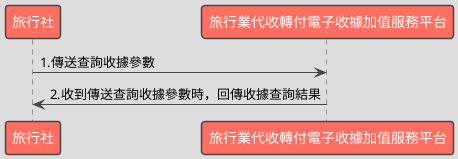

# 單筆查詢收據開立資料API

> 本文件包含 **AES256 加密、SHA256 簽章** 規格，詳見下方對應章節

---

## API 基本資訊

| 項目 | 內容 |
|:-----|:-----|
| 副標題 | 查詢收據開立資料 |
| 串接方式 | 幕後 |
| Content-Type | `application/x-www-form-urlencoded` |
| 加密方式 | AES256、SHA256 |
| 正式環境 URL | https://api.travelinvoice.com.tw/invoice_search |
| 測試環境 URL | https://capi.travelinvoice.com.tw/invoice_search |

---

## 欄位定義

### Post 參數（請求） [POST]

| 欄位名稱 | 中文說明 | 型別 | 長度 | 必填 | 預設值 | 允許值 | 可為空 | 範例 | 備註 |
|----------|----------|------|------|------|--------|--------|--------|------|------|
| MerchantID_ | 旅行社統一編號 | string | 8 | 必填 |  |  |  | 54352706 | 旅行社統一編號。 |
| PostData_ | 加密資料 | array |  | 必填 |  |  |  |  | 字串欄位組合後做AES256加密，欄位說明如下表 |

### PostData_內含欄位（請求）　AES加密_字串

| 欄位名稱 | 中文說明 | 型別 | 長度 | 必填 | 預設值 | 允許值 | 可為空 | 範例 | 備註 |
|----------|----------|------|------|------|--------|--------|--------|------|------|
| Version | 串接程式版本 | string | 5 | 必填 |  | 1.1 |  | 1.1 | 固定帶 1.1 |
| TimeStamp | 時間戳記 | string | 30 | 必填 |  |  |  | 1400137200 | Unix 時間戳記（秒），即自 1970-01-01 00:00:00 UTC 至今的秒數 例：2014-05-15 15:00:00 這個時間的時間，戳記為 1400137200，建議帶入當前時間 |
| InvoiceNumber | 收據號碼 | string | 9 | 必填 |  |  |  | T13671005 | 此次查詢的收據號碼。 |
| RandomNum | 收據防偽隨機碼 | string | 8 | 必填 |  |  |  | 85767715 | 開立收據時回傳的 8 碼隨機碼 (查詢收據時必填)。 |

### 系統回應訊息（回應）

| 欄位名稱 | 中文說明 | 型別 | 長度 | 範例 | 必回傳 | 備註 |
|----------|----------|------|------|------|--------|------|
| Status | 回傳狀態 | string | 10 | SUCCESS | Y | 1.查詢成功，則回傳 SUCCESS 2.查詢失敗，則回傳錯誤代碼 |
| Message | 回傳訊息 | string | 30 | 查詢開立收據成功 | Y | 文字，此次回傳狀態說明 |
| MerchantID | 旅行社統一編號 | string | 8 | 70565326 |  | 旅行社統一編號 |
| InvoiceTransNo | 開立流水號 | string | 20 | 193060 |  | 收據開立時的開立序號 |
| MerchantOrderNo | 自訂編號 | string | 30 | 202005010000008 |  | 旅行社於開立收據時帶入的自訂編號 |
| InvoiceNumber | 收據號碼 | string | 9 | T13671008 |  | 此次查詢的收據號碼 |
| RandomNum | 收據防偽隨機碼 | string | 8 | 85767715 |  | 於開立收據時，所產生的 8 碼收據防偽隨機碼 |
| BuyerName | 買受人名稱 | string | 50 | 藍新科技 |  | 開立收據時的買受人名稱，個人姓名或營業人名稱 |
| BuyerUBN | 買受人統一編號 | string | 8 | 54352706 |  | 1.若為 B2B 收據，此欄位為買受人統一編號 2.若為 B2C 收據，此欄位為空值。 |
| BuyerAddress | 買受人地址 | string | 200 | 台北市南港區南港路2段97號8樓 |  | 於開立收據時，該張收據的買受人地址 |
| BuyerPhone | 買受人手機號碼 | string | 15 | 0922123456 |  | 於開立收據時，該張收據的買受人手機號碼 |
| BuyerEmail | 買受人電子信箱 | string | 100 | abc@gmail.com |  | 於開立收據時，該張收據的買受人電子信箱。 |
| Category | 收據種類 | string | 5 | B2B |  | 該張收據的收據種類。 B2B=買受人為營業人(有統編) B2C=買受人為個人 |
| TotalAmt | 收據金額 | string | 8 | 500 |  | 純數字，為收據總金額。 |
| CreateTime | 開立收據時間 | datetime |  | 2014-09-25 12:12:12 |  | 該張收據開立時間，例：2014-09-25 12:12:12 |
| ItemDetail | 商品明細 | text |  | [{"ItemNum":1,"ItemName":"退票","ItemCount":"1","ItemWord":"張","ItemPrice":"-500","ItemAmount":"-500"},{"ItemNum":2,"ItemName":"車票","ItemCount":"1","ItemWord":"張","ItemPrice":"500","ItemAmount":"500"},{"ItemNum":3,"ItemName":"手續費","ItemCount":"1","ItemWord":"件","ItemPrice":"20","ItemAmount":"20"}] |  | 該張收據開立時的商品資訊(JSON 格式)。 ItemNum = 品項序號 ItemName = 商品名稱 ItemCount = 數量 ItemWord = 單位 ItemPrice = 單價 ItemAmount = 小計 |
| InvoiceStatus | 收據狀態 | int | 1 | 1 |  | 該張收據之收據狀態。 1 = 已開立 (有產生收據號碼) 2＝ 取消開立 3 = 已作廢 |
| TourName | 團名 | string | 50 | 北海道5日遊 |  | 該張收據的團名 |
| TourNo | 團號 | string | 20 | O54555 |  | 該張收據的團號 |
| TourDate | 預計出團日 | date |  | 2014-09-25 |  | 該張收據出團日,出團日當天會發出出團申報提醒通 知信至指定信箱 |
| TaxNoted | 申報註記 | int | 1 | 0 |  | 該張收據的申報註記欄位 0=未申報 1=已申報 |
| CheckCode | 檢查碼 | string | 150 | B6C1ABED0F4EC72E5B69A874A070907DF5E27E0A2F1FF2FC5BE0D1D1C6DD6B51 |  | 用來檢查此次資料回傳的合法性，串接時可以比對此參數資料，來檢核是否為平台所回傳，檢核方法請參考”SHA256加密說明”。如開立失敗則回傳空值。  CheckCode = 將 InvoiceTransNo, MerchantID, MerchantOrderNo, RandomNum, TotalAmt 依 SHA256 簽章規格計算所得之雜湊值 |
| EndStr | 字串結尾 | string | 2 | ## | Y | 固定回傳 ##，使用 String 方式接收資料的用戶，須 多判斷 EndStr=##，確保資料傳遞完整。 |

---

## 錯誤代碼

> 以下錯誤代碼均於 **HTTP 200** 回應中回傳，錯誤訊息包含於 response body。

| 代碼 | 說明 |
|------|------|
| KEY10001 | 非旅行社 API 串接 IP |
| KEY10002 | 資料解密錯誤 |
| KEY10003 | 版本錯誤 |
| KEY10004 | 資料不齊全 |
| KEY10006 | 旅行社未申請啟用電子收據 |
| KEY10007 | 頁面停留超過 30 分鐘 |
| KEY10009 | 取不到旅行社統一編號的資料 |
| KEY10010 | 旅行社統一編號空白 |
| KEY10011 | PostData_欄位空白 |
| KEY10012 | 資料傳遞錯誤 |
| KEY10013 | 資料空白 |
| KEY10014 | TimeOut。通常泛指 I/O 上的 time out |
| KEY10015 | 收據金額格式錯誤 |
| KEY10016 | 旅行社無申請郵遞列印加值服務 |
| KEY10017 | 郵遞列印加值服務可用數不足 |
| KEY10018 | 開立人欄位未填寫 |
| KEY10019 | 旅行社已被停權 |
| NOR10001 | 網路連線異常 |
| IS10001 | 收據號碼未填寫 |
| IS10002 | 收據防偽隨機碼未填寫 |
| IS10003 | DisplayFlag 有誤 |
| BS10015 | 折讓單號未填寫 |
| BS10016 | 作廢單號未填寫 |
| BS10017 | 查無折讓單資料 |
| BS10018 | 查無作廢單資料 |

---

## 串接範例

### 請求範例

> 示範用 Key：`12345678901234567890123456789012`（32 bytes）　IV：`1234567890123456`（16 bytes）

> 外層請求參數組合格式：**String**，各必填欄位以 `欄位名稱=值` 形式，以 `&` 符號串接後傳送，簡單字串拼接 key=value&key=value，不做 URL encode

```http
POST https://api.travelinvoice.com.tw/invoice_search
Content-Type: application/x-www-form-urlencoded

MerchantID_=54352706&PostData_=0ddd722db534612152877a2082309380fefc1612526018201e1b1d754ffcf5b058b95ed9bba6906eb0a1e978448101110ac27c9d8a35c30bb9d8f1de2bb00c54f9c88b4be877a2dc83a49b2fcb71ca81d03315f82f44b3f93afad184e4fda291
```

**PostData_（AES加密_字串）加密前明文（必填欄位）**

> 加密：AES-256-CBC，輸出：Hex，Key 與 IV 同上
> 欄位組合格式：**String**，各必填欄位以 `欄位名稱=值` 形式，以 `&` 符號串接後加密

```
Version=1.1&TimeStamp=1400137200&InvoiceNumber=T13671005&RandomNum=85767715
```

### 成功回應範例

> 回傳內容為 URL 編碼字串，請先進行 URL 解碼後，依 key=value 格式逐欄解析，各欄位以 & 分隔。

> 外層回應格式：**String**，各欄位以 `欄位名稱=值` 形式，以 `&` 符號串接後回傳

**系統回應**

```
Status=SUCCESS&Message=查詢開立收據成功&MerchantID=70565326&InvoiceTransNo=193060&MerchantOrderNo=202005010000008&InvoiceNumber=T13671008&RandomNum=85767715&BuyerName=藍新科技&BuyerUBN=54352706&BuyerAddress=台北市南港區南港路2段97號8樓&BuyerPhone=0922123456&BuyerEmail=abc@gmail.com&Category=B2B&TotalAmt=500&CreateTime=2014-09-25 12:12:12&ItemDetail=[{"ItemNum":1,"ItemName":"退票","ItemCount":"1","ItemWord":"張","ItemPrice":"-500","ItemAmount":"-500"},{"ItemNum":2,"ItemName":"車票","ItemCount":"1","ItemWord":"張","ItemPrice":"500","ItemAmount":"500"},{"ItemNum":3,"ItemName":"手續費","ItemCount":"1","ItemWord":"件","ItemPrice":"20","ItemAmount":"20"}]&InvoiceStatus=1&TourName=北海道5日遊&TourNo=O54555&TourDate=2014-09-25&TaxNoted=0&CheckCode=B6C1ABED0F4EC72E5B69A874A070907DF5E27E0A2F1FF2FC5BE0D1D1C6DD6B51&EndStr=##
```

> 本 API 回應無加密欄位，上方字串即為完整明文。

### 失敗回應範例

> 回傳內容為 URL 編碼字串，請先進行 URL 解碼後，依 key=value 格式逐欄解析，各欄位以 & 分隔。

**系統回應**

```
Status=KEY10001&Message=非旅行社 API 串接 IP&EndStr=##
```

---

## 串接目的

電子收據開立後，可透過查詢收據開立參數，查詢單筆收據資料

## 資料交換方式

1. 旅行社以「HTTP POST」方式傳送收據資料至電子收據平台進行開立。 
2. Content-Type 為 application/x-www-form-urlencoded。 
3. 編碼格式為 UTF-8。 
4. 電子收據平台回應格式化的字串。 
5. 各欄位計算單位為字元。中、英、數字、符號都算一個字元。 
6. 各欄位間以「&」作為連接符號，各欄位內不得含有此字元（U+0026）。

## 串接前置作業

（請先完成，否則程式必失敗）

 1. 取得 HashKey / HashIV
- 測試環境：登入測試區後台 → 基本資料 → API 串接設定 → 複製 HashKey 與 HashIV
- 正式環境：登入正式區後台 → 基本資料 → API 串接設定 → 複製 HashKey 與 HashIV

2. 申請 IP 白名單
- 申請窗口：於官網下載申請表單並填寫後，傳送後客服中心（傳真 / Email）
- 最多可設定 10 組 IP
- 需提供：伺服器對外 IP（非內網 IP，可至 https://ifconfig.me 查詢）
- 生效時間：通常 1-2 個工作天

3. 環境網址
-測試環境與正式環境是完全不同的設備，資料不共通，上線前務必要確認已經將串接網址切換至正式區網址

4. 常見「忘記做前置作業」的錯誤訊號
- `KEY10001 非旅行社 API 串接 IP` → IP 白名單未設定或設錯
- `KEY10002 資料解密錯誤` → HashKey / HashIV 不正確或仍是範例值
- `KEY10009 取不到旅行社統一編號的資料` → MerchantID 錯或未啟用

## 查詢收據流程



---

---

## AES256 加密規格

### 加密演算法規格

| 項目 | 規格 |
|:-----|:-----|
| 演算法 | AES |
| 金鑰長度 | 256 bits（32 bytes） |
| 加密模式 | CBC |
| 填充方式 | 類 PKCS7（32-byte 邊界，非標準） |
| 輸出格式 | Hex 十六進位 |
| 輸入編碼 | UTF-8 |
| Key 長度 | 32 bytes |
| IV 長度 | 16 bytes |

> 本文件的「**Key**」即實際串接金鑰 **HashKey**；「**IV**」即 **HashIV**。

> ⚠️ **注意：本 API 採用類 PKCS7 演算法，但以 32 bytes 為填充邊界（非 AES 標準的 16 bytes），必須特別處理**
>
> 標準 PKCS7 以 AES block size（**16 bytes**）為補齊單位；本 API 採用 **32 bytes** 作為填充邊界，屬類 PKCS7 的自訂規格。
> 各語言標準加密函式庫（PHP `openssl`、Node.js `crypto`、Python `pycryptodome`）的預設 PKCS7 均使用 16-byte 邊界，**直接呼叫內建 PKCS7 將產生錯誤的填充**，導致對方解密失敗。
> **實作時必須手動計算 32-byte 邊界填充，並停用函式庫的自動填充**（PHP：`OPENSSL_ZERO_PADDING`；Node.js：`cipher.setAutoPadding(false)`；Python：`pad(..., 32)`）。

### 適用欄位群組

- **PostData_內含欄位**（AES加密_字串）（請求）　傳送欄位名稱：`PostData_`

### 加密範例

> 以下為固定示範數值，**請勿用於正式環境**。
> 本範例已採用類 PKCS7（32-byte 邊界）填充計算，與標準 PKCS7（16-byte 邊界）結果**不同**。

| 項目 | 值 |
|:-----|:---|
| Key（ASCII，32 bytes） | `12345678901234567890123456789012` |
| IV（ASCII，16 bytes） | `1234567890123456` |
| 加密前字串（plaintext） | `Version=1.1&TimeStamp=1400137200&InvoiceNumber=T13671005&RandomNum=85767715` |
| 加密後（Hex 十六進位） | `0ddd722db534612152877a2082309380fefc1612526018201e1b1d754ffcf5b058b95ed9bba6906eb0a1e978448101110ac27c9d8a35c30bb9d8f1de2bb00c54f9c88b4be877a2dc83a49b2fcb71ca81d03315f82f44b3f93afad184e4fda291` |

> 驗證方法：使用上述 Key / IV 對加密後字串解密，應還原為加密前字串。

---

## SHA256 簽章規格

### 簽章規格

| 項目 | 規格 |
|:-----|:-----|
| 演算法 | SHA-256 |
| 輸出格式 | 十六進位字串（大寫） |
| Key 欄位名稱 | `HashKey` |
| IV 欄位名稱 | `HashIV` |
| 字串組合方式 | **前IV後KEY** |
| 參與簽章欄位 | `InvoiceTransNo,MerchantID,MerchantOrderNo,RandomNum,TotalAmt` |

### 字串組合說明

組合方式：**前IV後KEY**

參與簽章的欄位（依英文字母順序排列）：`InvoiceTransNo`、`MerchantID`、`MerchantOrderNo`、`RandomNum`、`TotalAmt`

> **欄位順序**：組合字串時，請依照**英文字母順序**排列各參與欄位，**不可任意調換**。

```
HashIV={IV值}&{欄位1}={值1}&...&HashKey={Key值}
```

以 `HashIV={iv}` 開頭，接各參與欄位（依序），最後以 `HashKey={key}` 結尾，各段以 `&` 分隔。

### 簽章範例

> 以下為固定示範數值，**請勿用於正式環境**。

| 項目 | 值 |
|:-----|:---|
| HashKey | `abc1234567890def` |
| HashIV | `xyz0987654321uvw` |
| InvoiceTransNo | `193060` |
| MerchantID | `70565326` |
| MerchantOrderNo | `202005010000008` |
| RandomNum | `85767715` |
| TotalAmt | `500` |
| **組合後字串** | `HashIV=xyz0987654321uvw&InvoiceTransNo=193060&MerchantID=70565326&MerchantOrderNo=202005010000008&RandomNum=85767715&TotalAmt=500&HashKey=abc1234567890def` |
| **SHA256 雜湊（大寫）** | `E0B6341047DEB46AF1010BB705E895CE3BC54A2B9AAB54819E747B4B6E384E75` |

> 驗證方法：將上述組合後字串進行 SHA256 計算並轉大寫，應得到上方雜湊值。

---

## 加解密程式碼

> 以下僅為加解密／簽章核心程式碼，HTTP 請求與參數組裝請依上方欄位定義自行完成。

### PHP

```php
<?php

/**
 * Custom PKCS7 padding to a specified block size (32 bytes as per spec).
 *
 * @param string $plaintext The data to pad.
 * @param int $blockSize The block size to pad to (e.g., 32).
 * @return string The padded data.
 */
function customPkcs7Pad($plaintext, $blockSize) {
    $pad = $blockSize - (strlen($plaintext) % $blockSize);
    // If the plaintext is already a multiple of blockSize, PKCS7 specifies to add a full block of padding.
    // Example: if plaintext length is 32, pad with 32 bytes of chr(32).
    if ($pad === 0) {
        $pad = $blockSize;
    }
    return $plaintext . str_repeat(chr($pad), $pad);
}

/**
 * Custom PKCS7 unpadding.
 *
 * @param string $paddedtext The padded data.
 * @return string The unpadded data.
 */
function customPkcs7Unpad($paddedtext) {
    $length = strlen($paddedtext);
    if ($length === 0) {
        return '';
    }
    $pad = ord($paddedtext[$length - 1]);

    // Basic validation for padding byte:
    // 1. Padding value should be positive.
    // 2. Padding value should not be greater than the total length of the padded text.
    // 3. All padding bytes should be equal to the padding value.
    if ($pad <= 0 || $pad > $length) {
        // Invalid padding byte or impossible padding value. Treat as unpadded.
        return $paddedtext;
    }

    // Check if all trailing bytes are indeed the padding byte value
    for ($i = 1; $i <= $pad; $i++) {
        if (ord($paddedtext[$length - $i]) !== $pad) {
            // Inconsistent padding, treat as unpadded.
            return $paddedtext;
        }
    }

    return substr($paddedtext, 0, $length - $pad);
}


/**
 * Encrypts data using AES-256-CBC with custom PKCS7 padding (block size 32) and returns Hex.
 * The spec specifies Block Size 32 for padding. AES itself uses 16-byte blocks.
 * Since 32 is a multiple of 16, padding to 32-byte boundaries is compatible.
 *
 * @param string $plaintext The data to encrypt (UTF-8 encoded).
 * @param string $key The 32-byte (256-bit) encryption key.
 * @param string $iv The 16-byte (128-bit) initialization vector.
 * @return string The encrypted data in hexadecimal format.
 * @throws Exception If key/IV length is incorrect or encryption fails.
 */
function encryptPostData($plaintext, $key, $iv) {
    if (strlen($key) !== 32) {
        throw new Exception("AES Key must be 32 bytes.");
    }
    if (strlen($iv) !== 16) {
        throw new Exception("AES IV must be 16 bytes.");
    }

    $paddedPlaintext = customPkcs7Pad($plaintext, 32);

    $encrypted = openssl_encrypt(
        $paddedPlaintext,
        "AES-256-CBC",
        $key,
        OPENSSL_RAW_DATA, // Output raw binary, do not apply library's default padding
        $iv
    );

    if ($encrypted === false) {
        throw new Exception("AES encryption failed: " . openssl_error_string());
    }

    return strtoupper(bin2hex($encrypted));
}

/**
 * Decrypts data using AES-256-CBC with custom PKCS7 unpadding (block size 32) from Hex input.
 *
 * @param string $ciphertextHex The encrypted data in hexadecimal format.
 * @param string $key The 32-byte (256-bit) encryption key.
 * @param string $iv The 16-byte (128-bit) initialization vector.
 * @return string The decrypted data (UTF-8 encoded).
 * @throws Exception If key/IV length is incorrect, ciphertext is invalid, or decryption fails.
 */
function decryptPostData($ciphertextHex, $key, $iv) {
    if (strlen($key) !== 32) {
        throw new Exception("AES Key must be 32 bytes.");
    }
    if (strlen($iv) !== 16) {
        throw new Exception("AES IV must be 16 bytes.");
    }

    if (!ctype_xdigit($ciphertextHex)) {
        throw new Exception("Ciphertext is not valid hexadecimal.");
    }
    $ciphertext = hex2bin($ciphertextHex);

    $decrypted = openssl_decrypt(
        $ciphertext,
        "AES-256-CBC",
        $key,
        OPENSSL_RAW_DATA, // Input raw binary, do not expect library's default unpadding
        $iv
    );

    if ($decrypted === false) {
        throw new Exception("AES decryption failed: " . openssl_error_string());
    }

    return customPkcs7Unpad($decrypted);
}

/**
 * Generates an SHA256 signature according to the specified rules.
 *
 * @param array $data An associative array of fields and their values to be signed.
 *                     Expected keys: InvoiceTransNo, MerchantID, MerchantOrderNo, RandomNum, TotalAmt.
 * @param string $hashKey The HashKey to include in the signature string.
 * @param string $hashIV The HashIV to include in the signature string.
 * @return string The generated SHA256 signature in uppercase hexadecimal.
 */
function generateSignature($data, $hashKey, $hashIV) {
    $signatureFields = [
        'InvoiceTransNo',
        'MerchantID',
        'MerchantOrderNo',
        'RandomNum',
        'TotalAmt'
    ];

    // Filter and sort fields (A -> Z)
    $sortedData = [];
    foreach ($signatureFields as $field) {
        // Use an empty string if a field is not present to avoid warnings and ensure consistent string building.
        // In a strict implementation, one might throw an error if a mandatory field is missing.
        $sortedData[$field] = isset($data[$field]) ? (string)$data[$field] : '';
    }
    ksort($sortedData); // Sort by key (field name) alphabetically A-Z

    // Build the signature string: HashIV={IV值}&Field1={Value1}&...&HashKey={Key值}
    $signatureString = "HashIV=" . $hashIV;
    foreach ($sortedData as $key => $value) {
        // Important: No URL encoding for values in the signature string
        $signatureString .= "&{$key}={$value}";
    }
    $signatureString .= "&HashKey=" . $hashKey;

    // Calculate SHA256 and convert to uppercase hex
    return strtoupper(hash('sha256', $signatureString));
}

/**
 * Verifies an SHA256 signature using a time-safe comparison.
 *
 * @param array $data An associative array of fields and their values used for signature generation.
 * @param string $expectedSignature The expected SHA256 signature (uppercase hex).
 * @param string $hashKey The HashKey used for signature generation.
 * @param string $hashIV The HashIV used for signature generation.
 * @return bool True if the signature is valid, false otherwise.
 */
function verifySignature($data, $expectedSignature, $hashKey, $hashIV) {
    $generatedSignature = generateSignature($data, $hashKey, $hashIV);
    // Use hash_equals for time-safe comparison to prevent timing attacks
    return hash_equals($generatedSignature, $expectedSignature);
}


// --- Test Vectors ---
echo "--- AES-256-CBC Encryption/Decryption Test ---\n";
echo "!!! IMPORTANT: Replace these with your actual production Key and IV !!!\n";

// Test Key and IV (32 bytes Key, 16 bytes IV)
$aesTestKey = str_repeat('A', 32); // Example 32-byte key: AAAAAAAAAAAAAAAAAAAAAAAAAAAAAAAA
$aesTestIV = str_repeat('B', 16);  // Example 16-byte IV: BBBBBBBBBBBBBBBB

// Plaintext for PostData_ (querystring format)
// From "PostData_內含欄位" section
$postDataPlaintext = "Version=1.1&TimeStamp=1678886400&InvoiceNumber=T12345678&RandomNum=12345678";

echo "Plaintext: '" . $postDataPlaintext . "'\n";
echo "Key: '" . bin2hex($aesTestKey) . "' (" . strlen($aesTestKey) . " bytes)\n";
echo "IV: '" . bin2hex($aesTestIV) . "' (" . strlen($aesTestIV) . " bytes)\n";

try {
    $encryptedHex = encryptPostData($postDataPlaintext, $aesTestKey, $aesTestIV);
    echo "Encrypted (Expected Ciphertext, Hex): '" . $encryptedHex . "'\n";

    $decryptedPlaintext = decryptPostData($encryptedHex, $aesTestKey, $aesTestIV);
    echo "Decrypted: '" . $decryptedPlaintext . "'\n";

    if ($decryptedPlaintext === $postDataPlaintext) {
        echo "AES Test Result: SUCCESS (Decryption matches original plaintext)\n";
    } else {
        echo "AES Test Result: FAILED (Decryption does not match original plaintext)\n";
    }

} catch (Exception $e) {
    echo "AES Error: " . $e->getMessage() . "\n";
}

echo "\n--- SHA256 Signature Generation/Verification Test ---\n";
echo "!!! IMPORTANT: Replace these with your actual production HashKey and HashIV !!!\n";

// Test HashKey and HashIV (for signature)
$hashTestKey = str_repeat('C', 32); // Example 32-byte key: CCCCCCCCCCCCCCCCCCCCCCCCCCCCCCCC
$hashTestIV = str_repeat('D', 16);  // Example 16-byte IV: DDDDDDDDDDDDDDDD

// Data for signature generation (from "參與簽章欄位" in SHA256 spec and response example)
$signatureData = [
    'InvoiceTransNo'    => '193060',
    'MerchantID'        => '70565326',
    'MerchantOrderNo'   => '202005010000008',
    'RandomNum'         => '85767715',
    'TotalAmt'          => '500'
];

echo "Signature Input Fields:\n";
foreach ($signatureData as $key => $value) {
    echo "  " . $key . ": '" . $value . "'\n";
}
echo "HashKey: '" . bin2hex($hashTestKey) . "' (" . strlen($hashTestKey) . " bytes)\n";
echo "HashIV: '" . bin2hex($hashTestIV) . "' (" . strlen($hashTestIV) . " bytes)\n";

// Manually construct the raw string for expected comparison
// This assumes the fields are sorted A-Z as per spec: InvoiceTransNo, MerchantID, MerchantOrderNo, RandomNum, TotalAmt
$expectedRawString = "HashIV=DDDDDDDDDDDDDDDD&InvoiceTransNo=193060&MerchantID=70565326&MerchantOrderNo=202005010000008&RandomNum=85767715&TotalAmt=500&HashKey=CCCCCCCCCCCCCCCCCCCCCCCCCCCCCCCC";
echo "Raw String for Hashing: '" . $expectedRawString . "'\n";


try {
    $generatedSignature = generateSignature($signatureData, $hashTestKey, $hashTestIV);
    echo "Generated Signature (Expected Signature, SHA256 Hex, Uppercase): '" . $generatedSignature . "'\n";

    // Verification Test 1: Using the freshly generated signature (should always pass)
    $isSignatureValid = verifySignature($signatureData, $generatedSignature, $hashTestKey, $hashTestIV);
    echo "Verification Test (using generated signature): " . ($isSignatureValid ? "SUCCESS" : "FAILED") . "\n";

    // Verification Test 2: With a slightly modified signature to demonstrate failure
    $modifiedSignature = $generatedSignature;
    if (strlen($modifiedSignature) > 1) { // Ensure string is long enough to modify
        $modifiedSignature[0] = ($modifiedSignature[0] === 'A' ? 'B' : 'A'); // Flip first char
    }
    $isSignatureValidModified = verifySignature($signatureData, $modifiedSignature, $hashTestKey, $hashTestIV);
    echo "Verification Test (with deliberately modified signature): " . ($isSignatureValidModified ? "SUCCESS" : "FAILED") . "\n";

} catch (Exception $e) {
    echo "SHA256 Error: " . $e->getMessage() . "\n";
}

?>
```

