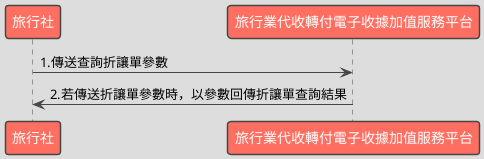

# 單筆查詢收據折讓資料API

> 本文件包含 **AES256 加密、SHA256 簽章** 規格，詳見下方對應章節

---

## API 基本資訊

| 項目 | 內容 |
|:-----|:-----|
| 副標題 | 查詢收據折讓資料 |
| 串接方式 | 幕後 |
| Content-Type | `application/x-www-form-urlencoded` |
| 加密方式 | AES256、SHA256 |
| 正式環境 URL | https://api.travelinvoice.com.tw/invoice_search |
| 測試環境 URL | https://capi.travelinvoice.com.tw/invoice_search |

---

## 欄位定義

### Post 參數（請求） [POST]

| 欄位名稱 | 中文說明 | 型別 | 長度 | 必填 | 預設值 | 允許值 | 可為空 | 範例 | 備註 |
|----------|----------|------|------|------|--------|--------|--------|------|------|
| MerchantID_ | 旅行社統一編號 | string | 8 | 必填 |  |  |  | 54352706 | 旅行社統一編號。 |
| SearchType_ | 搜尋種類 | int | 1 | 必填 |  | 2 |  | 2 | 2 |
| PostData_ | 加密資料 | array |  | 必填 |  |  |  |  | 字串欄位組合後做AES256加密，欄位說明如下表 |

### PostData_內含欄位（請求）　AES加密_字串

| 欄位名稱 | 中文說明 | 型別 | 長度 | 必填 | 預設值 | 允許值 | 可為空 | 範例 | 備註 |
|----------|----------|------|------|------|--------|--------|--------|------|------|
| Version | 串接程式版本 | string | 5 | 必填 |  | 1.1 |  | 1.1 | 固定帶 1.1 |
| TimeStamp | 時間戳記 | string | 30 | 必填 |  |  |  | 1400137200 | Unix 時間戳記（秒），即自 1970-01-01 00:00:00 UTC 至今的秒數 例：2014-05-15 15:00:00 這個時間的時間，戳記為 1400137200，建議帶入當前時間 |
| InvoiceNumber | 收據號碼 | string | 9 | 必填 |  |  |  | T13671005 | 此次查詢的收據號碼。 |
| AllowanceNo | 作廢單號 | string | 20 | 必填 |  |  |  | 722545 | 開立折讓單時，系統回傳的系統流水號。 |

### 系統回應訊息（回應）

| 欄位名稱 | 中文說明 | 型別 | 長度 | 範例 | 必回傳 | 備註 |
|----------|----------|------|------|------|--------|------|
| Status | 回傳狀態 | string | 10 | SUCCESS | Y | 1.查詢成功，則回傳 SUCCESS 2.查詢失敗，則回傳錯誤代碼 |
| Message | 回傳訊息 | string | 30 | 查詢折讓單成功 | Y | 文字，此次回傳狀態說明 |
| AllowanceNo | 折讓流水號 | string | 20 | 722545 |  | 開立折讓時的系統流水號 |
| InvoiceNumber | 收據號碼 | string | 9 | T13671003 |  | 執行折讓之收據號碼 |
| MerchantOrderNo | 自訂編號 | string | 30 | O_6588415 |  | 此次開立折讓的收據，於開立收據時，提供之自訂編號。 |
| BuyerEmail | 買受人 Email | string | 100 | abc@gmail.com |  | 於開立收據時，該張收據的買受人電子信箱。 |
| AllowanceType | 折讓方式 | int | 1 | 1 |  | 0=開立等待折讓。待買受人確認折讓後，再向平台發動確認等待折讓。 1=立即折讓。 |
| AllowanceStatus | 折讓狀態 | int | 1 | 1 |  | 該張折讓單之狀態。 0=未確認折讓 1=已確認折讓 2=取消折讓 |
| AllowanceCreateTime | 折讓建立日期 | datetime |  | 2014-09-25 12:12:12 |  | 該張折讓開立時間，例：2014-09-25 12:12:12。 |
| AllowanceDate | 確認折讓日期 | datetime |  | 2014-09-25 12:12:12 |  | 該張折讓確立開立時間，例：2014-09-25 12:12:12。 |
| ItemDetail | 折讓商品 | text |  |  |  | 該張收據開立時的商品資訊(JSON 格式)。 ItemNum = 品項序號 ItemName = 商品名稱 ItemCount = 數量 ItemWord = 單位 ItemPrice = 單價 ItemAmount = 小計 |
| AllowanceTotalAmt | 折讓金額 | int | 8 | 655 |  | 此次開立折讓的金額 |
| RemainAmt | 折讓後剩餘收據金額 | int | 8 | 522 |  | 確認折讓後，此張收據剩餘之收據金額。 |
| SellerName | 經手人 | string | 50 | 丁小雨 |  | 開立折讓單人員名稱。 |
| CheckCode | 檢查碼 | string | 150 | 0C69DBB83FD36B6A2B2E9E614DAEA3D91D474C2D8A829870CA91511C55AF2AA |  | 用來檢查此次資料回傳的合法性，串接時可以比對此參數資料，來檢核是否為平台所回傳，檢核方法請參考”SHA256加密說明”。如開立失敗則回傳空值。  CheckCode = 將 InvoiceTransNo, MerchantID, MerchantOrderNo, RandomNum, TotalAmt 依 SHA256 簽章規格計算所得之雜湊值  InvoiceTransNo , MerchantOrderNo,RandomNum, TotalAmt不含在此API回應欄位中，需讓程式 InvoiceNumber（收據號碼）於資料庫中來取得這4個欄位資料。 |
| EndStr | 字串結尾 | string | 2 | ## | Y | 固定回傳 ##，使用 String 方式接收資料的用戶，須多判斷 EndStr=##，確保資料傳遞完整。 |

---

## 錯誤代碼

> 以下錯誤代碼均於 **HTTP 200** 回應中回傳，錯誤訊息包含於 response body。

| 代碼 | 說明 |
|------|------|
| KEY10001 | 非旅行社 API 串接 IP |
| KEY10002 | 資料解密錯誤 |
| KEY10003 | 版本錯誤 |
| KEY10004 | 資料不齊全 |
| KEY10006 | 旅行社未申請啟用電子收據 |
| KEY10007 | 頁面停留超過 30 分鐘 |
| KEY10009 | 取不到旅行社統一編號的資料 |
| KEY10010 | 旅行社統一編號空白 |
| KEY10011 | PostData_欄位空白 |
| KEY10012 | 資料傳遞錯誤 |
| KEY10013 | 資料空白 |
| KEY10014 | TimeOut。通常泛指 I/O 上的 time out |
| KEY10015 | 收據金額格式錯誤 |
| KEY10016 | 旅行社無申請郵遞列印加值服務 |
| KEY10017 | 郵遞列印加值服務可用數不足 |
| KEY10018 | 開立人欄位未填寫 |
| KEY10019 | 旅行社已被停權 |
| NOR10001 | 網路連線異常 |
| IS10001 | 收據號碼未填寫 |
| IS10002 | 收據防偽隨機碼未填寫 |
| IS10003 | DisplayFlag 有誤 |
| BS10015 | 折讓單號未填寫 |
| BS10016 | 作廢單號未填寫 |
| BS10017 | 查無折讓單資料 |
| BS10018 | 查無作廢單資料 |

---

## 串接範例

### 請求範例

> 示範用 Key：`12345678901234567890123456789012`（32 bytes）　IV：`1234567890123456`（16 bytes）

> 外層請求參數組合格式：**String**，各必填欄位以 `欄位名稱=值` 形式，以 `&` 符號串接後傳送，簡單字串拼接 key=value&key=value，不做 URL encode

```http
POST https://api.travelinvoice.com.tw/invoice_search
Content-Type: application/x-www-form-urlencoded

MerchantID_=54352706&SearchType_=2&PostData_=0ddd722db534612152877a2082309380fefc1612526018201e1b1d754ffcf5b058b95ed9bba6906eb0a1e97844810111f17fea19cd8db43c8a708834ca18bc142114d4995c372cbb487661f410e200f42e35e2266fcc5257c9cd71c06ed9eaf9
```

**PostData_（AES加密_字串）加密前明文（必填欄位）**

> 加密：AES-256-CBC，輸出：Hex，Key 與 IV 同上
> 欄位組合格式：**String**，各必填欄位以 `欄位名稱=值` 形式，以 `&` 符號串接後加密

```
Version=1.1&TimeStamp=1400137200&InvoiceNumber=T13671005&AllowanceNo=722545
```

### 成功回應範例

> 回傳內容為 URL 編碼字串，請先進行 URL 解碼後，依 key=value 格式逐欄解析，各欄位以 & 分隔。

> 外層回應格式：**String**，各欄位以 `欄位名稱=值` 形式，以 `&` 符號串接後回傳

**系統回應**

```
Status=SUCCESS&Message=查詢折讓單成功&AllowanceNo=722545&InvoiceNumber=T13671003&MerchantOrderNo=O_6588415&BuyerEmail=abc@gmail.com&AllowanceType=1&AllowanceStatus=1&AllowanceCreateTime=2014-09-25 12:12:12&AllowanceDate=2014-09-25 12:12:12&ItemDetail=SampleValue&AllowanceTotalAmt=655&RemainAmt=522&SellerName=丁小雨&CheckCode=0C69DBB83FD36B6A2B2E9E614DAEA3D91D474C2D8A829870CA91511C55AF2AA&EndStr=##
```

> 本 API 回應無加密欄位，上方字串即為完整明文。

### 失敗回應範例

> 回傳內容為 URL 編碼字串，請先進行 URL 解碼後，依 key=value 格式逐欄解析，各欄位以 & 分隔。

**系統回應**

```
Status=KEY10001&Message=非旅行社 API 串接 IP&EndStr=##
```

---

## 串接目的

電子收據開立折讓資料後，可透過本API來查詢收據折讓的參數、進度及狀態。

## 資料交換方式

1. 旅行社以「HTTP POST」方式傳送收據資料至電子收據平台進行開立。 
2. Content-Type 為 application/x-www-form-urlencoded。 
3. 編碼格式為 UTF-8。 
4. 電子收據平台回應格式化的字串。 
5. 各欄位計算單位為字元。中、英、數字、符號都算一個字元。 
6. 各欄位間以「&」作為連接符號，各欄位內不得含有此字元（U+0026）。

## 串接前置作業

（請先完成，否則程式必失敗）

 1. 取得 HashKey / HashIV
- 測試環境：登入測試區後台 → 基本資料 → API 串接設定 → 複製 HashKey 與 HashIV
- 正式環境：登入正式區後台 → 基本資料 → API 串接設定 → 複製 HashKey 與 HashIV

2. 申請 IP 白名單
- 申請窗口：於官網下載申請表單並填寫後，傳送後客服中心（傳真 / Email）
- 最多可設定 10 組 IP
- 需提供：伺服器對外 IP（非內網 IP，可至 https://ifconfig.me 查詢）
- 生效時間：通常 1-2 個工作天

3. 環境網址
-測試環境與正式環境是完全不同的設備，資料不共通，上線前務必要確認已經將串接網址切換至正式區網址

4. 常見「忘記做前置作業」的錯誤訊號
- `KEY10001 非旅行社 API 串接 IP` → IP 白名單未設定或設錯
- `KEY10002 資料解密錯誤` → HashKey / HashIV 不正確或仍是範例值
- `KEY10009 取不到旅行社統一編號的資料` → MerchantID 錯或未啟用

## 查詢折讓單流程



---

---

## AES256 加密規格

### 加密演算法規格

| 項目 | 規格 |
|:-----|:-----|
| 演算法 | AES |
| 金鑰長度 | 256 bits（32 bytes） |
| 加密模式 | CBC |
| 填充方式 | 類 PKCS7（32-byte 邊界，非標準） |
| 輸出格式 | Hex 十六進位 |
| 輸入編碼 | UTF-8 |
| Key 長度 | 32 bytes |
| IV 長度 | 16 bytes |

> 本文件的「**Key**」即實際串接金鑰 **HashKey**；「**IV**」即 **HashIV**。

> ⚠️ **注意：本 API 採用類 PKCS7 演算法，但以 32 bytes 為填充邊界（非 AES 標準的 16 bytes），必須特別處理**
>
> 標準 PKCS7 以 AES block size（**16 bytes**）為補齊單位；本 API 採用 **32 bytes** 作為填充邊界，屬類 PKCS7 的自訂規格。
> 各語言標準加密函式庫（PHP `openssl`、Node.js `crypto`、Python `pycryptodome`）的預設 PKCS7 均使用 16-byte 邊界，**直接呼叫內建 PKCS7 將產生錯誤的填充**，導致對方解密失敗。
> **實作時必須手動計算 32-byte 邊界填充，並停用函式庫的自動填充**（PHP：`OPENSSL_ZERO_PADDING`；Node.js：`cipher.setAutoPadding(false)`；Python：`pad(..., 32)`）。

### 適用欄位群組

- **PostData_內含欄位**（AES加密_字串）（請求）　傳送欄位名稱：`PostData_`

### 加密範例

> 以下為固定示範數值，**請勿用於正式環境**。
> 本範例已採用類 PKCS7（32-byte 邊界）填充計算，與標準 PKCS7（16-byte 邊界）結果**不同**。

| 項目 | 值 |
|:-----|:---|
| Key（ASCII，32 bytes） | `12345678901234567890123456789012` |
| IV（ASCII，16 bytes） | `1234567890123456` |
| 加密前字串（plaintext） | `Version=1.1&TimeStamp=1400137200&InvoiceNumber=T13671005&AllowanceNo=722545` |
| 加密後（Hex 十六進位） | `0ddd722db534612152877a2082309380fefc1612526018201e1b1d754ffcf5b058b95ed9bba6906eb0a1e97844810111f17fea19cd8db43c8a708834ca18bc142114d4995c372cbb487661f410e200f42e35e2266fcc5257c9cd71c06ed9eaf9` |

> 驗證方法：使用上述 Key / IV 對加密後字串解密，應還原為加密前字串。

---

## SHA256 簽章規格

### 簽章規格

| 項目 | 規格 |
|:-----|:-----|
| 演算法 | SHA-256 |
| 輸出格式 | 十六進位字串（大寫） |
| Key 欄位名稱 | `HashKey` |
| IV 欄位名稱 | `HashIV` |
| 字串組合方式 | **前IV後KEY** |
| 參與簽章欄位 | `InvoiceTransNo,MerchantID,MerchantOrderNo,RandomNum,TotalAmt` |

### 字串組合說明

組合方式：**前IV後KEY**

參與簽章的欄位（依英文字母順序排列）：`InvoiceTransNo`、`MerchantID`、`MerchantOrderNo`、`RandomNum`、`TotalAmt`

> **欄位順序**：組合字串時，請依照**英文字母順序**排列各參與欄位，**不可任意調換**。

```
HashIV={IV值}&{欄位1}={值1}&...&HashKey={Key值}
```

以 `HashIV={iv}` 開頭，接各參與欄位（依序），最後以 `HashKey={key}` 結尾，各段以 `&` 分隔。

### 簽章範例

> 以下為固定示範數值，**請勿用於正式環境**。

| 項目 | 值 |
|:-----|:---|
| HashKey | `abc1234567890def` |
| HashIV | `xyz0987654321uvw` |
| InvoiceTransNo | `SampleValue` |
| MerchantID | `SampleValue` |
| MerchantOrderNo | `O_6588415` |
| RandomNum | `SampleValue` |
| TotalAmt | `SampleValue` |
| **組合後字串** | `HashIV=xyz0987654321uvw&InvoiceTransNo=SampleValue&MerchantID=SampleValue&MerchantOrderNo=O_6588415&RandomNum=SampleValue&TotalAmt=SampleValue&HashKey=abc1234567890def` |
| **SHA256 雜湊（大寫）** | `E0EFA0C4FC75B8E1360838D91795313AFA853057C3F88E87D81FA6A6226329FD` |

> 驗證方法：將上述組合後字串進行 SHA256 計算並轉大寫，應得到上方雜湊值。

---

## 加解密程式碼

> 以下僅為加解密／簽章核心程式碼，HTTP 請求與參數組裝請依上方欄位定義自行完成。

### PHP

```php
<?php

// Make sure to enable the OpenSSL extension in your php.ini:
// extension=openssl

// --- AES256 Helper Functions ---

/**
 * Applies PKCS7 padding with a specified block size.
 * The specification mentions "PKCS7 (Block Size 32) (⚠ 非標準規格)".
 * This implementation interprets this as standard PKCS7 padding, but with 32 bytes
 * as the block size for padding calculations, rather than the intrinsic AES block size of 16.
 * This ensures that if the data length is a multiple of 32, a full block of 32 bytes
 * (each byte being `chr(32)`) is added, making unpadding unambiguous.
 *
 * @param string $data The data to pad (UTF-8 encoded).
 * @param int $block_size The block size for padding (e.g., 32 as per spec).
 * @return string Padded data.
 */
function _pkcs7_pad(string $data, int $block_size = 32): string
{
    $pad_len = $block_size - (mb_strlen($data, '8bit') % $block_size);
    // According to standard PKCS7, if the data is already a multiple of block_size,
    // a full block of padding is added. The calculation naturally handles this
    // as ($block_size - 0) will be $block_size.
    return $data . str_repeat(chr($pad_len), $pad_len);
}

/**
 * Removes PKCS7 padding.
 *
 * @param string $padded_data Padded data.
 * @return string Unpadded data.
 */
function _pkcs7_unpad(string $padded_data): string
{
    if (empty($padded_data)) {
        return '';
    }
    $pad_len = ord(substr($padded_data, -1));

    // Basic validation to prevent errors from invalid padding bytes.
    // Padding length must be greater than 0 and not exceed the total data length.
    if ($pad_len <= 0 || $pad_len > mb_strlen($padded_data, '8bit')) {
        // In a production scenario, you might want to log this or throw an exception.
        // For this core crypto module, we'll return the original data to avoid fatal errors,
        // but this indicates potential corruption or incorrect padding.
        return $padded_data;
    }
    return substr($padded_data, 0, -$pad_len);
}

/**
 * Encrypts plaintext using AES-256-CBC with manual PKCS7 padding (Block Size 32).
 *
 * @param string $plaintext The data to encrypt (UTF-8 encoded).
 * @param string $key The 32-byte (256-bit) encryption key.
 * @param string $iv The 16-byte (128-bit) IV.
 * @return string The ciphertext in hexadecimal format.
 * @throws Exception If encryption fails or key/IV lengths are incorrect.
 */
function aes_encrypt(string $plaintext, string $key, string $iv): string
{
    if (mb_strlen($key, '8bit') !== 32) {
        throw new Exception("AES Key must be 32 bytes.");
    }
    if (mb_strlen($iv, '8bit') !== 16) {
        throw new Exception("AES IV must be 16 bytes.");
    }

    $padded_plaintext = _pkcs7_pad($plaintext, 32); // Pad to 32-byte multiple as per spec

    // OPENSSL_RAW_DATA flag:
    // 1. Prevents base64 encoding of the output.
    // 2. Disables built-in padding in OpenSSL, which is crucial as we do manual padding.
    $ciphertext_raw = openssl_encrypt(
        $padded_plaintext,
        "AES-256-CBC",
        $key,
        OPENSSL_RAW_DATA,
        $iv
    );

    if ($ciphertext_raw === false) {
        throw new Exception("AES encryption failed. Check OpenSSL errors: " . openssl_error_string());
    }

    return bin2hex($ciphertext_raw);
}

/**
 * Decrypts a hexadecimal ciphertext using AES-256-CBC and removes manual PKCS7 padding.
 *
 * @param string $hex_ciphertext The hexadecimal ciphertext to decrypt.
 * @param string $key The 32-byte (256-bit) encryption key.
 * @param string $iv The 16-byte (128-bit) IV.
 * @return string The decrypted plaintext (UTF-8 encoded).
 * @throws Exception If decryption fails or key/IV lengths are incorrect.
 */
function aes_decrypt(string $hex_ciphertext, string $key, string $iv): string
{
    if (mb_strlen($key, '8bit') !== 32) {
        throw new Exception("AES Key must be 32 bytes.");
    }
    if (mb_strlen($iv, '8bit') !== 16) {
        throw new Exception("AES IV must be 16 bytes.");
    }

    $ciphertext_raw = hex2bin($hex_ciphertext);
    if ($ciphertext_raw === false) {
        throw new Exception("Invalid hex ciphertext provided for decryption.");
    }

    // OPENSSL_RAW_DATA flag:
    // 1. Prevents base64 decoding of the input.
    // 2. Disables built-in padding removal in OpenSSL, aligning with manual unpadding.
    $decrypted_raw = openssl_decrypt(
        $ciphertext_raw,
        "AES-256-CBC",
        $key,
        OPENSSL_RAW_DATA,
        $iv
    );

    if ($decrypted_raw === false) {
        throw new Exception("AES decryption failed. Check OpenSSL errors: " . openssl_error_string());
    }

    return _pkcs7_unpad($decrypted_raw);
}

// --- SHA256 Signature Functions ---

/**
 * Generates an SHA256 signature string based on the provided data, HashKey, and HashIV.
 * The string is constructed by concatenating fields in a specific order and format,
 * without URL encoding.
 *
 * @param array $data An associative array of fields participating in the signature.
 *                    Expected keys: InvoiceTransNo, MerchantID, MerchantOrderNo, RandomNum, TotalAmt.
 * @param string $hash_key The HashKey for signing.
 * @param string $hash_iv The HashIV for signing.
 * @return string The uppercase hexadecimal SHA256 hash.
 * @throws Exception If any required signature field is missing from the data array.
 */
function generate_signature(array $data, string $hash_key, string $hash_iv): string
{
    $signature_field_names = [
        'InvoiceTransNo',
        'MerchantID',
        'MerchantOrderNo',
        'RandomNum',
        'TotalAmt'
    ];

    $parts = [];
    $parts[] = "HashIV={$hash_iv}"; // Start with HashIV

    // Append sorted fields
    foreach ($signature_field_names as $field_name) {
        if (!isset($data[$field_name])) {
            throw new Exception("Required signature field '{$field_name}' is missing.");
        }
        $parts[] = "{$field_name}={$data[$field_name]}";
    }

    $parts[] = "HashKey={$hash_key}"; // End with HashKey

    $raw_string = implode('&', $parts);

    return strtoupper(hash('sha256', $raw_string));
}

/**
 * Verifies an SHA256 signature by comparing a newly generated signature
 * with an expected one using a timing-safe comparison function.
 *
 * @param array $data An associative array of fields participating in the signature.
 * @param string $hash_key The HashKey for signing.
 * @param string $hash_iv The HashIV for signing.
 * @param string $expected_signature The expected uppercase hexadecimal SHA256 signature to verify against.
 * @return bool True if the generated signature matches the expected signature, false otherwise.
 */
function verify_signature(array $data, string $hash_key, string $hash_iv, string $expected_signature): bool
{
    try {
        $generated_signature = generate_signature($data, $hash_key, $hash_iv);
        // Use hash_equals() for timing-safe comparison to mitigate timing attacks.
        return hash_equals($generated_signature, strtoupper($expected_signature));
    } catch (Exception $e) {
        // Log or handle errors during signature generation/verification process.
        error_log("SHA256 signature verification failed: " . $e->getMessage());
        return false;
    }
}

// --- Test Vectors Demonstration ---

echo "--- AES256 Encryption/Decryption Test Vector ---\n";

// !!! IMPORTANT: Replace these test keys with your actual production keys !!!
$aes_test_key = '0123456789abcdef0123456789abcdef'; // 32 bytes (256 bits)
$aes_test_iv = 'fedcba9876543210';                 // 16 bytes (128 bits)

// Plaintext data for PostData_, which is a querystring of its sub-fields.
$aes_plaintext_data_fields = [
    'Version'       => '1.1',
    'TimeStamp'     => '1678886400', // Example Unix timestamp (2023-03-15 00:00:00 UTC)
    'InvoiceNumber' => 'T13671005',
    'AllowanceNo'   => '722545',
];
$aes_plaintext = http_build_query($aes_plaintext_data_fields);

echo "AES Input Plaintext (PostData_ content):\n" . $aes_plaintext . "\n";
echo "AES Key: " . $aes_test_key . "\n";
echo "AES IV: " . $aes_test_iv . "\n";

try {
    $encrypted_hex = aes_encrypt($aes_plaintext, $aes_test_key, $aes_test_iv);
    echo "AES Encrypted (Expected Ciphertext, Hex): " . $encrypted_hex . "\n";

    $decrypted_text = aes_decrypt($encrypted_hex, $aes_test_key, $aes_test_iv);
    echo "AES Decrypted Text: " . $decrypted_text . "\n";
    echo "AES Decryption matched original plaintext: " . ($decrypted_text === $aes_plaintext ? "True" : "False") . "\n";

} catch (Exception $e) {
    echo "AES Error: " . $e->getMessage() . "\n";
}

echo "\n--- SHA256 Signature Generation/Verification Test Vector ---\n";

// !!! IMPORTANT: Replace these test keys with your actual production HashKey and HashIV !!!
// These are distinct from the AES keys.
$sha_test_hash_key = 'abcdef0123456789abcdef0123456789ab'; // Example HashKey
$sha_test_hash_iv = '0123456789abcdef';                      // Example HashIV

// Data fields participating in the signature (from the API response for CheckCode verification)
// These should correspond to InvoiceTransNo,MerchantID,MerchantOrderNo,RandomNum,TotalAmt
// In a real scenario, InvoiceTransNo,MerchantOrderNo,RandomNum,TotalAmt would be retrieved from your database
// using the InvoiceNumber from the API response.
$sha_test_fields = [
    'InvoiceTransNo'    => 'TRANS12345',
    'MerchantID'        => '54352706',
    'MerchantOrderNo'   => 'ORDER_001',
    'RandomNum'         => '98765',
    'TotalAmt'          => '1200',
];

echo "SHA HashKey: " . $sha_test_hash_key . "\n";
echo "SHA HashIV: " . $sha_test_hash_iv . "\n";
echo "SHA Participating Fields:\n";
foreach ($sha_test_fields as $key => $value) {
    echo "  - {$key}: {$value}\n";
}

try {
    // Manually construct the raw string to show the exact input for SHA256
    // This exact string should be produced by the generate_signature function internally.
    $raw_string_for_demo = "HashIV={$sha_test_hash_iv}";
    $raw_string_for_demo .= "&InvoiceTransNo={$sha_test_fields['InvoiceTransNo']}";
    $raw_string_for_demo .= "&MerchantID={$sha_test_fields['MerchantID']}";
    $raw_string_for_demo .= "&MerchantOrderNo={$sha_test_fields['MerchantOrderNo']}";
    $raw_string_for_demo .= "&RandomNum={$sha_test_fields['RandomNum']}";
    $raw_string_for_demo .= "&TotalAmt={$sha_test_fields['TotalAmt']}";
    $raw_string_for_demo .= "&HashKey={$sha_test_hash_key}";

    echo "SHA Raw String for Signature:\n" . $raw_string_for_demo . "\n";

    $generated_signature = generate_signature($sha_test_fields, $sha_test_hash_key, $sha_test_hash_iv);
    echo "SHA Generated Signature (Expected Signature, Uppercase Hex): " . $generated_signature . "\n";

    // Simulate an expected signature received from the API (e.g., the CheckCode field)
    $simulate_api_signature = $generated_signature; // For successful verification

    echo "Verifying SHA signature against simulated API signature: " . $simulate_api_signature . "\n";
    $is_valid_signature = verify_signature($sha_test_fields, $sha_test_hash_key, $sha_test_hash_iv, $simulate_api_signature);
    echo "SHA Signature verification successful: " . ($is_valid_signature ? "True" : "False") . "\n";

    // Demonstrate verification failure with a tampered signature
    $tampered_signature = $generated_signature . 'F'; // Append 'F' to tamper it
    echo "Verifying SHA signature against tampered signature: " . $tampered_signature . "\n";
    $is_valid_tampered = verify_signature($sha_test_fields, $sha_test_hash_key, $sha_test_hash_iv, $tampered_signature);
    echo "SHA Signature verification (tampered) successful: " . ($is_valid_tampered ? "True" : "False") . "\n";

} catch (Exception $e) {
    echo "SHA256 Error: " . $e->getMessage() . "\n";
}

?>
```

