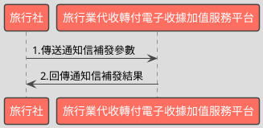

# 補發通知信API

> 本文件包含 **AES256 加密、SHA256 簽章** 規格，詳見下方對應章節

---

## API 基本資訊

| 項目 | 內容 |
|:-----|:-----|
| 副標題 | 補發收據開立、作廢單或折讓單 |
| 串接方式 | 幕後 |
| Content-Type | `application/x-www-form-urlencoded` |
| 加密方式 | AES256、SHA256 |
| 正式環境 URL | https://api.travelinvoice.com.tw/notification_resend |
| 測試環境 URL | https://capi.travelinvoice.com.tw/notification_resend |

---

## 欄位定義

### Post 參數（請求） [POST]

| 欄位名稱 | 中文說明 | 型別 | 長度 | 必填 | 預設值 | 允許值 | 可為空 | 範例 | 備註 |
|----------|----------|------|------|------|--------|--------|--------|------|------|
| MerchantID_ | 旅行社統一編號 | string | 8 | 必填 |  |  |  | 54352706 | 旅行社統一編號。 |
| PostData_ | 加密資料 | array |  | 必填 |  |  |  |  | 字串欄位組合後做AES256加密，欄位說明如下表 |

### PostData_內含欄位（請求）　AES加密_字串

| 欄位名稱 | 中文說明 | 型別 | 長度 | 必填 | 預設值 | 允許值 | 可為空 | 範例 | 備註 |
|----------|----------|------|------|------|--------|--------|--------|------|------|
| Version | 串接程式版本 | string | 5 | 必填 |  | 1.0 |  | 1.0 | 固定帶1.0 |
| TimeStamp | 時間戳記 | string | 30 | 必填 |  |  |  | 1400137200 | Unix 時間戳記（秒），即自 1970-01-01 00:00:00 UTC 至今的秒數 例：2014-05-15 15:00:00 這個時間的時間，戳記為 1400137200，建議帶入當前時間 |
| MailType | 發信類型 | int | 1 | 必填 |  | 1,2,3 |  | 1 | 依據所需發信的類型，給予對應參數。 1=開立信 2=折讓 3=作廢 |
| InvoiceNumber | 收據號碼 | string | 9 | 必填 |  |  |  | T13671008 | 此次查詢的收據號碼。 |
| SystemCorrespondNo | 折讓、作廢流水號 | string | 20 | 條件必填 |  |  |  | 8952 | 此次補發信的折讓單號或作廢單號。若MailType 為 2 或 3 才需傳入 |
| BuyerEmail | 收件人 Email | string | 100 | 必填 |  |  |  | abc@gmail.com | 此次補發信的 Mail 信箱，可用半型逗號區隔多信箱。 |

### 系統回應訊息（回應）

| 欄位名稱 | 中文說明 | 型別 | 長度 | 範例 | 必回傳 | 備註 |
|----------|----------|------|------|------|--------|------|
| Status | 回傳狀態 | string | 10 | SUCCESS | Y | 1.補發信成功，則回傳 SUCCESS 2.補發信失敗，則回傳錯誤代碼 |
| Message | 回傳訊息 | string | 30 | 成功 | Y | 文字，此次回傳狀態說明 |
| MerchantID | 旅行社統一編號 | string | 8 | 54352706 | Y | 旅行社統一編號。 |
| CheckCode | 檢查碼 | string | 150 | A791D7C1D64093962939B54CC1C07E8109EB8C454E0DC18F822BBA076EB38E66 |  | 用來檢查此次資料回傳的合法性，串接時可以比對此參數資料，來檢核是否為平台所回傳，檢核方法請參考”SHA256加密說明”。如發動失敗則不回傳。  CheckCode = InvoiceTransNo,MerchantID,MerchantOrderNo,RandomNum,TotalAmt依 SHA256 簽章規格計算所得之雜湊值  InvoiceTransNo ,MerchantOrderNo,RandomNum, TotalAmt不含在此API回應欄位中，需程式自行保存開立收據時回傳的 InvoiceTransNo ,MerchantOrderNo,RandomNum, TotalAmt，供日後 CheckCode 驗證使用。 |
| EndStr | 字串結尾 | string | 2 | ## | Y | 固定回傳 ##，使用 String 方式接收資料的用戶，須 多判斷 EndStr=##，確保資料傳遞完整。 |

---

## 錯誤代碼

> 以下錯誤代碼均於 **HTTP 200** 回應中回傳，錯誤訊息包含於 response body。

| 代碼 | 說明 |
|------|------|
| KEY10001 | 非旅行社 API 串接 IP |
| KEY10002 | 資料解密錯誤 |
| KEY10003 | 版本錯誤 |
| KEY10004 | 資料不齊全 |
| KEY10006 | 旅行社未申請啟用電子收據 |
| KEY10007 | 頁面停留超過 30 分鐘 |
| KEY10009 | 取不到旅行社統一編號的資料 |
| KEY10010 | 旅行社統一編號空白 |
| KEY10011 | PostData_欄位空白 |
| KEY10012 | 資料傳遞錯誤 |
| KEY10013 | 資料空白 |
| KEY10014 | TimeOut。通常泛指 I/O 上的 time out |
| KEY10015 | 收據金額格式錯誤 |
| KEY10016 | 旅行社無申請郵遞列印加值服務 |
| KEY10017 | 郵遞列印加值服務可用數不足 |
| KEY10018 | 開立人欄位未填寫 |
| KEY10019 | 旅行社已被停權 |
| NOR10001 | 網路連線異常 |
| INV70001 | 欄位資料格式錯誤 |
| SM10001 | 發信種類錯誤（請檢查 MailType 欄位） |
| SM10002 | 通知信信箱錯誤（請檢查 BuyerEmail 欄位） |
| BS10006 | 查無收據資料 |
| BS10015 | 折讓單號未填寫 |
| BS10016 | 作廢單號未填寫 |
| BS10017 | 查無折讓單資料 |
| BS10018 | 查無作廢單資料 |

---

## 串接範例

### 請求範例

> 示範用 Key：`12345678901234567890123456789012`（32 bytes）　IV：`1234567890123456`（16 bytes）

> 外層請求參數組合格式：**String**，各必填欄位以 `欄位名稱=值` 形式，以 `&` 符號串接後傳送，簡單字串拼接 key=value&key=value，不做 URL encode

```http
POST https://api.travelinvoice.com.tw/notification_resend
Content-Type: application/x-www-form-urlencoded

MerchantID_=54352706&PostData_=672781a0cacae60a9e8bf6e0866d113f5b90725edbb2af54aea18d6b41f6d8f3945fa3f1195f4bd2b361937d9796ac05d06e9c3ec75c250b86c9a4c90396feca283d609150ae37f001c1c1c2592090673344b20831c35d5febb986d183cd70a8
```

**PostData_（AES加密_字串）加密前明文（必填欄位）**

> 加密：AES-256-CBC，輸出：Hex，Key 與 IV 同上
> 欄位組合格式：**String**，各必填欄位以 `欄位名稱=值` 形式，以 `&` 符號串接後加密

```
Version=1.0&TimeStamp=1400137200&MailType=1&InvoiceNumber=T13671008&BuyerEmail=abc@gmail.com
```

### 成功回應範例

> 回傳內容為 URL 編碼字串，請先進行 URL 解碼後，依 key=value 格式逐欄解析，各欄位以 & 分隔。

> 外層回應格式：**String**，各欄位以 `欄位名稱=值` 形式，以 `&` 符號串接後回傳

**系統回應**

```
Status=SUCCESS&Message=成功&MerchantID=54352706&CheckCode=A791D7C1D64093962939B54CC1C07E8109EB8C454E0DC18F822BBA076EB38E66&EndStr=##
```

> 本 API 回應無加密欄位，上方字串即為完整明文。

### 失敗回應範例

> 回傳內容為 URL 編碼字串，請先進行 URL 解碼後，依 key=value 格式逐欄解析，各欄位以 & 分隔。

**系統回應**

```
Status=KEY10001&Message=非旅行社 API 串接 IP&MerchantID=54352706&EndStr=##
```

---

## 串接目的

1.提供旅行商業同業公會旗下會員，透過程式串接方式，來進行通知信補發。 
2.此 API 以發信類型(MailType)來區分要補發收據開立、作廢單或折讓單，並須指定 要補發的 EAMIL 信箱來達成通知信補發目的。 
3.本平台未提供媒體申報之相關機制與作業，旅行社請自行進行相關作業。

## 資料交換方式

1. 旅行社以「HTTP POST」方式傳送收據資料至電子收據平台進行開立。 
2. Content-Type 為 application/x-www-form-urlencoded。 
3. 編碼格式為 UTF-8。 
4. 電子收據平台回應格式化的字串。 
5. 各欄位計算單位為字元。中、英、數字、符號都算一個字元。 
6. 各欄位間以「&」作為連接符號，各欄位內不得含有此字元（U+0026）。

## 串接前置作業

（請先完成，否則程式必失敗）

 1. 取得 HashKey / HashIV
- 測試環境：登入測試區後台 → 基本資料 → API 串接設定 → 複製 HashKey 與 HashIV
- 正式環境：登入正式區後台 → 基本資料 → API 串接設定 → 複製 HashKey 與 HashIV

2. 申請 IP 白名單
- 申請窗口：於官網下載申請表單並填寫後，傳送後客服中心（傳真 / Email）
- 最多可設定 10 組 IP
- 需提供：伺服器對外 IP（非內網 IP，可至 https://ifconfig.me 查詢）
- 生效時間：通常 1-2 個工作天

3. 環境網址
-測試環境與正式環境是完全不同的設備，資料不共通，上線前務必要確認已經將串接網址切換至正式區網址

4. 常見「忘記做前置作業」的錯誤訊號
- `KEY10001 非旅行社 API 串接 IP` → IP 白名單未設定或設錯
- `KEY10002 資料解密錯誤` → HashKey / HashIV 不正確或仍是範例值
- `KEY10009 取不到旅行社統一編號的資料` → MerchantID 錯或未啟用

## 通知信補發呼叫流程圖



---

---

## AES256 加密規格

### 加密演算法規格

| 項目 | 規格 |
|:-----|:-----|
| 演算法 | AES |
| 金鑰長度 | 256 bits（32 bytes） |
| 加密模式 | CBC |
| 填充方式 | 類 PKCS7（32-byte 邊界，非標準） |
| 輸出格式 | Hex 十六進位 |
| 輸入編碼 | UTF-8 |
| Key 長度 | 32 bytes |
| IV 長度 | 16 bytes |

> 本文件的「**Key**」即實際串接金鑰 **HashKey**；「**IV**」即 **HashIV**。

> ⚠️ **注意：本 API 採用類 PKCS7 演算法，但以 32 bytes 為填充邊界（非 AES 標準的 16 bytes），必須特別處理**
>
> 標準 PKCS7 以 AES block size（**16 bytes**）為補齊單位；本 API 採用 **32 bytes** 作為填充邊界，屬類 PKCS7 的自訂規格。
> 各語言標準加密函式庫（PHP `openssl`、Node.js `crypto`、Python `pycryptodome`）的預設 PKCS7 均使用 16-byte 邊界，**直接呼叫內建 PKCS7 將產生錯誤的填充**，導致對方解密失敗。
> **實作時必須手動計算 32-byte 邊界填充，並停用函式庫的自動填充**（PHP：`OPENSSL_ZERO_PADDING`；Node.js：`cipher.setAutoPadding(false)`；Python：`pad(..., 32)`）。

### 適用欄位群組

- **PostData_內含欄位**（AES加密_字串）（請求）　傳送欄位名稱：`PostData_`

### 加密範例

> 以下為固定示範數值，**請勿用於正式環境**。
> 本範例已採用類 PKCS7（32-byte 邊界）填充計算，與標準 PKCS7（16-byte 邊界）結果**不同**。

| 項目 | 值 |
|:-----|:---|
| Key（ASCII，32 bytes） | `12345678901234567890123456789012` |
| IV（ASCII，16 bytes） | `1234567890123456` |
| 加密前字串（plaintext） | `Version=1.0&TimeStamp=1400137200&MailType=1&InvoiceNumber=T13671008&BuyerEmail=abc@gmail.com` |
| 加密後（Hex 十六進位） | `672781a0cacae60a9e8bf6e0866d113f5b90725edbb2af54aea18d6b41f6d8f3945fa3f1195f4bd2b361937d9796ac05d06e9c3ec75c250b86c9a4c90396feca283d609150ae37f001c1c1c2592090673344b20831c35d5febb986d183cd70a8` |

> 驗證方法：使用上述 Key / IV 對加密後字串解密，應還原為加密前字串。

---

## SHA256 簽章規格

### 簽章規格

| 項目 | 規格 |
|:-----|:-----|
| 演算法 | SHA-256 |
| 輸出格式 | 十六進位字串（大寫） |
| Key 欄位名稱 | `HashKey` |
| IV 欄位名稱 | `HashIV` |
| 字串組合方式 | **前IV後KEY** |
| 參與簽章欄位 | `InvoiceTransNo,MerchantID,MerchantOrderNo,RandomNum,TotalAmt` |

### 字串組合說明

組合方式：**前IV後KEY**

參與簽章的欄位（依英文字母順序排列）：`InvoiceTransNo`、`MerchantID`、`MerchantOrderNo`、`RandomNum`、`TotalAmt`

> **欄位順序**：組合字串時，請依照**英文字母順序**排列各參與欄位，**不可任意調換**。

```
HashIV={IV值}&{欄位1}={值1}&...&HashKey={Key值}
```

以 `HashIV={iv}` 開頭，接各參與欄位（依序），最後以 `HashKey={key}` 結尾，各段以 `&` 分隔。

### 簽章範例

> 以下為固定示範數值，**請勿用於正式環境**。

| 項目 | 值 |
|:-----|:---|
| HashKey | `abc1234567890def` |
| HashIV | `xyz0987654321uvw` |
| InvoiceTransNo | `SampleValue` |
| MerchantID | `54352706` |
| MerchantOrderNo | `SampleValue` |
| RandomNum | `SampleValue` |
| TotalAmt | `SampleValue` |
| **組合後字串** | `HashIV=xyz0987654321uvw&InvoiceTransNo=SampleValue&MerchantID=54352706&MerchantOrderNo=SampleValue&RandomNum=SampleValue&TotalAmt=SampleValue&HashKey=abc1234567890def` |
| **SHA256 雜湊（大寫）** | `8D8A6A2370BB658300300B34E7FEB2DF6D1BE63B89A4E82A0F2CF867B971CDD5` |

> 驗證方法：將上述組合後字串進行 SHA256 計算並轉大寫，應得到上方雜湊值。

---

## 加解密程式碼

> 以下僅為加解密／簽章核心程式碼，HTTP 請求與參數組裝請依上方欄位定義自行完成。

### PHP

```php
<?php

/**
 * PHP Core Cryptographic Functions and Test Vector for TravelInvoice API.
 *
 * This script provides functions for AES-256-CBC encryption/decryption
 * with specific PKCS7 padding (32-byte block size) and SHA256 signature
 * generation/verification, as per the provided API specifications.
 * It includes a test vector for demonstration purposes.
 *
 * Requirements met:
 * - PHP language.
 * - Core encryption, decryption, signature generation, and verification functions.
 * - Test vector demonstration.
 * - Focus strictly on cryptographic operations; no HTTP, no full request assembly.
 * - No UI/HTML output; uses console `echo` for pure text.
 * - Key/IV are passed as parameters to functions.
 * - Test vector uses fixed, explicit test keys/IVs.
 * - Adheres to all AES and SHA256 specifications (padding, output format, string combination, etc.).
 * - PHP 7.4 compatibility (avoiding `str_contains`, etc.).
 * - Signature comparison uses `hash_equals` for time-safe comparison.
 */

// --- AES256 Encryption/Decryption Core Functions ---

/**
 * Applies PKCS7 padding to the plaintext to ensure its length is a multiple of the block size.
 * The specification requires padding to a block size of 32 bytes for AES-256-CBC,
 * which is non-standard for AES (typically 16 bytes block size for the cipher itself).
 * This implementation adheres strictly to the "Block Size 32" requirement.
 *
 * @param string $plaintext The original string to be padded.
 * @param int $block_size The block size for padding (specified as 32 bytes).
 * @return string The padded string.
 */
function aes_pkcs7_pad(string $plaintext, int $block_size): string
{
    $pad_len = $block_size - (strlen($plaintext) % $block_size);
    // The padding character's value is the padding length itself.
    $padding = str_repeat(chr($pad_len), $pad_len);
    return $plaintext . $padding;
}

/**
 * Removes PKCS7 padding from the decrypted text.
 * Assumes padding was applied with a block size of 32 bytes.
 *
 * @param string $padded_text The padded string to be unpadded.
 * @return string The original unpadded string.
 */
function aes_pkcs7_unpad(string $padded_text): string
{
    if (empty($padded_text)) {
        return '';
    }
    $pad_len = ord(substr($padded_text, -1));

    // Basic sanity check: padding length must be positive and not exceed the string length.
    // Also, all padding bytes should have the value of $pad_len.
    // A robust system might include stricter checks for padding integrity.
    if ($pad_len > 0 && $pad_len <= strlen($padded_text)) {
        // Verify padding bytes for consistency (optional but good practice)
        $expected_padding = str_repeat(chr($pad_len), $pad_len);
        if (substr($padded_text, -$pad_len) === $expected_padding) {
            return substr($padded_text, 0, -$pad_len);
        }
    }
    // If padding appears invalid or length is zero, return original or throw an error.
    // For this example, we return as-is or a truncated string based on $pad_len.
    // In real-world scenarios, an exception would be more appropriate for invalid padding.
    return substr($padded_text, 0, strlen($padded_text) - $pad_len);
}

/**
 * Encrypts plaintext using AES-256-CBC with manual PKCS7 padding (block size 32) and Hex output.
 * Input encoding is expected to be UTF-8.
 *
 * @param string $plaintext The string to encrypt (UTF-8 encoded).
 * @param string $key The encryption key (32 bytes).
 * @param string $iv The initialization vector (16 bytes).
 * @return string|false The encrypted ciphertext in hexadecimal format, or false on error.
 * @throws InvalidArgumentException If key or IV length is incorrect.
 */
function aes_encrypt(string $plaintext, string $key, string $iv): string|false
{
    if (strlen($key) !== 32) {
        throw new InvalidArgumentException("AES Key must be 32 bytes long.");
    }
    if (strlen($iv) !== 16) {
        throw new InvalidArgumentException("AES IV must be 16 bytes long.");
    }

    // Apply manual PKCS7 padding to 32-byte block size
    $padded_plaintext = aes_pkcs7_pad($plaintext, 32);

    $ciphertext = openssl_encrypt(
        $padded_plaintext,
        'AES-256-CBC',
        $key,
        OPENSSL_RAW_DATA | OPENSSL_NO_PADDING, // Disable built-in padding
        $iv
    );

    if ($ciphertext === false) {
        // Log openssl_error_string() for debugging in a real application
        // error_log("AES encryption failed: " . openssl_error_string());
        return false;
    }

    return bin2hex($ciphertext);
}

/**
 * Decrypts hexadecimal ciphertext using AES-256-CBC with manual PKCS7 unpadding (block size 32).
 *
 * @param string $ciphertext_hex The hexadecimal ciphertext to decrypt.
 * @param string $key The decryption key (32 bytes).
 * @param string $iv The initialization vector (16 bytes).
 * @return string|false The decrypted plaintext (UTF-8 encoded), or false on error.
 * @throws InvalidArgumentException If key or IV length is incorrect or ciphertext is not valid hex.
 */
function aes_decrypt(string $ciphertext_hex, string $key, string $iv): string|false
{
    if (strlen($key) !== 32) {
        throw new InvalidArgumentException("AES Key must be 32 bytes long.");
    }
    if (strlen($iv) !== 16) {
        throw new InvalidArgumentException("AES IV must be 16 bytes long.");
    }

    $ciphertext = hex2bin($ciphertext_hex);
    if ($ciphertext === false && strlen($ciphertext_hex) > 0) {
        // hex2bin returns false for invalid hex string, but also for empty string if not careful.
        // Check strlen($ciphertext_hex) > 0 to differentiate.
        throw new InvalidArgumentException("Invalid hexadecimal ciphertext provided.");
    }

    $decrypted_raw = openssl_decrypt(
        $ciphertext,
        'AES-256-CBC',
        $key,
        OPENSSL_RAW_DATA | OPENSSL_NO_PADDING, // Disable built-in padding
        $iv
    );

    if ($decrypted_raw === false) {
        // Log openssl_error_string() for debugging in a real application
        // error_log("AES decryption failed: " . openssl_error_string());
        return false;
    }

    return aes_pkcs7_unpad($decrypted_raw);
}

// --- SHA256 Signature Core Functions ---

/**
 * Generates the raw string for SHA256 signature calculation.
 * Fields are sorted alphabetically, prepended with HashIV and appended with HashKey.
 * No URL encoding is applied to field values or the overall string.
 *
 * @param array $data An associative array of fields participating in the signature.
 *                    Expected keys are 'InvoiceTransNo', 'MerchantID', 'MerchantOrderNo', 'RandomNum', 'TotalAmt'.
 * @param string $hash_key The HashKey for signature.
 * @param string $hash_iv The HashIV for signature.
 * @return string The combined raw string.
 * @throws InvalidArgumentException If any required signing field is missing.
 */
function generate_signature_raw_string(array $data, string $hash_key, string $hash_iv): string
{
    $signing_fields = [
        'InvoiceTransNo',
        'MerchantID',
        'MerchantOrderNo',
        'RandomNum',
        'TotalAmt',
    ];

    $parts = [];
    foreach ($signing_fields as $field) {
        if (!isset($data[$field])) {
            // All specified signing fields are expected to be present.
            throw new InvalidArgumentException("Missing required signing field: {$field}");
        }
        $parts[] = "{$field}={$data[$field]}";
    }

    // Sort alphabetically by the field name portion of the 'key=value' string.
    // PHP's sort() sorts values, which works here since we have "Field=Value".
    sort($parts);

    // Combine with HashIV at the beginning and HashKey at the end as specified.
    return "HashIV={$hash_iv}&" . implode('&', $parts) . "&HashKey={$hash_key}";
}

/**
 * Generates an SHA256 signature from an array of data and HashKey/HashIV.
 * The output is an uppercase hexadecimal string.
 *
 * @param array $data An associative array of fields participating in the signature.
 * @param string $hash_key The HashKey for signature.
 * @param string $hash_iv The HashIV for signature.
 * @return string The SHA256 signature in uppercase hexadecimal format.
 */
function generate_sha256_signature(array $data, string $hash_key, string $hash_iv): string
{
    $raw_string = generate_signature_raw_string($data, $hash_key, $hash_iv);
    return strtoupper(hash('sha256', $raw_string));
}

/**
 * Verifies an SHA256 signature against an array of data, HashKey/HashIV, and an expected signature.
 * Uses a time-safe comparison to prevent timing attacks.
 *
 * @param array $data An associative array of fields participating in the signature.
 * @param string $hash_key The HashKey for signature.
 * @param string $hash_iv The HashIV for signature.
 * @param string $expected_signature The expected signature to compare against (uppercase hexadecimal).
 * @return bool True if the signature is valid, false otherwise.
 */
function verify_sha256_signature(array $data, string $hash_key, string $hash_iv, string $expected_signature): bool
{
    $calculated_signature = generate_sha256_signature($data, $hash_key, $hash_iv);
    return hash_equals($calculated_signature, $expected_signature);
}


// --- Test Vector Demonstration ---

echo "--- AES-256-CBC Encryption/Decryption Test Vector ---\n\n";

// TEST KEYS/IVs - REPLACE WITH ACTUAL PRODUCTION VALUES IN A LIVE ENVIRONMENT
$test_aes_key = str_repeat('k', 32); // 32 bytes (256 bits) test key
$test_aes_iv = str_repeat('i', 16);  // 16 bytes (128 bits) test IV

// Sample plaintext for PostData_ (querystring format)
// This mirrors the structure of PostData_內含欄位 when concatenated.
$aes_plaintext_data = [
    'Version' => '1.0',
    'TimeStamp' => '1400137200',
    'MailType' => '1',
    'InvoiceNumber' => 'T13671008',
    'SystemCorrespondNo' => '8952', // Example value for MailType 2 or 3
    'BuyerEmail' => 'abc@gmail.com',
];

// Reformat into 'key=value&key=value' querystring as specified for AES plaintext.
$aes_plaintext_parts = [];
foreach ($aes_plaintext_data as $key => $value) {
    $aes_plaintext_parts[] = "{$key}={$value}";
}
$test_aes_plaintext = implode('&', $aes_plaintext_parts);


echo "Plaintext (UTF-8):\n";
echo "  " . $test_aes_plaintext . "\n";
echo "AES Key (32 bytes, Hex): " . bin2hex($test_aes_key) . "\n";
echo "AES IV (16 bytes, Hex):  " . bin2hex($test_aes_iv) . "\n\n";

try {
    $encrypted_hex = aes_encrypt($test_aes_plaintext, $test_aes_key, $test_aes_iv);

    if ($encrypted_hex !== false) {
        echo "Encrypted (Expected Ciphertext, Hex):\n";
        echo "  " . $encrypted_hex . "\n\n";

        $decrypted_text = aes_decrypt($encrypted_hex, $test_aes_key, $test_aes_iv);
        if ($decrypted_text !== false) {
            echo "Decrypted (Verification):\n";
            echo "  " . $decrypted_text . "\n";
            echo "Decryption matches original plaintext: " . ($decrypted_text === $test_aes_plaintext ? "Yes" : "No") . "\n\n";
        } else {
            echo "Decryption failed.\n\n";
        }
    } else {
        echo "Encryption failed.\n\n";
    }
} catch (InvalidArgumentException $e) {
    echo "AES Error: " . $e->getMessage() . "\n\n";
}


echo "--- SHA256 Signature Generation/Verification Test Vector ---\n\n";

// TEST KEYS/IVs - REPLACE WITH ACTUAL PRODUCTION VALUES IN A LIVE ENVIRONMENT
$test_hash_key = 'TEST_HASH_KEY_0123456789'; // Example string value
$test_hash_iv = 'TEST_HASH_IV_ABCDEFG';    // Example string value

// Sample data for signature calculation, as per "參與簽章欄位" in the specification.
// These values would typically come from the API request or a prior transaction's response.
$test_signature_data = [
    'InvoiceTransNo' => 'INV_TRANS_12345',
    'MerchantID' => '54352706', // This value would correspond to the MerchantID_ Post parameter.
    'MerchantOrderNo' => 'ORDER_ABCDEF_GHIJ',
    'RandomNum' => '1234567890',
    'TotalAmt' => '1000',
];

echo "Signature Input Fields:\n";
foreach ($test_signature_data as $key => $value) {
    echo "  {$key}: {$value}\n";
}
echo "HashKey: " . $test_hash_key . "\n";
echo "HashIV:  " . $test_hash_iv . "\n\n";

try {
    $raw_signature_string = generate_signature_raw_string($test_signature_data, $test_hash_key, $test_hash_iv);
    echo "Raw String for Signature (Combination):\n";
    echo "  " . $raw_signature_string . "\n\n";

    $generated_signature = generate_sha256_signature($test_signature_data, $test_hash_key, $test_hash_iv);
    echo "Generated Signature (Expected Signature, Uppercase Hex):\n";
    echo "  " . $generated_signature . "\n\n";

    // Simulate verification with the original data to demonstrate success.
    $is_verified_ok = verify_sha256_signature($test_signature_data, $test_hash_key, $test_hash_iv, $generated_signature);
    echo "Verification against original data: " . ($is_verified_ok ? "SUCCESS" : "FAIL") . "\n";

    // Simulate verification with slightly modified data to demonstrate failure.
    $verification_data_fail = $test_signature_data;
    $verification_data_fail['TotalAmt'] = '999'; // Intentionally change a value
    $is_verified_fail = verify_sha256_signature($verification_data_fail, $test_hash_key, $test_hash_iv, $generated_signature);
    echo "Verification against tampered data (TotalAmt changed): " . ($is_verified_fail ? "SUCCESS" : "FAIL") . "\n";

    // Simulate verification with a different expected signature to demonstrate failure.
    $false_signature = 'AAAAAAAAAAAAAAAAAAAAAAAAAAAAAAAAAAAAAAAAAAAAAAAAAAAAAAAAAAAAAAAA'; // 64 'A's
    $is_verified_false_sig = verify_sha256_signature($test_signature_data, $test_hash_key, $test_hash_iv, $false_signature);
    echo "Verification against incorrect signature: " . ($is_verified_false_sig ? "SUCCESS" : "FAIL") . "\n";

} catch (InvalidArgumentException $e) {
    echo "SHA256 Error: " . $e->getMessage() . "\n\n";
}

?>
```

