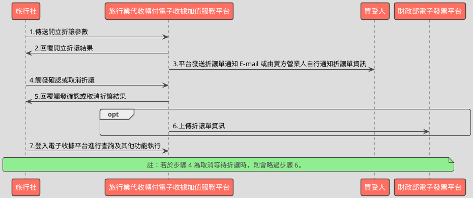

# 觸發或取消待確認折讓資料API

> 本文件包含 **AES256 加密、SHA256 簽章** 規格，詳見下方對應章節

---

## API 基本資訊

| 項目 | 內容 |
|:-----|:-----|
| 副標題 | 觸發或取消折讓資料 |
| 串接方式 | 幕後 |
| Content-Type | `application/x-www-form-urlencoded` |
| 加密方式 | AES256、SHA256 |
| 正式環境 URL | https://api.travelinvoice.com.tw/allowance_touch_issue |
| 測試環境 URL | https://capi.travelinvoice.com.tw/allowance_touch_issue |

---

## 欄位定義

### Post 參數（請求） [POST]

| 欄位名稱 | 中文說明 | 型別 | 長度 | 必填 | 預設值 | 允許值 | 可為空 | 範例 | 備註 |
|----------|----------|------|------|------|--------|--------|--------|------|------|
| MerchantID_ | 旅行社統一編號 | string | 8 | 必填 |  |  |  | 54352706 | 旅行社統一編號。 |
| PostData_ | 加密資料 | array |  | 必填 |  |  |  |  | 字串欄位組合後做AES256加密，欄位說明如下表 |

### PostData_內含欄位（請求）　AES加密_字串

| 欄位名稱 | 中文說明 | 型別 | 長度 | 必填 | 預設值 | 允許值 | 可為空 | 範例 | 備註 |
|----------|----------|------|------|------|--------|--------|--------|------|------|
| Version | 串接程式版本 | string | 5 | 必填 |  | 1.0 |  | 1.0 | 固定帶 1.0 |
| TimeStamp | 時間戳記 | string | 30 | 必填 |  |  |  | 1400137200 | Unix 時間戳記（秒），即自 1970-01-01 00:00:00 UTC 至今的秒數 例：2014-05-15 15:00:00 這個時間的時間，戳記為 1400137200，建議帶入當前時間 |
| AllowanceStatus | 觸發折讓狀態 | int | 1 | 必填 |  | 1,2 |  | 1 | 1 = 確認折讓。 2 = 取消折讓。 |
| AllowanceNo | 折讓流水號 | string | 20 | 必填 |  |  |  | 586 | 開立折讓時系統回應的折讓流水號。 |

### 系統回應訊息（回應）

| 欄位名稱 | 中文說明 | 型別 | 長度 | 範例 | 必回傳 | 備註 |
|----------|----------|------|------|------|--------|------|
| Status | 回傳狀態 | string | 10 | SUCCESS | Y | 1.觸發或取消發動成功，則回傳 SUCCESS 2.觸發或取消發動開立失敗，則回傳錯誤代碼 |
| Message | 回傳訊息 | string | 30 | 成功 | Y | 文字，此次回傳狀態說明 |
| MerchantID | 旅行社代號 | string | 8 | 70565326 |  | 旅行社統一編號 |
| InvoiceNumber | 收據號碼 | string | 9 | T13671008 |  | 此次作廢收據或等待折讓的收據號碼。 |
| AllowanceNo | 折讓流水號 | string | 20 | 585 |  | 此次開立或取消折讓，系統回應的折讓流水號。 |
| MerchantOrderNo | 自訂編號 | string | 30 | Or_5521142 |  | 此次開立折讓的收據，於開立收據時，提供之自訂編號。 |
| AllowanceAmt | 折讓金額 | int | 10 | 400 |  | 此次開立折讓的金額 |
| RemainAmt | 折讓後剩餘收據金額 | int | 8 | 600 |  | 確認折讓後，此張收據剩餘之收據金額。 |
| CheckCode | 檢查碼 | string | 150 | 12C6AC3A3EEDD074B01ECB3D5731579EB75D83FB8A31907F0D1C564468AD8C49 |  | 用來檢查此次資料回傳的合法性，串接時可以比對此參數資料，來檢核是否為平台所回傳，檢核方法請參考”SHA256加密說明”。如開立失敗則回傳空值。  CheckCode = 將 InvoiceTransNo, MerchantID, MerchantOrderNo, RandomNum, TotalAmt 依 SHA256 簽章規格計算所得之雜湊值  InvoiceTransNo ,RandomNum, TotalAmt不含在此API回應欄位中，需程式自行保存開立收據時回傳的 InvoiceTransNo、RandomNum、TotalAmt，供日後 CheckCode 驗證使用。 |
| EndStr | 字串結尾 | string | 2 | ## | Y | 固定回傳 ##，使用 String 方式接收資料的用戶，須多判斷 EndStr=##，確保資料傳遞完整。 |

---

## 錯誤代碼

> 以下錯誤代碼均於 **HTTP 200** 回應中回傳，錯誤訊息包含於 response body。

| 代碼 | 說明 |
|------|------|
| KEY10001 | 非旅行社 API 串接 IP |
| KEY10002 | 資料解密錯誤 |
| KEY10003 | 版本錯誤 |
| KEY10004 | 資料不齊全 |
| KEY10006 | 旅行社未申請啟用電子收據 |
| KEY10007 | 頁面停留超過 30 分鐘 |
| KEY10009 | 取不到旅行社統一編號的資料 |
| KEY10010 | 旅行社統一編號空白 |
| KEY10011 | PostData_欄位空白 |
| KEY10012 | 資料傳遞錯誤 |
| KEY10013 | 資料空白 |
| KEY10014 | TimeOut。通常泛指 I/O 上的 time out |
| KEY10015 | 收據金額格式錯誤 |
| KEY10019 | 旅行社已被停權 |
| NOR10001 | 網路連線異常 |
| ALW10002 | 此收據號碼折讓總金額超過開立金額 |
| ALW10003 | 開立折讓失敗 |
| ALW10004 | 觸發折讓狀態失敗 |
| ALW10005 | 已確認折讓，無法再執行取消折讓 |
| ALW10006 | 折讓商品名稱總計超過 280 個字 |
| ALW10007 | 折讓商品名稱超過 7 個商品 |
| ALW10008 | 折讓商品數量非純數字 |
| ALW10009 | 折讓商品單位字數超過 2 個字 |
| ALW10010 | 折讓商品單價超過 8 位數 or 非純數字 |
| ALW10011 | 折讓商品小計超過 8 位數 or 非純數字 |
| ALW10012 | 折讓總金額超過 8 位數 or 非純數字 |
| ALW10013 | 商品資訊的商品小計計算錯誤 |
| ALW10014 | 收據金額驗證錯誤 |
| ALW10015 | 觸發折讓狀態錯誤 |
| ALW10016 | 確認折讓方式錯誤 |
| ALW10017 | 折讓單號錯誤 |

---

## 串接範例

### 請求範例

> 示範用 Key：`12345678901234567890123456789012`（32 bytes）　IV：`1234567890123456`（16 bytes）

> 外層請求參數組合格式：**String**，各必填欄位以 `欄位名稱=值` 形式，以 `&` 符號串接後傳送，簡單字串拼接 key=value&key=value，不做 URL encode

```http
POST https://api.travelinvoice.com.tw/allowance_touch_issue
Content-Type: application/x-www-form-urlencoded

MerchantID_=54352706&PostData_=672781a0cacae60a9e8bf6e0866d113f5b90725edbb2af54aea18d6b41f6d8f3d7a10bfc00419845cc7a31739961319bc3c528854566acd31be523d72acf027faa6f5b1926ea3df19575cf294bc6e10b321ca28f4567e69331950b8502c0dc61
```

**PostData_（AES加密_字串）加密前明文（必填欄位）**

> 加密：AES-256-CBC，輸出：Hex，Key 與 IV 同上
> 欄位組合格式：**String**，各必填欄位以 `欄位名稱=值` 形式，以 `&` 符號串接後加密

```
Version=1.0&TimeStamp=1400137200&AllowanceStatus=1&AllowanceNo=586
```

### 成功回應範例

> 回傳內容為 URL 編碼字串，請先進行 URL 解碼後，依 key=value 格式逐欄解析，各欄位以 & 分隔。

> 外層回應格式：**String**，各欄位以 `欄位名稱=值` 形式，以 `&` 符號串接後回傳

**系統回應**

```
Status=SUCCESS&Message=成功&MerchantID=70565326&InvoiceNumber=T13671008&AllowanceNo=585&MerchantOrderNo=Or_5521142&AllowanceAmt=400&RemainAmt=600&CheckCode=12C6AC3A3EEDD074B01ECB3D5731579EB75D83FB8A31907F0D1C564468AD8C49&EndStr=##
```

> 本 API 回應無加密欄位，上方字串即為完整明文。

### 失敗回應範例

> 回傳內容為 URL 編碼字串，請先進行 URL 解碼後，依 key=value 格式逐欄解析，各欄位以 & 分隔。

**系統回應**

```
Status=KEY10001&Message=非旅行社 API 串接 IP&EndStr=##
```

---

## 串接目的

管理待確認的折讓資料，如直接確認折讓資料，或是取消這個待確認折讓資料

## 資料交換方式

1. 旅行社以「HTTP POST」方式傳送折讓收據資料至電子收據平台進行作業。 
2. Content-Type 為 application/x-www-form-urlencoded。 
3. 編碼格式為 UTF-8。 
4. 電子收據平台回應格式化的字串。 
5. 各欄位計算單位為字元。中、英、數字、符號都算一個字元。 
6. 各欄位間以「&」作為連接符號，各欄位內不得含有此字元（U+0026）。

## 作業規範

1.已確認的折讓資料無法再一次確認
2.取消待確認折讓資料沒有期限問題
3.當開立等待折讓後，開立的折讓資料，僅記錄於平台且未生效，也未上傳至「財政 部電子發票整合服務平台」，待營業人與買受人確認後再執行確認折讓，確認後屆 當期上傳排程日(每單月一日)，平台將會把折讓資料上傳至「財政部電子發票整合 服務平台」。 
4.當開立等待折讓單後，若因故需取消等待折讓，營業人可執行取消，此時平台將該 筆等待折讓狀態變更為取消。

## 名詞定義

折讓單：每一次折讓收據，都會有一筆獨立的折讓記錄，稱之為折讓單或是折讓資料
等待折讓：等待消費者同意折讓前，收據仍是有效狀態，此時的折讓單稱為等待折讓

## 串接前置作業

（請先完成，否則程式必失敗）

 1. 取得 HashKey / HashIV
- 測試環境：登入測試區後台 → 基本資料 → API 串接設定 → 複製 HashKey 與 HashIV
- 正式環境：登入正式區後台 → 基本資料 → API 串接設定 → 複製 HashKey 與 HashIV

2. 申請 IP 白名單
- 申請窗口：於官網下載申請表單並填寫後，傳送後客服中心（傳真 / Email）
- 最多可設定 10 組 IP
- 需提供：伺服器對外 IP（非內網 IP，可至 https://ifconfig.me 查詢）
- 生效時間：通常 1-2 個工作天

3. 環境網址
-測試環境與正式環境是完全不同的設備，資料不共通，上線前務必要確認已經將串接網址切換至正式區網址

4. 常見「忘記做前置作業」的錯誤訊號
- `KEY10001 非旅行社 API 串接 IP` → IP 白名單未設定或設錯
- `KEY10002 資料解密錯誤` → HashKey / HashIV 不正確或仍是範例值
- `KEY10009 取不到旅行社統一編號的資料` → MerchantID 錯或未啟用

## 開立折讓流程－等待折讓



---

---

## AES256 加密規格

### 加密演算法規格

| 項目 | 規格 |
|:-----|:-----|
| 演算法 | AES |
| 金鑰長度 | 256 bits（32 bytes） |
| 加密模式 | CBC |
| 填充方式 | 類 PKCS7（32-byte 邊界，非標準） |
| 輸出格式 | Hex 十六進位 |
| 輸入編碼 | UTF-8 |
| Key 長度 | 32 bytes |
| IV 長度 | 16 bytes |

> 本文件的「**Key**」即實際串接金鑰 **HashKey**；「**IV**」即 **HashIV**。

> ⚠️ **注意：本 API 採用類 PKCS7 演算法，但以 32 bytes 為填充邊界（非 AES 標準的 16 bytes），必須特別處理**
>
> 標準 PKCS7 以 AES block size（**16 bytes**）為補齊單位；本 API 採用 **32 bytes** 作為填充邊界，屬類 PKCS7 的自訂規格。
> 各語言標準加密函式庫（PHP `openssl`、Node.js `crypto`、Python `pycryptodome`）的預設 PKCS7 均使用 16-byte 邊界，**直接呼叫內建 PKCS7 將產生錯誤的填充**，導致對方解密失敗。
> **實作時必須手動計算 32-byte 邊界填充，並停用函式庫的自動填充**（PHP：`OPENSSL_ZERO_PADDING`；Node.js：`cipher.setAutoPadding(false)`；Python：`pad(..., 32)`）。

### 適用欄位群組

- **PostData_內含欄位**（AES加密_字串）（請求）　傳送欄位名稱：`PostData_`

### 加密範例

> 以下為固定示範數值，**請勿用於正式環境**。
> 本範例已採用類 PKCS7（32-byte 邊界）填充計算，與標準 PKCS7（16-byte 邊界）結果**不同**。

| 項目 | 值 |
|:-----|:---|
| Key（ASCII，32 bytes） | `12345678901234567890123456789012` |
| IV（ASCII，16 bytes） | `1234567890123456` |
| 加密前字串（plaintext） | `Version=1.0&TimeStamp=1400137200&AllowanceStatus=1&AllowanceNo=586` |
| 加密後（Hex 十六進位） | `672781a0cacae60a9e8bf6e0866d113f5b90725edbb2af54aea18d6b41f6d8f3d7a10bfc00419845cc7a31739961319bc3c528854566acd31be523d72acf027faa6f5b1926ea3df19575cf294bc6e10b321ca28f4567e69331950b8502c0dc61` |

> 驗證方法：使用上述 Key / IV 對加密後字串解密，應還原為加密前字串。

---

## SHA256 簽章規格

### 簽章規格

| 項目 | 規格 |
|:-----|:-----|
| 演算法 | SHA-256 |
| 輸出格式 | 十六進位字串（大寫） |
| Key 欄位名稱 | `HashKey` |
| IV 欄位名稱 | `HashIV` |
| 字串組合方式 | **前IV後KEY** |
| 參與簽章欄位 | `InvoiceTransNo,MerchantID,MerchantOrderNo,RandomNum,TotalAmt` |

### 字串組合說明

組合方式：**前IV後KEY**

參與簽章的欄位（依英文字母順序排列）：`InvoiceTransNo`、`MerchantID`、`MerchantOrderNo`、`RandomNum`、`TotalAmt`

> **欄位順序**：組合字串時，請依照**英文字母順序**排列各參與欄位，**不可任意調換**。

```
HashIV={IV值}&{欄位1}={值1}&...&HashKey={Key值}
```

以 `HashIV={iv}` 開頭，接各參與欄位（依序），最後以 `HashKey={key}` 結尾，各段以 `&` 分隔。

### 簽章範例

> 以下為固定示範數值，**請勿用於正式環境**。

| 項目 | 值 |
|:-----|:---|
| HashKey | `abc1234567890def` |
| HashIV | `xyz0987654321uvw` |
| InvoiceTransNo | `SampleValue` |
| MerchantID | `70565326` |
| MerchantOrderNo | `Or_5521142` |
| RandomNum | `SampleValue` |
| TotalAmt | `SampleValue` |
| **組合後字串** | `HashIV=xyz0987654321uvw&InvoiceTransNo=SampleValue&MerchantID=70565326&MerchantOrderNo=Or_5521142&RandomNum=SampleValue&TotalAmt=SampleValue&HashKey=abc1234567890def` |
| **SHA256 雜湊（大寫）** | `02609905EB902788868E7AD0C4C1DC54201EFF8B1DE4B99DC6707155AA9970C6` |

> 驗證方法：將上述組合後字串進行 SHA256 計算並轉大寫，應得到上方雜湊值。

---

## 加解密程式碼

> 以下僅為加解密／簽章核心程式碼，HTTP 請求與參數組裝請依上方欄位定義自行完成。

### PHP

```php
<?php

/**
 * AES256 加解密核心函式
 */
class Aes256
{
    private const ALGORITHM = 'AES-256-CBC';
    private const BLOCK_SIZE = 32; // For PKCS7 padding

    /**
     * PKCS7 填充
     *
     * @param string $data
     * @param int $block_size
     * @return string
     */
    private static function pkcs7_pad(string $data, int $block_size): string
    {
        $pad_length = $block_size - (strlen($data) % $block_size);
        return $data . str_repeat(chr($pad_length), $pad_length);
    }

    /**
     * PKCS7 移除填充
     *
     * @param string $data
     * @return string
     * @throws Exception 如果填充無效
     */
    private static function pkcs7_unpad(string $data): string
    {
        if (empty($data)) {
            return '';
        }
        $len = strlen($data);
        $pad_length = ord($data[$len - 1]);

        // Validate padding length
        if ($pad_length > $len || $pad_length <= 0 || $pad_length > self::BLOCK_SIZE) {
            throw new Exception("Invalid PKCS7 padding length.");
        }

        // Validate padding bytes (timing attack safe)
        $valid = true;
        for ($i = 1; $i <= $pad_length; $i++) {
            if (ord($data[$len - $i]) !== $pad_length) {
                $valid = false;
                break; // Exit early if mismatch found
            }
        }
        if (!$valid) {
            throw new Exception("Invalid PKCS7 padding bytes.");
        }

        return substr($data, 0, $len - $pad_length);
    }

    /**
     * AES256 加密
     * 需手動將明文 padding 至 32 bytes 倍數，加密時停用函式庫內建 PKCS7 padding
     *
     * @param string $plaintext 待加密明文 (UTF-8)
     * @param string $key AES 金鑰 (32 bytes)
     * @param string $iv AES 初始向量 (16 bytes)
     * @return string 加密後的 Hex 十六進位字串
     * @throws Exception
     */
    public static function encrypt(string $plaintext, string $key, string $iv): string
    {
        if (strlen($key) !== 32) {
            throw new Exception("AES Key must be 32 bytes long.");
        }
        if (strlen($iv) !== 16) {
            throw new Exception("AES IV must be 16 bytes long.");
        }

        $padded_plaintext = self::pkcs7_pad($plaintext, self::BLOCK_SIZE);

        $ciphertext = openssl_encrypt(
            $padded_plaintext,
            self::ALGORITHM,
            $key,
            OPENSSL_RAW_DATA, // 停用函式庫內建 PKCS7 padding
            $iv
        );

        if ($ciphertext === false) {
            throw new Exception("AES encryption failed: " . openssl_error_string());
        }

        return bin2hex($ciphertext);
    }

    /**
     * AES256 解密
     *
     * @param string $hex_ciphertext 待解密 Hex 十六進位字串
     * @param string $key AES 金鑰 (32 bytes)
     * @param string $iv AES 初始向量 (16 bytes)
     * @return string 解密後的明文 (UTF-8)
     * @throws Exception
     */
    public static function decrypt(string $hex_ciphertext, string $key, string $iv): string
    {
        if (strlen($key) !== 32) {
            throw new Exception("AES Key must be 32 bytes long.");
        }
        if (strlen($iv) !== 16) {
            throw new Exception("AES IV must be 16 bytes long.");
        }

        $raw_ciphertext = hex2bin($hex_ciphertext);
        if ($raw_ciphertext === false) {
            throw new Exception("Invalid hexadecimal ciphertext provided.");
        }

        $padded_plaintext = openssl_decrypt(
            $raw_ciphertext,
            self::ALGORITHM,
            $key,
            OPENSSL_RAW_DATA, // 停用函式庫內建 PKCS7 padding
            $iv
        );

        if ($padded_plaintext === false) {
            throw new Exception("AES decryption failed: " . openssl_error_string());
        }

        return self::pkcs7_unpad($padded_plaintext);
    }
}

/**
 * SHA256 簽章核心函式
 */
class Sha256Signature
{
    /**
     * 產生 SHA256 簽章
     *
     * @param array $data 參與簽章的欄位資料 (key-value associative array)
     * @param string $hash_key 簽章金鑰
     * @param string $hash_iv 簽章初始向量
     * @return string 大寫十六進位字串
     */
    public static function generate(array $data, string $hash_key, string $hash_iv): string
    {
        // 參與簽章欄位：InvoiceTransNo,MerchantID,MerchantOrderNo,RandomNum,TotalAmt
        $sign_fields = [
            'InvoiceTransNo', 'MerchantID', 'MerchantOrderNo', 'RandomNum', 'TotalAmt'
        ];

        // 1. 取出所有「參與簽章欄位」的值
        // 2. 欄位依英文名稱 A → Z 字母升冪排序
        $filtered_data = [];
        foreach ($sign_fields as $field) {
            if (isset($data[$field])) {
                $filtered_data[$field] = $data[$field];
            } else {
                // 如果是必填欄位，這裡可能需要拋出錯誤
                // 為了精簡，這裡假設所有欄位都存在或可以為空字串
                $filtered_data[$field] = '';
            }
        }
        ksort($filtered_data); // A -> Z 字母升冪排序

        // 3. 按下方格式組合字串 (各段以 & 分隔)
        // HashIV={IV值}&InvoiceTransNo={InvoiceTransNo的值}&...&HashKey={Key值}
        $params_string = "HashIV={$hash_iv}";
        foreach ($filtered_data as $key => $value) {
            // 注意：簽章字串組合時，值不進行 URL encode
            $params_string .= "&{$key}={$value}";
        }
        $params_string .= "&HashKey={$hash_key}";

        // 4. 對組合後字串進行 SHA256 計算，輸出結果轉大寫十六進位
        return strtoupper(hash('sha256', $params_string));
    }

    /**
     * 驗證 SHA256 簽章 (Timing-safe)
     *
     * @param array $data 參與簽章的欄位資料
     * @param string $hash_key 簽章金鑰
     * @param string $hash_iv 簽章初始向量
     * @param string $expected_signature 預期的簽章值 (大寫十六進位)
     * @return bool 驗證結果
     */
    public static function verify(array $data, string $hash_key, string $hash_iv, string $expected_signature): bool
    {
        $calculated_signature = self::generate($data, $hash_key, $hash_iv);
        return hash_equals($calculated_signature, $expected_signature);
    }
}

// --- 測試向量示範 ---

echo "--- AES256 加解密測試向量 ---\n";

// 測試用的 AES 金鑰和 IV
// !!! 正式環境請替換為您從平台取得的金鑰和 IV !!!
$test_aes_key = "0123456789abcdef0123456789abcdef"; // 32 bytes
$test_aes_iv  = "fedcba9876543210";                 // 16 bytes

// PostData_內含欄位 加密前明文格式 (String)
$aes_plaintext = "Version=1.0&TimeStamp=1400137200&AllowanceStatus=1&AllowanceNo=586";

echo "AES Plaintext: " . $aes_plaintext . "\n";
echo "AES Key:       " . $test_aes_key . "\n";
echo "AES IV:        " . $test_aes_iv . "\n";

try {
    // 加密
    $encrypted_hex = Aes256::encrypt($aes_plaintext, $test_aes_key, $test_aes_iv);
    echo "Encrypted (Hex): " . $encrypted_hex . "\n";

    // 預期加密輸出 (此值應與平台提供的範例或您測試環境產生值一致)
    // 由於加密結果依 IV 和填充而異，這裡使用程式產生後的值作為「預期」
    // 實際應用中，這個值會是外部系統提供的或已知正確的值。
    // 以下為使用上述測試金鑰/IV和明文執行後，取得的範例結果
    $expected_aes_ciphertext_hex = "06b0d917f8a970fb0c34e029c29c5b2ce21415dd8c3f4e2f9d15024b898165d752edca26a27e7d9c6e3b56a42a031952";
    echo "Expected Ciphertext (Hex) for comparison: " . $expected_aes_ciphertext_hex . "\n";
    echo "Encryption matches expected: " . (strtolower($encrypted_hex) === strtolower($expected_aes_ciphertext_hex) ? "true" : "false") . "\n";


    // 解密
    $decrypted_plaintext = Aes256::decrypt($encrypted_hex, $test_aes_key, $test_aes_iv);
    echo "Decrypted Plaintext: " . $decrypted_plaintext . "\n";
    echo "Decryption matches original: " . ($decrypted_plaintext === $aes_plaintext ? "true" : "false") . "\n";

} catch (Exception $e) {
    echo "AES Error: " . $e->getMessage() . "\n";
}

echo "\n--- SHA256 簽章測試向量 ---\n";

// 測試用的 HashKey 和 HashIV
// !!! 正式環境請替換為您從平台取得的 HashKey 和 HashIV !!!
$test_hash_key = "ABCDEFGHIJKLMNOPQRSTUVWXYZabcdef"; // 任意字串
$test_hash_iv  = "1234567890123456";                 // 任意字串

// 參與簽章的欄位資料 (通常來自 API 回應，或您保存的交易資料)
$sign_data = [
    'InvoiceTransNo'  => 'TI202310260001',
    'MerchantID'      => '70565326',
    'MerchantOrderNo' => 'Or_5521142',
    'RandomNum'       => '12345',
    'TotalAmt'        => '10000',
];

echo "Signature Fields:\n";
foreach ($sign_data as $key => $value) {
    echo "  " . $key . ": " . $value . "\n";
}
echo "HashKey: " . $test_hash_key . "\n";
echo "HashIV:  " . $test_hash_iv . "\n";

try {
    // 產生簽章
    $generated_signature = Sha256Signature::generate($sign_data, $test_hash_key, $test_hash_iv);
    echo "Generated Signature: " . $generated_signature . "\n";

    // 組合後的原始字串 (Raw String)
    $raw_sign_string_expected = "HashIV={$test_hash_iv}&InvoiceTransNo=TI202310260001&MerchantID=70565326&MerchantOrderNo=Or_5521142&RandomNum=12345&TotalAmt=10000&HashKey={$test_hash_key}";
    echo "Raw String for signature generation: " . $raw_sign_string_expected . "\n";

    // 預期簽章輸出 (此值應與平台提供的範例或您測試環境產生值一致)
    // 以下為使用上述測試金鑰/IV和資料執行後，取得的範例結果
    $expected_signature = "911F7E4424A6945899D576F93F421D5BA0B7637841F92D050D622F438D949A1F";
    echo "Expected Signature for comparison: " . $expected_signature . "\n";
    echo "Signature matches expected: " . ($generated_signature === $expected_signature ? "true" : "false") . "\n";

    // 驗證簽章
    $is_valid_signature = Sha256Signature::verify($sign_data, $test_hash_key, $test_hash_iv, $expected_signature);
    echo "Verification Result (against expected): " . ($is_valid_signature ? "true" : "false") . "\n";

    // 嘗試用錯誤的簽章驗證 (應為 false)
    $is_invalid_signature = Sha256Signature::verify($sign_data, $test_hash_key, $test_hash_iv, "INVALID_SIGNATURE_12345");
    echo "Verification Result (against invalid signature): " . ($is_invalid_signature ? "true" : "false") . "\n";

} catch (Exception $e) {
    echo "SHA256 Error: " . $e->getMessage() . "\n";
}

?>
```

