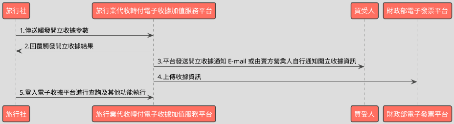

# 觸發或取消預約收據API

> 本文件包含 **AES256 加密、SHA256 簽章** 規格，詳見下方對應章節

---

## API 基本資訊

| 項目 | 內容 |
|:-----|:-----|
| 副標題 | 提前觸發或取消預約收據 |
| 串接方式 | 幕後 |
| Content-Type | `application/x-www-form-urlencoded` |
| 加密方式 | AES256、SHA256 |
| 正式環境 URL | https://api.travelinvoice.com.tw/invoice_touch_issue |
| 測試環境 URL | https://capi.travelinvoice.com.tw/invoice_touch_issue |

---

## 欄位定義

### Post 參數（請求） [POST]

| 欄位名稱 | 中文說明 | 型別 | 長度 | 必填 | 預設值 | 允許值 | 可為空 | 範例 | 備註 |
|----------|----------|------|------|------|--------|--------|--------|------|------|
| MerchantID_ | 旅行社統一編號 | string | 8 | 必填 |  |  |  | 54352706 | 旅行社統一編號。 |
| PostData_ | 加密資料 | array |  | 必填 |  |  |  |  | 字串欄位組合後做AES256加密，欄位說明如下表 |

### PostData_內含欄位（請求）　AES加密_字串

| 欄位名稱 | 中文說明 | 型別 | 長度 | 必填 | 預設值 | 允許值 | 可為空 | 範例 | 備註 |
|----------|----------|------|------|------|--------|--------|--------|------|------|
| Version | 串接程式版本 | string | 5 | 必填 |  | 1.0 |  | 1.0 | 固定帶 1.0 |
| TimeStamp | 時間戳記 | string | 30 | 必填 |  |  |  | 1400137200 | Unix 時間戳記（秒），即自 1970-01-01 00:00:00 UTC 至今的秒數 例：2014-05-15 15:00:00 這個時間的時間，戳記為 1400137200，建議帶入當前時間 |
| InvoiceID | 開立流水號 | int | 20 | 必填 |  |  |  | 351254 | 開立收據時系統回應的開立流水號。 |
| MerchantOrderNo | 自訂編號 | string | 30 | 必填 |  |  |  | O_201406010001 | 1.旅行社自訂訂單編號，限英、數字、”_ ”格式。 2.可用於與營業人內部系統對應使用，可填入訂單流水號、帳務編號等等， |
| TotalAmt | 收據金額 | int | 8 | 必填 |  |  |  | 2542 | 此次開立收據的金額。 |
| Status | 收據狀態 | int | 1 | 必填 |  | 1,2 |  | 1 | 1 = 確認開立。 2 = 取消預約開立。 |

### 系統回應訊息（回應）

| 欄位名稱 | 中文說明 | 型別 | 長度 | 範例 | 必回傳 | 備註 |
|----------|----------|------|------|------|--------|------|
| Status | 回傳狀態 | string | 10 | SUCCESS | Y | 1.觸發成功或取消成功，則回傳 SUCCESS 2.發動失敗，則回傳錯誤代碼 |
| Message | 回傳訊息 | string | 30 | 成功 | Y | 文字，此次回傳狀態說明 |
| MerchantID | 旅行社代號 | string | 8 | 54352706 |  | 旅行社統一編號 |
| InvoiceTransNo | 開立流水號 | string | 20 | 351254 |  | 此次收據開立或取消開立的流水號。 |
| MerchantOrderNo | 自訂編號 | string | 30 | O_201406010001 |  | 旅行社於開立收據時提供的自訂編號 |
| TotalAmt | 收據金額 | int | 8 | 2542 |  | 此次開立收據的金額 |
| InvoiceNumber | 收據號碼 | string | 9 | T13671009 |  | 此次開立收據的收據號碼。(取消開立則為空值) |
| RandomNum | 收據防偽隨機碼 | string | 8 | 94414538 |  | 此次開立收據所產生的 8 碼防偽隨機碼。(取消開立 則為空值) |
| CreateTime | 開立收據時間 | datetime |  | 2014-09-25 12:12:12 |  | 此次開立收據的時間，例：2014-09-25 12:12:12。 |
| CheckCode | 檢查碼 | string | 150 | E038CCC4547DAC7E100F720396A43E552288D0CBE6B0B55D75C166CEC2AAD476 |  | 用來檢查此次資料回傳的合法性，串接時可以比對此參數資料，來檢核是否為平台所回傳，檢核方法請參考”SHA256加密說明”。如開立失敗則回傳空值。  CheckCode = 將 InvoiceTransNo, MerchantID, MerchantOrderNo, RandomNum, TotalAmt 依 SHA256 簽章規格計算所得之雜湊值 |
| EndStr | 字串結尾 | string | 2 | ## | Y | 固定回傳 ##，使用 String 方式接收資料的用戶，須多判斷 EndStr=##，確保資料傳遞完整。 |

---

## 錯誤代碼

> 以下錯誤代碼均於 **HTTP 200** 回應中回傳，錯誤訊息包含於 response body。

| 代碼 | 說明 |
|------|------|
| KEY10001 | 非旅行社 API 串接 IP |
| KEY10002 | 資料解密錯誤 |
| KEY10003 | 版本錯誤 |
| KEY10004 | 資料不齊全 |
| KEY10006 | 旅行社未申請啟用電子收據 |
| KEY10007 | 頁面停留超過 30 分鐘 |
| KEY10009 | 取不到旅行社統一編號的資料 |
| KEY10010 | 旅行社統一編號空白 |
| KEY10011 | PostData_欄位空白 |
| KEY10012 | 資料傳遞錯誤 |
| KEY10013 | 資料空白 |
| KEY10014 | TimeOut。通常泛指 I/O 上的 time out |
| KEY10015 | 收據金額格式錯誤 |
| KEY10016 | 旅行社無申請郵遞列印加值服務 |
| KEY10017 | 郵遞列印加值服務可用數不足 |
| KEY10018 | 開立人欄位未填寫 |
| KEY10019 | 旅行社已被停權 |
| NOR10001 | 網路連線異常 |
| INV10003 | 商品資訊格式錯誤或缺少資料 |
| INV10004 | 商品資訊的商品小計計算錯誤 |
| INV10012 | 收據金額驗證錯誤 |
| INV10013 | 收據欄位資料不齊全或格式錯誤 |
| INV10014 | 自訂編號格式錯誤 |
| INV10016 | 自訂編號重覆 |
| INV20001 | 查無可用字軌 |
| INV20002 | 取用字軌失敗 |
| INV20003 | 字軌已使用完畢 |
| INV20004 | 開立收據失敗 |
| INV20005 | 寫入收據商品表失敗 |
| INV20006 | 查無收據資料 |
| INV20007 | 系統日已到預定開立收據日無法取消預約開立 |
| INV20008 | 取消預約開立收據失敗 |
| INV20010 | 預約開立日期為空 |
| INV20011 | 預約開立日期格式不正確 |
| INV20012 | 預約開立日期不可小於系統日 |
| INV20013 | 預計開立日期延長日格式不正確 |
| INV20014 | 統一編號輸入錯誤 |
| INV20015 | 買受人統編未填寫 |
| INV20016 | 買受人名稱未填寫 |
| INV20018 | 預約出團日期格式不正確 |
| INV20100 | 寫入資料發生異常 |
| INV70001 | 欄位資料格式錯誤 |

---

## 串接範例

### 請求範例

> 示範用 Key：`12345678901234567890123456789012`（32 bytes）　IV：`1234567890123456`（16 bytes）

> 外層請求參數組合格式：**String**，各必填欄位以 `欄位名稱=值` 形式，以 `&` 符號串接後傳送，簡單字串拼接 key=value&key=value，不做 URL encode

```http
POST https://api.travelinvoice.com.tw/invoice_touch_issue
Content-Type: application/x-www-form-urlencoded

MerchantID_=54352706&PostData_=672781a0cacae60a9e8bf6e0866d113f5b90725edbb2af54aea18d6b41f6d8f3247673f7515edecd07a2b43fd1533af2e708c8bf7aaf5672be59b26c007593a675781b59973812a54325e0d66678bb27f3499a5389ce89c6a3a55dcb6eafd2e80e35cfaffa4d79a3717c71e6517f2fa7c88209bb597ce739c8509c9c0773dfcd
```

**PostData_（AES加密_字串）加密前明文（必填欄位）**

> 加密：AES-256-CBC，輸出：Hex，Key 與 IV 同上
> 欄位組合格式：**String**，各必填欄位以 `欄位名稱=值` 形式，以 `&` 符號串接後加密

```
Version=1.0&TimeStamp=1400137200&InvoiceID=351254&MerchantOrderNo=O_201406010001&TotalAmt=2542&Status=1
```

### 成功回應範例

> 回傳內容為 URL 編碼字串，請先進行 URL 解碼後，依 key=value 格式逐欄解析，各欄位以 & 分隔。

> 外層回應格式：**String**，各欄位以 `欄位名稱=值` 形式，以 `&` 符號串接後回傳

**系統回應**

```
Status=SUCCESS&Message=成功&MerchantID=54352706&InvoiceTransNo=351254&MerchantOrderNo=O_201406010001&TotalAmt=2542&InvoiceNumber=T13671009&RandomNum=94414538&CreateTime=2014-09-25 12:12:12&CheckCode=E038CCC4547DAC7E100F720396A43E552288D0CBE6B0B55D75C166CEC2AAD476&EndStr=##
```

> 本 API 回應無加密欄位，上方字串即為完整明文。

### 失敗回應範例

> 回傳內容為 URL 編碼字串，請先進行 URL 解碼後，依 key=value 格式逐欄解析，各欄位以 & 分隔。

**系統回應**

```
Status=KEY10001&Message=非旅行社 API 串接 IP&EndStr=##
```

---

## 串接目的

1.管理已經開立的預約收據。
2.可將已經開立的預約提前開出（觸發）或是取消這個預約收據

## 資料交換方式

1. 旅行社以「HTTP POST」方式傳送收據資料至電子收據平台進行開立。 
2. Content-Type 為 application/x-www-form-urlencoded。 
3. 編碼格式為 UTF-8。 
4. 電子收據平台回應格式化的字串。 
5. 各欄位計算單位為字元。中、英、數字、符號都算一個字元。 
6. 各欄位間以「&」作為連接符號，各欄位內不得含有此字元（U+0026）。

## 名詞定義

預約收據：開立收據時，如將此收據開立設定為預約收據，就表示會在指定日期，將該收據配上收據號碼（收據號碼為系統配發，不能指定）
取消預約收據：在指定日期前，都可以將預約收據取消
提前觸發收據：在指定日期前，可提前將預約收據配上收據號碼（收據號碼為系統配發，不能指定）

## 串接前置作業

（請先完成，否則程式必失敗）

 1. 取得 HashKey / HashIV
- 測試環境：登入測試區後台 → 基本資料 → API 串接設定 → 複製 HashKey 與 HashIV
- 正式環境：登入正式區後台 → 基本資料 → API 串接設定 → 複製 HashKey 與 HashIV

2. 申請 IP 白名單
- 申請窗口：於官網下載申請表單並填寫後，傳送後客服中心（傳真 / Email）
- 最多可設定 10 組 IP
- 需提供：伺服器對外 IP（非內網 IP，可至 https://ifconfig.me 查詢）
- 生效時間：通常 1-2 個工作天

3. 環境網址
-測試環境與正式環境是完全不同的設備，資料不共通，上線前務必要確認已經將串接網址切換至正式區網址

4. 常見「忘記做前置作業」的錯誤訊號
- `KEY10001 非旅行社 API 串接 IP` → IP 白名單未設定或設錯
- `KEY10002 資料解密錯誤` → HashKey / HashIV 不正確或仍是範例值
- `KEY10009 取不到旅行社統一編號的資料` → MerchantID 錯或未啟用

## 開立收據流程-【觸發預約開立】或【取消預約開立】



---

---

## AES256 加密規格

### 加密演算法規格

| 項目 | 規格 |
|:-----|:-----|
| 演算法 | AES |
| 金鑰長度 | 256 bits（32 bytes） |
| 加密模式 | CBC |
| 填充方式 | 類 PKCS7（32-byte 邊界，非標準） |
| 輸出格式 | Hex 十六進位 |
| 輸入編碼 | UTF-8 |
| Key 長度 | 32 bytes |
| IV 長度 | 16 bytes |

> 本文件的「**Key**」即實際串接金鑰 **HashKey**；「**IV**」即 **HashIV**。

> ⚠️ **注意：本 API 採用類 PKCS7 演算法，但以 32 bytes 為填充邊界（非 AES 標準的 16 bytes），必須特別處理**
>
> 標準 PKCS7 以 AES block size（**16 bytes**）為補齊單位；本 API 採用 **32 bytes** 作為填充邊界，屬類 PKCS7 的自訂規格。
> 各語言標準加密函式庫（PHP `openssl`、Node.js `crypto`、Python `pycryptodome`）的預設 PKCS7 均使用 16-byte 邊界，**直接呼叫內建 PKCS7 將產生錯誤的填充**，導致對方解密失敗。
> **實作時必須手動計算 32-byte 邊界填充，並停用函式庫的自動填充**（PHP：`OPENSSL_ZERO_PADDING`；Node.js：`cipher.setAutoPadding(false)`；Python：`pad(..., 32)`）。

### 適用欄位群組

- **PostData_內含欄位**（AES加密_字串）（請求）　傳送欄位名稱：`PostData_`

### 加密範例

> 以下為固定示範數值，**請勿用於正式環境**。
> 本範例已採用類 PKCS7（32-byte 邊界）填充計算，與標準 PKCS7（16-byte 邊界）結果**不同**。

| 項目 | 值 |
|:-----|:---|
| Key（ASCII，32 bytes） | `12345678901234567890123456789012` |
| IV（ASCII，16 bytes） | `1234567890123456` |
| 加密前字串（plaintext） | `Version=1.0&TimeStamp=1400137200&InvoiceID=351254&MerchantOrderNo=O_201406010001&TotalAmt=2542&Status=1` |
| 加密後（Hex 十六進位） | `672781a0cacae60a9e8bf6e0866d113f5b90725edbb2af54aea18d6b41f6d8f3247673f7515edecd07a2b43fd1533af2e708c8bf7aaf5672be59b26c007593a675781b59973812a54325e0d66678bb27f3499a5389ce89c6a3a55dcb6eafd2e80e35cfaffa4d79a3717c71e6517f2fa7c88209bb597ce739c8509c9c0773dfcd` |

> 驗證方法：使用上述 Key / IV 對加密後字串解密，應還原為加密前字串。

---

## SHA256 簽章規格

### 簽章規格

| 項目 | 規格 |
|:-----|:-----|
| 演算法 | SHA-256 |
| 輸出格式 | 十六進位字串（大寫） |
| Key 欄位名稱 | `HashKey` |
| IV 欄位名稱 | `HashIV` |
| 字串組合方式 | **前IV後KEY** |
| 參與簽章欄位 | `InvoiceTransNo,MerchantID,MerchantOrderNo,RandomNum,TotalAmt` |

### 字串組合說明

組合方式：**前IV後KEY**

參與簽章的欄位（依英文字母順序排列）：`InvoiceTransNo`、`MerchantID`、`MerchantOrderNo`、`RandomNum`、`TotalAmt`

> **欄位順序**：組合字串時，請依照**英文字母順序**排列各參與欄位，**不可任意調換**。

```
HashIV={IV值}&{欄位1}={值1}&...&HashKey={Key值}
```

以 `HashIV={iv}` 開頭，接各參與欄位（依序），最後以 `HashKey={key}` 結尾，各段以 `&` 分隔。

### 簽章範例

> 以下為固定示範數值，**請勿用於正式環境**。

| 項目 | 值 |
|:-----|:---|
| HashKey | `abc1234567890def` |
| HashIV | `xyz0987654321uvw` |
| InvoiceTransNo | `351254` |
| MerchantID | `54352706` |
| MerchantOrderNo | `O_201406010001` |
| RandomNum | `94414538` |
| TotalAmt | `2542` |
| **組合後字串** | `HashIV=xyz0987654321uvw&InvoiceTransNo=351254&MerchantID=54352706&MerchantOrderNo=O_201406010001&RandomNum=94414538&TotalAmt=2542&HashKey=abc1234567890def` |
| **SHA256 雜湊（大寫）** | `2EC808B0BF0F595295F59AB18632070DD14F7C0E9FE97762F3E9C203A0E03F37` |

> 驗證方法：將上述組合後字串進行 SHA256 計算並轉大寫，應得到上方雜湊值。

---

## 加解密程式碼

> 以下僅為加解密／簽章核心程式碼，HTTP 請求與參數組裝請依上方欄位定義自行完成。

### PHP

```php
<?php

/**
 * PHP 7.4 compatible core cryptographic functions for TravelInvoice API.
 * This script provides AES-256-CBC encryption/decryption and SHA256 signature
 * generation/verification as per the API specifications.
 *
 * IMPORTANT: In a production environment, replace the test keys and IVs
 *            with actual secure values.
 */

// --- AES-256-CBC Encryption/Decryption ---

/**
 * Pads the plaintext using a non-standard PKCS7-like padding to a multiple of 32 bytes.
 * As per specification: "PKCS7（Block Size 32）（⚠ 非標準規格：需手動將明文 padding 至 32 bytes 倍數）"
 *
 * @param string $plaintext The original plaintext string (UTF-8).
 * @return string The padded plaintext.
 */
function pkcs7_pad_32_bytes(string $plaintext): string
{
    $block_size = 32; // Specified block size for padding
    $pad_len = $block_size - (strlen($plaintext) % $block_size);
    // The padding byte value is the number of padding bytes
    return $plaintext . str_repeat(chr($pad_len), $pad_len);
}

/**
 * Removes the non-standard PKCS7-like padding from the decrypted data.
 *
 * @param string $decrypted_data The data after decryption, potentially containing padding.
 * @return string|null The unpadded plaintext or null if padding is invalid.
 */
function pkcs7_unpad_32_bytes(string $decrypted_data): ?string
{
    if (empty($decrypted_data)) {
        return null;
    }

    $last_byte_value = ord(substr($decrypted_data, -1));

    // Validate the padding byte value against the specified block size and data length
    if ($last_byte_value < 1 || $last_byte_value > 32 || $last_byte_value > strlen($decrypted_data)) {
        return null; // Invalid padding byte value or padding length exceeds data
    }

    // Check if all padding bytes are consistent (all should have the value of $last_byte_value)
    $padding_start_pos = strlen($decrypted_data) - $last_byte_value;
    for ($i = $padding_start_pos; $i < strlen($decrypted_data); $i++) {
        if (ord($decrypted_data[$i]) !== $last_byte_value) {
            return null; // Inconsistent padding, likely corrupted data or incorrect padding scheme
        }
    }

    return substr($decrypted_data, 0, $padding_start_pos);
}

/**
 * Encrypts a plaintext string using AES-256-CBC with manual PKCS7 (Block Size 32) padding.
 *
 * @param string $plaintext The plaintext string to encrypt (UTF-8 encoded).
 * @param string $key The 32-byte (256-bit) encryption key.
 * @param string $iv The 16-byte (128-bit) initialization vector.
 * @return string|null The encrypted data in hexadecimal format, or null on failure.
 */
function aes_encrypt(string $plaintext, string $key, string $iv): ?string
{
    // Validate Key and IV lengths as per specification
    if (strlen($key) !== 32 || strlen($iv) !== 16) {
        // In a real application, you might log this error or throw an exception.
        // For this focused output, we return null.
        return null;
    }

    // Apply manual PKCS7 padding (Block Size 32)
    $padded_plaintext = pkcs7_pad_32_bytes($plaintext);

    // Encrypt using AES-256-CBC. OPENSSL_RAW_DATA ensures raw binary output
    // and OPENSSL_NO_PADDING is implicitly used because we handle padding manually.
    $ciphertext = openssl_encrypt($padded_plaintext, 'AES-256-CBC', $key, OPENSSL_RAW_DATA, $iv);

    if ($ciphertext === false) {
        return null; // Encryption failed
    }

    return bin2hex($ciphertext); // Output format: Hexadecimal
}

/**
 * Decrypts a hexadecimal ciphertext string using AES-256-CBC with manual PKCS7 (Block Size 32) unpadding.
 *
 * @param string $hex_ciphertext The encrypted data in hexadecimal format.
 * @param string $key The 32-byte (256-bit) encryption key.
 * @param string $iv The 16-byte (128-bit) initialization vector.
 * @return string|null The decrypted plaintext string (UTF-8 encoded), or null on failure or invalid padding.
 */
function aes_decrypt(string $hex_ciphertext, string $key, string $iv): ?string
{
    // Validate Key and IV lengths
    if (strlen($key) !== 32 || strlen($iv) !== 16) {
        return null;
    }

    $binary_ciphertext = hex2bin($hex_ciphertext);
    if ($binary_ciphertext === false) {
        return null; // Invalid hexadecimal ciphertext input
    }

    // Decrypt using AES-256-CBC with raw data and no built-in padding
    $decrypted_data = openssl_decrypt($binary_ciphertext, 'AES-256-CBC', $key, OPENSSL_RAW_DATA, $iv);

    if ($decrypted_data === false) {
        return null; // Decryption failed
    }

    // Remove manual PKCS7 padding
    return pkcs7_unpad_32_bytes($decrypted_data);
}


// --- SHA256 Signature Generation/Verification ---

/**
 * Generates an SHA256 signature based on specified fields and keys.
 * As per specification: "HashIV={IV值}&InvoiceTransNo={InvoiceTransNo的值}&...&HashKey={Key值}"
 *
 * @param array $fields An associative array of data fields participating in the signature.
 *                      Keys should match the field names listed in the SHA256 spec (e.g., 'MerchantID').
 * @param string $hash_key The HashKey string.
 * @param string $hash_iv The HashIV string.
 * @return string|null The uppercase hexadecimal SHA256 signature, or null on error.
 */
function generate_sha256_signature(array $fields, string $hash_key, string $hash_iv): ?string
{
    // These are the specific fields to be included in the signature, in A-Z order for the body
    $signing_field_names = array(
        'InvoiceTransNo',
        'MerchantID',
        'MerchantOrderNo',
        'RandomNum',
        'TotalAmt'
    );

    // Collect and sort the data fields for signing
    $data_to_sign = array();
    foreach ($signing_field_names as $field_name) {
        // Use an empty string if a field is not present, or handle as an error
        // The spec implies these fields are always present for CheckCode calculation.
        $data_to_sign[$field_name] = isset($fields[$field_name]) ? (string)$fields[$field_name] : '';
    }
    ksort($data_to_sign); // Sort by field name A-Z as per spec

    // Construct the raw string for hashing
    $raw_string_parts = array();
    $raw_string_parts[] = "HashIV={$hash_iv}"; // Start with HashIV
    foreach ($data_to_sign as $key => $value) {
        $raw_string_parts[] = "{$key}={$value}"; // Add sorted fields
    }
    $raw_string_parts[] = "HashKey={$hash_key}"; // End with HashKey

    $raw_string = implode('&', $raw_string_parts); // Combine with '&'

    // Calculate SHA256 hash
    $signature = hash('sha256', $raw_string);

    if ($signature === false) {
        return null; // Hashing failed
    }

    return strtoupper($signature); // Output format: Uppercase Hexadecimal
}

/**
 * Verifies an SHA256 signature against provided fields and keys.
 *
 * @param array $fields An associative array of data fields.
 * @param string $hash_key The HashKey string.
 * @param string $hash_iv The HashIV string.
 * @param string $expected_signature The expected uppercase hexadecimal SHA256 signature to verify against.
 * @return bool True if the signature is valid, false otherwise.
 */
function verify_sha256_signature(array $fields, string $hash_key, string $hash_iv, string $expected_signature): bool
{
    $generated_signature = generate_sha256_signature($fields, $hash_key, $hash_iv);

    if ($generated_signature === null) {
        return false; // Signature generation failed, cannot verify
    }

    // Use hash_equals for time-safe comparison to prevent timing attacks
    return hash_equals($generated_signature, $expected_signature);
}


// --- Test Vectors ---

echo "--- AES-256-CBC Encryption/Decryption Test Vector ---\n";

// Example AES Key (32 bytes) and IV (16 bytes) for testing.
// In production, these would be securely managed.
$test_aes_key = "0123456789abcdef0123456789abcdef"; // 32 bytes ASCII
$test_aes_iv = "abcdef9876543210";                   // 16 bytes ASCII

// Plaintext for 'PostData_內含欄位'
// Format: key=value&key=value (querystring format, no URL encoding)
$aes_plaintext_fields_data = array(
    'InvoiceID'       => '351254',
    'MerchantOrderNo' => 'O_201406010001',
    'Status'          => '1',
    'TimeStamp'       => '1400137200',
    'TotalAmt'        => '2542',
    'Version'         => '1.0'
);
// Ensure sorting is applied to generate the exact same string
ksort($aes_plaintext_fields_data); // Sort for consistent plaintext generation
$aes_plaintext_parts = array();
foreach ($aes_plaintext_fields_data as $key => $value) {
    $aes_plaintext_parts[] = "{$key}={$value}";
}
$aes_plaintext = implode('&', $aes_plaintext_parts);


echo "Plaintext (PostData_): '{$aes_plaintext}'\n";
echo "AES Key (Binary Hex): '" . bin2hex($test_aes_key) . "'\n";
echo "AES IV (Binary Hex): '" . bin2hex($test_aes_iv) . "'\n";

$encrypted_data = aes_encrypt($aes_plaintext, $test_aes_key, $test_aes_iv);

if ($encrypted_data !== null) {
    echo "Encrypted Ciphertext (Hex): '{$encrypted_data}'\n";
    $decrypted_data = aes_decrypt($encrypted_data, $test_aes_key, $test_aes_iv);
    if ($decrypted_data !== null) {
        echo "Decrypted Plaintext: '{$decrypted_data}'\n";
        echo "Decryption Check: " . ($aes_plaintext === $decrypted_data ? "SUCCESS" : "FAILED") . "\n";
    } else {
        echo "Decryption Failed.\n";
    }
} else {
    echo "Encryption Failed.\n";
}

echo "\n--- SHA256 Signature Generation/Verification Test Vector ---\n";

// Example Hash Key and IV for testing.
// In production, these would be securely managed.
$test_hash_key = "YourTestHashKey12345678901234"; // Example 30-char key
$test_hash_iv = "YourTestHashIV12";              // Example 16-char IV

// Fields participating in signature, using example values from spec.
// Note: 'MerchantID' here refers to the actual merchant ID, which might be 'MerchantID_' in request params.
$sha_fields_for_signing = array(
    'InvoiceTransNo'  => '351254',             // Example from response InvoiceTransNo
    'MerchantID'      => '54352706',           // Example from request MerchantID_
    'MerchantOrderNo' => 'O_201406010001',     // Example from PostData_內含欄位
    'RandomNum'       => '94414538',           // Example from response RandomNum (for opened invoice)
    'TotalAmt'        => '2542'                // Example from PostData_內含欄位
);

// Manually construct the raw string for printing to match generation logic
$signing_field_names_alpha = array_keys($sha_fields_for_signing);
sort($signing_field_names_alpha); // This ensures A-Z for the body of the string

$sha_raw_string_parts_display = array();
$sha_raw_string_parts_display[] = "HashIV={$test_hash_iv}";
foreach ($signing_field_names_alpha as $key) {
    $sha_raw_string_parts_display[] = "{$key}={$sha_fields_for_signing[$key]}";
}
$sha_raw_string_parts_display[] = "HashKey={$test_hash_key}";
$sha_raw_string_for_display = implode('&', $sha_raw_string_parts_display);

echo "Input Fields for Signing:\n";
foreach ($sha_fields_for_signing as $key => $value) {
    echo "  {$key}: '{$value}'\n";
}
echo "HashKey: '{$test_hash_key}'\n";
echo "HashIV: '{$test_hash_iv}'\n";
echo "Raw String for SHA256: '{$sha_raw_string_for_display}'\n";

$generated_signature = generate_sha256_signature($sha_fields_for_signing, $test_hash_key, $test_hash_iv);

if ($generated_signature !== null) {
    echo "Generated SHA256 Signature: '{$generated_signature}'\n";

    // For verification, we assume the API sends back a CheckCode.
    // For this test, we use the locally generated signature as the "expected" one.
    $expected_signature_for_verification = $generated_signature;
    echo "Expected Signature for Verification: '{$expected_signature_for_verification}'\n";

    $is_signature_valid = verify_sha256_signature($sha_fields_for_signing, $test_hash_key, $test_hash_iv, $expected_signature_for_verification);
    echo "Signature Verification Check: " . ($is_signature_valid ? "SUCCESS" : "FAILED") . "\n";

    // Demonstrate with a tampered signature (should fail verification)
    $tampered_signature = $generated_signature . 'X'; // Append 'X' to alter signature
    $is_tampered_signature_valid = verify_sha256_signature($sha_fields_for_signing, $test_hash_key, $test_hash_iv, $tampered_signature);
    echo "Tampered Signature Verification Check: " . ($is_tampered_signature_valid ? "FAILED (should be false)" : "SUCCESS (correctly rejected)") . "\n";

} else {
    echo "Signature Generation Failed.\n";
}
```

