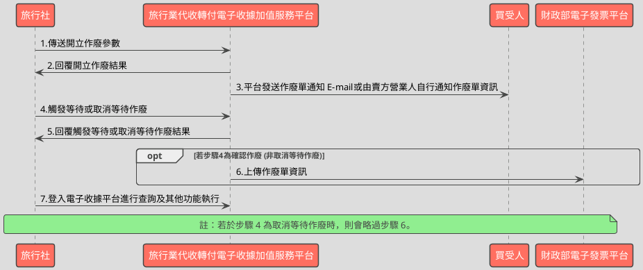

# 觸發或取消作廢資料API

> 本文件包含 **AES256 加密、SHA256 簽章** 規格，詳見下方對應章節

---

## API 基本資訊

| 項目 | 內容 |
|:-----|:-----|
| 副標題 | 觸發或取消作廢資料 |
| 串接方式 | 幕後 |
| Content-Type | `application/x-www-form-urlencoded` |
| 加密方式 | AES256、SHA256 |
| 正式環境 URL | https://api.travelinvoice.com.tw/invalid_touch_issue |
| 測試環境 URL | https://capi.travelinvoice.com.tw/invalid_touch_issue |

---

## 欄位定義

### Post 參數（請求） [POST]

| 欄位名稱 | 中文說明 | 型別 | 長度 | 必填 | 預設值 | 允許值 | 可為空 | 範例 | 備註 |
|----------|----------|------|------|------|--------|--------|--------|------|------|
| MerchantID_ | 旅行社統一編號 | string | 8 | 必填 |  |  |  | 54352706 | 旅行社統一編號。 |
| PostData_ | 加密資料 | array |  | 必填 |  |  |  |  | 字串欄位組合後做AES256加密，欄位說明如下表 |

### PostData_內含欄位（請求）　AES加密_字串

| 欄位名稱 | 中文說明 | 型別 | 長度 | 必填 | 預設值 | 允許值 | 可為空 | 範例 | 備註 |
|----------|----------|------|------|------|--------|--------|--------|------|------|
| Version | 串接程式版本 | string | 5 | 必填 |  | 1.0 |  | 1.0 | 固定帶 1.0 |
| TimeStamp | 時間戳記 | string | 30 | 必填 |  |  |  | 1400137200 | Unix 時間戳記（秒），即自 1970-01-01 00:00:00 UTC 至今的秒數 例：2014-05-15 15:00:00 這個時間的時間，戳記為 1400137200，建議帶入當前時間 |
| InvalidStatus | 觸發作廢狀態 | int | 1 | 必填 |  | 1,2 |  | 1 | 1 = 確認作廢。 2 = 取消作廢。 |
| InvalidNo | 作廢單流水號 | string | 20 | 必填 |  |  |  | 586 | 開立等待作廢時系統回應的作廢單流水 號。 |

### 系統回應訊息（回應）

| 欄位名稱 | 中文說明 | 型別 | 長度 | 範例 | 必回傳 | 備註 |
|----------|----------|------|------|------|--------|------|
| Status | 回傳狀態 | string | 10 | SUCCESS | Y | 1.作廢單開立成功，則回傳 SUCCESS 2.作廢單開立失敗，則回傳錯誤代碼 |
| Message | 回傳訊息 | string | 30 | 成功 | Y | 文字，此次回傳狀態說明 |
| MerchantID | 旅行社代號 | string | 8 | 70565326 |  | 旅行社統一編號 |
| InvalidNo | 作廢單流水號 | string | 20 | 8294 |  | 此次開立作廢或取消作廢的作廢單流水號。 |
| InvoiceNumber | 收據號碼 | string | 9 | T13671008 |  | 此次作廢收據或等待作廢的收據號碼。 |
| CheckCode | 檢查碼 | string | 150 | 12C6AC3A3EEDD074B01ECB3D5731579EB75D83FB8A31907F0D1C564468AD8C49 |  | 用來檢查此次資料回傳的合法性，串接時可以比對此參數資料，來檢核是否為平台所回傳，檢核方法請參考”SHA256加密說明”。如開立失敗則回傳空值。  CheckCode = 將 InvoiceTransNo, MerchantID, MerchantOrderNo, RandomNum, TotalAmt 依 SHA256 簽章規格計算所得之雜湊值  需程式自行保存開立收據時回傳的 InvoiceTransNo、RandomNum、TotalAmt、MerchantOrderNo，供日後 CheckCode 驗證使用。 |
| EndStr | 字串結尾 | string | 2 | ## | Y | 固定回傳 ##，使用 String 方式接收資料的用戶，須多判斷 EndStr=##，確保資料傳遞完整。 |

---

## 錯誤代碼

> 以下錯誤代碼均於 **HTTP 200** 回應中回傳，錯誤訊息包含於 response body。

| 代碼 | 說明 |
|------|------|
| KEY10001 | 非旅行社 API 串接 IP |
| KEY10002 | 資料解密錯誤 |
| KEY10003 | 版本錯誤 |
| KEY10004 | 資料不齊全 |
| KEY10006 | 旅行社未申請啟用電子收據 |
| KEY10007 | 頁面停留超過 30 分鐘 |
| KEY10009 | 取不到旅行社統一編號的資料 |
| KEY10010 | 旅行社統一編號空白 |
| KEY10011 | PostData_欄位空白 |
| KEY10012 | 資料傳遞錯誤 |
| KEY10013 | 資料空白 |
| KEY10014 | TimeOut。通常泛指 I/O 上的 time out |
| KEY10015 | 收據金額格式錯誤 |
| KEY10019 | 旅行社已被停權 |
| NOR10001 | 網路連線異常 |
| INV10015 | 欄位資料長度有誤 |
| LIB10001 | 該收據非開立成功的收據 |
| LIB10002 | 經辨名稱未填寫 |
| LIB10004 | 確認作廢方式有誤 |
| LIB10005 | 收據已作廢過 |
| LIB10006 | 觸發作廢狀態有誤 |
| LIB10007 | 該張收據已執行過收據折讓，無法作廢 |
| LIB10008 | 超過可作廢期限 |
| LIB10009 | 無此作廢資料 |
| LIB10010 | 該作廢資料已被取消作廢 |
| LIB10011 | 該作廢資料狀態為作廢失敗，不可再作廢 |

---

## 串接範例

### 請求範例

> 示範用 Key：`12345678901234567890123456789012`（32 bytes）　IV：`1234567890123456`（16 bytes）

> 外層請求參數組合格式：**String**，各必填欄位以 `欄位名稱=值` 形式，以 `&` 符號串接後傳送，簡單字串拼接 key=value&key=value，不做 URL encode

```http
POST https://api.travelinvoice.com.tw/invalid_touch_issue
Content-Type: application/x-www-form-urlencoded

MerchantID_=54352706&PostData_=672781a0cacae60a9e8bf6e0866d113f5b90725edbb2af54aea18d6b41f6d8f3f3ba6f1dac666afe5ebe7c64e5092289fe04c8b7735ea8624c35bc27b6a44c99
```

**PostData_（AES加密_字串）加密前明文（必填欄位）**

> 加密：AES-256-CBC，輸出：Hex，Key 與 IV 同上
> 欄位組合格式：**String**，各必填欄位以 `欄位名稱=值` 形式，以 `&` 符號串接後加密

```
Version=1.0&TimeStamp=1400137200&InvalidStatus=1&InvalidNo=586
```

### 成功回應範例

> 回傳內容為 URL 編碼字串，請先進行 URL 解碼後，依 key=value 格式逐欄解析，各欄位以 & 分隔。

> 外層回應格式：**String**，各欄位以 `欄位名稱=值` 形式，以 `&` 符號串接後回傳

**系統回應**

```
Status=SUCCESS&Message=成功&MerchantID=70565326&InvalidNo=8294&InvoiceNumber=T13671008&CheckCode=12C6AC3A3EEDD074B01ECB3D5731579EB75D83FB8A31907F0D1C564468AD8C49&EndStr=##
```

> 本 API 回應無加密欄位，上方字串即為完整明文。

### 失敗回應範例

> 回傳內容為 URL 編碼字串，請先進行 URL 解碼後，依 key=value 格式逐欄解析，各欄位以 & 分隔。

**系統回應**

```
Status=KEY10001&Message=非旅行社 API 串接 IP&EndStr=##
```

---

## 串接目的

管理待確認的作廢資料，如直接確認作廢資料，或是取消這個待確認作廢資料

## 資料交換方式

1. 旅行社以「HTTP POST」方式傳送收據資料至電子收據平台進行作業。 
2. Content-Type 為 application/x-www-form-urlencoded。 
3. 編碼格式為 UTF-8。 
4. 電子收據平台回應格式化的字串。 
5. 各欄位計算單位為字元。中、英、數字、符號都算一個字元。 
6. 各欄位間以「&」作為連接符號，各欄位內不得含有此字元（U+0026）。

## 作業規範

1.如收據已經超過可作廢期限（開立後下一個單月15號前），那麼將無法執行直接確認的動作
2.已確認的作廢資料無法再一次確認
3.取消待確認作廢資料沒有期限問題

## 名詞定義

作廢單：每一次作廢收據，都會有一筆獨立的作廢記錄，稱之為作廢單或是作廢資料
等待作廢：等待消費者同意作廢前，收據仍是有效狀態，此時的作廢單稱為等待作廢

## 串接前置作業

（請先完成，否則程式必失敗）

 1. 取得 HashKey / HashIV
- 測試環境：登入測試區後台 → 基本資料 → API 串接設定 → 複製 HashKey 與 HashIV
- 正式環境：登入正式區後台 → 基本資料 → API 串接設定 → 複製 HashKey 與 HashIV

2. 申請 IP 白名單
- 申請窗口：於官網下載申請表單並填寫後，傳送後客服中心（傳真 / Email）
- 最多可設定 10 組 IP
- 需提供：伺服器對外 IP（非內網 IP，可至 https://ifconfig.me 查詢）
- 生效時間：通常 1-2 個工作天

3. 環境網址
-測試環境與正式環境是完全不同的設備，資料不共通，上線前務必要確認已經將串接網址切換至正式區網址

4. 常見「忘記做前置作業」的錯誤訊號
- `KEY10001 非旅行社 API 串接 IP` → IP 白名單未設定或設錯
- `KEY10002 資料解密錯誤` → HashKey / HashIV 不正確或仍是範例值
- `KEY10009 取不到旅行社統一編號的資料` → MerchantID 錯或未啟用

## 開立作廢流程－等待作廢



---

---

## AES256 加密規格

### 加密演算法規格

| 項目 | 規格 |
|:-----|:-----|
| 演算法 | AES |
| 金鑰長度 | 256 bits（32 bytes） |
| 加密模式 | CBC |
| 填充方式 | 類 PKCS7（32-byte 邊界，非標準） |
| 輸出格式 | Hex 十六進位 |
| 輸入編碼 | UTF-8 |
| Key 長度 | 32 bytes |
| IV 長度 | 16 bytes |

> 本文件的「**Key**」即實際串接金鑰 **HashKey**；「**IV**」即 **HashIV**。

> ⚠️ **注意：本 API 採用類 PKCS7 演算法，但以 32 bytes 為填充邊界（非 AES 標準的 16 bytes），必須特別處理**
>
> 標準 PKCS7 以 AES block size（**16 bytes**）為補齊單位；本 API 採用 **32 bytes** 作為填充邊界，屬類 PKCS7 的自訂規格。
> 各語言標準加密函式庫（PHP `openssl`、Node.js `crypto`、Python `pycryptodome`）的預設 PKCS7 均使用 16-byte 邊界，**直接呼叫內建 PKCS7 將產生錯誤的填充**，導致對方解密失敗。
> **實作時必須手動計算 32-byte 邊界填充，並停用函式庫的自動填充**（PHP：`OPENSSL_ZERO_PADDING`；Node.js：`cipher.setAutoPadding(false)`；Python：`pad(..., 32)`）。

### 適用欄位群組

- **PostData_內含欄位**（AES加密_字串）（請求）　傳送欄位名稱：`PostData_`

### 加密範例

> 以下為固定示範數值，**請勿用於正式環境**。
> 本範例已採用類 PKCS7（32-byte 邊界）填充計算，與標準 PKCS7（16-byte 邊界）結果**不同**。

| 項目 | 值 |
|:-----|:---|
| Key（ASCII，32 bytes） | `12345678901234567890123456789012` |
| IV（ASCII，16 bytes） | `1234567890123456` |
| 加密前字串（plaintext） | `Version=1.0&TimeStamp=1400137200&InvalidStatus=1&InvalidNo=586` |
| 加密後（Hex 十六進位） | `672781a0cacae60a9e8bf6e0866d113f5b90725edbb2af54aea18d6b41f6d8f3f3ba6f1dac666afe5ebe7c64e5092289fe04c8b7735ea8624c35bc27b6a44c99` |

> 驗證方法：使用上述 Key / IV 對加密後字串解密，應還原為加密前字串。

---

## SHA256 簽章規格

### 簽章規格

| 項目 | 規格 |
|:-----|:-----|
| 演算法 | SHA-256 |
| 輸出格式 | 十六進位字串（大寫） |
| Key 欄位名稱 | `HashKey` |
| IV 欄位名稱 | `HashIV` |
| 字串組合方式 | **前IV後KEY** |
| 參與簽章欄位 | `InvoiceTransNo,MerchantID,MerchantOrderNo,RandomNum,TotalAmt` |

### 字串組合說明

組合方式：**前IV後KEY**

參與簽章的欄位（依英文字母順序排列）：`InvoiceTransNo`、`MerchantID`、`MerchantOrderNo`、`RandomNum`、`TotalAmt`

> **欄位順序**：組合字串時，請依照**英文字母順序**排列各參與欄位，**不可任意調換**。

```
HashIV={IV值}&{欄位1}={值1}&...&HashKey={Key值}
```

以 `HashIV={iv}` 開頭，接各參與欄位（依序），最後以 `HashKey={key}` 結尾，各段以 `&` 分隔。

### 簽章範例

> 以下為固定示範數值，**請勿用於正式環境**。

| 項目 | 值 |
|:-----|:---|
| HashKey | `abc1234567890def` |
| HashIV | `xyz0987654321uvw` |
| InvoiceTransNo | `SampleValue` |
| MerchantID | `70565326` |
| MerchantOrderNo | `SampleValue` |
| RandomNum | `SampleValue` |
| TotalAmt | `SampleValue` |
| **組合後字串** | `HashIV=xyz0987654321uvw&InvoiceTransNo=SampleValue&MerchantID=70565326&MerchantOrderNo=SampleValue&RandomNum=SampleValue&TotalAmt=SampleValue&HashKey=abc1234567890def` |
| **SHA256 雜湊（大寫）** | `FC5DCE6E7581BEC6493F739C65A738AD8BAB203FBFAAFABA074D127E39D06D81` |

> 驗證方法：將上述組合後字串進行 SHA256 計算並轉大寫，應得到上方雜湊值。

---

## 加解密程式碼

> 以下僅為加解密／簽章核心程式碼，HTTP 請求與參數組裝請依上方欄位定義自行完成。

### PHP

```php
<?php

// --- AES256 Manual PKCS7 Padding (Block Size 32) ---

/**
 * Applies PKCS7 padding (Block Size 32) to the data.
 * The padding value is the number of padding bytes.
 * If data length is already a multiple of block_size, a full block of padding is added.
 *
 * @param string $data The data to pad.
 * @return string Padded data.
 */
function pkcs7_pad_32($data) {
    $block_size = 32;
    $padding_needed = $block_size - (strlen($data) % $block_size);
    // If data length is already a multiple of block_size, add a full block of padding
    if ($padding_needed === 0) {
        $padding_needed = $block_size;
    }
    return $data . str_repeat(chr($padding_needed), $padding_needed);
}

/**
 * Removes PKCS7 padding (Block Size 32) from the data.
 *
 * @param string $data The data to unpad.
 * @return string Unpadded data.
 * @throws InvalidArgumentException If padding is invalid or data length is inconsistent.
 */
function pkcs7_unpad_32($data) {
    if (empty($data)) {
        return '';
    }
    $len = strlen($data);
    if ($len === 0) {
        return '';
    }

    $last_char = substr($data, -1);
    $padding_length = ord($last_char);

    // Basic check for valid padding length (must be > 0 and <= block_size)
    if ($padding_length <= 0 || $padding_length > 32) {
        throw new InvalidArgumentException("Invalid PKCS7 padding length detected.");
    }

    // Check if the data length is less than padding_length (implies invalid padding)
    if ($len < $padding_length) {
        throw new InvalidArgumentException("Data length (" . $len . ") is less than reported padding length (" . $padding_length . ").");
    }

    // Check if all padding bytes are indeed the padding_length
    for ($i = 0; $i < $padding_length; $i++) {
        if (substr($data, -$padding_length + $i, 1) !== $last_char) {
            throw new InvalidArgumentException("Invalid PKCS7 padding bytes detected.");
        }
    }

    return substr($data, 0, $len - $padding_length);
}

// --- AES256 Encryption/Decryption Core Functions (PHP 7.4 compatible) ---

/**
 * Encrypts data using AES-256-CBC with manual PKCS7 padding (Block Size 32).
 *
 * @param string $plaintext The data to encrypt (UTF-8 encoded).
 * @param string $key The 32-byte AES key.
 * @param string $iv The 16-byte AES IV.
 * @return string Hexadecimal representation of the ciphertext (uppercase).
 * @throws InvalidArgumentException If key or IV length is incorrect.
 * @throws RuntimeException If encryption fails.
 */
function aes_encrypt_data($plaintext, $key, $iv) {
    if (strlen($key) !== 32) {
        throw new InvalidArgumentException("AES Key must be 32 bytes long.");
    }
    if (strlen($iv) !== 16) {
        throw new InvalidArgumentException("AES IV must be 16 bytes long.");
    }

    // Apply manual PKCS7 padding to 32-byte block size
    $padded_plaintext = pkcs7_pad_32($plaintext);

    $ciphertext = openssl_encrypt(
        $padded_plaintext,
        "AES-256-CBC",
        $key,
        OPENSSL_RAW_DATA, // Crucial: disables built-in padding, requires raw binary output
        $iv
    );

    if ($ciphertext === false) {
        throw new RuntimeException("AES encryption failed: " . openssl_error_string());
    }

    // Output as Hexadecimal (uppercase)
    return strtoupper(bin2hex($ciphertext));
}

/**
 * Decrypts hexadecimal AES-256-CBC ciphertext with manual PKCS7 padding (Block Size 32).
 *
 * @param string $hex_ciphertext Hexadecimal string of the ciphertext.
 * @param string $key The 32-byte AES key.
 * @param string $iv The 16-byte AES IV.
 * @return string Decrypted plaintext (UTF-8 encoded).
 * @throws InvalidArgumentException If key/IV length is incorrect, ciphertext is invalid, or padding is malformed.
 * @throws RuntimeException If decryption fails.
 */
function aes_decrypt_data($hex_ciphertext, $key, $iv) {
    if (strlen($key) !== 32) {
        throw new InvalidArgumentException("AES Key must be 32 bytes long.");
    }
    if (strlen($iv) !== 16) {
        throw new InvalidArgumentException("AES IV must be 16 bytes long.");
    }

    $ciphertext = hex2bin($hex_ciphertext);
    if ($ciphertext === false && strlen($hex_ciphertext) > 0) { // Check for non-empty but invalid hex
        throw new InvalidArgumentException("Invalid hexadecimal ciphertext provided.");
    }
    // Check if the ciphertext length is a multiple of the block size (32 bytes)
    if (strlen($ciphertext) % 32 !== 0) {
        throw new InvalidArgumentException("Ciphertext length is not a multiple of the AES block size (32 bytes).");
    }

    $decrypted_data = openssl_decrypt(
        $ciphertext,
        "AES-256-CBC",
        $key,
        OPENSSL_RAW_DATA, // Crucial: disables built-in padding, expects raw binary input
        $iv
    );

    if ($decrypted_data === false) {
        throw new RuntimeException("AES decryption failed: " . openssl_error_string());
    }

    // Remove manual PKCS7 padding
    return pkcs7_unpad_32($decrypted_data);
}

// --- SHA256 Signature Core Functions (PHP 7.4 compatible) ---

/**
 * Generates an SHA256 signature based on the provided data fields, HashKey, and HashIV.
 * The string combination follows the "前IV後KEY" rule with specific field sorting (A-Z).
 *
 * @param array $data_fields An associative array of fields participating in the signature.
 *                           Expected keys: InvoiceTransNo, MerchantID, MerchantOrderNo, RandomNum, TotalAmt.
 * @param string $hash_key The HashKey string.
 * @param string $hash_iv The HashIV string.
 * @return string The uppercase hexadecimal SHA256 hash.
 * @throws InvalidArgumentException If any required signature field is missing.
 */
function generate_sha256_signature($data_fields, $hash_key, $hash_iv) {
    // 1. 取出所有「參與簽章欄位」的值 & 2. 欄位依英文名稱 A → Z 字母升冪排序
    $sorted_fields_for_signature = [];
    $signature_fields_order_az = [ // This array defines the A-Z alphabetical order of fields
        'InvoiceTransNo',
        'MerchantID',
        'MerchantOrderNo',
        'RandomNum',
        'TotalAmt'
    ];

    foreach ($signature_fields_order_az as $field) {
        if (!array_key_exists($field, $data_fields)) {
            throw new InvalidArgumentException("Missing required signature field: {$field}");
        }
        $sorted_fields_for_signature[$field] = $data_fields[$field];
    }

    // 3. 按下方格式組合字串 (各段以 `&` 分隔，前IV後KEY)
    $query_parts = ["HashIV={$hash_iv}"];
    foreach ($sorted_fields_for_signature as $key => $value) {
        // As per specification, no URL encoding is applied to values within the signature string.
        $query_parts[] = "{$key}={$value}";
    }
    $query_parts[] = "HashKey={$hash_key}";

    $raw_string = implode('&', $query_parts);

    // 4. 對組合後字串進行 SHA256 計算，輸出結果轉大寫十六進位
    return strtoupper(hash('sha256', $raw_string));
}

/**
 * Verifies an SHA256 signature against the provided data fields, HashKey, and HashIV.
 * Uses timing-safe comparison to prevent side-channel attacks.
 *
 * @param string $received_signature The signature received from the server (uppercase hex).
 * @param array $data_fields An associative array of fields that participated in the signature.
 * @param string $hash_key The HashKey string used for generation.
 * @param string $hash_iv The HashIV string used for generation.
 * @return bool True if the signature is valid, false otherwise.
 */
function verify_sha256_signature($received_signature, $data_fields, $hash_key, $hash_iv) {
    try {
        $expected_signature = generate_sha256_signature($data_fields, $hash_key, $hash_iv);
        // Use hash_equals for timing-safe comparison (prevents timing attacks)
        return hash_equals($expected_signature, $received_signature);
    } catch (InvalidArgumentException $e) {
        // Log the error if required signature fields are missing during verification
        // For a verification function, returning false is generally appropriate on errors
        return false;
    }
}

// --- TEST VECTORS (PHP 7.4 compatible) ---

echo "--- API 加解密與簽章核心程式碼測試向量 ---\n\n";

// Define test Keys and IVs (*** IMPORTANT: REPLACE WITH YOUR ACTUAL KEYS/IVs IN PRODUCTION ***)
// For AES: Key length 32 bytes (256 bits), IV length 16 bytes (128 bits)
$aes_test_key = "0123456789ABCDEF0123456789ABCDEF"; // Example 32-byte key
$aes_test_iv = "ABCDEFGHIJKLMNOP";               // Example 16-byte IV
$hash_test_key = "TestHashKeyExample1234567890";   // Example HashKey string
$hash_test_iv = "TestHashIVExample12345";         // Example HashIV string

echo "--- AES256 加解密測試 ---\n";

// AES Encryption (Generation: Client Sending 'PostData_' content)
$aes_plaintext_gen = "Version=1.0&TimeStamp=1400137200&InvalidStatus=1&InvalidNo=586";
echo "AES 加密 (Generation - Client 發送):\n";
echo "  明文 (Plaintext, UTF-8): " . $aes_plaintext_gen . "\n";
echo "  金鑰 (Key, Raw Bytes Hex): " . bin2hex($aes_test_key) . "\n";
echo "  向量 (IV, Raw Bytes Hex): " . bin2hex($aes_test_iv) . "\n";

try {
    $aes_ciphertext_gen = aes_encrypt_data($aes_plaintext_gen, $aes_test_key, $aes_test_iv);
    echo "  加密預期輸出 (Expected Ciphertext, Hex, Uppercase): " . $aes_ciphertext_gen . "\n\n";
} catch (Exception $e) {
    echo "  AES 加密失敗: " . $e->getMessage() . "\n\n";
    $aes_ciphertext_gen = ""; // Ensure it's empty if encryption fails
}


// AES Decryption (Verification: Server Receiving / Client Receiving API Response)
// Using the ciphertext from the generation step for demonstration
$aes_ciphertext_verify = $aes_ciphertext_gen; 
echo "AES 解密 (Verification - Server 接收 / Client 接收回傳):\n";
echo "  密文 (Ciphertext, Hex): " . $aes_ciphertext_verify . "\n";
echo "  金鑰 (Key, Raw Bytes Hex): " . bin2hex($aes_test_key) . "\n";
echo "  向量 (IV, Raw Bytes Hex): " . bin2hex($aes_test_iv) . "\n";

try {
    $aes_plaintext_verify = aes_decrypt_data($aes_ciphertext_verify, $aes_test_key, $aes_test_iv);
    echo "  解密預期輸出 (Expected Plaintext, UTF-8): " . $aes_plaintext_verify . "\n\n";
    echo "  解密結果與原始明文比對: " . ($aes_plaintext_gen === $aes_plaintext_verify ? "成功" : "失敗") . "\n\n";
} catch (Exception $e) {
    echo "  AES 解密失敗: " . $e->getMessage() . "\n\n";
}


// SHA256 Signature Test Vector
echo "--- SHA256 簽章測試 ---\n";

// SHA256 Signature Generation (Generation: Client Sending)
$signature_fields_gen = [
    'InvoiceTransNo' => 'TRX12345',
    'MerchantID' => '54352706',
    'MerchantOrderNo' => 'ORD98765',
    'RandomNum' => 'XYZ789',
    'TotalAmt' => '1000'
];

echo "SHA256 簽章產生 (Generation - Client 發送):\n";
echo "  輸入欄位: " . json_encode($signature_fields_gen) . "\n";
echo "  HashKey: " . $hash_test_key . "\n";
echo "  HashIV: " . $hash_test_iv . "\n";

try {
    // Construct the raw string for display based on the specified order
    $sorted_fields_for_display = [];
    $signature_fields_order_az = [
        'InvoiceTransNo', 'MerchantID', 'MerchantOrderNo', 'RandomNum', 'TotalAmt'
    ];
    foreach ($signature_fields_order_az as $field) {
        $sorted_fields_for_display[$field] = $signature_fields_gen[$field];
    }

    $raw_string_parts = ["HashIV={$hash_test_iv}"];
    foreach ($sorted_fields_for_display as $key => $value) {
        $raw_string_parts[] = "{$key}={$value}";
    }
    $raw_string_parts[] = "HashKey={$hash_test_key}";
    $raw_string_gen_display = implode('&', $raw_string_parts);

    $sha256_signature_gen = generate_sha256_signature($signature_fields_gen, $hash_test_key, $hash_test_iv);
    echo "  組合後的原始字串 (Raw String): " . $raw_string_gen_display . "\n";
    echo "  簽章預期輸出 (Expected Signature, Hex, Uppercase): " . $sha256_signature_gen . "\n\n";
} catch (Exception $e) {
    echo "  SHA256 簽章產生失敗: " . $e->getMessage() . "\n\n";
    $sha256_signature_gen = "";
}

// SHA256 Signature Verification (Verification: Server Receiving / Client Receiving API Response 'CheckCode')
// Using the generated signature for demonstration
$received_signature_verify = $sha256_signature_gen; 

echo "SHA256 簽章驗證 (Verification - Server 接收 / Client 接收回傳):\n";
echo "  接收簽章 (Received Signature, Hex): " . $received_signature_verify . "\n";
echo "  驗證欄位: " . json_encode($signature_fields_gen) . "\n";
echo "  HashKey: " . $hash_test_key . "\n";
echo "  HashIV: " . $hash_test_iv . "\n";

try {
    $is_signature_valid = verify_sha256_signature($received_signature_verify, $signature_fields_gen, $hash_test_key, $hash_test_iv);
    echo "  簽章驗證結果: " . ($is_signature_valid ? "成功 (有效)" : "失敗 (無效)") . "\n\n";
    
    // Demonstrate a failed verification (e.g., if data was tampered or incorrect signature received)
    echo "  簽章驗證失敗範例 (故意修改簽章):\n";
    $tampered_signature = $received_signature_verify;
    if (strlen($tampered_signature) > 0) { // Ensure it's not empty
         $tampered_signature = substr($tampered_signature, 0, strlen($tampered_signature) - 1) . 'F'; // Change last char
    } else {
        $tampered_signature = "INVALID_SIGNATURE_EXAMPLE";
    }
    
    $is_tampered_signature_valid = verify_sha256_signature($tampered_signature, $signature_fields_gen, $hash_test_key, $hash_test_iv);
    echo "    修改後簽章: " . $tampered_signature . "\n";
    echo "    驗證結果: " . ($is_tampered_signature_valid ? "成功 (不應發生)" : "失敗 (符合預期)") . "\n";

} catch (Exception $e) {
    echo "  SHA256 簽章驗證失敗: " . $e->getMessage() . "\n\n";
}

?>
```

