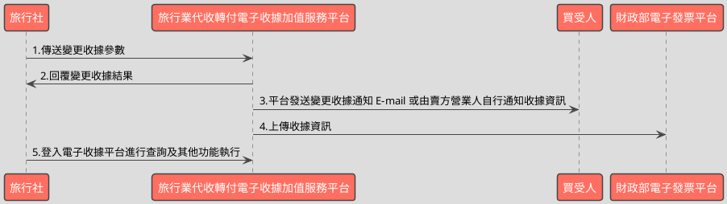

# 變更收據API

> 本文件包含 **AES256 加密、SHA256 簽章** 規格，詳見下方對應章節

---

## API 基本資訊

| 項目 | 內容 |
|:-----|:-----|
| 副標題 | 變更收據開立資料 |
| 串接方式 | 幕後 |
| Content-Type | `application/x-www-form-urlencoded` |
| 加密方式 | AES256、SHA256 |
| 正式環境 URL | https://api.travelinvoice.com.tw/invoice_edit |
| 測試環境 URL | https://capi.travelinvoice.com.tw/invoice_edit |

---

## 欄位定義

### Post 參數（請求） [POST]

| 欄位名稱 | 中文說明 | 型別 | 長度 | 必填 | 預設值 | 允許值 | 可為空 | 範例 | 備註 |
|----------|----------|------|------|------|--------|--------|--------|------|------|
| MerchantID_ | 旅行社統一編號 | string | 8 | 必填 |  |  |  | 54352706 | 旅行社統一編號。 |
| PostData_ | 加密資料 | array |  | 必填 |  |  |  |  | 字串欄位組合後做AES256加密，欄位說明如下表 |

### PostData_內含欄位（請求）　AES加密_字串

| 欄位名稱 | 中文說明 | 型別 | 長度 | 必填 | 預設值 | 允許值 | 可為空 | 範例 | 備註 |
|----------|----------|------|------|------|--------|--------|--------|------|------|
| Version | 串接程式版本 | string | 5 | 必填 |  | 1.0 |  | 1.0 | 固定帶 1.0 |
| TimeStamp | 時間戳記 | string | 30 | 必填 |  |  |  | 1400137200 | Unix 時間戳記（秒），即自 1970-01-01 00:00:00 UTC 至今的秒數 例：2014-05-15 15:00:00 這個時間的時間，戳記為 1400137200，建議帶入當前時間 |
| InvoiceNumber | 收據號碼 | string | 9 | 必填 |  |  |  | T13671007 | 此次開立折讓的收據號碼。 |
| Category | 收據種類 | string | 5 | 選填 |  | B2B,B2C |  | B2B | B2B=買受人為營利事業單位(統編必填)。 B2C=買受人為個人。 1.收據變更作業僅限一次(變更欄位含:收據種類、買受人名稱、買受人統一編號) 2.留空或無此欄位表示不變動資料。 |
| BuyerName | 買受人名稱 | string | 50 | 選填 |  |  |  | 王小一 | 1.買受人名稱，個人姓名或營利事業單位名稱。 2.收據變更作業僅限一次(變更欄位含:收據種類、買受人名稱、買受人統一編號) 3.當收據種類由 B2C 變更為 B2B 時，此為必帶欄位且不得為空值。 4.留空或無此欄位表示不變動資料。 5.如需清除此欄資料則請輸入*[clean]* |
| BuyerUBN | 買受人統一編號 | string | 8 | 選填 |  |  |  | 54352706 | 1.買受人(營利事業單位)統編，純數字。 2.買受人為個人時，則不須填寫。 3.收據變更作業僅限一次(變更欄位含:收據種類、買受人名稱、買受人統一編號、買受人電話、買受人地址) 4.當收據種類由 B2C 變更為 B2B 時，此為必帶欄位且不得為空值。 5.當收據種類由 B2B 變更為 B2C 時，系統會清除原有值。 6.留空或無此欄位表示不變動資料。 7.如需清除此欄資料則請輸入 *[clean]* |
| BuyerMobilePhone | 買受人電話 | string | 50 | 選填 |  |  |  | 0922123456 | 1.買受人的手機號碼。 2.留空或無此欄位表示不變動資料。 3.收據變更作業僅限一次(變更欄位含:收據種類、買受人名稱、買受人統一編號、買受人電話、買受人地址) 4.如需清除此欄資料則請輸入 *[clean]* |
| BuyerAddress | 買受人地址 | string | 100 | 選填 |  |  |  | 台北市南港區南港路二段97號8樓 | 1.買受人的地址。 2.留空或無此欄位表示不變動資料。 3.收據變更作業僅限一次(變更欄位含:收據種類、買受人名稱、買受人統一編號、買受人電話、買受人地址) 4.如需清除此欄資料則請輸入 *[clean]* |
| Comment | 備註 | string | 50 | 選填 |  |  |  | 機票 | 1.該張收據的備註。 2.留空或無此欄位表示不變動資料。 3.變更不限次數 4.如需清除此欄資料則請輸入 *[clean]* |
| TourName | 團名 | string | 50 | 選填 |  |  |  | 北海道5日遊 | 1.變更不限次數 2.如需清除此欄資料則請輸入 *[clean]* 3.全型/半型中文、英數、符號與空格，都算一個字 4.不接受斷行與下列特殊符號 : 雙引號 "\| 單引號 ' \| 連結符號 & \| 與 < > |
| TourNo | 團號 | string | 20 | 選填 |  |  |  | Ba023355 | 1.變更不限次數 2.如需清除此欄資料則請輸入 *[clean]* 3.不接受斷行與下列特殊符號 : 雙引號 "\| 單引號 ' \| 連結符號 & \| 與 < > |
| TourDate | 預計出團日 | date |  | 選填 |  |  |  | 2014-10-05 | 1.格式為 YYYY-MM-DD。例：2014-10-05 2.預計出團日不得晚於該收據實際開立日期的兩年後。 3.變更不限次數 4.如需清除此欄資料則請輸入 *[clean]* |
| TaxNoted | 申報註記 | int | 1 | 選填 |  | 0,1 |  | 0 | 0=未申報 1=已申報 留空或無傳送此參數表示不變更資料。 |

### 系統回應訊息（回應）

| 欄位名稱 | 中文說明 | 型別 | 長度 | 範例 | 必回傳 | 備註 |
|----------|----------|------|------|------|--------|------|
| Status | 回傳狀態 | string | 10 | SUCCESS | Y | 1.變更收據成功，則回傳 SUCCESS 2.變更收據失敗，則回傳錯誤代碼 |
| Message | 回傳訊息 | string | 30 | 成功 | Y | 文字，此次回傳狀態說明 |
| MerchantID | 旅行社代號 | string | 8 | 54352706 |  | 旅行社統一編號 |
| InvoiceNumber | 收據號碼 | string | 9 | T13671008 |  | 此次變更收據的收據號碼 |
| BuyerName | 買受人名稱 | string | 50 | 王小一 |  | 開立收據時的買受人名稱，個人姓名或營業人名稱。 |
| BuyerUBN | 買受人統一編號 | string | 8 | 54352706 |  | 1.若為 B2B 收據，此欄位為買受人統一編號。 2.若為 B2C 收據，此欄位為空值。 |
| BuyerMobilePhone | 買受人電話 | string | 50 | 0922123456 |  | 買受人的手機號碼。 |
| BuyerAddress | 買受人地址 | string | 100 | 台北市南港區南港路二段97號8樓 |  | 買受人的地址。 |
| Comment | 備註 | string | 50 | 機票 |  | 該張收據的備註。 |
| TourName | 團名 | string | 50 | 北海道5日遊 |  | 該張收據的團名 |
| TourNo | 團號 | string | 20 | Ba023355 |  | 該張收據的團號 |
| TourDate | 預計出團日 | date |  | 2014-10-05 |  | 該張收據出團日,出團日當天會發出出團申報提醒通 知信至指定信箱 |
| TaxNoted | 申報註記 | int | 1 | 0 |  | 該張收據的申報註記欄位 0=未申報 1=已申報 |
| CheckCode | 檢查碼 | string | 150 | 0C69DBB83FD36B6A2B2E9E614DAEA3D91D474C2D8A829870CA91511C55AF2AA |  | 用來檢查此次資料回傳的合法性，串接時可以比對此參數資料，來檢核是否為平台所回傳，檢核方法請參考”SHA256加密說明”。如開立失敗則回傳空值。  CheckCode = 將 InvoiceTransNo, MerchantID, MerchantOrderNo, RandomNum, TotalAmt 依 SHA256 簽章規格計算所得之雜湊值  InvoiceTransNo ,MerchantOrderNo,RandomNum, TotalAmt不含在此API回應欄位中，需程式自行保存開立收據時回傳的 InvoiceTransNo ,MerchantOrderNo,RandomNum, TotalAmt，供日後 CheckCode 驗證使用。 |
| EndStr | 字串結尾 | string | 2 | ## | Y | 固定回傳 ##，使用 String 方式接收資料的用戶，須多判斷 EndStr=##，確保資料傳遞完整。 |

---

## 錯誤代碼

> 以下錯誤代碼均於 **HTTP 200** 回應中回傳，錯誤訊息包含於 response body。

| 代碼 | 說明 |
|------|------|
| KEY10001 | 非旅行社 API 串接 IP |
| KEY10002 | 資料解密錯誤 |
| KEY10003 | 版本錯誤 |
| KEY10004 | 資料不齊全 |
| KEY10006 | 旅行社未申請啟用電子收據 |
| KEY10007 | 頁面停留超過 30 分鐘 |
| KEY10009 | 取不到旅行社統一編號的資料 |
| KEY10010 | 旅行社統一編號空白 |
| KEY10011 | PostData_欄位空白 |
| KEY10012 | 資料傳遞錯誤 |
| KEY10013 | 資料空白 |
| KEY10014 | TimeOut。通常泛指 I/O 上的 time out |
| KEY10015 | 收據金額格式錯誤 |
| KEY10016 | 旅行社無申請郵遞列印加值服務 |
| KEY10017 | 郵遞列印加值服務可用數不足 |
| KEY10018 | 開立人欄位未填寫 |
| KEY10019 | 旅行社已被停權 |
| NOR10001 | 網路連線異常 |
| INV20014 | 統一編號格式有誤 |
| INV20015 | 買受人統編未填寫 |
| INV20016 | 買受人名稱未填寫 |
| INV20018 | 預約出團日期格式不正確 |
| INV20100 | 資料庫發生嚴重錯誤 |
| INV20101 | 申報註記錯誤 |
| INV20102 | 團名欄位超過字數限制，請縮短字數。 |
| INV20103 | 團號欄位超過字數限制，請縮短字數。 |
| INV20104 | 團名欄位中有特殊符號，如"" ' & < >，請移除。 |
| INV20105 | 團號欄位中有特殊符號，如"" ' & < >，請移除。 |
| ED10001 | 預約出團日期格式不正確 |
| ED10002 | 申報註記輸入有誤 |
| ED10006 | 預計出團日期不可大於兩年 |
| ED10009 | 資料型別錯誤 |
| ED10011 | 資料未變更 |
| ED10012 | 收據種類為 B2B 時，買受人統編或買受人名稱不可為空 |
| ED10013 | 此收據已上傳財政部財資中心！依財政部規定，上傳 完成之收據不得再行變更。 |
| ED10014 | 此收據已超過可變更期限！收據可接受變更期限，為每單月一號整合服務平台上傳作業開始前一日的 23 點 59 分 59 秒，超過此期間的收據，因已進入上傳作業階段，無法再行變更。 |
| ED10015 | 收據內容已被變更，此項操作依法規僅限進行ㄧ次。 詳細變更資訊請參考上方變更歷程功能。 |
| ED10016 | 買受人已列印過此收據！依財政部規定，列印過之收據不得再行變更。 |
| ED10017 | 此收據狀態為取消或作廢，不得進行變更 |
| ED10018 | 買受人名稱超過字數限制 |
| ED10019 | 買受人統編格式錯誤 |
| ED10020 | 買受人手機超過字數限制 |
| ED10021 | 買受人地址超過字數限制 |
| ED10022 | 新增修改歷程記錄失敗 |
| ED10023 | 發票種類錯誤 |
| ED10024 | 備註超過字數限制 |

---

## 串接範例

### 請求範例

> 示範用 Key：`12345678901234567890123456789012`（32 bytes）　IV：`1234567890123456`（16 bytes）

> 外層請求參數組合格式：**String**，各必填欄位以 `欄位名稱=值` 形式，以 `&` 符號串接後傳送，簡單字串拼接 key=value&key=value，不做 URL encode

```http
POST https://api.travelinvoice.com.tw/invoice_edit
Content-Type: application/x-www-form-urlencoded

MerchantID_=54352706&PostData_=672781a0cacae60a9e8bf6e0866d113f5b90725edbb2af54aea18d6b41f6d8f3a0cf36553faa412bd49c3a2de0beebb6c7c3afc97dbfd4d58e793cdd89ff79d1
```

**PostData_（AES加密_字串）加密前明文（必填欄位）**

> 加密：AES-256-CBC，輸出：Hex，Key 與 IV 同上
> 欄位組合格式：**String**，各必填欄位以 `欄位名稱=值` 形式，以 `&` 符號串接後加密

```
Version=1.0&TimeStamp=1400137200&InvoiceNumber=T13671007
```

### 成功回應範例

> 回傳內容為 URL 編碼字串，請先進行 URL 解碼後，依 key=value 格式逐欄解析，各欄位以 & 分隔。

> 外層回應格式：**String**，各欄位以 `欄位名稱=值` 形式，以 `&` 符號串接後回傳

**系統回應**

```
Status=SUCCESS&Message=成功&MerchantID=54352706&InvoiceNumber=T13671008&BuyerName=王小一&BuyerUBN=54352706&BuyerMobilePhone=0922123456&BuyerAddress=台北市南港區南港路二段97號8樓&Comment=機票&TourName=北海道5日遊&TourNo=Ba023355&TourDate=2014-10-05&TaxNoted=0&CheckCode=0C69DBB83FD36B6A2B2E9E614DAEA3D91D474C2D8A829870CA91511C55AF2AA&EndStr=##
```

> 本 API 回應無加密欄位，上方字串即為完整明文。

### 失敗回應範例

> 回傳內容為 URL 編碼字串，請先進行 URL 解碼後，依 key=value 格式逐欄解析，各欄位以 & 分隔。

**系統回應**

```
Status=KEY10001&Message=非旅行社 API 串接 IP&EndStr=##
```

---

## 串接目的

1.提供各旅行同業公會旗下會員透過程式串接方式，進行變更電子收據之機制。 
2.本平台未提供媒體申報之相關機制與作業，旅行社請自行進行相關事宜。 
3.串接前請先與客服中心聯繫申請 IP 設定，可設定之 IP 組數為： 10 組。

## 資料交換方式

1. 旅行社以「HTTP POST」方式傳送收據資料至電子收據平台進行開立。 
2. Content-Type 為 application/x-www-form-urlencoded。 
3. 編碼格式為 UTF-8。 
4. 電子收據平台回應格式化的字串。 
5. 各欄位計算單位為字元。中、英、數字、符號都算一個字元。 
6. 各欄位間以「&」作為連接符號，各欄位內不得含有此字元（U+0026）。

## 串接前置作業

（請先完成，否則程式必失敗）

 1. 取得 HashKey / HashIV
- 測試環境：登入測試區後台 → 基本資料 → API 串接設定 → 複製 HashKey 與 HashIV
- 正式環境：登入正式區後台 → 基本資料 → API 串接設定 → 複製 HashKey 與 HashIV

2. 申請 IP 白名單
- 申請窗口：於官網下載申請表單並填寫後，傳送後客服中心（傳真 / Email）
- 最多可設定 10 組 IP
- 需提供：伺服器對外 IP（非內網 IP，可至 https://ifconfig.me 查詢）
- 生效時間：通常 1-2 個工作天

3. 環境網址
-測試環境與正式環境是完全不同的設備，資料不共通，上線前務必要確認已經將串接網址切換至正式區網址

4. 常見「忘記做前置作業」的錯誤訊號
- `KEY10001 非旅行社 API 串接 IP` → IP 白名單未設定或設錯
- `KEY10002 資料解密錯誤` → HashKey / HashIV 不正確或仍是範例值
- `KEY10009 取不到旅行社統一編號的資料` → MerchantID 錯或未啟用

## 變更收據流程



---

---

## AES256 加密規格

### 加密演算法規格

| 項目 | 規格 |
|:-----|:-----|
| 演算法 | AES |
| 金鑰長度 | 256 bits（32 bytes） |
| 加密模式 | CBC |
| 填充方式 | 類 PKCS7（32-byte 邊界，非標準） |
| 輸出格式 | Hex 十六進位 |
| 輸入編碼 | UTF-8 |
| Key 長度 | 32 bytes |
| IV 長度 | 16 bytes |

> 本文件的「**Key**」即實際串接金鑰 **HashKey**；「**IV**」即 **HashIV**。

> ⚠️ **注意：本 API 採用類 PKCS7 演算法，但以 32 bytes 為填充邊界（非 AES 標準的 16 bytes），必須特別處理**
>
> 標準 PKCS7 以 AES block size（**16 bytes**）為補齊單位；本 API 採用 **32 bytes** 作為填充邊界，屬類 PKCS7 的自訂規格。
> 各語言標準加密函式庫（PHP `openssl`、Node.js `crypto`、Python `pycryptodome`）的預設 PKCS7 均使用 16-byte 邊界，**直接呼叫內建 PKCS7 將產生錯誤的填充**，導致對方解密失敗。
> **實作時必須手動計算 32-byte 邊界填充，並停用函式庫的自動填充**（PHP：`OPENSSL_ZERO_PADDING`；Node.js：`cipher.setAutoPadding(false)`；Python：`pad(..., 32)`）。

### 適用欄位群組

- **PostData_內含欄位**（AES加密_字串）（請求）　傳送欄位名稱：`PostData_`

### 加密範例

> 以下為固定示範數值，**請勿用於正式環境**。
> 本範例已採用類 PKCS7（32-byte 邊界）填充計算，與標準 PKCS7（16-byte 邊界）結果**不同**。

| 項目 | 值 |
|:-----|:---|
| Key（ASCII，32 bytes） | `12345678901234567890123456789012` |
| IV（ASCII，16 bytes） | `1234567890123456` |
| 加密前字串（plaintext） | `Version=1.0&TimeStamp=1400137200&InvoiceNumber=T13671007` |
| 加密後（Hex 十六進位） | `672781a0cacae60a9e8bf6e0866d113f5b90725edbb2af54aea18d6b41f6d8f3a0cf36553faa412bd49c3a2de0beebb6c7c3afc97dbfd4d58e793cdd89ff79d1` |

> 驗證方法：使用上述 Key / IV 對加密後字串解密，應還原為加密前字串。

---

## SHA256 簽章規格

### 簽章規格

| 項目 | 規格 |
|:-----|:-----|
| 演算法 | SHA-256 |
| 輸出格式 | 十六進位字串（大寫） |
| Key 欄位名稱 | `HashKey` |
| IV 欄位名稱 | `HashIV` |
| 字串組合方式 | **前IV後KEY** |
| 參與簽章欄位 | `InvoiceTransNo,MerchantID,MerchantOrderNo,RandomNum,TotalAmt` |

### 字串組合說明

組合方式：**前IV後KEY**

參與簽章的欄位（依英文字母順序排列）：`InvoiceTransNo`、`MerchantID`、`MerchantOrderNo`、`RandomNum`、`TotalAmt`

> **欄位順序**：組合字串時，請依照**英文字母順序**排列各參與欄位，**不可任意調換**。

```
HashIV={IV值}&{欄位1}={值1}&...&HashKey={Key值}
```

以 `HashIV={iv}` 開頭，接各參與欄位（依序），最後以 `HashKey={key}` 結尾，各段以 `&` 分隔。

### 簽章範例

> 以下為固定示範數值，**請勿用於正式環境**。

| 項目 | 值 |
|:-----|:---|
| HashKey | `abc1234567890def` |
| HashIV | `xyz0987654321uvw` |
| InvoiceTransNo | `SampleValue` |
| MerchantID | `54352706` |
| MerchantOrderNo | `SampleValue` |
| RandomNum | `SampleValue` |
| TotalAmt | `SampleValue` |
| **組合後字串** | `HashIV=xyz0987654321uvw&InvoiceTransNo=SampleValue&MerchantID=54352706&MerchantOrderNo=SampleValue&RandomNum=SampleValue&TotalAmt=SampleValue&HashKey=abc1234567890def` |
| **SHA256 雜湊（大寫）** | `8D8A6A2370BB658300300B34E7FEB2DF6D1BE63B89A4E82A0F2CF867B971CDD5` |

> 驗證方法：將上述組合後字串進行 SHA256 計算並轉大寫，應得到上方雜湊值。

---

## 加解密程式碼

> 以下僅為加解密／簽章核心程式碼，HTTP 請求與參數組裝請依上方欄位定義自行完成。

### PHP

```php
<?php

/**
 * PHP 7.4+ AES256-CBC 加解密與 SHA256 簽章核心程式碼
 *
 * 嚴格遵循「變更收據API」規格。
 *
 * - AES256-CBC 加密模式
 * - 自定義 PKCS7 Padding (Block Size 32)
 * - SHA256 簽章產生與驗證 (時序安全)
 *
 * 僅包含密碼學相關核心函式，不含 HTTP 請求、完整參數組裝或錯誤碼處理。
 * 輸出為純文字，適用於命令列。
 */

// =====================================================================
// AES256 加解密核心程式碼
// =====================================================================

/**
 * 實作非標準的 PKCS7 Padding (Block Size 32)。
 * 明文會被填充至 32 bytes 的倍數，填充位元組的值為填充的長度。
 *
 * @param string $plaintext 原始明文。
 * @return string 經過 padding 處理的明文。
 */
function pkcs7_pad_32_bytes(string $plaintext): string
{
    $block_size = 32;
    $plaintext_length = strlen($plaintext);
    $padding_needed = $block_size - ($plaintext_length % $block_size);

    // 如果明文長度已是 Block Size 的倍數，則需添加一個完整的 Block 的 Padding。
    if ($padding_needed === 0) {
        $padding_needed = $block_size;
    }

    // 填充位元組的值為填充的長度。
    $padding_value = chr($padding_needed);
    return $plaintext . str_repeat($padding_value, $padding_needed);
}

/**
 * 實作非標準的 PKCS7 Unpadding (Block Size 32)。
 * 從已填充的資料中移除 padding。
 *
 * @param string $padded_data 經過 padding 處理的資料。
 * @return string 移除 padding 後的原始資料。
 * @throws Exception 如果 padding 格式不正確。
 */
function pkcs7_unpad_32_bytes(string $padded_data): string
{
    $block_size = 32;
    if (empty($padded_data)) {
        throw new Exception("Cannot unpad empty data.");
    }

    $data_length = strlen($padded_data);
    if ($data_length === 0 || $data_length % $block_size !== 0) {
        throw new Exception("Invalid padded data length for block size 32.");
    }

    $last_char = substr($padded_data, -1);
    $padding_length = ord($last_char);

    // 驗證 padding 長度是否在有效範圍內
    if ($padding_length < 1 || $padding_length > $block_size) {
        throw new Exception("Invalid padding length: {$padding_length}.");
    }

    // 驗證所有 padding 位元組是否都相同
    $expected_padding_chars = str_repeat($last_char, $padding_length);
    if (substr($padded_data, -$padding_length) !== $expected_padding_chars) {
        throw new Exception("Invalid padding characters detected.");
    }

    return substr($padded_data, 0, $data_length - $padding_length);
}

/**
 * 使用 AES-256-CBC 演算法加密資料。
 * 輸出為 Hex 十六進位字串。
 *
 * @param string $plaintext 原始明文 (UTF-8 編碼)。
 * @param string $key AES 金鑰 (32 bytes)。
 * @param string $iv AES 初始向量 (16 bytes)。
 * @return string 加密後的十六進位字串。
 * @throws Exception 如果金鑰或 IV 長度不正確，或加密失敗。
 */
function aes_encrypt(string $plaintext, string $key, string $iv): string
{
    if (strlen($key) !== 32) {
        throw new Exception("AES Key length must be 32 bytes.");
    }
    if (strlen($iv) !== 16) {
        throw new Exception("AES IV length must be 16 bytes.");
    }

    // 1. 手動執行 PKCS7 Padding (Block Size 32)
    $padded_plaintext = pkcs7_pad_32_bytes($plaintext);

    // 2. 使用 openssl_encrypt 進行 AES-256-CBC 加密，並停用函式庫內建 padding
    // OPENSSL_RAW_DATA 確保輸出為原始二進位密文，而不是 base64 編碼
    $ciphertext = openssl_encrypt($padded_plaintext, "AES-256-CBC", $key, OPENSSL_RAW_DATA, $iv);

    if ($ciphertext === false) {
        throw new Exception("AES encryption failed: " . openssl_error_string());
    }

    // 3. 將原始密文轉換為 Hex 十六進位字串
    return bin2hex($ciphertext);
}

/**
 * 使用 AES-256-CBC 演算法解密 Hex 十六進位字串。
 *
 * @param string $hex_ciphertext 十六進位加密字串。
 * @param string $key AES 金鑰 (32 bytes)。
 * @param string $iv AES 初始向量 (16 bytes)。
 * @return string 解密後的原始明文 (UTF-8 編碼)。
 * @throws Exception 如果金鑰或 IV 長度不正確，hex 轉換失敗，或解密失敗。
 */
function aes_decrypt(string $hex_ciphertext, string $key, string $iv): string
{
    if (strlen($key) !== 32) {
        throw new Exception("AES Key length must be 32 bytes.");
    }
    if (strlen($iv) !== 16) {
        throw new Exception("AES IV length must be 16 bytes.");
    }

    // 1. 將十六進位字串轉換為原始二進位密文
    $raw_ciphertext = hex2bin($hex_ciphertext);
    if ($raw_ciphertext === false) {
        throw new Exception("Hex to binary conversion failed for ciphertext.");
    }

    // 2. 使用 openssl_decrypt 進行 AES-256-CBC 解密，並停用函式庫內建 padding
    $padded_plaintext = openssl_decrypt($raw_ciphertext, "AES-256-CBC", $key, OPENSSL_RAW_DATA, $iv);

    if ($padded_plaintext === false) {
        throw new Exception("AES decryption failed: " . openssl_error_string());
    }

    // 3. 手動執行 PKCS7 Unpadding (Block Size 32)
    return pkcs7_unpad_32_bytes($padded_plaintext);
}

// =====================================================================
// SHA256 簽章核心程式碼
// =====================================================================

/**
 * 產生 SHA256 簽章。
 * 依據 API 規格將指定欄位與 HashIV/HashKey 組合後進行 SHA256 計算。
 *
 * @param array $params 參與簽章的欄位值陣列 (Key => Value)。
 *                        包含 InvoiceTransNo, MerchantID, MerchantOrderNo, RandomNum, TotalAmt。
 * @param string $hash_key HashKey 值。
 * @param string $hash_iv HashIV 值。
 * @return string 計算後的 SHA256 簽章 (大寫十六進位字串)。
 * @throws Exception 如果有必要，可檢查 $params 是否包含所有必填簽章欄位。
 */
function generate_sha256_signature(array $params, string $hash_key, string $hash_iv): string
{
    // 1. 定義參與簽章的欄位 (英文名稱)
    $sign_fields_order = [
        'InvoiceTransNo',
        'MerchantID',
        'MerchantOrderNo',
        'RandomNum',
        'TotalAmt',
    ];

    // 2. 組合字串：前IV後KEY，中間欄位按英文名稱 A → Z 字母升冪排序
    // 規格中已給出的欄位順序 (InvoiceTransNo, MerchantID, MerchantOrderNo, RandomNum, TotalAmt)
    // 實際上已經是字母升冪排序，因此直接使用此順序即可。
    $string_to_sign = "HashIV={$hash_iv}";

    foreach ($sign_fields_order as $field_name) {
        // 取出欄位值，如果欄位不存在，則視為空字串。
        // 實際應用中，應確保這些欄位在發送請求時都有值。
        $value = isset($params[$field_name]) ? $params[$field_name] : '';
        $string_to_sign .= "&{$field_name}={$value}";
    }

    $string_to_sign .= "&HashKey={$hash_key}";

    // 3. 對組合後字串進行 SHA256 計算，輸出結果轉大寫十六進位
    return strtoupper(hash('sha256', $string_to_sign));
}

/**
 * 驗證 SHA256 簽章。
 * 使用時序安全函式 hash_equals() 比對計算出的簽章與收到的簽章。
 *
 * @param string $received_signature 從 API 回傳的簽章 (大寫十六進位字串)。
 * @param array $original_request_params 參與簽章的原始欄位值陣列。
 *                                       (InvoiceTransNo, MerchantID, MerchantOrderNo, RandomNum, TotalAmt 等)。
 *                                       這些值通常應從您發送請求時的保存資料中取得。
 * @param string $hash_key HashKey 值。
 * @param string $hash_iv HashIV 值。
 * @return bool 簽章是否匹配。
 */
function verify_sha256_signature(
    string $received_signature,
    array $original_request_params,
    string $hash_key,
    string $hash_iv
): bool {
    try {
        $calculated_signature = generate_sha256_signature($original_request_params, $hash_key, $hash_iv);
        // 使用 hash_equals() 進行時序安全的字串比對，以防止時序攻擊。
        return hash_equals($calculated_signature, $received_signature);
    } catch (Exception $e) {
        // 在實際應用中，應記錄此錯誤。
        // error_log("Signature verification failed: " . $e->getMessage());
        return false;
    }
}

// =====================================================================
// 測試向量示範
// =====================================================================

echo "===== PHP 7.4+ 加解密/簽章核心程式碼測試向量示範 =====\n\n";

// !!! 警告：以下為測試用的 Key 和 IV，請在正式環境中替換為您的實際金鑰和 IV !!!
// AES 金鑰長度必須為 32 bytes (256 bits)
$TEST_AES_KEY = 'YOUR_AES_KEY_0123456789ABCDEF0123'; // 32 bytes
// AES IV 長度必須為 16 bytes (128 bits)
$TEST_AES_IV = 'YOUR_AES_IV_0123'; // 16 bytes

$TEST_HASH_KEY = 'YOUR_TEST_HASH_KEY_EXAMPLE';
$TEST_HASH_IV = 'YOUR_TEST_HASH_IV_EXAMPLE';

echo "--- AES256-CBC 加密/解密示範 ---\n";
echo "AES Key (32 bytes): " . bin2hex($TEST_AES_KEY) . "\n";
echo "AES IV (16 bytes): " . bin2hex($TEST_AES_IV) . "\n";

// 準備用於加密的 PostData_ 內含欄位 (querystring 格式)
// 注意：這裡只是一個示範用的資料，實際應用中會從 API 請求的 PostData_ 內含欄位構造。
$post_data_fields_for_aes = [
    'Version' => '1.0',
    'TimeStamp' => '1678886400', // 範例: 2023-03-15 08:00:00 UTC
    'InvoiceNumber' => 'T13671007',
    'Category' => 'B2B',
    'BuyerName' => '王小一',
    'BuyerUBN' => '54352706',
    'BuyerMobilePhone' => '0922123456',
    'BuyerAddress' => '台北市南港區南港路二段97號8樓',
    'Comment' => '機票',
    'TourName' => '北海道5日遊',
    'TourNo' => 'Ba023355',
    'TourDate' => '2014-10-05',
    'TaxNoted' => '0',
];
// 將欄位轉換為 key=value&key=value 的 querystring 格式 (Content-Type application/x-www-form-urlencoded 的子集)
$plaintext_to_encrypt = http_build_query($post_data_fields_for_aes);

echo "明文 (Plaintext, PostData_內含欄位): " . $plaintext_to_encrypt . "\n";

try {
    $encrypted_hex = aes_encrypt($plaintext_to_encrypt, $TEST_AES_KEY, $TEST_AES_IV);
    echo "加密預期輸出 (Expected Ciphertext, Hex): " . $encrypted_hex . "\n";

    $decrypted_plaintext = aes_decrypt($encrypted_hex, $TEST_AES_KEY, $TEST_AES_IV);
    echo "解密結果 (Decrypted Plaintext): " . $decrypted_plaintext . "\n";

    if ($plaintext_to_encrypt === $decrypted_plaintext) {
        echo "AES 加解密驗證成功。\n";
    } else {
        echo "AES 加解密驗證失敗！\n";
    }

} catch (Exception $e) {
    echo "AES 錯誤: " . $e->getMessage() . "\n";
}

echo "\n--- SHA256 簽章示範 (用於請求發送) ---\n";
echo "HashKey: " . $TEST_HASH_KEY . "\n";
echo "HashIV: " . $TEST_HASH_IV . "\n";

// 準備用於簽章的欄位及其值
// 這些欄位是參與簽章的原始請求資料。
$request_sign_params = [
    'InvoiceTransNo' => 'TRAVELINV_20230315_001',
    'MerchantID' => '54352706',
    'MerchantOrderNo' => 'MYORDER_XYZ_001',
    'RandomNum' => '1234567890abcdef',
    'TotalAmt' => '10000',
];

echo "簽章輸入欄位:\n";
foreach ($request_sign_params as $key => $value) {
    echo "  {$key}: {$value}\n";
}

try {
    // 手動組合原始字串，以驗證 generate_sha256_signature 函式的內部邏輯。
    $raw_string_for_signature = "HashIV={$TEST_HASH_IV}";
    $sign_fields_sorted_for_raw_string = [
        'InvoiceTransNo',
        'MerchantID',
        'MerchantOrderNo',
        'RandomNum',
        'TotalAmt'
    ];
    foreach ($sign_fields_sorted_for_raw_string as $field_name) {
        $value = isset($request_sign_params[$field_name]) ? $request_sign_params[$field_name] : '';
        $raw_string_for_signature .= "&{$field_name}={$value}";
    }
    $raw_string_for_signature .= "&HashKey={$TEST_HASH_KEY}";

    echo "組合後的原始字串 (Raw String): " . $raw_string_for_signature . "\n";

    $generated_signature = generate_sha256_signature($request_sign_params, $TEST_HASH_KEY, $TEST_HASH_IV);
    echo "簽章預期輸出 (Expected Signature, Uppercase Hex): " . $generated_signature . "\n";

    // --- SHA256 簽章驗證示範 (用於回應 CheckCode) ---
    // 模擬 API 回傳的 CheckCode 進行驗證。
    // 注意：`InvoiceTransNo`, `MerchantOrderNo`, `RandomNum`, `TotalAmt`
    // 在驗證 CheckCode 時，應使用 *原始請求中* 的這些值。
    $received_check_code = $generated_signature; // 假設 API 回傳的就是剛剛生成的簽章

    echo "\n--- SHA256 簽章驗證示範 (用於回應 CheckCode) ---\n";
    echo "接收到的 CheckCode: " . $received_check_code . "\n";
    echo "用以驗證的原始請求欄位 (需程式自行保存): \n";
    foreach ($request_sign_params as $key => $value) {
        echo "  {$key}: {$value}\n";
    }
    echo "HashKey: " . $TEST_HASH_KEY . "\n";
    echo "HashIV: " . $TEST_HASH_IV . "\n";

    if (verify_sha256_signature($received_check_code, $request_sign_params, $TEST_HASH_KEY, $TEST_HASH_IV)) {
        echo "SHA256 簽章驗證成功。\n";
    } else {
        echo "SHA256 簽章驗證失敗！\n";
    }

    // --- SHA256 簽章驗證失敗示範 ---
    echo "\n--- SHA256 簽章驗證失敗示範 ---\n";
    $invalid_received_check_code = "INVALID" . $generated_signature; // 故意給一個錯誤的 CheckCode
    echo "接收到的錯誤 CheckCode: " . $invalid_received_check_code . "\n";
    if (verify_sha256_signature($invalid_received_check_code, $request_sign_params, $TEST_HASH_KEY, $TEST_HASH_IV)) {
        echo "SHA256 簽章驗證成功 (意外！此情況不應發生)。\n";
    } else {
        echo "SHA256 簽章驗證失敗 (符合預期，錯誤 CheckCode 應導致驗證失敗)。\n";
    }

} catch (Exception $e) {
    echo "SHA256 錯誤: " . $e->getMessage() . "\n";
}

?>
```

