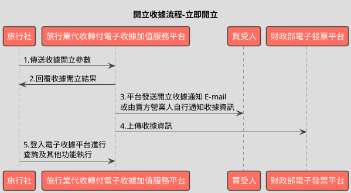
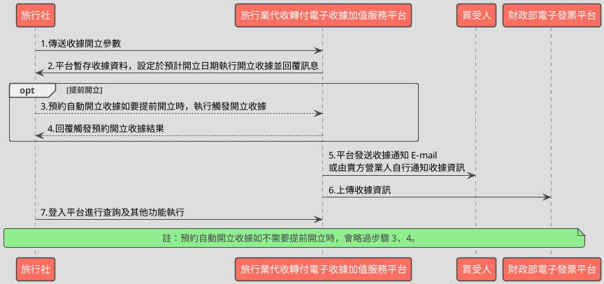

# 開立電子收據API

> 本文件包含 **AES256 加密、SHA256 簽章** 規格，詳見下方對應章節

---

## API 基本資訊

| 項目 | 內容 |
|:-----|:-----|
| 副標題 | 開立及時或預約收據 |
| 串接方式 | 幕後 |
| Content-Type | `application/x-www-form-urlencoded` |
| 加密方式 | AES256、SHA256 |
| 正式環境 URL | https://api.travelinvoice.com.tw/invoice_issue |
| 測試環境 URL | https://capi.travelinvoice.com.tw/invoice_issue |

---

## 欄位定義

### Post 參數（請求） [POST]

| 欄位名稱 | 中文說明 | 型別 | 長度 | 必填 | 預設值 | 允許值 | 可為空 | 範例 | 備註 |
|----------|----------|------|------|------|--------|--------|--------|------|------|
| MerchantID_ | 旅行社統一編號 | string | 8 | 必填 |  |  |  | 54352706 | 旅行社統一編號。 |
| PostData_ | 加密資料 | array |  | 必填 |  |  |  |  | 字串欄位組合後做AES256加密，欄位說明如下表 |

### PostData_內含欄位（請求）　AES加密_字串

| 欄位名稱 | 中文說明 | 型別 | 長度 | 必填 | 預設值 | 允許值 | 可為空 | 範例 | 備註 |
|----------|----------|------|------|------|--------|--------|--------|------|------|
| Version | 串接程式版本 | string | 5 | 必填 |  | 1.1 |  | 1.1 | 固定帶 1.1 |
| TimeStamp | 時間戳記 | string | 30 | 必填 |  |  |  | 1400137200 | Unix 時間戳記（秒），即自 1970-01-01 00:00:00 UTC 至今的秒數 例：2014-05-15 15:00:00 這個時間的時間，戳記為 1400137200，建議帶入當前時間 例：2014-05-15 15:00:00 這個時間的時間，戳記為 1400137200，建議帶入當前時間 |
| MerchantOrderNo | 自訂編號 | string | 30 | 必填 |  |  |  | O_201406010001 | 1.旅行社自訂訂單編號，限英、數字、”_ ”格式。 2.可用於與營業人內部系統對應使用，可填入訂單流水號、帳務編號等等， |
| Status | 開立收據方式 | int | 1 | 必填 |  | 1,2 |  | 1 | 1=即時開立收據 2=預約自動開立收據(須指定預計開立日期) |
| CreateStatusTime | 預計開立日期 | date |  | 條件必填 |  |  |  | 2030-10-05 | 1.當開立收據方式為預約自動開立收據時(Status=2)，此參數為必填。 2.格式為 YYYY-MM-DD。 |
| CreateStatusadd | 預計開立日期延長日 | int | 5 | 選填 |  |  |  | 2 | 1.當預計開立日期有值時，此參數才有作用。 2.純數字。 3.數字表延後開立日期的日數。如 2 代表延後開立日期兩天。 |
| Category | 收據種類 | string | 5 | 必填 |  | B2B,B2C |  | B2B | B2B=買受人為營利事業單位(有統編)。 B2C=買受人為個人。 |
| BuyerName | 買受人名稱 | string | 50 | 條件必填 |  |  |  | 藍新科技 | 買受人名稱，個人姓名或營利事業單位名稱。當收據種類為 B2B，則此欄位為必填。 Category=B2B 時必填 |
| BuyerUBN | 買受人統一編號 | string | 8 | 條件必填 |  |  |  | 54352706 | 1.買受人(營利事業單位)統編，純數字。 2.買受人為個人時，則不須填寫。 3.當收據種類為 B2B，則此欄位為必填。 |
| BuyerAddress | 買受人地址 | string | 100 | 選填 |  |  |  | 台北市南港區南港路二段97號 | 買受人的聯絡地址。 |
| BuyerEmail | 買受人電子信箱 | string | 100 | 必填 |  |  |  | abc@gmail.com | 1.買受人的電子信箱。當收據開立時，寄送收據相關查詢資訊。 2.若需帶入多個信箱，請以逗號分隔 |
| Buyerphone | 買受人手機 | string | 20 | 選填 |  |  |  | 0922123456 | 買受人的手機號碼。 |
| SellerName | 經辦人名稱 | string | 50 | 必填 |  |  |  | 業務203 | 開立收據人員名稱。純記錄，系統不檢核。如未填寫則無法開立成功，系統回覆錯誤代碼。 |
| TotalAmt | 收據金額 | int | 8 | 必填 |  |  |  | 1200 | 1.純數字，為收據總金額。 2.銷售額計算方式，請務必與公司財會人員進行確認。 3.收據總金額需為商品小計的總和。 |
| EmailLang | 收據通知信語系 | int | 2 | 選填 | 0 | 0,1 |  | 0 | 如有買受人電子信箱，將寄送收據開立通知信。若未帶此參數，系統預設參數值為 0(使用中文通知信)。 0=中文通知信 1=英文通知信 |
| ItemName | 摘要（商品名稱） | string | 286 | 必填 |  |  |  | 商品一\|商品二 | 1.多項商品時，商品名稱以 \| 分隔。 2.全部商品名稱總字數最多 280 個字。 3.單一品項名稱最多可接受 160 個字,中文、英文、數字符號皆算一個字 4.單一收據最多可接受 7 個品項，品項名稱每超過 40 個字，可輸入的品項就少一個。 |
| ItemCount | 商品數量 | string | 41 | 必填 |  |  |  | 1\|10 | 1.多項商品時，商品數量以 \|分隔。商品數量需為數字。例：ItemCount =”1\|2” 2.每個商品數量最多為 5 位數。 |
| ItemUnit | 商品單位 | string | 20 | 必填 |  |  |  | 個\|本 | 1.內容如：個、件、本、張…..。 2.多項商品時，商品單位以 \| 分隔。例：ItemUnit =”個\|本” 3.每個商品單位最多兩個字。例：ItemUnit =”個\|公斤” |
| ItemPrice | 商品單價 | string | 62 | 必填 |  |  |  | 200\|100 | 1.多項商品時，商品單價以 \| 分隔。純數字。例：ItemPrice =”200\|100” 2.每個商品單價不能超過 8 位數。 |
| ItemAmt | 商品小計 | string | 62 | 必填 |  |  |  | 200\|1000 | 1.每個小記為純數字。 2.計算方式為：數量 * 單價 = 小計。平台將會檢查計算結果。 3.多項商品時，商品小計以 \| 分隔。例：ItemAmt =”200\|200” 4.每個商品小計金額計算後不能超過 8位數。 |
| TourName | 團名 | string | 50 | 選填 |  |  |  | 北海道五日\|北海道五日 | 1.該張收據的團名 2.全型/半型中文、英數、符號與空格，都算一個字 3.不接受斷行，與下列特殊符號 : 雙引號 " \| 單引號 ' \| 連結符號 & \| 與< > |
| TourNo | 團號 | string | 20 | 選填 |  |  |  | X0323\|X0323 | 1.該張收據的團號 2.全型/半型中文、英數、符號與空格，都算一個字 3.不接受斷行，與下列特殊符號 : 雙引號 " \| 單引號 ' \| 連結符號 & \| 與< > |
| TourDate | 預計出團日 | date |  | 選填 |  |  |  | 2014-10-05 | 1.格式為 YYYY-MM-DD。例：2014-10-05 2.預計出團日不得晚於該收據實際開立日期的兩年後。 3.出團日當天會寄發出團申報提醒通知至指定信箱(請至 會員專區>電子收據>電子收據通知設定功能，填寫欲收信信箱) |
| TaxNoted | 申報註記 | int | 1 | 選填 | 0 | 0,1 |  | 0 | 0=未申報 1=已申報 留空或無傳送此參數表示未申報。 |
| Comment | 備註 | string | 50 | 選填 |  |  |  | 此張收據為北海道專案團 | 1.收據備註。 2.字串支援換行符號（16 進制：0x0A 或0x0D 0x0A）。字串中插入換行符號於列印收據時將會自動換行。 |

### 系統回應訊息（回應）

| 欄位名稱 | 中文說明 | 型別 | 長度 | 範例 | 必回傳 | 備註 |
|----------|----------|------|------|------|--------|------|
| Status | 回傳狀態 | string | 10 | SUCCESS | Y | 1.開立收據成功，則回傳 SUCCESS 2.開立收據失敗，則回傳錯誤代碼 |
| Message | 回傳訊息 | string | 30 | 成功 | Y | 文字，此次回傳狀態說明 |
| MerchantID | 旅行社代號 | string | 8 | 54352706 |  | 旅行社統一編號 |
| MerchantOrderNo | 自訂編號 | string | 30 | O_201406010001 |  | 旅行社於開立收據時提供的自訂編號 |
| TotalAmt | 收據金額 | int | 8 | 20532 |  | 此次開立收據的金額 |
| InvoiceNumber | 收據號碼 | string | 9 | T13671008 |  | 1.此次開立收據的收據號碼 2.預約開立為空值 |
| InvoiceTransNo | 開立流水號 | string | 20 | 193060 |  | 1.此次收據開立的開立流水號。 2.觸發或取消預約開立時之必填參數。 |
| RandomNum | 收據防偽隨機碼 | string | 8 | 85767715 |  | 1.此次開立收據所產生的 8 碼防偽隨機碼。 2.預約開立為空值 |
| CreateTime | 開立收據時間 | datetime |  | 2014-09-25 12:12:12 |  | CreateTime 開立收據時間 DateTime 此次開立收據的時間，例：2014-09-25 12:12:12。 |
| Surplus | 剩餘張數 | int | 8 | 2003 |  | 旅行社剩餘可用的字軌數量。 |
| CheckCode | 檢查碼 | string | 150 | 0C69DBB83FD36B6A2B2E9E614DAEA3D91D474C2D8A829870CA91511C55AF2AA |  | 用來檢查此次資料回傳的合法性，串接時可以比對此參數資料，來檢核是否為平台所回傳，檢核方法請參考”SHA256加密說明”。如開立失敗則回傳空值。  CheckCode = 將 InvoiceTransNo, MerchantID, MerchantOrderNo, RandomNum, TotalAmt 依 SHA256 簽章規格計算所得之雜湊值 |
| DisplayURL | 資料展示網址 | string | 300 | https://cwww.travelinvoice.com.tw/official/Invoice/searchInv?Key=844888dca6084f5394aa6c51c586ed613c2381a47 |  | 1.此欄位為一個完整的網址（含 https://） 2.該網址可直接連線官網取得收據的資料，不用再輸入開立日期、隨機碼等資訊。 |
| EndStr | 字串結尾 | string | 2 | ## | Y | 固定回傳 ##，使用 String 方式接收資料的用戶，須多判斷 EndStr=##，確保資料傳遞完整。 |

---

## 錯誤代碼

> 以下錯誤代碼均於 **HTTP 200** 回應中回傳，錯誤訊息包含於 response body。

| 代碼 | 說明 |
|------|------|
| KEY10001 | 非旅行社 API 串接 IP |
| KEY10002 | 資料解密錯誤 |
| KEY10003 | 版本錯誤 |
| KEY10004 | 資料不齊全 |
| KEY10006 | 旅行社未申請啟用電子收據 |
| KEY10007 | 頁面停留超過 30 分鐘 |
| KEY10009 | 取不到旅行社統一編號的資料 |
| KEY10010 | 旅行社統一編號空白 |
| KEY10011 | PostData_欄位空白 |
| KEY10012 | 資料傳遞錯誤 |
| KEY10013 | 資料空白 |
| KEY10014 | TimeOut。通常泛指 I/O 上的 time out |
| KEY10015 | 收據金額格式錯誤 |
| KEY10016 | 旅行社無申請郵遞列印加值服務 |
| KEY10017 | 郵遞列印加值服務可用數不足 |
| KEY10018 | 開立人欄位未填寫 |
| KEY10019 | 旅行社已被停權 |
| NOR10001 | 網路連線異常 |
| INV10003 | 商品資訊格式錯誤或缺少資料 |
| INV10004 | 商品資訊的商品小計計算錯誤 |
| INV10012 | 收據金額驗證錯誤 |
| INV10013 | 收據欄位資料不齊全或格式錯誤 |
| INV10014 | 自訂編號格式錯誤 |
| INV10016 | 自訂編號重覆 |
| INV20001 | 查無可用字軌 |
| INV20002 | 取用字軌失敗 |
| INV20003 | 字軌已使用完畢 |
| INV20004 | 開立收據失敗 |
| INV20005 | 寫入收據商品表失敗 |
| INV20006 | 查無收據資料 |
| INV20007 | 系統日已到預定開立收據日無法取消預約開立 |
| INV20008 | 取消預約開立收據失敗 |
| INV20010 | 預約開立日期為空 |
| INV20011 | 預約開立日期格式不正確 |
| INV20012 | 預約開立日期不可小於系統日 |
| INV20013 | 預計開立日期延長日格式不正確 |
| INV20014 | 統一編號輸入錯誤 |
| INV20015 | 買受人統編未填寫 |
| INV20016 | 買受人名稱未填寫 |
| INV20018 | 預約出團日期格式不正確 |
| INV20100 | 寫入資料發生異常 |
| INV70001 | 欄位資料格式錯誤 |

---

## 串接範例

### 請求範例

> 示範用 Key：`12345678901234567890123456789012`（32 bytes）　IV：`1234567890123456`（16 bytes）

> 外層請求參數組合格式：**String**，各必填欄位以 `欄位名稱=值` 形式，以 `&` 符號串接後傳送，簡單字串拼接 key=value&key=value，不做 URL encode

```http
POST https://api.travelinvoice.com.tw/invoice_issue
Content-Type: application/x-www-form-urlencoded

MerchantID_=54352706&PostData_=0ddd722db534612152877a2082309380fefc1612526018201e1b1d754ffcf5b0b7b7bd703b20ff4b43eb72778fa8ae9426874514ce8da4439b584275a11c02c140a19a36ec20138bac86670c53e98f330932098ae9d21481dee8baeccee466ddc8999fa9211a6e8e1f79de3d62322d2bc130e26bc6d69ddd6b9db013e0cebdd08c5b182a8313242cbd55141ff680d6c93600eaa2358a7ec700d37a8f60a07769d8859cf18c80f6936baaacb69f7d27a236670febece5a5d833e3aee34c2856b3eeb9953b43cd5b9d318c7c3ab98e7444b16fd5aa6e424b59cd6e399cff7413e184edcd71da7935da4b51f301f48e541a297fcc1c90cc43b56e4d519126c81bf3
```

**PostData_（AES加密_字串）加密前明文（必填欄位）**

> 加密：AES-256-CBC，輸出：Hex，Key 與 IV 同上
> 欄位組合格式：**String**，各必填欄位以 `欄位名稱=值` 形式，以 `&` 符號串接後加密

```
Version=1.1&TimeStamp=1400137200&MerchantOrderNo=O_201406010001&Status=1&Category=B2B&BuyerEmail=abc@gmail.com&SellerName=業務203&TotalAmt=1200&ItemName=商品一|商品二&ItemCount=1|10&ItemUnit=個|本&ItemPrice=200|100&ItemAmt=200|1000
```

### 成功回應範例

> 回傳內容為 URL 編碼字串，請先進行 URL 解碼後，依 key=value 格式逐欄解析，各欄位以 & 分隔。

> 外層回應格式：**String**，各欄位以 `欄位名稱=值` 形式，以 `&` 符號串接後回傳

**系統回應**

```
Status=SUCCESS&Message=成功&MerchantID=54352706&MerchantOrderNo=O_201406010001&TotalAmt=20532&InvoiceNumber=T13671008&InvoiceTransNo=193060&RandomNum=85767715&CreateTime=2014-09-25 12:12:12&Surplus=2003&CheckCode=0C69DBB83FD36B6A2B2E9E614DAEA3D91D474C2D8A829870CA91511C55AF2AA&DisplayURL=https://cwww.travelinvoice.com.tw/official/Invoice/searchInv?Key=844888dca6084f5394aa6c51c586ed613c2381a47&EndStr=##
```

> 本 API 回應無加密欄位，上方字串即為完整明文。

### 失敗回應範例

> 回傳內容為 URL 編碼字串，請先進行 URL 解碼後，依 key=value 格式逐欄解析，各欄位以 & 分隔。

**系統回應**

```
Status=KEY10001&Message=非旅行社 API 串接 IP&EndStr=##
```

---

## 串接目的

1.提供各旅行同業公會旗下會員透過程式串接方式，進行開立電子收據及提供上傳至「財政部電子發票整合服務平台」之機制。 
2.本平台未提供媒體申報之相關機制與作業，旅行社請自行進行相關事宜。 
3.串接前請先與客服中心聯繫申請 IP 設定，可設定之 IP 組數為： 10 組。

## 資料交換方式

1. 旅行社以「HTTP POST」方式傳送收據資料至電子收據平台進行開立。 
2. Content-Type 為 application/x-www-form-urlencoded。 
3. 編碼格式為 UTF-8。 
4. 電子收據平台回應格式化的字串。 
5. 各欄位計算單位為字元。中、英、數字、符號都算一個字元。 
6. 各欄位間以「&」作為連接符號，各欄位內不得含有此字元（U+0026）。

## 收據計算方式檢核

1.電子收據平台系統僅檢核「商品小計=商品數量 X 商品單價」及「收據金額= 銷售額」。 
2.收據計算方式，請串接人員務必與公司財會人員進行確認，收據資料關係到公司稅務，請謹慎處理。

## 開立收據流程-預約開立

1.當收據開立方式為預約自動開立收據時，收據資料僅暫存於平台，系統於設預計開 立日期自動執行開立收據。 
2.於預計開立日期前欲提前開立，則可執行「觸發開立收據」，觸發後會立即開出收據。
3.預約開立收據於預約到期日當天 0 時 0 分後，不可取消或執行觸發。
4.開立收據後，屆當期上傳排程日(每單月一日)，平台將會把開立資料上傳至「財政 部電子發票整合服務平台」。

## 串接前置作業

（請先完成，否則程式必失敗）

 1. 取得 HashKey / HashIV
- 測試環境：登入測試區後台 → 基本資料 → API 串接設定 → 複製 HashKey 與 HashIV
- 正式環境：登入正式區後台 → 基本資料 → API 串接設定 → 複製 HashKey 與 HashIV

2. 申請 IP 白名單
- 申請窗口：於官網下載申請表單並填寫後，傳送後客服中心（傳真 / Email）
- 最多可設定 10 組 IP
- 需提供：伺服器對外 IP（非內網 IP，可至 https://ifconfig.me 查詢）
- 生效時間：通常 1-2 個工作天

3. 環境網址
-測試環境與正式環境是完全不同的設備，資料不共通，上線前務必要確認已經將串接網址切換至正式區網址

4. 常見「忘記做前置作業」的錯誤訊號
- `KEY10001 非旅行社 API 串接 IP` → IP 白名單未設定或設錯
- `KEY10002 資料解密錯誤` → HashKey / HashIV 不正確或仍是範例值
- `KEY10009 取不到旅行社統一編號的資料` → MerchantID 錯或未啟用

## 上傳開立收據至財政部

開立收據後，屆當期上傳排程日(每單月一日)，平台將會把開立資料上傳至 「財政部電子發票整合服務平台」

## 開立收據流程_立即開立



## 開立收據流程_預約開立



---

---

## AES256 加密規格

### 加密演算法規格

| 項目 | 規格 |
|:-----|:-----|
| 演算法 | AES |
| 金鑰長度 | 256 bits（32 bytes） |
| 加密模式 | CBC |
| 填充方式 | 類 PKCS7（32-byte 邊界，非標準） |
| 輸出格式 | Hex 十六進位 |
| 輸入編碼 | UTF-8 |
| Key 長度 | 32 bytes |
| IV 長度 | 16 bytes |

> 本文件的「**Key**」即實際串接金鑰 **HashKey**；「**IV**」即 **HashIV**。

> ⚠️ **注意：本 API 採用類 PKCS7 演算法，但以 32 bytes 為填充邊界（非 AES 標準的 16 bytes），必須特別處理**
>
> 標準 PKCS7 以 AES block size（**16 bytes**）為補齊單位；本 API 採用 **32 bytes** 作為填充邊界，屬類 PKCS7 的自訂規格。
> 各語言標準加密函式庫（PHP `openssl`、Node.js `crypto`、Python `pycryptodome`）的預設 PKCS7 均使用 16-byte 邊界，**直接呼叫內建 PKCS7 將產生錯誤的填充**，導致對方解密失敗。
> **實作時必須手動計算 32-byte 邊界填充，並停用函式庫的自動填充**（PHP：`OPENSSL_ZERO_PADDING`；Node.js：`cipher.setAutoPadding(false)`；Python：`pad(..., 32)`）。

### 適用欄位群組

- **PostData_內含欄位**（AES加密_字串）（請求）　傳送欄位名稱：`PostData_`

### 加密範例

> 以下為固定示範數值，**請勿用於正式環境**。
> 本範例已採用類 PKCS7（32-byte 邊界）填充計算，與標準 PKCS7（16-byte 邊界）結果**不同**。

| 項目 | 值 |
|:-----|:---|
| Key（ASCII，32 bytes） | `12345678901234567890123456789012` |
| IV（ASCII，16 bytes） | `1234567890123456` |
| 加密前字串（plaintext） | `Version=1.1&TimeStamp=1400137200&MerchantOrderNo=O_201406010001&Status=1&Category=B2B&BuyerEmail=abc@gmail.com&SellerName=業務203&TotalAmt=1200&ItemName=商品一|商品二&ItemCount=1|10&ItemUnit=個|本&ItemPrice=200|100&ItemAmt=200|1000` |
| 加密後（Hex 十六進位） | `0ddd722db534612152877a2082309380fefc1612526018201e1b1d754ffcf5b0b7b7bd703b20ff4b43eb72778fa8ae9426874514ce8da4439b584275a11c02c140a19a36ec20138bac86670c53e98f330932098ae9d21481dee8baeccee466ddc8999fa9211a6e8e1f79de3d62322d2bc130e26bc6d69ddd6b9db013e0cebdd08c5b182a8313242cbd55141ff680d6c93600eaa2358a7ec700d37a8f60a07769d8859cf18c80f6936baaacb69f7d27a236670febece5a5d833e3aee34c2856b3eeb9953b43cd5b9d318c7c3ab98e7444b16fd5aa6e424b59cd6e399cff7413e184edcd71da7935da4b51f301f48e541a297fcc1c90cc43b56e4d519126c81bf3` |

> 驗證方法：使用上述 Key / IV 對加密後字串解密，應還原為加密前字串。

---

## SHA256 簽章規格

### 簽章規格

| 項目 | 規格 |
|:-----|:-----|
| 演算法 | SHA-256 |
| 輸出格式 | 十六進位字串（大寫） |
| Key 欄位名稱 | `HashKey` |
| IV 欄位名稱 | `HashIV` |
| 字串組合方式 | **前IV後KEY** |
| 參與簽章欄位 | `InvoiceTransNo,MerchantID,MerchantOrderNo,RandomNum,TotalAmt` |

### 字串組合說明

組合方式：**前IV後KEY**

參與簽章的欄位（依英文字母順序排列）：`InvoiceTransNo`、`MerchantID`、`MerchantOrderNo`、`RandomNum`、`TotalAmt`

> **欄位順序**：組合字串時，請依照**英文字母順序**排列各參與欄位，**不可任意調換**。

```
HashIV={IV值}&{欄位1}={值1}&...&HashKey={Key值}
```

以 `HashIV={iv}` 開頭，接各參與欄位（依序），最後以 `HashKey={key}` 結尾，各段以 `&` 分隔。

### 簽章範例

> 以下為固定示範數值，**請勿用於正式環境**。

| 項目 | 值 |
|:-----|:---|
| HashKey | `abc1234567890def` |
| HashIV | `xyz0987654321uvw` |
| InvoiceTransNo | `193060` |
| MerchantID | `54352706` |
| MerchantOrderNo | `O_201406010001` |
| RandomNum | `85767715` |
| TotalAmt | `20532` |
| **組合後字串** | `HashIV=xyz0987654321uvw&InvoiceTransNo=193060&MerchantID=54352706&MerchantOrderNo=O_201406010001&RandomNum=85767715&TotalAmt=20532&HashKey=abc1234567890def` |
| **SHA256 雜湊（大寫）** | `BF39A0883906922021BEEDF09358586B08608FEF7536AFF256ED99FBE07CDAD8` |

> 驗證方法：將上述組合後字串進行 SHA256 計算並轉大寫，應得到上方雜湊值。

