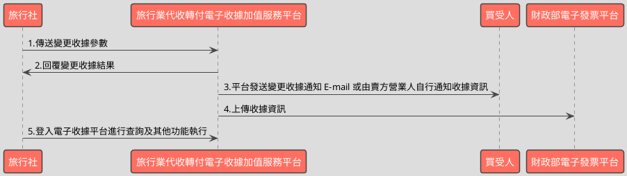

# 變更收據API

> 本文件包含 **AES256 加密、SHA256 簽章** 規格，詳見下方對應章節

---

## API 基本資訊

| 項目 | 內容 |
|:-----|:-----|
| 副標題 | 變更收據開立資料 |
| 串接方式 | 幕後 |
| Content-Type | `application/x-www-form-urlencoded` |
| 加密方式 | AES256、SHA256 |
| 正式環境 URL | https://api.travelinvoice.com.tw/invoice_edit |
| 測試環境 URL | https://capi.travelinvoice.com.tw/invoice_edit |

---

## 欄位定義

### Post 參數（請求） [POST]

| 欄位名稱 | 中文說明 | 型別 | 長度 | 必填 | 預設值 | 允許值 | 可為空 | 範例 | 備註 |
|----------|----------|------|------|------|--------|--------|--------|------|------|
| MerchantID_ | 旅行社統一編號 | string | 8 | 必填 |  |  |  | 54352706 | 旅行社統一編號。 |
| PostData_ | 加密資料 | array |  | 必填 |  |  |  |  | 字串欄位組合後做AES256加密，欄位說明如下表 |

### PostData_內含欄位（請求）　AES加密_字串

| 欄位名稱 | 中文說明 | 型別 | 長度 | 必填 | 預設值 | 允許值 | 可為空 | 範例 | 備註 |
|----------|----------|------|------|------|--------|--------|--------|------|------|
| Version | 串接程式版本 | string | 5 | 必填 |  | 1.0 |  | 1.0 | 固定帶 1.0 |
| TimeStamp | 時間戳記 | string | 30 | 必填 |  |  |  | 1400137200 | Unix 時間戳記（秒），即自 1970-01-01 00:00:00 UTC 至今的秒數 例：2014-05-15 15:00:00 這個時間的時間，戳記為 1400137200，建議帶入當前時間 |
| InvoiceNumber | 收據號碼 | string | 9 | 必填 |  |  |  | T13671007 | 此次開立折讓的收據號碼。 |
| Category | 收據種類 | string | 5 | 選填 |  | B2B,B2C |  | B2B | B2B=買受人為營利事業單位(統編必填)。 B2C=買受人為個人。 1.收據變更作業僅限一次(變更欄位含:收據種類、買受人名稱、買受人統一編號) 2.留空或無此欄位表示不變動資料。 |
| BuyerName | 買受人名稱 | string | 50 | 選填 |  |  |  | 王小一 | 1.買受人名稱，個人姓名或營利事業單位名稱。 2.收據變更作業僅限一次(變更欄位含:收據種類、買受人名稱、買受人統一編號) 3.當收據種類由 B2C 變更為 B2B 時，此為必帶欄位且不得為空值。 4.留空或無此欄位表示不變動資料。 5.如需清除此欄資料則請輸入*[clean]* |
| BuyerUBN | 買受人統一編號 | string | 8 | 選填 |  |  |  | 54352706 | 1.買受人(營利事業單位)統編，純數字。 2.買受人為個人時，則不須填寫。 3.收據變更作業僅限一次(變更欄位含:收據種類、買受人名稱、買受人統一編號、買受人電話、買受人地址) 4.當收據種類由 B2C 變更為 B2B 時，此為必帶欄位且不得為空值。 5.當收據種類由 B2B 變更為 B2C 時，系統會清除原有值。 6.留空或無此欄位表示不變動資料。 7.如需清除此欄資料則請輸入 *[clean]* |
| BuyerMobilePhone | 買受人電話 | string | 50 | 選填 |  |  |  | 0922123456 | 1.買受人的手機號碼。 2.留空或無此欄位表示不變動資料。 3.收據變更作業僅限一次(變更欄位含:收據種類、買受人名稱、買受人統一編號、買受人電話、買受人地址) 4.如需清除此欄資料則請輸入 *[clean]* |
| BuyerAddress | 買受人地址 | string | 100 | 選填 |  |  |  | 台北市南港區南港路二段97號8樓 | 1.買受人的地址。 2.留空或無此欄位表示不變動資料。 3.收據變更作業僅限一次(變更欄位含:收據種類、買受人名稱、買受人統一編號、買受人電話、買受人地址) 4.如需清除此欄資料則請輸入 *[clean]* |
| Comment | 備註 | string | 50 | 選填 |  |  |  | 機票 | 1.該張收據的備註。 2.留空或無此欄位表示不變動資料。 3.變更不限次數 4.如需清除此欄資料則請輸入 *[clean]* |
| TourName | 團名 | string | 50 | 選填 |  |  |  | 北海道5日遊 | 1.變更不限次數 2.如需清除此欄資料則請輸入 *[clean]* 3.全型/半型中文、英數、符號與空格，都算一個字 4.不接受斷行與下列特殊符號 : 雙引號 "\| 單引號 ' \| 連結符號 & \| 與 < > |
| TourNo | 團號 | string | 20 | 選填 |  |  |  | Ba023355 | 1.變更不限次數 2.如需清除此欄資料則請輸入 *[clean]* 3.不接受斷行與下列特殊符號 : 雙引號 "\| 單引號 ' \| 連結符號 & \| 與 < > |
| TourDate | 預計出團日 | date |  | 選填 |  |  |  | 2014-10-05 | 1.格式為 YYYY-MM-DD。例：2014-10-05 2.預計出團日不得晚於該收據實際開立日期的兩年後。 3.變更不限次數 4.如需清除此欄資料則請輸入 *[clean]* |
| TaxNoted | 申報註記 | int | 1 | 選填 |  | 0,1 |  | 0 | 0=未申報 1=已申報 留空或無傳送此參數表示不變更資料。 |

### 系統回應訊息（回應）

| 欄位名稱 | 中文說明 | 型別 | 長度 | 範例 | 必回傳 | 備註 |
|----------|----------|------|------|------|--------|------|
| Status | 回傳狀態 | string | 10 | SUCCESS | Y | 1.開立收據成功，則回傳 SUCCESS 2.開立收據失敗，則回傳錯誤代碼 |
| Message | 回傳訊息 | string | 30 | 成功 | Y | 文字，此次回傳狀態說明 |
| MerchantID | 旅行社代號 | string | 8 | 54352706 |  | 旅行社統一編號 |
| InvoiceNumber | 收據號碼 | string | 9 | T13671008 |  | 此次開立收據的收據號碼 |
| BuyerName | 買受人名稱 | string | 50 | 王小一 |  | 開立收據時的買受人名稱，個人姓名或營業人名稱。 |
| BuyerUBN | 買受人統一編號 | string | 8 | 54352706 |  | 1.若為 B2B 收據，此欄位為買受人統一編號。 2.若為 B2C 收據，此欄位為空值。 |
| BuyerMobilePhone | 買受人電話 | string | 50 | 0922123456 |  | 買受人的手機號碼。 |
| BuyerAddress | 買受人地址 | string | 100 | 台北市南港區南港路二段97號8樓 |  | 買受人的地址。 |
| Comment | 備註 | string | 50 | 機票 |  | 該張收據的備註。 |
| TourName | 團名 | string | 50 | 北海道5日遊 |  | 該張收據的團名 |
| TourNo | 團號 | string | 20 | Ba023355 |  | 該張收據的團號 |
| TourDate | 預計出團日 | date |  | 2014-10-05 |  | 該張收據出團日,出團日當天會發出出團申報提醒通 知信至指定信箱 |
| TaxNoted | 申報註記 | int | 1 | 0 |  | 該張收據的申報註記欄位 0=未申報 1=已申報 |
| CheckCode | 檢查碼 | string | 50 | 0C69DBB83FD36B6A2B2E9E614DAEA3D91D474C2D8A829870CA91511C55AF2AA |  | 用來檢查此次資料回傳的合法性，串接時可以比對此參數資料，來檢核是否為平台所回傳，檢核方法請參考”SHA256加密說明”。如開立失敗則回傳空值。  CheckCode = 將 InvoiceTransNo, MerchantID, MerchantOrderNo, RandomNum, TotalAmt 依 SHA256 簽章規格計算所得之雜湊值  InvoiceTransNo ,MerchantOrderNo,RandomNum, TotalAmt不含在此API回應欄位中，需程式自行保存開立收據時回傳的 InvoiceTransNo ,MerchantOrderNo,RandomNum, TotalAmt，供日後 CheckCode 驗證使用。 |
| EndStr | 字串結尾 | string | 2 | ## | Y | 固定回傳 ##，使用 String 方式接收資料的用戶，須多判斷 EndStr=##，確保資料傳遞完整。 |

---

## 錯誤代碼

> 以下錯誤代碼均於 **HTTP 200** 回應中回傳，錯誤訊息包含於 response body。

| 代碼 | 說明 |
|------|------|
| KEY10001 | 非旅行社 API 串接 IP |
| KEY10002 | 資料解密錯誤 |
| KEY10003 | 版本錯誤 |
| KEY10004 | 資料不齊全 |
| KEY10006 | 旅行社未申請啟用電子收據 |
| KEY10007 | 頁面停留超過 30 分鐘 |
| KEY10009 | 取不到旅行社統一編號的資料 |
| KEY10010 | 旅行社統一編號空白 |
| KEY10011 | PostData_欄位空白 |
| KEY10012 | 資料傳遞錯誤 |
| KEY10013 | 資料空白 |
| KEY10014 | TimeOut。通常泛指 I/O 上的 time out |
| KEY10015 | 收據金額格式錯誤 |
| KEY10016 | 旅行社無申請郵遞列印加值服務 |
| KEY10017 | 郵遞列印加值服務可用數不足 |
| KEY10018 | 開立人欄位未填寫 |
| KEY10019 | 旅行社已被停權 |
| NOR10001 | 網路連線異常 |
| INV20014 | 統一編號格式有誤 |
| INV20015 | 買受人統編未填寫 |
| INV20016 | 買受人名稱未填寫 |
| INV20018 | 預約出團日期格式不正確 |
| INV20100 | 資料庫發生嚴重錯誤 |
| INV20101 | 申報註記錯誤 |
| INV20102 | 團名欄位超過字數限制，請縮短字數。 |
| INV20103 | 團號欄位超過字數限制，請縮短字數。 |
| INV20104 | 團名欄位中有特殊符號，如"" ' & < >，請移除。 |
| INV20105 | 團號欄位中有特殊符號，如"" ' & < >，請移除。 |
| ED10001 | 預約出團日期格式不正確 |
| ED10002 | 申報註記輸入有誤 |
| ED10006 | 預計出團日期不可大於兩年 |
| ED10009 | 資料型別錯誤 |
| ED10011 | 資料未變更 |
| ED10012 | 收據種類為 B2B 時，買受人統編或買受人名稱不可為空 |
| ED10013 | 此收據已上傳財政部財資中心！依財政部規定，上傳 完成之收據不得再行變更。 |
| ED10014 | 此收據已超過可變更期限！收據可接受變更期限，為每單月一號整合服務平台上傳作業開始前一日的 23 點 59 分 59 秒，超過此期間的收據，因已進入上傳作業階段，無法再行變更。 |
| ED10015 | 收據內容已被變更，此項操作依法規僅限進行ㄧ次。 詳細變更資訊請參考上方變更歷程功能。 |
| ED10016 | 買受人已列印過此收據！依財政部規定，列印過之收據不得再行變更。 |
| ED10017 | 此收據狀態為取消或作廢，不得進行變更 |
| ED10018 | 買受人名稱超過字數限制 |
| ED10019 | 買受人統編格式錯誤 |
| ED10020 | 買受人手機超過字數限制 |
| ED10021 | 買受人地址超過字數限制 |
| ED10022 | 新增修改歷程記錄失敗 |
| ED10023 | 發票種類錯誤 |
| ED10024 | 備註超過字數限制 |

---

## 串接範例

### 請求範例

> 示範用 Key：`12345678901234567890123456789012`（32 bytes）　IV：`1234567890123456`（16 bytes）

> 外層請求參數組合格式：**String**，各必填欄位以 `欄位名稱=值` 形式，以 `&` 符號串接後傳送，簡單字串拼接 key=value&key=value，不做 URL encode

```http
POST https://api.travelinvoice.com.tw/invoice_edit
Content-Type: application/x-www-form-urlencoded

MerchantID_=54352706&PostData_=672781a0cacae60a9e8bf6e0866d113f5b90725edbb2af54aea18d6b41f6d8f3a0cf36553faa412bd49c3a2de0beebb6c7c3afc97dbfd4d58e793cdd89ff79d1
```

**PostData_（AES加密_字串）加密前明文（必填欄位）**

> 加密：AES-256-CBC，輸出：Hex，Key 與 IV 同上
> 欄位組合格式：**String**，各必填欄位以 `欄位名稱=值` 形式，以 `&` 符號串接後加密

```
Version=1.0&TimeStamp=1400137200&InvoiceNumber=T13671007
```

### 成功回應範例

> 回傳內容為 URL 編碼字串，請先進行 URL 解碼後，依 key=value 格式逐欄解析，各欄位以 & 分隔。

> 外層回應格式：**String**，各欄位以 `欄位名稱=值` 形式，以 `&` 符號串接後回傳

**系統回應**

```
Status=SUCCESS&Message=成功&MerchantID=54352706&InvoiceNumber=T13671008&BuyerName=王小一&BuyerUBN=54352706&BuyerMobilePhone=0922123456&BuyerAddress=台北市南港區南港路二段97號8樓&Comment=機票&TourName=北海道5日遊&TourNo=Ba023355&TourDate=2014-10-05&TaxNoted=0&CheckCode=0C69DBB83FD36B6A2B2E9E614DAEA3D91D474C2D8A829870CA91511C55AF2AA&EndStr=##
```

> 本 API 回應無加密欄位，上方字串即為完整明文。

### 失敗回應範例

> 回傳內容為 URL 編碼字串，請先進行 URL 解碼後，依 key=value 格式逐欄解析，各欄位以 & 分隔。

**系統回應**

```
Status=KEY10001&Message=非旅行社 API 串接 IP&EndStr=##
```

---

## 串接目的

1.提供各旅行同業公會旗下會員透過程式串接方式，進行變更電子收據之機制。 
2.本平台未提供媒體申報之相關機制與作業，旅行社請自行進行相關事宜。 
3.串接前請先與客服中心聯繫申請 IP 設定，可設定之 IP 組數為： 10 組。

## 資料交換方式

1. 旅行社以「HTTP POST」方式傳送收據資料至電子收據平台進行開立。 
2. Content-Type 為 application/x-www-form-urlencoded。 
3. 編碼格式為 UTF-8。 
4. 電子收據平台回應格式化的字串。 
5. 各欄位計算單位為字元。中、英、數字、符號都算一個字元。 
6. 各欄位間以「&」作為連接符號，各欄位內不得含有此字元（U+0026）。

## 串接前置作業

（請先完成，否則程式必失敗）

 1. 取得 HashKey / HashIV
- 測試環境：登入測試區後台 → 基本資料 → API 串接設定 → 複製 HashKey 與 HashIV
- 正式環境：登入正式區後台 → 基本資料 → API 串接設定 → 複製 HashKey 與 HashIV

2. 申請 IP 白名單
- 申請窗口：於官網下載申請表單並填寫後，傳送後客服中心（傳真 / Email）
- 最多可設定 10 組 IP
- 需提供：伺服器對外 IP（非內網 IP，可至 https://ifconfig.me 查詢）
- 生效時間：通常 1-2 個工作天

3. 環境網址
-測試環境與正式環境是完全不同的設備，資料不共通，上線前務必要確認已經將串接網址切換至正式區網址

4. 常見「忘記做前置作業」的錯誤訊號
- `KEY10001 非旅行社 API 串接 IP` → IP 白名單未設定或設錯
- `KEY10002 資料解密錯誤` → HashKey / HashIV 不正確或仍是範例值
- `KEY10009 取不到旅行社統一編號的資料` → MerchantID 錯或未啟用

## 變更收據流程



---

---

## AES256 加密規格

### 加密演算法規格

| 項目 | 規格 |
|:-----|:-----|
| 演算法 | AES |
| 金鑰長度 | 256 bits（32 bytes） |
| 加密模式 | CBC |
| 填充方式 | 類 PKCS7（32-byte 邊界，非標準） |
| 輸出格式 | Hex 十六進位 |
| 輸入編碼 | UTF-8 |
| Key 長度 | 32 bytes |
| IV 長度 | 16 bytes |

> 本文件的「**Key**」即實際串接金鑰 **HashKey**；「**IV**」即 **HashIV**。

> ⚠️ **注意：本 API 採用類 PKCS7 演算法，但以 32 bytes 為填充邊界（非 AES 標準的 16 bytes），必須特別處理**
>
> 標準 PKCS7 以 AES block size（**16 bytes**）為補齊單位；本 API 採用 **32 bytes** 作為填充邊界，屬類 PKCS7 的自訂規格。
> 各語言標準加密函式庫（PHP `openssl`、Node.js `crypto`、Python `pycryptodome`）的預設 PKCS7 均使用 16-byte 邊界，**直接呼叫內建 PKCS7 將產生錯誤的填充**，導致對方解密失敗。
> **實作時必須手動計算 32-byte 邊界填充，並停用函式庫的自動填充**（PHP：`OPENSSL_ZERO_PADDING`；Node.js：`cipher.setAutoPadding(false)`；Python：`pad(..., 32)`）。

### 適用欄位群組

- **PostData_內含欄位**（AES加密_字串）（請求）　傳送欄位名稱：`PostData_`

### 加密範例

> 以下為固定示範數值，**請勿用於正式環境**。
> 本範例已採用類 PKCS7（32-byte 邊界）填充計算，與標準 PKCS7（16-byte 邊界）結果**不同**。

| 項目 | 值 |
|:-----|:---|
| Key（ASCII，32 bytes） | `12345678901234567890123456789012` |
| IV（ASCII，16 bytes） | `1234567890123456` |
| 加密前字串（plaintext） | `Version=1.0&TimeStamp=1400137200&InvoiceNumber=T13671007` |
| 加密後（Hex 十六進位） | `672781a0cacae60a9e8bf6e0866d113f5b90725edbb2af54aea18d6b41f6d8f3a0cf36553faa412bd49c3a2de0beebb6c7c3afc97dbfd4d58e793cdd89ff79d1` |

> 驗證方法：使用上述 Key / IV 對加密後字串解密，應還原為加密前字串。

---

## SHA256 簽章規格

### 簽章規格

| 項目 | 規格 |
|:-----|:-----|
| 演算法 | SHA-256 |
| 輸出格式 | 十六進位字串（大寫） |
| Key 欄位名稱 | `HashKey` |
| IV 欄位名稱 | `HashIV` |
| 字串組合方式 | **前IV後KEY** |
| 參與簽章欄位 | `InvoiceTransNo,MerchantID,MerchantOrderNo,RandomNum,TotalAmt` |

### 字串組合說明

組合方式：**前IV後KEY**

參與簽章的欄位（依英文字母順序排列）：`InvoiceTransNo`、`MerchantID`、`MerchantOrderNo`、`RandomNum`、`TotalAmt`

> **欄位順序**：組合字串時，請依照**英文字母順序**排列各參與欄位，**不可任意調換**。

```
HashIV={IV值}&{欄位1}={值1}&...&HashKey={Key值}
```

以 `HashIV={iv}` 開頭，接各參與欄位（依序），最後以 `HashKey={key}` 結尾，各段以 `&` 分隔。

### 簽章範例

> 以下為固定示範數值，**請勿用於正式環境**。

| 項目 | 值 |
|:-----|:---|
| HashKey | `abc1234567890def` |
| HashIV | `xyz0987654321uvw` |
| InvoiceTransNo | `SampleValue` |
| MerchantID | `54352706` |
| MerchantOrderNo | `SampleValue` |
| RandomNum | `SampleValue` |
| TotalAmt | `SampleValue` |
| **組合後字串** | `HashIV=xyz0987654321uvw&InvoiceTransNo=SampleValue&MerchantID=54352706&MerchantOrderNo=SampleValue&RandomNum=SampleValue&TotalAmt=SampleValue&HashKey=abc1234567890def` |
| **SHA256 雜湊（大寫）** | `8D8A6A2370BB658300300B34E7FEB2DF6D1BE63B89A4E82A0F2CF867B971CDD5` |

> 驗證方法：將上述組合後字串進行 SHA256 計算並轉大寫，應得到上方雜湊值。

