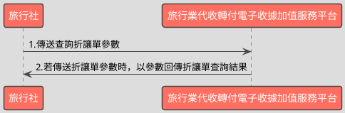

# 單筆查詢收據折讓資料API

> 本文件包含 **AES256 加密、SHA256 簽章** 規格，詳見下方對應章節

---

## API 基本資訊

| 項目 | 內容 |
|:-----|:-----|
| 副標題 | 查詢收據折讓資料 |
| 串接方式 | 幕後 |
| Content-Type | `application/x-www-form-urlencoded` |
| 加密方式 | AES256、SHA256 |
| 正式環境 URL | https://api.travelinvoice.com.tw/invoice_search |
| 測試環境 URL | https://capi.travelinvoice.com.tw/invoice_search |

---

## 欄位定義

### Post 參數（請求） [POST]

| 欄位名稱 | 中文說明 | 型別 | 長度 | 必填 | 預設值 | 允許值 | 可為空 | 範例 | 備註 |
|----------|----------|------|------|------|--------|--------|--------|------|------|
| MerchantID_ | 旅行社統一編號 | string | 8 | 必填 |  |  |  | 54352706 | 旅行社統一編號。 |
| SearchType_ | 搜尋種類 | int | 1 | 必填 |  | 2 |  | 2 | 2 |
| PostData_ | 加密資料 | array |  | 必填 |  |  |  |  | 字串欄位組合後做AES256加密，欄位說明如下表 |

### PostData_內含欄位（請求）　AES加密_字串

| 欄位名稱 | 中文說明 | 型別 | 長度 | 必填 | 預設值 | 允許值 | 可為空 | 範例 | 備註 |
|----------|----------|------|------|------|--------|--------|--------|------|------|
| Version | 串接程式版本 | string | 5 | 必填 |  | 1.1 |  | 1.1 | 固定帶 1.1 |
| TimeStamp | 時間戳記 | string | 30 | 必填 |  |  |  | 1400137200 | 自從 Unix 纪元（格林威治時間 1970 年1 月 1 日 00:00:00）到當前時間的秒數，若以 php 程式語言為例，即為呼叫time()函式所回傳的值。 例：2014-05-15 15:00:00 這個時間的時間，戳記為 1400137200，建議帶入當前時間 |
| InvoiceNumber | 收據號碼 | string | 9 | 必填 |  |  |  | T13671005 | 此次查詢的收據號碼。 |
| AllowanceNo | 作廢單號 | string | 20 | 必填 |  |  |  | 722545 | 開立折讓單時，系統回傳的系統流水號。 |

### 系統回應訊息（回應）

| 欄位名稱 | 中文說明 | 型別 | 長度 | 範例 | 必回傳 | 備註 |
|----------|----------|------|------|------|--------|------|
| Status | 回傳狀態 | string | 10 | SUCCESS | Y | 1.查詢成功，則回傳 SUCCESS 2.查詢失敗，則回傳錯誤代碼 |
| Message | 回傳訊息 | string | 30 | 查詢開立收據成功 | Y | 文字，此次回傳狀態說明 |
| AllowanceNo | 折讓流水號 | string | 20 | 722545 |  | 開立折讓時的系統流水號 |
| InvoiceNumber | 收據號碼 | string | 9 | T13671003 |  | 執行作廢之收據號碼 |
| MerchantOrderNo | 自訂編號 | string | 30 | O_6588415 |  | 此次開立折讓的收據，於開立收據時，提供之自訂編號。 |
| BuyerEmail | 買受人 Email | string | 100 | abc@gmail.com |  | 於開立收據時，該張收據的買受人電子信箱。 |
| AllowanceType | 折讓方式 | int | 1 | 1 |  | 0=開立等待折讓。待買受人確認折讓後，再向平台發動確認等待折讓。 1=立即折讓。 |
| AllowanceStatus | 折讓狀態 | int | 1 | 1 |  | 該張折讓單之狀態。 0=未確認折讓 1=已確認折讓 2=取消折讓 |
| AllowanceCreateTime | 折讓建立日期 | datetime |  | 2014-09-25 12:12:12 |  | 該張折讓開立時間，例：2014-09-25 12:12:12。 |
| AllowanceDate | 確認折讓日期 | datetime |  | 2014-09-25 12:12:12 |  | 該張折讓確立開立時間，例：2014-09-25 12:12:12。 |
| ItemDetail | 折讓商品 | text |  |  |  | 該張收據開立時的商品資訊(JSON 格式)。 ItemNum = 品項序號 ItemName = 商品名稱 ItemCount = 數量 ItemWord = 單位 ItemPrice = 單價 ItemAmount = 小計 |
| AllowanceTotalAmt | 折讓金額 | int | 8 | 655 |  | 此次開立折讓的金額 |
| RemainAmt | 折讓後剩餘收據金額 | int | 8 | 522 |  | 確認折讓後，此張收據剩餘之收據金額。 |
| SellerName | 經手人 | string | 50 | 丁小雨 |  | 開立折讓單人員名稱。 |
| CheckCode | 檢查碼 | string | 150 | 0C69DBB83FD36B6A2B2E9E614DAEA3D91D474C2D8A829870CA91511C55AF2AA |  | 用來檢查此次資料回傳的合法性，串接時可以比對此參數資料，來檢核是否為平台所回傳，檢核方法請參考”SHA256加密說明”。如開立失敗則回傳空值。  CheckCode = 將 InvoiceTransNo, MerchantID, MerchantOrderNo, RandomNum, TotalAmt 依 SHA256 簽章規格計算所得之雜湊值  InvoiceTransNo , MerchantOrderNo,RandomNum, TotalAmt不含在此API回應欄位中，需讓程式 InvoiceNumber（收據號碼）於資料庫中來取得這4個欄位資料。 |
| EndStr | 字串結尾 | string | 2 | ## | Y | 固定回傳 ##，使用 String 方式接收資料的用戶，須多判斷 EndStr=##，確保資料傳遞完整。 |

---

## 錯誤代碼

> 以下錯誤代碼均於 **HTTP 200** 回應中回傳，錯誤訊息包含於 response body。

| 代碼 | 說明 |
|------|------|
| KEY10001 | 非旅行社 API 串接 IP |
| KEY10002 | 資料解密錯誤 |
| KEY10003 | 版本錯誤 |
| KEY10004 | 資料不齊全 |
| KEY10006 | 旅行社未申請啟用電子收據 |
| KEY10007 | 頁面停留超過 30 分鐘 |
| KEY10009 | 取不到旅行社統一編號的資料 |
| KEY10010 | 旅行社統一編號空白 |
| KEY10011 | PostData_欄位空白 |
| KEY10012 | 資料傳遞錯誤 |
| KEY10013 | 資料空白 |
| KEY10014 | TimeOut。通常泛指 I/O 上的 time out |
| KEY10015 | 收據金額格式錯誤 |
| KEY10016 | 旅行社無申請郵遞列印加值服務 |
| KEY10017 | 郵遞列印加值服務可用數不足 |
| KEY10018 | 開立人欄位未填寫 |
| KEY10019 | 旅行社已被停權 |
| NOR10001 | 網路連線異常 |
| IS10001 | 收據號碼未填寫 |
| IS10002 | 收據防偽隨機碼未填寫 |
| IS10003 | DisplayFlag 有誤 |
| BS10015 | 折讓單號未填寫 |
| BS10016 | 作廢單號未填寫 |
| BS10017 | 查無折讓單資料 |
| BS10018 | 查無作廢單資料 |

---

## 串接範例

### 請求範例

> 示範用 Key：`12345678901234567890123456789012`（32 bytes）　IV：`1234567890123456`（16 bytes）

> 外層請求參數組合格式：**String**，各必填欄位以 `欄位名稱=值` 形式，以 `&` 符號串接後傳送，簡單字串拼接 key=value&key=value，不做 URL encode

```http
POST https://api.travelinvoice.com.tw/invoice_search
Content-Type: application/x-www-form-urlencoded

MerchantID_=54352706&SearchType_=2&PostData_=0ddd722db534612152877a2082309380fefc1612526018201e1b1d754ffcf5b058b95ed9bba6906eb0a1e97844810111f17fea19cd8db43c8a708834ca18bc142114d4995c372cbb487661f410e200f42e35e2266fcc5257c9cd71c06ed9eaf9
```

**PostData_（AES加密_字串）加密前明文（必填欄位）**

> 加密：AES-256-CBC，輸出：Hex，Key 與 IV 同上
> 欄位組合格式：**String**，各必填欄位以 `欄位名稱=值` 形式，以 `&` 符號串接後加密

```
Version=1.1&TimeStamp=1400137200&InvoiceNumber=T13671005&AllowanceNo=722545
```

### 成功回應範例

> 回傳內容為 URL Encoded 字串，接收後請先進行 **URL Decode** 再解析。
> 注意：PHP 的 `parse_str()` 已內建 URL Decode；其他語言（Java、Python 等）請先手動 `urldecode` 後再逐欄解析。

> 外層回應格式：**String**，各欄位以 `欄位名稱=值` 形式，以 `&` 符號串接後回傳

**系統回應**

```
Status=SUCCESS&Message=查詢開立收據成功&AllowanceNo=722545&InvoiceNumber=T13671003&MerchantOrderNo=O_6588415&BuyerEmail=abc@gmail.com&AllowanceType=1&AllowanceStatus=1&AllowanceCreateTime=2014-09-25 12:12:12&AllowanceDate=2014-09-25 12:12:12&ItemDetail=SampleValue&AllowanceTotalAmt=655&RemainAmt=522&SellerName=丁小雨&CheckCode=0C69DBB83FD36B6A2B2E9E614DAEA3D91D474C2D8A829870CA91511C55AF2AA&EndStr=##
```

> 本 API 回應無加密欄位，上方字串即為完整明文。

### 失敗回應範例

> 回傳內容為 URL Encoded 字串，接收後請先進行 **URL Decode** 再解析。
> 注意：PHP 的 `parse_str()` 已內建 URL Decode；其他語言（Java、Python 等）請先手動 `urldecode` 後再逐欄解析。

**系統回應**

```
Status=KEY10001&Message=非旅行社 API 串接 IP&EndStr=##
```

---

## 串接目的

電子收據開立折讓資料後，可透過本API來查詢收據折讓的參數、進度及狀態。

## 資料交換方式

1. 旅行社以「HTTP POST」方式傳送收據資料至電子收據平台進行開立。 
2. Content-Type 為 application/x-www-form-urlencoded。 
3. 編碼格式為 UTF-8。 
4. 電子收據平台回應格式化的字串。 
5. 各欄位計算單位為字元。中、英、數字、符號都算一個字元。 
6. 各欄位間以「&」作為連接符號，各欄位內不得含有此字元（U+0026）。

## 串接前置作業

（請先完成，否則程式必失敗）

 1. 取得 HashKey / HashIV
- 測試環境：登入測試區後台 → 基本資料 → API 串接設定 → 複製 HashKey 與 HashIV
- 正式環境：登入正式區後台 → 基本資料 → API 串接設定 → 複製 HashKey 與 HashIV

2. 申請 IP 白名單
- 申請窗口：於官網下載申請表單並填寫後，傳送後客服中心（傳真 / Email）
- 最多可設定 10 組 IP
- 需提供：伺服器對外 IP（非內網 IP，可至 https://ifconfig.me 查詢）
- 生效時間：通常 1-2 個工作天

3. 環境網址
-測試環境與正式環境是完全不同的設備，資料不共通，上線前務必要確認已經將串接網址切換至正式區網址

4. 常見「忘記做前置作業」的錯誤訊號
- `KEY10001 非旅行社 API 串接 IP` → IP 白名單未設定或設錯
- `KEY10002 資料解密錯誤` → HashKey / HashIV 不正確或仍是範例值
- `KEY10009 取不到旅行社統一編號的資料` → MerchantID 錯或未啟用

## 查詢折讓單流程



---

---

## AES256 加密規格

### 加密演算法規格

| 項目 | 規格 |
|:-----|:-----|
| 演算法 | AES |
| 金鑰長度 | 256 bits（32 bytes） |
| 加密模式 | CBC |
| 填充方式 | 類 PKCS7（32-byte 邊界，非標準） |
| 輸出格式 | Hex 十六進位 |
| 輸入編碼 | UTF-8 |
| Key 長度 | 32 bytes |
| IV 長度 | 16 bytes |

> ⚠️ **注意：本 API 採用類 PKCS7 演算法，但以 32 bytes 為填充邊界（非 AES 標準的 16 bytes），必須特別處理**
>
> 標準 PKCS7 以 AES block size（**16 bytes**）為補齊單位；本 API 採用 **32 bytes** 作為填充邊界，屬類 PKCS7 的自訂規格。
> 各語言標準加密函式庫（PHP `openssl`、Node.js `crypto`、Python `pycryptodome`）的預設 PKCS7 均使用 16-byte 邊界，**直接呼叫內建 PKCS7 將產生錯誤的填充**，導致對方解密失敗。
> **實作時必須手動計算 32-byte 邊界填充，並停用函式庫的自動填充**（PHP：`OPENSSL_ZERO_PADDING`；Node.js：`cipher.setAutoPadding(false)`；Python：`pad(..., 32)`）。

### 適用欄位群組

- **PostData_內含欄位**（AES加密_字串）（請求）　傳送欄位名稱：`PostData_`

### 加密範例

> 以下為固定示範數值，**請勿用於正式環境**。
> 本範例已採用類 PKCS7（32-byte 邊界）填充計算，與標準 PKCS7（16-byte 邊界）結果**不同**。

| 項目 | 值 |
|:-----|:---|
| Key（ASCII，32 bytes） | `12345678901234567890123456789012` |
| IV（ASCII，16 bytes） | `1234567890123456` |
| 加密前字串（plaintext） | `Version=1.1&TimeStamp=1400137200&InvoiceNumber=T13671005&AllowanceNo=722545` |
| 加密後（Hex 十六進位） | `0ddd722db534612152877a2082309380fefc1612526018201e1b1d754ffcf5b058b95ed9bba6906eb0a1e97844810111f17fea19cd8db43c8a708834ca18bc142114d4995c372cbb487661f410e200f42e35e2266fcc5257c9cd71c06ed9eaf9` |

> 驗證方法：使用上述 Key / IV 對加密後字串解密，應還原為加密前字串。

---

## SHA256 簽章規格

### 簽章規格

| 項目 | 規格 |
|:-----|:-----|
| 演算法 | SHA-256 |
| 輸出格式 | 十六進位字串（大寫） |
| Key 欄位名稱 | `HashKey` |
| IV 欄位名稱 | `HashIV` |
| 字串組合方式 | **前IV後KEY** |
| 參與簽章欄位 | `InvoiceTransNo,MerchantID,MerchantOrderNo,RandomNum,TotalAmt` |

### 字串組合說明

組合方式：**前IV後KEY**

參與簽章的欄位（依下列順序排列）：`InvoiceTransNo`、`MerchantID`、`MerchantOrderNo`、`RandomNum`、`TotalAmt`

> **欄位順序**：組合字串時，請依照本文件設定的欄位清單順序排列，**不可任意調換**。

```
HashIV={IV值}&{欄位1}={值1}&...&HashKey={Key值}
```

以 `HashIV={iv}` 開頭，接各參與欄位（依序），最後以 `HashKey={key}` 結尾，各段以 `&` 分隔。

### 簽章範例

> 以下為固定示範數值，**請勿用於正式環境**。

| 項目 | 值 |
|:-----|:---|
| HashKey | `abc1234567890def` |
| HashIV | `xyz0987654321uvw` |
| InvoiceTransNo | `SampleValue` |
| MerchantID | `SampleValue` |
| MerchantOrderNo | `O_6588415` |
| RandomNum | `SampleValue` |
| TotalAmt | `SampleValue` |
| **組合後字串** | `HashIV=xyz0987654321uvw&InvoiceTransNo=SampleValue&MerchantID=SampleValue&MerchantOrderNo=O_6588415&RandomNum=SampleValue&TotalAmt=SampleValue&HashKey=abc1234567890def` |
| **SHA256 雜湊（大寫）** | `E0EFA0C4FC75B8E1360838D91795313AFA853057C3F88E87D81FA6A6226329FD` |

> 驗證方法：將上述組合後字串進行 SHA256 計算並轉大寫，應得到上方雜湊值。

---

## 程式碼範例

### PHP

```php
<?php
/**
 * IMPORTANT: Key and IV values differ between production and test environments — confirm you have obtained the correct credentials for the target environment before use.
 * Replace all placeholder constants (e.g. YOUR_API_KEY_HERE) with real values before running this code — the code will block and display an error if placeholders are detected.
 */

// Define application configuration credentials
// 32 bytes — used for both AES-256 encryption and SHA256 signature verification
define('API_KEY', 'YOUR_API_KEY_HERE');
// 16 bytes — IV length is 16 bytes because AES block size is fixed to 16 bytes, used for both AES-256 encryption and SHA256 signature verification
define('API_IV', 'YOUR_API_IV_HERE');
define('MERCHANT_ID', 'YOUR_MERCHANT_ID_HERE');

// Define API target endpoints
define('API_URL_TEST', 'https://capi.travelinvoice.com.tw/invoice_search');
define('API_URL_PROD', 'https://api.travelinvoice.com.tw/invoice_search');

// Validate credentials before processing any logic
$credentialError = false;
if (API_KEY === 'YOUR_API_KEY_HERE' || API_IV === 'YOUR_API_IV_HERE' || MERCHANT_ID === 'YOUR_MERCHANT_ID_HERE') {
    $credentialError = true;
}

// Simulated local database to support response verification (CheckCode check)
// In a real application, you would query your actual database using the searched InvoiceNumber
$mockInvoiceDatabase = [
    'T13671005' => [
        'InvoiceTransNo'  => 'TXN987654321',
        'MerchantOrderNo' => 'O_6588415',
        'RandomNum'       => '9999',
        'TotalAmt'        => '1177'
    ],
    'T13671003' => [
        'InvoiceTransNo'  => 'TXN987654323',
        'MerchantOrderNo' => 'O_6588413',
        'RandomNum'       => '8888',
        'TotalAmt'        => '1177'
    ]
];

/**
 * Verification (Verifying response signature)
 *
 * Verifies the validity of the CheckCode returned from the API response
 * using cryptographic timing-safe comparisons against computed hashes.
 *
 * @param string $invoiceTransNo
 * @param string $merchantId
 * @param string $merchantOrderNo
 * @param string $randomNum
 * @param int $totalAmt
 * @param string $receivedCheckCode
 * @return bool
 */
function verifyResponseCheckCode($invoiceTransNo, $merchantId, $merchantOrderNo, $randomNum, $totalAmt, $receivedCheckCode) {
    // Construct the verification signature string directly without URL encoding as required
    $rawString = 'HashIV=' . API_IV .
                 '&InvoiceTransNo=' . $invoiceTransNo .
                 '&MerchantID=' . $merchantId .
                 '&MerchantOrderNo=' . $merchantOrderNo .
                 '&RandomNum=' . $randomNum .
                 '&TotalAmt=' . $totalAmt .
                 '&HashKey=' . API_KEY;

    $calculatedHash = strtoupper(hash('sha256', $rawString));
    return hash_equals($calculatedHash, $receivedCheckCode);
}

/**
 * Encrypts data using AES-256-CBC with custom PKCS7 Padding (Block Size 32)
 *
 * @param string $plaintext
 * @return string Hex encoded encrypted payload
 * @throws Exception
 */
function encryptPostData($plaintext) {
    /* NON-STANDARD AES PADDING: PKCS7 with Block Size 32
     * Standard AES uses PKCS7 padding aligned to a 16-byte block size (AES native block size).
     * This API uses a non-standard variant where PKCS7 padding is aligned to 32 bytes.
     * paddingLen = 32 - (plaintext.length % 32), result is always in range 1–32.
     * Each padding byte value equals paddingLen.
     * Apply this padding manually; use the cipher's ZERO_PADDING / no-padding flag
     * to prevent the library from applying its own PKCS7 padding. */
    $blockSize = 32;
    $plaintextLen = strlen($plaintext);
    $paddingLen = $blockSize - ($plaintextLen % $blockSize);
    $paddedPlaintext = $plaintext . str_repeat(chr($paddingLen), $paddingLen);

    $encrypted = openssl_encrypt(
        $paddedPlaintext,
        'AES-256-CBC',
        API_KEY,
        OPENSSL_RAW_DATA | OPENSSL_ZERO_PADDING,
        API_IV
    );

    if ($encrypted === false) {
        throw new Exception('AES encryption process failed.');
    }

    return bin2hex($encrypted);
}

// Variables to capture API processing state
$apiResult = null;
$errorMsg = null;
$verificationStatus = 'Not Checked';

if ($_SERVER['REQUEST_METHOD'] === 'POST' && !$credentialError) {
    try {
        $invoiceNumber = isset($_POST['InvoiceNumber']) ? trim($_POST['InvoiceNumber']) : '';
        $allowanceNo = isset($_POST['AllowanceNo']) ? trim($_POST['AllowanceNo']) : '';
        $environment = isset($_POST['Environment']) ? trim($_POST['Environment']) : 'test';

        if ($invoiceNumber === '' || $allowanceNo === '') {
            throw new Exception('Please fill in all required query parameters.');
        }

        // Prepare raw query string payload
        $timestamp = (string)time();
        $plaintextPayload = 'Version=1.1&TimeStamp=' . $timestamp . '&InvoiceNumber=' . $invoiceNumber . '&AllowanceNo=' . $allowanceNo;

        // Perform custom encryption
        $encryptedData = encryptPostData($plaintextPayload);

        // Map final request parameters
        $postParams = [
            'MerchantID_' => MERCHANT_ID,
            'SearchType_' => 2,
            'PostData_'   => $encryptedData
        ];

        // Determine URL endpoint
        $targetUrl = ($environment === 'production') ? API_URL_PROD : API_URL_TEST;

        // Send payload via cURL
        $ch = curl_init();
        curl_setopt_array($ch, [
            CURLOPT_URL            => $targetUrl,
            CURLOPT_POST           => true,
            CURLOPT_POSTFIELDS     => http_build_query($postParams),
            CURLOPT_RETURNTRANSFER => true,
            CURLOPT_TIMEOUT        => 30,
            CURLOPT_SSL_VERIFYPEER => true
        ]);

        $response = curl_exec($ch);
        
        if ($response === false) {
            $curlError = curl_error($ch);
            throw new Exception('Network Communication Failure: ' . $curlError);
        }

        $httpCode = curl_getinfo($ch, CURLINFO_HTTP_CODE);
        if ($httpCode !== 200) {
            throw new Exception('Remote host returned non-200 HTTP response code: ' . $httpCode);
        }

        // Verify that the response payload ends with standard designated EOF symbol
        $responseString = trim($response);
        $endsWithEOF = (substr($responseString, -2) === '##');

        if (!$endsWithEOF) {
            throw new Exception('Data transmission integrity check failed. Missing trailing ## marker.');
        }

        // Parse query string response payload
        parse_str($responseString, $parsedResponse);

        // Sanitize return parameters
        $status = $parsedResponse['Status'] ?? '';
        $message = $parsedResponse['Message'] ?? '';
        $returnedInvoice = $parsedResponse['InvoiceNumber'] ?? '';
        $checkCode = $parsedResponse['CheckCode'] ?? '';

        $apiResult = [
            'Status'              => $status,
            'Message'             => $message,
            'AllowanceNo'         => $parsedResponse['AllowanceNo'] ?? '',
            'InvoiceNumber'       => $returnedInvoice,
            'MerchantOrderNo'     => $parsedResponse['MerchantOrderNo'] ?? '',
            'BuyerEmail'          => $parsedResponse['BuyerEmail'] ?? '',
            'AllowanceType'       => $parsedResponse['AllowanceType'] ?? '',
            'AllowanceStatus'     => $parsedResponse['AllowanceStatus'] ?? '',
            'AllowanceCreateTime' => $parsedResponse['AllowanceCreateTime'] ?? '',
            'AllowanceDate'       => $parsedResponse['AllowanceDate'] ?? '',
            'ItemDetail'          => $parsedResponse['ItemDetail'] ?? '',
            'AllowanceTotalAmt'   => $parsedResponse['AllowanceTotalAmt'] ?? '',
            'RemainAmt'           => $parsedResponse['RemainAmt'] ?? '',
            'SellerName'          => $parsedResponse['SellerName'] ?? '',
            'CheckCode'           => $checkCode,
            'EndStr'              => $parsedResponse['EndStr'] ?? ''
        ];

        // If API query succeeds, execute cryptographic verification checks against the signature
        if ($status === 'SUCCESS' && $checkCode !== '') {
            if (isset($mockInvoiceDatabase[$returnedInvoice])) {
                $dbRecord = $mockInvoiceDatabase[$returnedInvoice];
                $isValid = verifyResponseCheckCode(
                    $dbRecord['InvoiceTransNo'],
                    MERCHANT_ID,
                    $dbRecord['MerchantOrderNo'],
                    $dbRecord['RandomNum'],
                    $dbRecord['TotalAmt'],
                    $checkCode
                );
                $verificationStatus = $isValid ? 'VERIFIED_SUCCESS' : 'VERIFICATION_FAILED';
            } else {
                $verificationStatus = 'MISSING_LOCAL_DB_RECORD_FOR_VERIFICATION';
            }
        } else {
            $verificationStatus = 'NOT_APPLICABLE_DUE_TO_ERRORS';
        }

    } catch (Exception $e) {
        $errorMsg = $e->getMessage();
    }
}
?>
<!DOCTYPE html>
<html lang="en">
<head>
    <meta charset="UTF-8">
    <meta name="viewport" content="width=device-width, initial-scale=1.0">
    <title>API Query Demo - Receipt Allowance Data</title>
    <style>
        body { font-family: -apple-system, BlinkMacSystemFont, "Segoe UI", Roboto, Helvetica, Arial, sans-serif; background-color: #f3f4f6; color: #1f2937; margin: 0; padding: 20px; }
        .container { max-width: 1000px; margin: 0 auto; background: #ffffff; padding: 30px; border-radius: 8px; box-shadow: 0 4px 6px -1px rgba(0,0,0,0.1); }
        h1 { font-size: 24px; margin-bottom: 20px; color: #111827; border-bottom: 2px solid #e5e7eb; padding-bottom: 10px; }
        .error-box { background-color: #fee2e2; border-left: 4px solid #ef4444; color: #b91c1c; padding: 15px; margin-bottom: 20px; border-radius: 4px; }
        .error-box h3 { margin: 0 0 5px 0; font-size: 16px; }
        .form-grid { display: grid; grid-template-columns: 1fr 1fr; gap: 20px; margin-bottom: 20px; }
        .form-group { display: flex; flex-direction: column; }
        .form-group label { font-size: 14px; font-weight: 600; margin-bottom: 6px; color: #4b5563; }
        .form-group input, .form-group select { padding: 10px; border: 1px solid #d1d5db; border-radius: 4px; font-size: 14px; }
        .btn-submit { background-color: #2563eb; color: #ffffff; padding: 12px 24px; border: none; border-radius: 4px; font-size: 16px; font-weight: 600; cursor: pointer; transition: background-color 0.2s; }
        .btn-submit:hover { background-color: #1d4ed8; }
        .result-section { margin-top: 30px; background: #f9fafb; border: 1px solid #e5e7eb; border-radius: 6px; padding: 20px; }
        .result-header { display: flex; justify-content: space-between; align-items: center; border-bottom: 1px solid #e5e7eb; padding-bottom: 10px; margin-bottom: 15px; }
        .status-badge { padding: 4px 12px; border-radius: 12px; font-size: 12px; font-weight: 700; }
        .badge-success { background-color: #d1fae5; color: #065f46; }
        .badge-danger { background-color: #fee2e2; color: #991b1b; }
        .badge-warn { background-color: #fef3c7; color: #92400e; }
        table { width: 100%; border-collapse: collapse; margin-top: 10px; }
        table th, table td { text-align: left; padding: 10px; border-bottom: 1px solid #e5e7eb; font-size: 14px; }
        table th { background-color: #f3f4f6; color: #374151; width: 30%; }
        .db-info { background-color: #eff6ff; border: 1px solid #bfdbfe; color: #1e3a8a; padding: 12px; border-radius: 4px; margin-bottom: 20px; font-size: 13px; }
    </style>
</head>
<body>

<div class="container">
    <h1>Receipt Allowance Data Query</h1>

    <?php if ($credentialError): ?>
        <div class="error-box">
            <h3>Configuration Error Detected</h3>
            <p>Please update placeholder constants at the top of the file (<code>API_KEY</code>, <code>API_IV</code>, and <code>MERCHANT_ID</code>) with your real credentials before executing queries.</p>
        </div>
    <?php else: ?>

        <div class="db-info">
            <strong>Mock Database Info:</strong> To test response cryptographic validation (CheckCode), use one of the pre-loaded receipt numbers below. If you query other receipt numbers, the response check will return <em>MISSING_LOCAL_DB_RECORD_FOR_VERIFICATION</em>.
            <ul>
                <li>Receipt Number: <strong>T13671005</strong> (Mocked matching record exists in local dummy DB)</li>
                <li>Receipt Number: <strong>T13671003</strong> (Mocked matching record exists in local dummy DB)</li>
            </ul>
        </div>

        <form method="POST" action="">
            <div class="form-grid">
                <div class="form-group">
                    <label for="InvoiceNumber">Receipt Number (InvoiceNumber) <span style="color:red">*</span></label>
                    <input type="text" id="InvoiceNumber" name="InvoiceNumber" required value="<?php echo htmlspecialchars($_POST['InvoiceNumber'] ?? 'T13671005'); ?>">
                </div>
                <div class="form-group">
                    <label for="AllowanceNo">Allowance Number (AllowanceNo) <span style="color:red">*</span></label>
                    <input type="text" id="AllowanceNo" name="AllowanceNo" required value="<?php echo htmlspecialchars($_POST['AllowanceNo'] ?? '722545'); ?>">
                </div>
                <div class="form-group">
                    <label for="Environment">Connection Target Environment</label>
                    <select id="Environment" name="Environment">
                        <option value="test" <?php echo (isset($_POST['Environment']) && $_POST['Environment'] === 'test') ? 'selected' : ''; ?>>Test Sandbox Environment</option>
                        <option value="production" <?php echo (isset($_POST['Environment']) && $_POST['Environment'] === 'production') ? 'selected' : ''; ?>>Production Environment</option>
                    </select>
                </div>
            </div>
            <button type="submit" class="btn-submit">Submit Query Request</button>
        </form>

        <?php if ($errorMsg !== null): ?>
            <div class="error-box" style="margin-top: 25px;">
                <h3>Execution Exception Encountered</h3>
                <p><?php echo htmlspecialchars($errorMsg); ?></p>
            </div>
        <?php endif; ?>

        <?php if ($apiResult !== null): ?>
            <div class="result-section">
                <div class="result-header">
                    <h2>API Query Response Result</h2>
                    <div>
                        <?php if (($apiResult['Status'] ?? '') === 'SUCCESS'): ?>
                            <span class="status-badge badge-success">API SUCCESS</span>
                        <?php else: ?>
                            <span class="status-badge badge-danger">API ERROR (<?php echo htmlspecialchars($apiResult['Status'] ?? 'UNKNOWN'); ?>)</span>
                        <?php endif; ?>

                        <?php if ($verificationStatus === 'VERIFIED_SUCCESS'): ?>
                            <span class="status-badge badge-success">Signature Verified</span>
                        <?php elseif ($verificationStatus === 'VERIFICATION_FAILED'): ?>
                            <span class="status-badge badge-danger">Signature Check Invalid</span>
                        <?php else: ?>
                            <span class="status-badge badge-warn">Signature Status: <?php echo htmlspecialchars($verificationStatus); ?></span>
                        <?php endif; ?>
                    </div>
                </div>

                <table>
                    <tr>
                        <th>Field Name (English)</th>
                        <th>Field Name (Chinese)</th>
                        <th>Returned Value</th>
                    </tr>
                    <tr>
                        <td>Status</td>
                        <td>回傳狀態</td>
                        <td><strong><?php echo htmlspecialchars($apiResult['Status'] ?? ''); ?></strong></td>
                    </tr>
                    <tr>
                        <td>Message</td>
                        <td>回傳訊息</td>
                        <td><?php echo htmlspecialchars($apiResult['Message'] ?? ''); ?></td>
                    </tr>
                    <tr>
                        <td>AllowanceNo</td>
                        <td>折讓流水號</td>
                        <td><?php echo htmlspecialchars($apiResult['AllowanceNo'] ?? ''); ?></td>
                    </tr>
                    <tr>
                        <td>InvoiceNumber</td>
                        <td>收據號碼</td>
                        <td><?php echo htmlspecialchars($apiResult['InvoiceNumber'] ?? ''); ?></td>
                    </tr>
                    <tr>
                        <td>MerchantOrderNo</td>
                        <td>自訂編號</td>
                        <td><?php echo htmlspecialchars($apiResult['MerchantOrderNo'] ?? ''); ?></td>
                    </tr>
                    <tr>
                        <td>BuyerEmail</td>
                        <td>買受人 Email</td>
                        <td><?php echo htmlspecialchars($apiResult['BuyerEmail'] ?? ''); ?></td>
                    </tr>
                    <tr>
                        <td>AllowanceType</td>
                        <td>折讓方式</td>
                        <td><?php echo htmlspecialchars($apiResult['AllowanceType'] ?? ''); ?></td>
                    </tr>
                    <tr>
                        <td>AllowanceStatus</td>
                        <td>折讓狀態</td>
                        <td><?php echo htmlspecialchars($apiResult['AllowanceStatus'] ?? ''); ?></td>
                    </tr>
                    <tr>
                        <td>AllowanceCreateTime</td>
                        <td>折讓建立日期</td>
                        <td><?php echo htmlspecialchars($apiResult['AllowanceCreateTime'] ?? ''); ?></td>
                    </tr>
                    <tr>
                        <td>AllowanceDate</td>
                        <td>確認折讓日期</td>
                        <td><?php echo htmlspecialchars($apiResult['AllowanceDate'] ?? ''); ?></td>
                    </tr>
                    <tr>
                        <td>ItemDetail</td>
                        <td>折讓商品 (JSON)</td>
                        <td><code><?php echo htmlspecialchars($apiResult['ItemDetail'] ?? ''); ?></code></td>
                    </tr>
                    <tr>
                        <td>AllowanceTotalAmt</td>
                        <td>折讓金額</td>
                        <td><?php echo htmlspecialchars($apiResult['AllowanceTotalAmt'] ?? ''); ?></td>
                    </tr>
                    <tr>
                        <td>RemainAmt</td>
                        <td>折讓後剩餘收據金額</td>
                        <td><?php echo htmlspecialchars($apiResult['RemainAmt'] ?? ''); ?></td>
                    </tr>
                    <tr>
                        <td>SellerName</td>
                        <td>經手人</td>
                        <td><?php echo htmlspecialchars($apiResult['SellerName'] ?? ''); ?></td>
                    </tr>
                    <tr>
                        <td>CheckCode</td>
                        <td>檢查碼</td>
                        <td><small style="word-break: break-all; font-family: monospace;"><?php echo htmlspecialchars($apiResult['CheckCode'] ?? ''); ?></small></td>
                    </tr>
                    <tr>
                        <td>EndStr</td>
                        <td>字串結尾</td>
                        <td><?php echo htmlspecialchars($apiResult['EndStr'] ?? ''); ?></td>
                    </tr>
                </table>
            </div>
        <?php endif; ?>

    <?php endif; ?>
</div>

</body>
</html>
```

