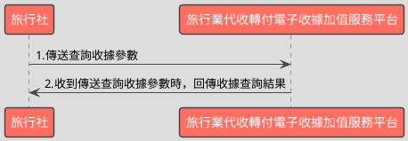

# 單筆查詢收據開立資料API

> 本文件包含 **AES256 加密、SHA256 簽章** 規格，詳見下方對應章節

---

## API 基本資訊

| 項目 | 內容 |
|:-----|:-----|
| 副標題 | 查詢收據開立資料 |
| 串接方式 | 幕後 |
| Content-Type | `application/x-www-form-urlencoded` |
| 加密方式 | AES256、SHA256 |
| 正式環境 URL | https://api.travelinvoice.com.tw/invoice_search |
| 測試環境 URL | https://capi.travelinvoice.com.tw/invoice_search |

---

## 欄位定義

### Post 參數（請求） [POST]

| 欄位名稱 | 中文說明 | 型別 | 長度 | 必填 | 預設值 | 允許值 | 可為空 | 範例 | 備註 |
|----------|----------|------|------|------|--------|--------|--------|------|------|
| MerchantID_ | 旅行社統一編號 | string | 8 | 必填 |  |  |  | 54352706 | 旅行社統一編號。 |
| PostData_ | 加密資料 | array |  | 必填 |  |  |  |  | 字串欄位組合後做AES256加密，欄位說明如下表 |

### PostData_內含欄位（請求）　AES加密_字串

| 欄位名稱 | 中文說明 | 型別 | 長度 | 必填 | 預設值 | 允許值 | 可為空 | 範例 | 備註 |
|----------|----------|------|------|------|--------|--------|--------|------|------|
| Version | 串接程式版本 | string | 5 | 必填 |  | 1.1 |  | 1.1 | 固定帶 1.1 |
| TimeStamp | 時間戳記 | string | 30 | 必填 |  |  |  | 1400137200 | 自從 Unix 纪元（格林威治時間 1970 年1 月 1 日 00:00:00）到當前時間的秒數，若以 php 程式語言為例，即為呼叫time()函式所回傳的值。 例：2014-05-15 15:00:00 這個時間的時間，戳記為 1400137200，建議帶入當前時間 |
| InvoiceNumber | 收據號碼 | string | 9 | 必填 |  |  |  | T13671005 | 此次查詢的收據號碼。 |
| RandomNum | 收據防偽隨機碼 | string | 8 | 必填 |  |  |  | 85767715 | 開立收據時回傳的 8 碼隨機碼 (查詢收據時必填)。 |

### 系統回應訊息（回應）

| 欄位名稱 | 中文說明 | 型別 | 長度 | 範例 | 必回傳 | 備註 |
|----------|----------|------|------|------|--------|------|
| Status | 回傳狀態 | string | 10 | SUCCESS | Y | 1.查詢成功，則回傳 SUCCESS 2.查詢失敗，則回傳錯誤代碼 |
| Message | 回傳訊息 | string | 30 | 查詢開立收據成功 | Y | 文字，此次回傳狀態說明 |
| MerchantID | 旅行社統一編號 | string | 8 | 70565326 |  | 旅行社統一編號 |
| InvoiceTransNo | 開立流水號 | string | 20 | 193060 |  | 收據開立時的開立序號 |
| MerchantOrderNo | 自訂編號 | string | 30 | 202005010000008 |  | 旅行社於開立收據時帶入的自訂編號 |
| InvoiceNumber | 收據號碼 | string | 9 | T13671008 |  | 此次查詢的收據號碼 |
| RandomNum | 收據防偽隨機碼 | string | 8 | 85767715 |  | 於開立收據時，所產生的 8 碼收據防偽隨機碼 |
| BuyerName | 買受人名稱 | string | 50 | 藍新科技 |  | 開立收據時的買受人名稱，個人姓名或營業人名稱 |
| BuyerUBN | 買受人統一編號 | string | 8 | 54352706 |  | 1.若為 B2B 收據，此欄位為買受人統一編號 2.若為 B2C 收據，此欄位為空值。 |
| BuyerAddress | 買受人地址 | string | 200 | 台北市南港區南港路2段97號8樓 |  | 於開立收據時，該張收據的買受人地址 |
| BuyerPhone | 買受人手機號碼 | string | 15 | 0922123456 |  | 於開立收據時，該張收據的買受人手機號碼 |
| BuyerEmail | 買受人電子信箱 | string | 100 | abc@gmail.com |  | 於開立收據時，該張收據的買受人電子信箱。 |
| Category | 收據種類 | string | 5 | B2B |  | 該張收據的收據種類。 B2B=買受人為營業人(有統編) B2C=買受人為個人 |
| TotalAmt | 收據金額 | int | 8 | 500 |  | 純數字，為收據總金額。 |
| CreateTime | 開立收據時間 | datetime |  | 2014-09-25 12:12:12 |  | 該張收據開立時間，例：2014-09-25 12:12:12 |
| ItemDetail | 商品明細 | text |  | [{"ItemNum":1,"ItemName":"\u5546\u54c1\u4e00","ItemC ount":"1","ItemWord":"\u500b","ItemPrice":"300","ItemAmount":"300"},{"ItemNum":2,"ItemName":"\u5546\u54c1\ u4e8c","ItemCount":"2","ItemWord":"\u500b","ItemPrice":"100","ItemAmount":"200"}] |  | 該張收據開立時的商品資訊(JSON 格式)。 ItemNum = 品項序號 ItemName = 商品名稱 ItemCount = 數量 ItemWord = 單位 ItemPrice = 單價 ItemAmount = 小計 |
| InvoiceStatus | 收據狀態 | int | 1 | 1 |  | 該張收據之收據狀態。 1 = 已開立 (有產生收據號碼) 2＝ 取消開立 3 = 已作廢 |
| TourName | 團名 | string | 50 | 北海道5日遊 |  | 該張收據的團名 |
| TourNo | 團號 | string | 20 | O54555 |  | 該張收據的團號 |
| TourDate | 預計出團日 | date |  | 2014-09-25 |  | 該張收據出團日,出團日當天會發出出團申報提醒通 知信至指定信箱 |
| TaxNoted | 申報註記 | int | 1 | 0 |  | 該張收據的申報註記欄位 0=未申報 1=已申報 |
| CheckCode | 檢查碼 | string | 150 | B6C1ABED0F4EC72E5B69A874A070907DF5E27E0A2F1FF2FC5BE0D1D1C6DD6B51 |  | 用來檢查此次資料回傳的合法性，串接時可以比對此參數資料，來檢核是否為平台所回傳，檢核方法請參考”SHA256加密說明”。如開立失敗則回傳空值。  CheckCode = 將 InvoiceTransNo, MerchantID, MerchantOrderNo, RandomNum, TotalAmt 依 SHA256 簽章規格計算所得之雜湊值 |
| EndStr | 字串結尾 | string | 2 | ## | Y | 固定回傳 ##，使用 String 方式接收資料的用戶，須 多判斷 EndStr=##，確保資料傳遞完整。 |

---

## 錯誤代碼

> 以下錯誤代碼均於 **HTTP 200** 回應中回傳，錯誤訊息包含於 response body。

| 代碼 | 說明 |
|------|------|
| KEY10001 | 非旅行社 API 串接 IP |
| KEY10002 | 資料解密錯誤 |
| KEY10003 | 版本錯誤 |
| KEY10004 | 資料不齊全 |
| KEY10006 | 旅行社未申請啟用電子收據 |
| KEY10007 | 頁面停留超過 30 分鐘 |
| KEY10009 | 取不到旅行社統一編號的資料 |
| KEY10010 | 旅行社統一編號空白 |
| KEY10011 | PostData_欄位空白 |
| KEY10012 | 資料傳遞錯誤 |
| KEY10013 | 資料空白 |
| KEY10014 | TimeOut。通常泛指 I/O 上的 time out |
| KEY10015 | 收據金額格式錯誤 |
| KEY10016 | 旅行社無申請郵遞列印加值服務 |
| KEY10017 | 郵遞列印加值服務可用數不足 |
| KEY10018 | 開立人欄位未填寫 |
| KEY10019 | 旅行社已被停權 |
| NOR10001 | 網路連線異常 |
| IS10001 | 收據號碼未填寫 |
| IS10002 | 收據防偽隨機碼未填寫 |
| IS10003 | DisplayFlag 有誤 |
| BS10015 | 折讓單號未填寫 |
| BS10016 | 作廢單號未填寫 |
| BS10017 | 查無折讓單資料 |
| BS10018 | 查無作廢單資料 |

---

## 串接範例

### 請求範例

> 示範用 Key：`12345678901234567890123456789012`（32 bytes）　IV：`1234567890123456`（16 bytes）

> 外層請求參數組合格式：**String**，各必填欄位以 `欄位名稱=值` 形式，以 `&` 符號串接後傳送，簡單字串拼接 key=value&key=value，不做 URL encode

```http
POST https://api.travelinvoice.com.tw/invoice_search
Content-Type: application/x-www-form-urlencoded

MerchantID_=54352706&PostData_=0ddd722db534612152877a2082309380fefc1612526018201e1b1d754ffcf5b058b95ed9bba6906eb0a1e978448101110ac27c9d8a35c30bb9d8f1de2bb00c54f9c88b4be877a2dc83a49b2fcb71ca81d03315f82f44b3f93afad184e4fda291
```

**PostData_（AES加密_字串）加密前明文（必填欄位）**

> 加密：AES-256-CBC，輸出：Hex，Key 與 IV 同上
> 欄位組合格式：**String**，各必填欄位以 `欄位名稱=值` 形式，以 `&` 符號串接後加密

```
Version=1.1&TimeStamp=1400137200&InvoiceNumber=T13671005&RandomNum=85767715
```

### 成功回應範例

> 回傳內容為 URL Encoded 字串，接收後請先進行 **URL Decode** 再解析。
> 注意：PHP 的 `parse_str()` 已內建 URL Decode；其他語言（Java、Python 等）請先手動 `urldecode` 後再逐欄解析。

> 外層回應格式：**String**，各欄位以 `欄位名稱=值` 形式，以 `&` 符號串接後回傳

**系統回應**

```
Status=SUCCESS&Message=查詢開立收據成功&MerchantID=70565326&InvoiceTransNo=193060&MerchantOrderNo=202005010000008&InvoiceNumber=T13671008&RandomNum=85767715&BuyerName=藍新科技&BuyerUBN=54352706&BuyerAddress=台北市南港區南港路2段97號8樓&BuyerPhone=0922123456&BuyerEmail=abc@gmail.com&Category=B2B&TotalAmt=500&CreateTime=2014-09-25 12:12:12&ItemDetail=[{"ItemNum":1,"ItemName":"\u5546\u54c1\u4e00","ItemC
ount":"1","ItemWord":"\u500b","ItemPrice":"300","ItemAmount":"300"},{"ItemNum":2,"ItemName":"\u5546\u54c1\
u4e8c","ItemCount":"2","ItemWord":"\u500b","ItemPrice":"100","ItemAmount":"200"}]&InvoiceStatus=1&TourName=北海道5日遊&TourNo=O54555&TourDate=2014-09-25&TaxNoted=0&CheckCode=B6C1ABED0F4EC72E5B69A874A070907DF5E27E0A2F1FF2FC5BE0D1D1C6DD6B51&EndStr=##
```

> 本 API 回應無加密欄位，上方字串即為完整明文。

### 失敗回應範例

> 回傳內容為 URL Encoded 字串，接收後請先進行 **URL Decode** 再解析。
> 注意：PHP 的 `parse_str()` 已內建 URL Decode；其他語言（Java、Python 等）請先手動 `urldecode` 後再逐欄解析。

**系統回應**

```
Status=KEY10001&Message=非旅行社 API 串接 IP&EndStr=##
```

---

## 串接目的

電子收據開立後，可透過查詢收據開立參數，查詢單筆收據資料

## 資料交換方式

1. 旅行社以「HTTP POST」方式傳送收據資料至電子收據平台進行開立。 
2. Content-Type 為 application/x-www-form-urlencoded。 
3. 編碼格式為 UTF-8。 
4. 電子收據平台回應格式化的字串。 
5. 各欄位計算單位為字元。中、英、數字、符號都算一個字元。 
6. 各欄位間以「&」作為連接符號，各欄位內不得含有此字元（U+0026）。

## 串接前置作業

（請先完成，否則程式必失敗）

 1. 取得 HashKey / HashIV
- 測試環境：登入測試區後台 → 基本資料 → API 串接設定 → 複製 HashKey 與 HashIV
- 正式環境：登入正式區後台 → 基本資料 → API 串接設定 → 複製 HashKey 與 HashIV

2. 申請 IP 白名單
- 申請窗口：於官網下載申請表單並填寫後，傳送後客服中心（傳真 / Email）
- 最多可設定 10 組 IP
- 需提供：伺服器對外 IP（非內網 IP，可至 https://ifconfig.me 查詢）
- 生效時間：通常 1-2 個工作天

3. 環境網址
-測試環境與正式環境是完全不同的設備，資料不共通，上線前務必要確認已經將串接網址切換至正式區網址

4. 常見「忘記做前置作業」的錯誤訊號
- `KEY10001 非旅行社 API 串接 IP` → IP 白名單未設定或設錯
- `KEY10002 資料解密錯誤` → HashKey / HashIV 不正確或仍是範例值
- `KEY10009 取不到旅行社統一編號的資料` → MerchantID 錯或未啟用

## 查詢收據流程



---

---

## AES256 加密規格

### 加密演算法規格

| 項目 | 規格 |
|:-----|:-----|
| 演算法 | AES |
| 金鑰長度 | 256 bits（32 bytes） |
| 加密模式 | CBC |
| 填充方式 | 類 PKCS7（32-byte 邊界，非標準） |
| 輸出格式 | Hex 十六進位 |
| 輸入編碼 | UTF-8 |
| Key 長度 | 32 bytes |
| IV 長度 | 16 bytes |

> ⚠️ **注意：本 API 採用類 PKCS7 演算法，但以 32 bytes 為填充邊界（非 AES 標準的 16 bytes），必須特別處理**
>
> 標準 PKCS7 以 AES block size（**16 bytes**）為補齊單位；本 API 採用 **32 bytes** 作為填充邊界，屬類 PKCS7 的自訂規格。
> 各語言標準加密函式庫（PHP `openssl`、Node.js `crypto`、Python `pycryptodome`）的預設 PKCS7 均使用 16-byte 邊界，**直接呼叫內建 PKCS7 將產生錯誤的填充**，導致對方解密失敗。
> **實作時必須手動計算 32-byte 邊界填充，並停用函式庫的自動填充**（PHP：`OPENSSL_ZERO_PADDING`；Node.js：`cipher.setAutoPadding(false)`；Python：`pad(..., 32)`）。

### 適用欄位群組

- **PostData_內含欄位**（AES加密_字串）（請求）　傳送欄位名稱：`PostData_`

### 加密範例

> 以下為固定示範數值，**請勿用於正式環境**。
> 本範例已採用類 PKCS7（32-byte 邊界）填充計算，與標準 PKCS7（16-byte 邊界）結果**不同**。

| 項目 | 值 |
|:-----|:---|
| Key（ASCII，32 bytes） | `12345678901234567890123456789012` |
| IV（ASCII，16 bytes） | `1234567890123456` |
| 加密前字串（plaintext） | `Version=1.1&TimeStamp=1400137200&InvoiceNumber=T13671005&RandomNum=85767715` |
| 加密後（Hex 十六進位） | `0ddd722db534612152877a2082309380fefc1612526018201e1b1d754ffcf5b058b95ed9bba6906eb0a1e978448101110ac27c9d8a35c30bb9d8f1de2bb00c54f9c88b4be877a2dc83a49b2fcb71ca81d03315f82f44b3f93afad184e4fda291` |

> 驗證方法：使用上述 Key / IV 對加密後字串解密，應還原為加密前字串。

---

## SHA256 簽章規格

### 簽章規格

| 項目 | 規格 |
|:-----|:-----|
| 演算法 | SHA-256 |
| 輸出格式 | 十六進位字串（大寫） |
| Key 欄位名稱 | `HashKey` |
| IV 欄位名稱 | `HashIV` |
| 字串組合方式 | **前IV後KEY** |
| 參與簽章欄位 | `InvoiceTransNo,MerchantID,MerchantOrderNo,RandomNum,TotalAmt` |

### 字串組合說明

組合方式：**前IV後KEY**

參與簽章的欄位（依下列順序排列）：`InvoiceTransNo`、`MerchantID`、`MerchantOrderNo`、`RandomNum`、`TotalAmt`

> **欄位順序**：組合字串時，請依照本文件設定的欄位清單順序排列，**不可任意調換**。

```
HashIV={IV值}&{欄位1}={值1}&...&HashKey={Key值}
```

以 `HashIV={iv}` 開頭，接各參與欄位（依序），最後以 `HashKey={key}` 結尾，各段以 `&` 分隔。

### 簽章範例

> 以下為固定示範數值，**請勿用於正式環境**。

| 項目 | 值 |
|:-----|:---|
| HashKey | `abc1234567890def` |
| HashIV | `xyz0987654321uvw` |
| InvoiceTransNo | `193060` |
| MerchantID | `70565326` |
| MerchantOrderNo | `202005010000008` |
| RandomNum | `85767715` |
| TotalAmt | `500` |
| **組合後字串** | `HashIV=xyz0987654321uvw&InvoiceTransNo=193060&MerchantID=70565326&MerchantOrderNo=202005010000008&RandomNum=85767715&TotalAmt=500&HashKey=abc1234567890def` |
| **SHA256 雜湊（大寫）** | `E0B6341047DEB46AF1010BB705E895CE3BC54A2B9AAB54819E747B4B6E384E75` |

> 驗證方法：將上述組合後字串進行 SHA256 計算並轉大寫，應得到上方雜湊值。

---

## 程式碼範例

### PHP

```php
<?php
/*
 * IMPORTANT: Key and IV values differ between production and test environments — confirm you have obtained the correct credentials for the target environment before use;
 * Replace all placeholder constants (e.g. YOUR_HASH_KEY_HERE) with real values before running this code — the code will block and display an error if placeholders are detected
 */

// Define credential constants with meaningful semantic names
define('MERCHANT_ID', 'YOUR_MERCHANT_ID_HERE');
// 32 bytes — used for both AES-256 encryption and SHA256 signature
define('API_KEY', 'YOUR_API_KEY_HERE');
// 16 bytes — IV size is 16 bytes because the AES block size is fixed at 16 bytes
define('API_IV', 'YOUR_API_IV_HERE');

// Define API target URL (Testing endpoint used by default)
define('API_URL', 'https://capi.travelinvoice.com.tw/invoice_search');

// Detect if placeholder values are still active
$hasPlaceholder = (
    MERCHANT_ID === 'YOUR_MERCHANT_ID_HERE' ||
    API_KEY === 'YOUR_API_KEY_HERE' ||
    API_IV === 'YOUR_API_IV_HERE'
);

$apiResult = null;
$apiError = null;

/* NON-STANDARD AES PADDING: PKCS7 with Block Size 32
 * Standard AES uses PKCS7 padding aligned to a 16-byte block size (AES native block size).
 * This API uses a non-standard variant where PKCS7 padding is aligned to 32 bytes.
 * paddingLen = 32 - (plaintext.length % 32), result is always in range 1–32.
 * Each padding byte value equals paddingLen.
 * Apply this padding manually; use the cipher's ZERO_PADDING / no-padding flag
 * to prevent the library from applying its own PKCS7 padding. */
function encryptAes256CbcPkcs7B32($plaintext, $key, $iv) {
    $blockSize = 32;
    $plaintextLen = strlen($plaintext);
    $paddingLen = $blockSize - ($plaintextLen % $blockSize);
    $paddedPlaintext = $plaintext . str_repeat(chr($paddingLen), $paddingLen);

    $encrypted = openssl_encrypt(
        $paddedPlaintext,
        'AES-256-CBC',
        $key,
        OPENSSL_RAW_DATA | OPENSSL_ZERO_PADDING,
        $iv
    );

    if ($encrypted === false) {
        throw new Exception('AES encryption process encountered an internal failure via openssl_encrypt.');
    }

    return bin2hex($encrypted);
}

/**
 * Verification (驗證回應簽章)
 *
 * Verifies the authenticity of the API response by calculating the SHA256 signature
 * using specific fields returned from the API, then comparing it against the received CheckCode.
 *
 * @param array $responseFields Parse response key-value pairs
 * @param string $key HashKey (32 bytes)
 * @param string $iv HashIV (16 bytes, fixed block size of AES)
 * @return bool True if valid, false otherwise
 */
function verifyResponseSignature(array $responseFields, $key, $iv) {
    $invoiceTransNo = $responseFields['InvoiceTransNo'] ?? '';
    $merchantId = $responseFields['MerchantID'] ?? '';
    $merchantOrderNo = $responseFields['MerchantOrderNo'] ?? '';
    $randomNum = $responseFields['RandomNum'] ?? '';
    $totalAmt = $responseFields['TotalAmt'] ?? '';

    // Values are concatenated directly without URL encoding to build the raw signature string
    $rawString = 'HashIV=' . $iv .
                 '&InvoiceTransNo=' . $invoiceTransNo .
                 '&MerchantID=' . $merchantId .
                 '&MerchantOrderNo=' . $merchantOrderNo .
                 '&RandomNum=' . $randomNum .
                 '&TotalAmt=' . $totalAmt .
                 '&HashKey=' . $key;

    $calculatedHash = strtoupper(hash('sha256', $rawString));
    $receivedCheckCode = $responseFields['CheckCode'] ?? '';

    return hash_equals($calculatedHash, $receivedCheckCode);
}

// Process API submission when configuration is correct and query is sent
if (!$hasPlaceholder && $_SERVER['REQUEST_METHOD'] === 'POST') {
    try {
        $invoiceNumber = isset($_POST['InvoiceNumber']) ? trim($_POST['InvoiceNumber']) : '';
        $randomNum = isset($_POST['RandomNum']) ? trim($_POST['RandomNum']) : '';

        if ($invoiceNumber === '' || $randomNum === '') {
            throw new Exception('Both Receipt Number (InvoiceNumber) and Verification Random Code (RandomNum) are mandatory.');
        }

        // Prepare raw query string parameters for encryption
        $postDataParams = [
            'Version' => '1.1',
            'TimeStamp' => (string)time(),
            'InvoiceNumber' => $invoiceNumber,
            'RandomNum' => $randomNum
        ];

        // Format into a query string without encoding characters to preserve integrity
        $queryStringParts = [];
        foreach ($postDataParams as $k => $v) {
            $queryStringParts[] = $k . '=' . $v;
        }
        $plaintextString = implode('&', $queryStringParts);

        // Encrypt the formatted plain parameters with AES256 CBC Block Size 32 padding
        $encryptedPostData = encryptAes256CbcPkcs7B32($plaintextString, API_KEY, API_IV);

        // Dispatch API request via cURL
        $ch = curl_init();
        curl_setopt($ch, CURLOPT_URL, API_URL);
        curl_setopt($ch, CURLOPT_POST, true);
        curl_setopt($ch, CURLOPT_POSTFIELDS, http_build_query([
            'MerchantID_' => MERCHANT_ID,
            'PostData_' => $encryptedPostData
        ]));
        curl_setopt($ch, CURLOPT_RETURNTRANSFER, true);
        curl_setopt($ch, CURLOPT_TIMEOUT, 30);
        curl_setopt($ch, CURLOPT_SSL_VERIFYPEER, true);

        $responseString = curl_exec($ch);

        if ($responseString === false) {
            $curlErrorMsg = curl_error($ch);
            throw new Exception('Network communication failure: ' . $curlErrorMsg);
        }

        // curl_close() has no effect in PHP 8.0+ and is intentionally omitted

        // Parse standard query string response format
        parse_str($responseString, $parsedResponse);

        if (empty($parsedResponse)) {
            throw new Exception('Response parsing error: Empty or invalid response payload format.');
        }

        // Safely extract signature properties with fallback values
        $responseStatus = $parsedResponse['Status'] ?? '';
        $endStr = $parsedResponse['EndStr'] ?? '';

        // Validate complete transmission termination signal
        if ($endStr !== '##') {
            throw new Exception('Transmission incomplete error: Missing expected EndStr closure token.');
        }

        if ($responseStatus === 'SUCCESS') {
            // Validate authenticity using cryptographic verification
            if (!verifyResponseSignature($parsedResponse, API_KEY, API_IV)) {
                throw new Exception('Security violation: SHA256 integrity signature check mismatch.');
            }
        }

        $apiResult = $parsedResponse;

    } catch (Exception $e) {
        $apiError = $e->getMessage();
    }
}
?>
<!DOCTYPE html>
<html lang="zh-Hant">
<head>
    <meta charset="UTF-8">
    <meta name="viewport" content="width=device-width, initial-scale=1.0">
    <title>Travel Invoice API Integration Demo</title>
    <style>
        body {
            font-family: -apple-system, BlinkMacSystemFont, "Segoe UI", Roboto, "Helvetica Neue", Arial, sans-serif;
            line-height: 1.6;
            color: #333;
            max-width: 900px;
            margin: 0 auto;
            padding: 20px;
            background-color: #f8f9fa;
        }
        .container {
            background: #fff;
            padding: 30px;
            border-radius: 8px;
            box-shadow: 0 4px 6px rgba(0,0,0,0.1);
        }
        h1, h2 {
            border-bottom: 2px solid #eaeaea;
            padding-bottom: 10px;
            color: #2c3e50;
        }
        .alert {
            padding: 15px;
            border-radius: 4px;
            margin-bottom: 20px;
            font-weight: bold;
        }
        .alert-danger {
            background-color: #fde8e8;
            color: #9b1c1c;
            border: 1px solid #f8b4b4;
        }
        .alert-success {
            background-color: #def7ec;
            color: #03543f;
            border: 1px solid #84e1bc;
        }
        .form-group {
            margin-bottom: 15px;
        }
        label {
            display: block;
            font-weight: bold;
            margin-bottom: 5px;
        }
        input[type="text"] {
            width: 100%;
            padding: 10px;
            border: 1px solid #ccc;
            border-radius: 4px;
            box-sizing: border-box;
            font-size: 16px;
        }
        button {
            background-color: #007bff;
            color: #fff;
            border: none;
            padding: 12px 20px;
            border-radius: 4px;
            cursor: pointer;
            font-size: 16px;
            width: 100%;
        }
        button:hover {
            background-color: #0056b3;
        }
        table {
            width: 100%;
            border-collapse: collapse;
            margin-top: 15px;
        }
        th, td {
            border: 1px solid #ddd;
            padding: 10px;
            text-align: left;
        }
        th {
            background-color: #f2f2f2;
            width: 30%;
        }
        pre {
            background-color: #272822;
            color: #f8f8f2;
            padding: 15px;
            border-radius: 4px;
            overflow-x: auto;
            font-family: Consolas, Monaco, monospace;
        }
    </style>
</head>
<body>
<div class="container">
    <h1>Single Receipt Query API Demonstration</h1>

    <?php if ($hasPlaceholder): ?>
        <div class="alert alert-danger">
            <strong>Configuration Warning:</strong> Real authorization credential placeholders detected! <br>
            Please replace MERCHANT_ID, API_KEY, and API_IV with valid environment parameters to execute query operations.
        </div>
    <?php endif; ?>

    <form method="POST" action="">
        <div class="form-group">
            <label for="InvoiceNumber">Receipt Number (InvoiceNumber) <span style="color: red;">*Required</span></label>
            <input type="text" id="InvoiceNumber" name="InvoiceNumber" placeholder="e.g., T13671005" value="<?php echo htmlspecialchars($_POST['InvoiceNumber'] ?? 'T13671005'); ?>" required <?php echo $hasPlaceholder ? 'disabled' : ''; ?>>
        </div>
        <div class="form-group">
            <label for="RandomNum">Receipt Random Code (RandomNum) <span style="color: red;">*Required</span></label>
            <input type="text" id="RandomNum" name="RandomNum" placeholder="e.g., 85767715" value="<?php echo htmlspecialchars($_POST['RandomNum'] ?? '85767715'); ?>" required <?php echo $hasPlaceholder ? 'disabled' : ''; ?>>
        </div>
        <button type="submit" <?php echo $hasPlaceholder ? 'disabled' : ''; ?>>Submit Receipt Verification Request</button>
    </form>

    <?php if ($apiError !== null): ?>
        <div class="alert alert-danger" style="margin-top: 20px;">
            <strong>Execution Error:</strong> <?php echo htmlspecialchars($apiError); ?>
        </div>
    <?php endif; ?>

    <?php if ($apiResult !== null): ?>
        <h2 style="margin-top: 30px;">API Processing Result</h2>
        <?php if (($apiResult['Status'] ?? '') === 'SUCCESS'): ?>
            <div class="alert alert-success">
                Successfully processed query result from the travel invoice platform.
            </div>
            <table>
                <tr>
                    <th>Status Code (Status)</th>
                    <td><?php echo htmlspecialchars($apiResult['Status'] ?? ''); ?></td>
                </tr>
                <tr>
                    <th>Execution Message (Message)</th>
                    <td><?php echo htmlspecialchars($apiResult['Message'] ?? ''); ?></td>
                </tr>
                <tr>
                    <th>Transaction Sequence No (InvoiceTransNo)</th>
                    <td><?php echo htmlspecialchars($apiResult['InvoiceTransNo'] ?? ''); ?></td>
                </tr>
                <tr>
                    <th>Agency Order No (MerchantOrderNo)</th>
                    <td><?php echo htmlspecialchars($apiResult['MerchantOrderNo'] ?? ''); ?></td>
                </tr>
                <tr>
                    <th>Receipt Number (InvoiceNumber)</th>
                    <td><?php echo htmlspecialchars($apiResult['InvoiceNumber'] ?? ''); ?></td>
                </tr>
                <tr>
                    <th>Random Number (RandomNum)</th>
                    <td><?php echo htmlspecialchars($apiResult['RandomNum'] ?? ''); ?></td>
                </tr>
                <tr>
                    <th>Total Base Amount (TotalAmt)</th>
                    <td>$<?php echo htmlspecialchars($apiResult['TotalAmt'] ?? '0'); ?></td>
                </tr>
                <tr>
                    <th>Buyer Identity Name (BuyerName)</th>
                    <td><?php echo htmlspecialchars($apiResult['BuyerName'] ?? ''); ?></td>
                </tr>
                <tr>
                    <th>Buyer VAT Number (BuyerUBN)</th>
                    <td><?php echo htmlspecialchars($apiResult['BuyerUBN'] ?? 'N/A'); ?></td>
                </tr>
                <tr>
                    <th>Buyer Address Info (BuyerAddress)</th>
                    <td><?php echo htmlspecialchars($apiResult['BuyerAddress'] ?? ''); ?></td>
                </tr>
                <tr>
                    <th>Issued Timestamp (CreateTime)</th>
                    <td><?php echo htmlspecialchars($apiResult['CreateTime'] ?? ''); ?></td>
                </tr>
                <tr>
                    <th>Check Validation Code (CheckCode)</th>
                    <td><small><?php echo htmlspecialchars($apiResult['CheckCode'] ?? ''); ?></small></td>
                </tr>
            </table>

            <h3>Line Item Details (ItemDetail JSON Structure)</h3>
            <pre><?php
                $itemJson = $apiResult['ItemDetail'] ?? '[]';
                $decodedJson = json_decode($itemJson, true);
                if (json_last_error() === JSON_ERROR_NONE) {
                    echo htmlspecialchars(json_encode($decodedJson, JSON_PRETTY_PRINT | JSON_UNESCAPED_UNICODE));
                } else {
                    echo htmlspecialchars($itemJson);
                }
            ?></pre>
        <?php else: ?>
            <div class="alert alert-danger">
                Query Operation Rejected by Platform (Status Code: <?php echo htmlspecialchars($apiResult['Status'] ?? 'UNKNOWN'); ?>)
            </div>
            <table>
                <tr>
                    <th>Error Code</th>
                    <td><?php echo htmlspecialchars($apiResult['Status'] ?? ''); ?></td>
                </tr>
                <tr>
                    <th>Description Statement</th>
                    <td><?php echo htmlspecialchars($apiResult['Message'] ?? ''); ?></td>
                </tr>
            </table>
        <?php endif; ?>
    <?php endif; ?>
</div>
</body>
</html>
```

