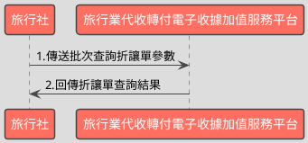

# 批次查詢收據折讓資料API

> 本文件包含 **AES256 加密、SHA256 簽章** 規格，詳見下方對應章節

---

## API 基本資訊

| 項目 | 內容 |
|:-----|:-----|
| 副標題 | 批次查詢折讓資料 |
| 串接方式 | 幕後 |
| Content-Type | `application/x-www-form-urlencoded` |
| 加密方式 | AES256、SHA256 |
| 正式環境 URL | https://api.travelinvoice.com.tw/invoice_searchall |
| 測試環境 URL | https://capi.travelinvoice.com.tw/invoice_searchall |

---

## 欄位定義

### Post 參數（請求） [POST]

| 欄位名稱 | 中文說明 | 型別 | 長度 | 必填 | 預設值 | 允許值 | 可為空 | 範例 | 備註 |
|----------|----------|------|------|------|--------|--------|--------|------|------|
| MerchantID_ | 旅行社統一編號 | string | 8 | 必填 |  |  |  | 54352706 | 旅行社統一編號。 |
| SearchType_ | 搜尋種類 | int | 1 | 選填 |  | 2 |  | 2 | 固定帶 2 |
| PostData_ | 加密資料 | array |  | 必填 |  |  |  |  | 字串欄位組合後做AES256加密，欄位說明如下表 |

### PostData_內含欄位（請求）　AES加密_字串

| 欄位名稱 | 中文說明 | 型別 | 長度 | 必填 | 預設值 | 允許值 | 可為空 | 範例 | 備註 |
|----------|----------|------|------|------|--------|--------|--------|------|------|
| Version | 串接程式版本 | string | 5 | 必填 |  | 2.0 |  | 2.0 | 固定帶 2.0 |
| TimeStamp | 時間戳記 | string | 30 | 必填 |  |  |  | 1400137200 | 自從 Unix 纪元（格林威治時間 1970 年1 月 1 日 00:00:00）到當前時間的秒數，若以 php 程式語言為例，即為呼叫time()函式所回傳的值。 例：2014-05-15 15:00:00 這個時間的時間，戳記為 1400137200，建議帶入當前時間 |
| AllowFrom | 折讓單來源 | int | 1 | 選填 |  | 0,1 |  | 0 | 0＝API 建立 1＝官網操作建立 |
| AllowStatus | 折讓單狀態 | int | 1 | 選填 |  | 0,1,2 |  | 0 | 0＝未確認折讓單 1＝已確認折讓單 2=取消之未確認折讓單 |
| SellerName | 經辦人名稱 | string | 50 | 選填 |  |  |  | 丁小雨 | 可過濾特定經辦人開立之折讓單。 為精確比對，需輸入完整無誤之經辦人 名稱，方可進行比對。 |
| InvoiceNumber | 收據號碼 | string | 9 | 選填 |  |  |  | T13671005 | 要查詢的收據號碼 |
| StartDate | 查詢起始日期 | datetime |  | 必填 |  |  |  | 2016-09-25 00:00:01 | 1. 查詢區間起始（折讓單建立時間） 例：2016-09-25 2. 若已帶入收據號碼參數，查詢起始日 期與查詢結束日期建議留空，查詢時將 不考慮查詢區間。 3. 若已帶入收據號碼參數，同時也填入 查詢起始日期與查詢結束日期，將僅查 詢所設定時間區間內的資料。. 4. 若有填入查詢起始日期，則查詢結束 日期為必填。 |
| EndDate | 查詢結束日期 | datetime |  | 必填 |  |  |  | 2016-09-25 23:59:59 | 1.查詢區間結束（收據開立時間） 例：2016-02-25 2.查詢日期區間最長為 90 天，系統會抓 取當前日曆天進行天數計算 例 : 若查詢起始日期為 09-01，最長可接 受之查詢結束日期為 11-29-23:59:59 3. 若已帶入收據號碼參數，查詢起始日 期與查詢結束日期建議留空，查詢時將 不考慮查詢區間。 4. 若已帶入收據號碼參數，同時也填入 查詢起始日期與查詢結束日期，將僅查詢 所設定時間區間內的資料。 5. 若有輸入查詢結束日期，則查詢起始 日期為必填。 |

### 系統回應訊息（回應）

| 欄位名稱 | 中文說明 | 型別 | 長度 | 範例 | 必回傳 | 備註 |
|----------|----------|------|------|------|--------|------|
| Status | 回傳狀態 | int | 10 | SUCCESS | Y | 1.查詢成功，則回傳 SUCCESS 2.查詢失敗，則回傳錯誤代碼 |
| Message | 回傳訊息 | string | 30 | 查詢折讓資料成功 | Y | 文字，此次回傳狀態說明 |
| MerchantID | 旅行社統一編號 | string | 8 | 54352706 | Y | 旅行社統一編號。 |
| ReturnInvoice | 回傳的收據資料 | array |  |  | Y | 內容為 JSON 格式字串。查詢失敗此欄位回傳空值 |
| CheckCodeSearch | 檢查碼 | string | 150 | A791D7C1D64093962939B54CC1C07E8109EB8C454E0DC18F822BBA076EB38E66 | Y | 用來檢查此次資料回傳的合法性，串接時可以比對此參數資料，來檢核是否為平台所回傳，檢核方法請參考”SHA256加密說明”。如開立失敗則回傳空值。  CheckCodeSearch = 將MerchantID,StartDate,EndDate,TimeStamp 依 SHA256 簽章規格計算所得之雜湊值  用來檢查此次資料回傳的合法性，串接時可以比對此參數資料，來檢核是否為平台所回傳，檢核方法請參考”SHA256加密說明”。如開立失敗則回傳空值。  CheckCodeSearch = 將MerchantID,StartDate,EndDate,TimeStamp依 SHA256 簽章規格計算所得之雜湊值  TimeStamp 為本次查詢送出之時間戳記。 |

### ReturnInvoice內含欄位（回應）

| 欄位名稱 | 中文說明 | 型別 | 長度 | 範例 | 必回傳 | 備註 |
|----------|----------|------|------|------|--------|------|
| AllowanceNo | 折讓流水號 | string | 20 | 1229 |  | 折讓單開立時產生的系統流水號。 |
| InvoiceNumber | 收據號碼 | string | 9 | T13671005 |  | 折讓單所屬收據號碼。 |
| BuyerEmail | 買受人電子信箱 | string | 100 | abc@gmail.com |  | 於開立折讓單時，該張折讓單的買受人電子信箱。 |
| TotalAmt | 折讓金額 | int | 8 | 500 |  | 純數字，為折讓單金額。 |
| CreateTime | 折讓單建立日期 | datetime |  | 2014-09-25 12:12:12 |  | 該張折讓單建立時間，例：2014-09-25 12:12:12。 |
| AllowStatus | 折讓狀態 | int | 1 | 1 |  | 該張折讓單之狀態。 0=未確認折讓 1=已確認折讓 2=取消折讓 |
| ItemDetail | 商品明細 | text |  | [{\"ItemNum\": 1,\"ItemName\":\"商品一\",\"ItemCount\":\"1\",\"ItemWord\":\"個\",\"ItemPrice\":\"30\",\"ItemAmount\":\"30\"},{\"ItemNum\ ":2,\"ItemName\":\"商品二\",\"ItemCount\":\"2\",\"ItemWord\":\"個\",\"ItemPrice\":\"10\",\"ItemAmount\":\"20\"}]"}] |  | 該張折讓單開立時的商品資訊(JSON 格式)。 ItemNum = 品項序號 ItemName = 商品名稱 ItemCount = 數量 ItemWord = 單位 ItemPrice = 單價 ItemAmount = 小計 |

---

## 錯誤代碼

> 以下錯誤代碼均於 **HTTP 200** 回應中回傳，錯誤訊息包含於 response body。

| 代碼 | 說明 |
|------|------|
| KEY10001 | 非旅行社 API 串接 IP |
| KEY10002 | 資料解密錯誤 |
| KEY10003 | 版本錯誤 |
| KEY10004 | 資料不齊全 |
| KEY10006 | 旅行社未申請啟用電子收據 |
| KEY10007 | 頁面停留超過 30 分鐘 |
| KEY10009 | 取不到旅行社統一編號的資料 |
| KEY10010 | 旅行社統一編號空白 |
| KEY10011 | PostData_欄位空白 |
| KEY10012 | 資料傳遞錯誤 |
| KEY10013 | 資料空白 |
| KEY10014 | TimeOut。通常泛指 I/O 上的 time out |
| KEY10015 | 收據金額格式錯誤 |
| KEY10016 | 旅行社無申請郵遞列印加值服務 |
| KEY10017 | 郵遞列印加值服務可用數不足 |
| KEY10018 | 開立人欄位未填寫 |
| KEY10019 | 旅行社已被停權 |
| KEY10020 | SearchType_欄位空白 |
| KEY10021 | ReturnType_欄位空白 |
| INV20014 | 統一編號格式有誤 |
| INV70001 | 欄位資料格式錯誤 |
| WEB1002 | 日期格式有誤 |
| NOR10001 | 網路連線異常 |
| BS10001 | 查詢區間錯誤 |
| BS10002 | 收據來源錯誤（請確認所帶入的收據來源參數） |
| BS10003 | 收據狀態錯誤（請確認所帶入的收據來源參數） |
| BS10004 | 收據種類錯誤（請確認所帶入的收據來源參數） |
| BS10005 | 取得查詢收據資料失敗（請多嘗試幾次，若一直出現此錯誤請聯繫客服） |
| BS10006 | 查無收據資料 |
| BS10007 | 折讓狀態錯誤（請確認所帶入的收據來源參數） |
| BS10008 | 搜尋種類錯誤 |
| BS10009 | 折讓單來源錯誤 |
| BS10010 | 折讓單狀態錯誤 |
| BS10011 | 作廢單來源錯誤 |
| BS10012 | 作廢單狀態錯誤 |
| BS10013 | 日期區間有誤（最多查詢 90 日資料） |
| BS10014 | 日期區間有誤（起始日期不得大於結束日期） |

---

## 串接範例

### 請求範例

> 示範用 Key：`12345678901234567890123456789012`（32 bytes）　IV：`1234567890123456`（16 bytes）

> 外層請求參數組合格式：**String**，各必填欄位以 `欄位名稱=值` 形式，以 `&` 符號串接後傳送，簡單字串拼接 key=value&key=value，不做 URL encode

```http
POST https://api.travelinvoice.com.tw/invoice_searchall
Content-Type: application/x-www-form-urlencoded

MerchantID_=54352706&PostData_=78942f0afca77d7e464726ee053b1018da04ae2ecb132f4db2e693b79a1523d261c87ea6e713a2d528961375904af7a660f388b6fac737b62043ce1037f9ec98e9b94d80cb66bece77933349c41d17e6e7cef4658f4975467ecba841ddaca9c6
```

**PostData_（AES加密_字串）加密前明文（必填欄位）**

> 加密：AES-256-CBC，輸出：Hex，Key 與 IV 同上
> 欄位組合格式：**String**，各必填欄位以 `欄位名稱=值` 形式，以 `&` 符號串接後加密

```
Version=2.0&TimeStamp=1400137200&StartDate=2016-09-25 00:00:01&EndDate=2016-09-25 23:59:59
```

### 成功回應範例

> 回傳內容為 URL Encoded 字串，接收後請先進行 **URL Decode** 再解析。
> 注意：PHP 的 `parse_str()` 已內建 URL Decode；其他語言（Java、Python 等）請先手動 `urldecode` 後再逐欄解析。

> 外層回應格式：**JSON**，整體以 JSON 物件回傳

**系統回應**

```json
{
    "Status": "SUCCESS",
    "Message": "查詢折讓資料成功",
    "MerchantID": "54352706",
    "ReturnInvoice": "[]",
    "CheckCodeSearch": "A791D7C1D64093962939B54CC1C07E8109EB8C454E0DC18F822BBA076EB38E66",
    "AllowanceNo": "1229",
    "InvoiceNumber": "T13671005",
    "BuyerEmail": "abc@gmail.com",
    "TotalAmt": "500",
    "CreateTime": "2014-09-25 12:12:12",
    "AllowStatus": "1",
    "ItemDetail": "[{\\\"ItemNum\\\":\n1,\\\"ItemName\\\":\\\"商品一\\\",\\\"ItemCount\\\":\\\"1\\\",\\\"ItemWord\\\":\\\"個\\\",\\\"ItemPrice\\\":\\\"30\\\",\\\"ItemAmount\\\":\\\"30\\\"},{\\\"ItemNum\\\n\":2,\\\"ItemName\\\":\\\"商品二\\\",\\\"ItemCount\\\":\\\"2\\\",\\\"ItemWord\\\":\\\"個\\\",\\\"ItemPrice\\\":\\\"10\\\",\\\"ItemAmount\\\":\\\"20\\\"}]\"}]"
}
```

> 本 API 回應無加密欄位，上方 JSON 即為完整明文。

### 失敗回應範例

> 回傳內容為 URL Encoded 字串，接收後請先進行 **URL Decode** 再解析。
> 注意：PHP 的 `parse_str()` 已內建 URL Decode；其他語言（Java、Python 等）請先手動 `urldecode` 後再逐欄解析。

**系統回應**

```json
{
    "Status": "KEY10001",
    "Message": "非旅行社 API 串接 IP",
    "MerchantID": "54352706",
    "ReturnInvoice": "[]",
    "CheckCodeSearch": "A791D7C1D64093962939B54CC1C07E8109EB8C454E0DC18F822BBA076EB38E66"
}
```

**解密後明文**

> 失敗回應無需解密。

---

## 串接目的

電子收據開立後，透過時間區間與電子收據的折讓資料參數，來進行所設定期間內的折讓資料查詢及狀態

## 資料交換方式

1. 旅行社以「HTTP POST」方式傳送收據資料至電子收據平台進行開立。 
2. Content-Type 為 application/x-www-form-urlencoded。 
3. 編碼格式為 UTF-8。 
4. 電子收據平台回應格式化的字串。 
5. 各欄位計算單位為字元。中、英、數字、符號都算一個字元。 
6. 各欄位間以「&」作為連接符號，各欄位內不得含有此字元（U+0026）。

## 串接前置作業

（請先完成，否則程式必失敗）

 1. 取得 HashKey / HashIV
- 測試環境：登入測試區後台 → 基本資料 → API 串接設定 → 複製 HashKey 與 HashIV
- 正式環境：登入正式區後台 → 基本資料 → API 串接設定 → 複製 HashKey 與 HashIV

2. 申請 IP 白名單
- 申請窗口：於官網下載申請表單並填寫後，傳送後客服中心（傳真 / Email）
- 最多可設定 10 組 IP
- 需提供：伺服器對外 IP（非內網 IP，可至 https://ifconfig.me 查詢）
- 生效時間：通常 1-2 個工作天

3. 環境網址
-測試環境與正式環境是完全不同的設備，資料不共通，上線前務必要確認已經將串接網址切換至正式區網址

4. 常見「忘記做前置作業」的錯誤訊號
- `KEY10001 非旅行社 API 串接 IP` → IP 白名單未設定或設錯
- `KEY10002 資料解密錯誤` → HashKey / HashIV 不正確或仍是範例值
- `KEY10009 取不到旅行社統一編號的資料` → MerchantID 錯或未啟用

## 批次查詢折讓單資料呼叫流程圖



---

---

## AES256 加密規格

### 加密演算法規格

| 項目 | 規格 |
|:-----|:-----|
| 演算法 | AES |
| 金鑰長度 | 256 bits（32 bytes） |
| 加密模式 | CBC |
| 填充方式 | 類 PKCS7（32-byte 邊界，非標準） |
| 輸出格式 | Hex 十六進位 |
| 輸入編碼 | UTF-8 |
| Key 長度 | 32 bytes |
| IV 長度 | 16 bytes |

> ⚠️ **注意：本 API 採用類 PKCS7 演算法，但以 32 bytes 為填充邊界（非 AES 標準的 16 bytes），必須特別處理**
>
> 標準 PKCS7 以 AES block size（**16 bytes**）為補齊單位；本 API 採用 **32 bytes** 作為填充邊界，屬類 PKCS7 的自訂規格。
> 各語言標準加密函式庫（PHP `openssl`、Node.js `crypto`、Python `pycryptodome`）的預設 PKCS7 均使用 16-byte 邊界，**直接呼叫內建 PKCS7 將產生錯誤的填充**，導致對方解密失敗。
> **實作時必須手動計算 32-byte 邊界填充，並停用函式庫的自動填充**（PHP：`OPENSSL_ZERO_PADDING`；Node.js：`cipher.setAutoPadding(false)`；Python：`pad(..., 32)`）。

### 適用欄位群組

- **PostData_內含欄位**（AES加密_字串）（請求）　傳送欄位名稱：`PostData_`

### 加密範例

> 以下為固定示範數值，**請勿用於正式環境**。
> 本範例已採用類 PKCS7（32-byte 邊界）填充計算，與標準 PKCS7（16-byte 邊界）結果**不同**。

| 項目 | 值 |
|:-----|:---|
| Key（ASCII，32 bytes） | `12345678901234567890123456789012` |
| IV（ASCII，16 bytes） | `1234567890123456` |
| 加密前字串（plaintext） | `Version=2.0&TimeStamp=1400137200&StartDate=2016-09-25 00:00:01&EndDate=2016-09-25 23:59:59` |
| 加密後（Hex 十六進位） | `78942f0afca77d7e464726ee053b1018da04ae2ecb132f4db2e693b79a1523d261c87ea6e713a2d528961375904af7a660f388b6fac737b62043ce1037f9ec98e9b94d80cb66bece77933349c41d17e6e7cef4658f4975467ecba841ddaca9c6` |

> 驗證方法：使用上述 Key / IV 對加密後字串解密，應還原為加密前字串。

---

## SHA256 簽章規格

### 簽章規格

| 項目 | 規格 |
|:-----|:-----|
| 演算法 | SHA-256 |
| 輸出格式 | 十六進位字串（大寫） |
| Key 欄位名稱 | `HashKey` |
| IV 欄位名稱 | `HashIV` |
| 字串組合方式 | **前IV後KEY** |
| 參與簽章欄位 | `MerchantID,StartDate,EndDate,TimeStamp` |

### 字串組合說明

組合方式：**前IV後KEY**

參與簽章的欄位（依下列順序排列）：`MerchantID`、`StartDate`、`EndDate`、`TimeStamp`

> **欄位順序**：組合字串時，請依照本文件設定的欄位清單順序排列，**不可任意調換**。

```
HashIV={IV值}&{欄位1}={值1}&...&HashKey={Key值}
```

以 `HashIV={iv}` 開頭，接各參與欄位（依序），最後以 `HashKey={key}` 結尾，各段以 `&` 分隔。

### 簽章範例

> 以下為固定示範數值，**請勿用於正式環境**。

| 項目 | 值 |
|:-----|:---|
| HashKey | `abc1234567890def` |
| HashIV | `xyz0987654321uvw` |
| MerchantID | `54352706` |
| StartDate | `2016-09-25 00:00:01` |
| EndDate | `2016-09-25 23:59:59` |
| TimeStamp | `1400137200` |
| **組合後字串** | `HashIV=xyz0987654321uvw&MerchantID=54352706&StartDate=2016-09-25 00:00:01&EndDate=2016-09-25 23:59:59&TimeStamp=1400137200&HashKey=abc1234567890def` |
| **SHA256 雜湊（大寫）** | `DC9AAA0909357BAC5A51FE6AA44FBDF942A727F98DBCA8E70BB0EF59D08BD23B` |

> 驗證方法：將上述組合後字串進行 SHA256 計算並轉大寫，應得到上方雜湊值。

---

## 程式碼範例

### PHP

```php
<?php
/**
 * IMPORTANT: Key and IV values differ between production and test environments — confirm you have obtained the correct credentials for the target environment before use;
 * Replace all placeholder constants (e.g. YOUR_AES_KEY_HERE) with real values before running this code — the code will block and display an error if placeholders are detected
 */

// Define credential constants
// AES_KEY and AES_IV serve dual purposes: they are used for AES-256-CBC encryption and also act as HashKey and HashIV for SHA256 signature verification.
define('MERCHANT_ID', 'YOUR_MERCHANT_ID_HERE');
define('AES_KEY', 'YOUR_AES_KEY_HERE'); // 32 bytes — used for both AES-256 encryption and SHA256 signature
define('AES_IV', 'YOUR_AES_IV_HERE');   // 16 bytes — used for both AES-256 encryption and SHA256 signature (IV length is 16 bytes because AES block size is fixed at 16 bytes)

// Endpoint selection (Test environment by default)
define('API_ENDPOINT', 'https://capi.travelinvoice.com.tw/invoice_searchall');

// Guard check to prevent execution with placeholders
if (MERCHANT_ID === 'YOUR_MERCHANT_ID_HERE' || AES_KEY === 'YOUR_AES_KEY_HERE' || AES_IV === 'YOUR_AES_IV_HERE') {
    $hasCredentialError = true;
} else {
    $hasCredentialError = false;
}

/**
 * Encrypts a plaintext string using AES-256-CBC with non-standard PKCS7 Block Size 32 padding.
 *
 * @param string $plaintext The plaintext query string to encrypt
 * @param string $key The 32-byte encryption key
 * @param string $iv The 16-byte initialization vector (AES block size is fixed at 16 bytes)
 * @return string Hexadecimal representation of the encrypted payload
 * @throws Exception If encryption fails
 */
function encrypt_aes256_pkcs7_b32(string $plaintext, string $key, string $iv): string {
    /* NON-STANDARD AES PADDING: PKCS7 with Block Size 32
     * Standard AES uses PKCS7 padding aligned to a 16-byte block size (AES native block size).
     * This API uses a non-standard variant where PKCS7 padding is aligned to 32 bytes.
     * paddingLen = 32 - (plaintext.length % 32), result is always in range 1–32.
     * Each padding byte value equals paddingLen.
     * Apply this padding manually; use the cipher's ZERO_PADDING / no-padding flag
     * to prevent the library from applying its own PKCS7 padding. */
    $blockSize = 32;
    $padLen = $blockSize - (strlen($plaintext) % $blockSize);
    $paddedText = $plaintext . str_repeat(chr($padLen), $padLen);

    $ciphertext = openssl_encrypt($paddedText, 'AES-256-CBC', $key, OPENSSL_RAW_DATA | OPENSSL_ZERO_PADDING, $iv);
    if ($ciphertext === false) {
        throw new Exception('AES encryption process failed.');
    }
    return bin2hex($ciphertext);
}

/**
 * Verification (驗證回應簽章)
 *
 * Validates the SHA256 signature returned by the API platform to ensure data integrity and authenticity.
 *
 * @param string $merchantId The merchant business registration number
 * @param string $startDate Query start date in Y-m-d H:i:s format
 * @param string $endDate Query end date in Y-m-d H:i:s format
 * @param string $timestamp Unix timestamp of the request
 * @param string $key The HashKey used for signature generation
 * @param string $iv The HashIV used for signature generation
 * @param string $responseCheckCode The signature string received from the API response
 * @return bool True if verification succeeds, false otherwise
 */
function verify_response_signature(
    string $merchantId,
    string $startDate,
    string $endDate,
    string $timestamp,
    string $key,
    string $iv,
    string $responseCheckCode
): bool {
    $rawString = 'HashIV=' . $iv .
                 '&EndDate=' . $endDate .
                 '&MerchantID=' . $merchantId .
                 '&StartDate=' . $startDate .
                 '&TimeStamp=' . $timestamp .
                 '&HashKey=' . $key;

    $calculatedHash = strtoupper(hash('sha256', $rawString));
    
    return hash_equals($calculatedHash, $responseCheckCode);
}

$apiResult = null;
$errorMessage = null;
$validationResult = null;

if ($_SERVER['REQUEST_METHOD'] === 'POST' && !$hasCredentialError) {
    try {
        $startDate = isset($_POST['start_date']) ? trim($_POST['start_date']) : '';
        $endDate = isset($_POST['end_date']) ? trim($_POST['end_date']) : '';
        $invoiceNumber = isset($_POST['invoice_number']) ? trim($_POST['invoice_number']) : '';
        $allowStatus = isset($_POST['allow_status']) ? trim($_POST['allow_status']) : '';
        $allowFrom = isset($_POST['allow_from']) ? trim($_POST['allow_from']) : '';
        $sellerName = isset($_POST['seller_name']) ? trim($_POST['seller_name']) : '';

        $timestamp = (string)time();

        $postDataParams = array(
            'Version' => '2.0',
            'TimeStamp' => $timestamp,
            'StartDate' => $startDate,
            'EndDate' => $endDate
        );

        if ($invoiceNumber !== '') {
            $postDataParams['InvoiceNumber'] = $invoiceNumber;
        }
        if ($allowStatus !== '') {
            $postDataParams['AllowStatus'] = (int)$allowStatus;
        }
        if ($allowFrom !== '') {
            $postDataParams['AllowFrom'] = (int)$allowFrom;
        }
        if ($sellerName !== '') {
            $postDataParams['SellerName'] = $sellerName;
        }

        $plaintextQuery = http_build_query($postDataParams);

        $encryptedPostData = encrypt_aes256_pkcs7_b32($plaintextQuery, AES_KEY, AES_IV);

        $requestPayload = array(
            'MerchantID_' => MERCHANT_ID,
            'SearchType_' => 2,
            'PostData_' => $encryptedPostData
        );

        $ch = curl_init();
        curl_setopt($ch, CURLOPT_URL, API_ENDPOINT);
        curl_setopt($ch, CURLOPT_POST, true);
        curl_setopt($ch, CURLOPT_POSTFIELDS, http_build_query($requestPayload));
        curl_setopt($ch, CURLOPT_RETURNTRANSFER, true);
        curl_setopt($ch, CURLOPT_TIMEOUT, 30);
        curl_setopt($ch, CURLOPT_SSL_VERIFYPEER, true);

        $response = curl_exec($ch);

        if ($response === false) {
            throw new Exception('CURL Request failed: ' . curl_error($ch));
        }

        $httpCode = curl_getinfo($ch, CURLINFO_HTTP_CODE);
        if ($httpCode !== 200) {
            throw new Exception('API responded with HTTP status code: ' . $httpCode);
        }

        $apiResult = json_decode($response, true);
        if (json_last_error() !== JSON_ERROR_NONE) {
            throw new Exception('Failed to decode JSON response from API.');
        }

        $status = $apiResult['Status'] ?? 'ERROR';
        $responseCheckCode = $apiResult['CheckCodeSearch'] ?? '';

        if ($status === 'SUCCESS' && $responseCheckCode !== '') {
            $isSignatureValid = verify_response_signature(
                MERCHANT_ID,
                $startDate,
                $endDate,
                $timestamp,
                AES_KEY,
                AES_IV,
                $responseCheckCode
            );

            if ($isSignatureValid) {
                $validationResult = 'SUCCESS';
            } else {
                $validationResult = 'FAILED';
                $errorMessage = 'Response signature validation failed. The data may have been tampered with.';
            }
        } else {
            $validationResult = 'SKIPPED';
        }

    } catch (Exception $e) {
        $errorMessage = $e->getMessage();
    }
}
?>
<!DOCTYPE html>
<html lang="en">
<head>
    <meta charset="UTF-8">
    <meta name="viewport" content="width=device-width, initial-scale=1.0">
    <title>Batch Query Receipt Allowance API Sample</title>
    <style>
        body { font-family: -apple-system, BlinkMacSystemFont, "Segoe UI", Roboto, sans-serif; background-color: #f5f7fb; color: #333; margin: 0; padding: 20px; }
        .container { max-width: 960px; margin: 0 auto; background: #fff; padding: 30px; border-radius: 8px; box-shadow: 0 4px 12px rgba(0,0,0,0.05); }
        h1 { font-size: 24px; color: #1a1f36; margin-bottom: 20px; border-bottom: 2px solid #eaeef2; padding-bottom: 10px; }
        .alert { background-color: #fdf2f2; border-left: 4px solid #de350b; color: #de350b; padding: 15px; margin-bottom: 25px; border-radius: 4px; font-weight: bold; }
        .form-grid { display: grid; grid-template-columns: repeat(2, 1fr); gap: 20px; margin-bottom: 20px; }
        .form-group { display: flex; flex-direction: column; }
        .form-group.full-width { grid-column: span 2; }
        label { font-weight: 600; margin-bottom: 8px; color: #4f5b66; font-size: 14px; }
        input[type="text"], input[type="datetime-local"], select { padding: 10px; border: 1px solid #dcdfe6; border-radius: 4px; font-size: 14px; background: #fcfdff; }
        input:focus, select:focus { outline: none; border-color: #409eff; background: #fff; }
        .btn { background-color: #0052cc; color: white; border: none; padding: 12px 20px; font-size: 16px; border-radius: 4px; cursor: pointer; font-weight: 600; transition: background 0.2s; }
        .btn:hover { background-color: #0070e0; }
        .result-section { margin-top: 30px; border-top: 2px solid #eaeef2; padding-top: 20px; }
        .result-title { font-size: 18px; font-weight: bold; margin-bottom: 15px; color: #1a1f36; }
        .badge { display: inline-block; padding: 4px 8px; font-size: 12px; font-weight: bold; border-radius: 4px; }
        .badge.success { background-color: #e3fcef; color: #006644; }
        .badge.danger { background-color: #ffebe6; color: #bf2600; }
        .badge.warning { background-color: #fffae6; color: #b77c00; }
        pre { background-color: #1e1e1e; color: #d4d4d4; padding: 15px; border-radius: 6px; overflow-x: auto; font-family: "Courier New", Courier, monospace; font-size: 13px; line-height: 1.5; }
    </style>
</head>
<body>

<div class="container">
    <h1>Batch Query Receipt Allowance API Testing Utility</h1>

    <?php if ($hasCredentialError): ?>
        <div class="alert">
            [CRITICAL ERROR] Placeholders detected inside PHP constants (MERCHANT_ID, AES_KEY, or AES_IV). <br>
            Please replace 'YOUR_MERCHANT_ID_HERE', 'YOUR_AES_KEY_HERE', and 'YOUR_AES_IV_HERE' with real credentials from the TravelInvoice platform to execute requests.
        </div>
    <?php endif; ?>

    <form method="POST" action="">
        <div class="form-grid">
            <div class="form-group">
                <label for="start_date">Query Start Date (StartDate)*</label>
                <input type="text" id="start_date" name="start_date" value="<?php echo htmlspecialchars($_POST['start_date'] ?? date('Y-m-d 00:00:00', strtotime('-7 days'))); ?>" required placeholder="YYYY-MM-DD HH:MM:SS">
            </div>

            <div class="form-group">
                <label for="end_date">Query End Date (EndDate)*</label>
                <input type="text" id="end_date" name="end_date" value="<?php echo htmlspecialchars($_POST['end_date'] ?? date('Y-m-d 23:59:59')); ?>" required placeholder="YYYY-MM-DD HH:MM:SS">
            </div>

            <div class="form-group">
                <label for="invoice_number">Receipt Number (InvoiceNumber)</label>
                <input type="text" id="invoice_number" name="invoice_number" value="<?php echo htmlspecialchars($_POST['invoice_number'] ?? ''); ?>" placeholder="e.g. T13671005">
            </div>

            <div class="form-group">
                <label for="allow_status">Allowance Status (AllowStatus)</label>
                <select id="allow_status" name="allow_status">
                    <option value="" <?php echo ($_POST['allow_status'] ?? '') === '' ? 'selected' : ''; ?>>All Statuses</option>
                    <option value="0" <?php echo ($_POST['allow_status'] ?? '') === '0' ? 'selected' : ''; ?>>0 = Unconfirmed</option>
                    <option value="1" <?php echo ($_POST['allow_status'] ?? '') === '1' ? 'selected' : ''; ?>>1 = Confirmed</option>
                    <option value="2" <?php echo ($_POST['allow_status'] ?? '') === '2' ? 'selected' : ''; ?>>2 = Cancelled Unconfirmed</option>
                </select>
            </div>

            <div class="form-group">
                <label for="allow_from">Allowance Source (AllowFrom)</label>
                <select id="allow_from" name="allow_from">
                    <option value="" <?php echo ($_POST['allow_from'] ?? '') === '' ? 'selected' : ''; ?>>All Sources</option>
                    <option value="0" <?php echo ($_POST['allow_from'] ?? '') === '0' ? 'selected' : ''; ?>>0 = Built via API</option>
                    <option value="1" <?php echo ($_POST['allow_from'] ?? '') === '1' ? 'selected' : ''; ?>>1 = Built via Web Console</option>
                </select>
            </div>

            <div class="form-group">
                <label for="seller_name">Salesperson Name (SellerName)</label>
                <input type="text" id="seller_name" name="seller_name" value="<?php echo htmlspecialchars($_POST['seller_name'] ?? ''); ?>" placeholder="Full operator name">
            </div>
        </div>

        <button type="submit" class="btn" <?php echo $hasCredentialError ? 'disabled style="opacity: 0.5; cursor: not-allowed;"' : ''; ?>>Execute Query Request</button>
    </form>

    <?php if ($errorMessage !== null): ?>
        <div class="result-section" style="border-top-color: #de350b;">
            <div class="result-title" style="color: #de350b;">Execution Error Occurred</div>
            <pre><?php echo htmlspecialchars($errorMessage); ?></pre>
        </div>
    <?php endif; ?>

    <?php if ($apiResult !== null): ?>
        <div class="result-section">
            <div class="result-title">Query Results Summary</div>
            
            <table style="width: 100%; border-collapse: collapse; margin-bottom: 20px; font-size: 14px;">
                <tr style="border-bottom: 1px solid #eaeef2;">
                    <td style="padding: 10px 0; font-weight: bold; width: 250px;">API Status Response:</td>
                    <td style="padding: 10px 0;">
                        <?php 
                        $status = $apiResult['Status'] ?? 'UNKNOWN';
                        if ($status === 'SUCCESS') {
                            echo '<span class="badge success">SUCCESS</span>';
                        } else {
                            echo '<span class="badge danger">' . htmlspecialchars($status) . '</span>';
                        }
                        ?>
                    </td>
                </tr>
                <tr style="border-bottom: 1px solid #eaeef2;">
                    <td style="padding: 10px 0; font-weight: bold;">Message:</td>
                    <td style="padding: 10px 0;"><?php echo htmlspecialchars($apiResult['Message'] ?? ''); ?></td>
                </tr>
                <tr style="border-bottom: 1px solid #eaeef2;">
                    <td style="padding: 10px 0; font-weight: bold;">SHA256 Signature Verification:</td>
                    <td style="padding: 10px 0;">
                        <?php if ($validationResult === 'SUCCESS'): ?>
                            <span class="badge success">VERIFIED (TIMING-SAFE OK)</span>
                        <?php elseif ($validationResult === 'FAILED'): ?>
                            <span class="badge danger">INVALID SIGNATURE</span>
                        <?php else: ?>
                            <span class="badge warning">NOT APPLICABLE</span>
                        <?php endif; ?>
                    </td>
                </tr>
            </table>

            <div class="result-title">Raw HTTP Response Payload</div>
            <pre><?php echo htmlspecialchars(json_encode($apiResult, JSON_PRETTY_PRINT | JSON_UNESCAPED_UNICODE)); ?></pre>
        </div>
    <?php endif; ?>
</div>

</body>
</html>
```

