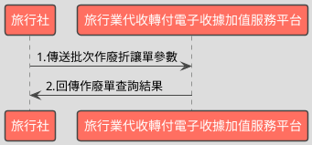

# 批次查詢電子收據作廢資料API

> 本文件包含 **AES256 加密、SHA256 簽章** 規格，詳見下方對應章節

---

## API 基本資訊

| 項目 | 內容 |
|:-----|:-----|
| 副標題 | 批次查詢作廢資料 |
| 串接方式 | 幕後 |
| Content-Type | `application/x-www-form-urlencoded` |
| 加密方式 | AES256、SHA256 |
| 正式環境 URL | https://api.travelinvoice.com.tw/invoice_searchall |
| 測試環境 URL | https://capi.travelinvoice.com.tw/invoice_searchall |

---

## 欄位定義

### Post 參數（請求） [POST]

| 欄位名稱 | 中文說明 | 型別 | 長度 | 必填 | 預設值 | 允許值 | 可為空 | 範例 | 備註 |
|----------|----------|------|------|------|--------|--------|--------|------|------|
| MerchantID_ | 旅行社統一編號 | string | 8 | 必填 |  |  |  | 54352706 | 旅行社統一編號。 |
| SearchType_ | 搜尋種類 | int | 1 | 選填 |  | 3 |  | 3 | 固定帶3 |
| PostData_ | 加密資料 | array |  | 必填 |  |  |  |  | 字串欄位組合後做AES256加密，欄位說明如下表 |

### PostData_內含欄位（請求）　AES加密_字串

| 欄位名稱 | 中文說明 | 型別 | 長度 | 必填 | 預設值 | 允許值 | 可為空 | 範例 | 備註 |
|----------|----------|------|------|------|--------|--------|--------|------|------|
| Version | 串接程式版本 | string | 5 | 必填 |  | 2.0 |  | 2.0 | 固定帶 2.0 |
| TimeStamp | 時間戳記 | string | 30 | 必填 |  |  |  | 1400137200 | 自從 Unix 纪元（格林威治時間 1970 年1 月 1 日 00:00:00）到當前時間的秒數，若以 php 程式語言為例，即為呼叫time()函式所回傳的值。 例：2014-05-15 15:00:00 這個時間的時間，戳記為 1400137200，建議帶入當前時間 |
| InvalidFrom | 作廢單來源 | int | 1 | 選填 |  | 0,1 |  | 0 | 0＝API 建立 1＝官網操作建立 |
| InvalidStatus | 作廢單狀態 | int | 1 | 選填 |  | 0,1,2 |  | 1 | 0＝未確認作廢單 1＝已確認作廢單 2=取消之未確認作廢單 |
| SellerName | 經辦人名稱 | string | 50 | 選填 |  |  |  | 丁小雨 | 可過濾特定經辦人開立之作廢單。 為精確比對，需輸入完整無誤之經辦人 名稱，方可進行比對。 |
| StartDate | 查詢起始日期 | datetime |  | 必填 |  |  |  | 2016-09-25 00:00:01 | 1. 查詢區間起始（折讓單建立時間） 例：2016-09-25 2. 若已帶入收據號碼參數，查詢起始日 期與查詢結束日期建議留空，查詢時將 不考慮查詢區間。 3. 若已帶入收據號碼參數，同時也填入 查詢起始日期與查詢結束日期，將僅查 詢所設定時間區間內的資料。. 4. 若有填入查詢起始日期，則查詢結束 日期為必填。 |
| EndDate | 查詢結束日期 | datetime |  | 必填 |  |  |  | 2016-09-25 23:59:59 | 1.查詢區間結束（收據開立時間） 例：2016-02-25 2.查詢日期區間最長為 90 天，系統會抓 取當前日曆天進行天數計算 例 : 若查詢起始日期為 09-01，最長可接 受之查詢結束日期為 11-29-23:59:59 3. 若已帶入收據號碼參數，查詢起始日 期與查詢結束日期建議留空，查詢時將 不考慮查詢區間。 4. 若已帶入收據號碼參數，同時也填入 查詢起始日期與查詢結束日期，將僅查詢 所設定時間區間內的資料。 5. 若有輸入查詢結束日期，則查詢起始 日期為必填。 |

### 系統回應訊息（回應）

| 欄位名稱 | 中文說明 | 型別 | 長度 | 範例 | 必回傳 | 備註 |
|----------|----------|------|------|------|--------|------|
| Status | 回傳狀態 | int | 10 | SUCCESS | Y | 1.查詢成功，則回傳 SUCCESS 2.查詢失敗，則回傳錯誤代碼 |
| Message | 回傳訊息 | string | 30 | 查詢折讓資料成功 | Y | 文字，此次回傳狀態說明 |
| MerchantID | 旅行社統一編號 | string | 8 | 54352706 | Y | 旅行社統一編號。 |
| ReturnInvoice | 回傳的收據資料 | array |  |  | Y | 內容為 JSON 格式字串。查詢失敗此欄位回傳空值 |
| CheckCodeSearch | 檢查碼 | string | 150 | A791D7C1D64093962939B54CC1C07E8109EB8C454E0DC18F822BBA076EB38E66 | Y | 用來檢查此次資料回傳的合法性，串接時可以比對此參數資料，來檢核是否為平台所回傳，檢核方法請參考”SHA256加密說明”。如開立失敗則回傳空值。  CheckCodeSearch = 將MerchantID,StartDate,EndDate,TimeStamp依 SHA256 簽章規格計算所得之雜湊值  TimeStamp 為本次查詢送出之時間戳記。 |

### ReturnInvoice內含欄位（回應）

| 欄位名稱 | 中文說明 | 型別 | 長度 | 範例 | 必回傳 | 備註 |
|----------|----------|------|------|------|--------|------|
| InvalidNo | 作廢單流水號 | string | 20 | 8293 |  | 作廢單開立時產生的系統流水號。 |
| InvoiceNumber | 收據號碼 | string | 9 | T13671 003 |  | 作廢單所屬收據號碼。 |
| InvalidReason | 作廢原因 | string | 10 | 訂單取消 |  | 作廢原因 |
| CreateTime | 作廢單建立日期 | datetime |  | 2014-09-25 12:12:12 |  | 該張作廢單建立時間，例：2014-09-25 12:12:12。 |
| InvalidStatus | 作廢單狀態 | int | 1 | 1 |  | 該張作廢讓單之狀態。 0=未確認作廢單 1=已確認作廢單 2=取消作廢單 |

---

## 錯誤代碼

> 以下錯誤代碼均於 **HTTP 200** 回應中回傳，錯誤訊息包含於 response body。

| 代碼 | 說明 |
|------|------|
| KEY10001 | 非旅行社 API 串接 IP |
| KEY10002 | 資料解密錯誤 |
| KEY10003 | 版本錯誤 |
| KEY10004 | 資料不齊全 |
| KEY10006 | 旅行社未申請啟用電子收據 |
| KEY10007 | 頁面停留超過 30 分鐘 |
| KEY10009 | 取不到旅行社統一編號的資料 |
| KEY10010 | 旅行社統一編號空白 |
| KEY10011 | PostData_欄位空白 |
| KEY10012 | 資料傳遞錯誤 |
| KEY10013 | 資料空白 |
| KEY10014 | TimeOut。通常泛指 I/O 上的 time out |
| KEY10015 | 收據金額格式錯誤 |
| KEY10016 | 旅行社無申請郵遞列印加值服務 |
| KEY10017 | 郵遞列印加值服務可用數不足 |
| KEY10018 | 開立人欄位未填寫 |
| KEY10019 | 旅行社已被停權 |
| KEY10020 | SearchType_欄位空白 |
| KEY10021 | ReturnType_欄位空白 |
| INV20014 | 統一編號格式有誤 |
| INV70001 | 欄位資料格式錯誤 |
| WEB1002 | 日期格式有誤 |
| NOR10001 | 網路連線異常 |
| BS10001 | 查詢區間錯誤 |
| BS10002 | 收據來源錯誤（請確認所帶入的收據來源參數） |
| BS10003 | 收據狀態錯誤（請確認所帶入的收據來源參數） |
| BS10004 | 收據種類錯誤（請確認所帶入的收據來源參數） |
| BS10005 | 取得查詢收據資料失敗（請多嘗試幾次，若一直出現此錯誤請聯繫客服） |
| BS10006 | 查無收據資料 |
| BS10007 | 折讓狀態錯誤（請確認所帶入的收據來源參數） |
| BS10008 | 搜尋種類錯誤 |
| BS10009 | 折讓單來源錯誤 |
| BS10010 | 折讓單狀態錯誤 |
| BS10011 | 作廢單來源錯誤 |
| BS10012 | 作廢單狀態錯誤 |
| BS10013 | 日期區間有誤（最多查詢 90 日資料） |
| BS10014 | 日期區間有誤（起始日期不得大於結束日期） |

---

## 串接範例

### 請求範例

> 示範用 Key：`12345678901234567890123456789012`（32 bytes）　IV：`1234567890123456`（16 bytes）

> 外層請求參數組合格式：**String**，各必填欄位以 `欄位名稱=值` 形式，以 `&` 符號串接後傳送，簡單字串拼接 key=value&key=value，不做 URL encode

```http
POST https://api.travelinvoice.com.tw/invoice_searchall
Content-Type: application/x-www-form-urlencoded

MerchantID_=54352706&PostData_=78942f0afca77d7e464726ee053b1018da04ae2ecb132f4db2e693b79a1523d261c87ea6e713a2d528961375904af7a660f388b6fac737b62043ce1037f9ec98e9b94d80cb66bece77933349c41d17e6e7cef4658f4975467ecba841ddaca9c6
```

**PostData_（AES加密_字串）加密前明文（必填欄位）**

> 加密：AES-256-CBC，輸出：Hex，Key 與 IV 同上
> 欄位組合格式：**String**，各必填欄位以 `欄位名稱=值` 形式，以 `&` 符號串接後加密

```
Version=2.0&TimeStamp=1400137200&StartDate=2016-09-25 00:00:01&EndDate=2016-09-25 23:59:59
```

### 成功回應範例

> 回傳內容為 URL Encoded 字串，接收後請先進行 **URL Decode** 再解析。
> 注意：PHP 的 `parse_str()` 已內建 URL Decode；其他語言（Java、Python 等）請先手動 `urldecode` 後再逐欄解析。

> 外層回應格式：**JSON**，整體以 JSON 物件回傳

**系統回應**

```json
{
    "Status": "SUCCESS",
    "Message": "查詢折讓資料成功",
    "MerchantID": "54352706",
    "ReturnInvoice": "[]",
    "CheckCodeSearch": "A791D7C1D64093962939B54CC1C07E8109EB8C454E0DC18F822BBA076EB38E66",
    "InvalidNo": "8293",
    "InvoiceNumber": "T13671\n003",
    "InvalidReason": "訂單取消",
    "CreateTime": "2014-09-25 12:12:12",
    "InvalidStatus": "1"
}
```

> 本 API 回應無加密欄位，上方 JSON 即為完整明文。

### 失敗回應範例

> 回傳內容為 URL Encoded 字串，接收後請先進行 **URL Decode** 再解析。
> 注意：PHP 的 `parse_str()` 已內建 URL Decode；其他語言（Java、Python 等）請先手動 `urldecode` 後再逐欄解析。

**系統回應**

```json
{
    "Status": "KEY10001",
    "Message": "非旅行社 API 串接 IP",
    "MerchantID": "54352706",
    "ReturnInvoice": "[]",
    "CheckCodeSearch": "A791D7C1D64093962939B54CC1C07E8109EB8C454E0DC18F822BBA076EB38E66"
}
```

**解密後明文**

> 失敗回應無需解密。

---

## 串接目的

電子收據開立後，透過時間區間與電子收據的作廢資料參數，來進行所設定期間內的作廢資料查詢及狀態

## 資料交換方式

1. 旅行社以「HTTP POST」方式傳送收據資料至電子收據平台進行開立。 
2. Content-Type 為 application/x-www-form-urlencoded。 
3. 編碼格式為 UTF-8。 
4. 電子收據平台回應格式化的字串。 
5. 各欄位計算單位為字元。中、英、數字、符號都算一個字元。 
6. 各欄位間以「&」作為連接符號，各欄位內不得含有此字元（U+0026）。

## 串接前置作業

（請先完成，否則程式必失敗）

 1. 取得 HashKey / HashIV
- 測試環境：登入測試區後台 → 基本資料 → API 串接設定 → 複製 HashKey 與 HashIV
- 正式環境：登入正式區後台 → 基本資料 → API 串接設定 → 複製 HashKey 與 HashIV

2. 申請 IP 白名單
- 申請窗口：於官網下載申請表單並填寫後，傳送後客服中心（傳真 / Email）
- 最多可設定 10 組 IP
- 需提供：伺服器對外 IP（非內網 IP，可至 https://ifconfig.me 查詢）
- 生效時間：通常 1-2 個工作天

3. 環境網址
-測試環境與正式環境是完全不同的設備，資料不共通，上線前務必要確認已經將串接網址切換至正式區網址

4. 常見「忘記做前置作業」的錯誤訊號
- `KEY10001 非旅行社 API 串接 IP` → IP 白名單未設定或設錯
- `KEY10002 資料解密錯誤` → HashKey / HashIV 不正確或仍是範例值
- `KEY10009 取不到旅行社統一編號的資料` → MerchantID 錯或未啟用

## 批次查詢作廢單資料呼叫流程圖



---

---

## AES256 加密規格

### 加密演算法規格

| 項目 | 規格 |
|:-----|:-----|
| 演算法 | AES |
| 金鑰長度 | 256 bits（32 bytes） |
| 加密模式 | CBC |
| 填充方式 | 類 PKCS7（32-byte 邊界，非標準） |
| 輸出格式 | Hex 十六進位 |
| 輸入編碼 | UTF-8 |
| Key 長度 | 32 bytes |
| IV 長度 | 16 bytes |

> ⚠️ **注意：本 API 採用類 PKCS7 演算法，但以 32 bytes 為填充邊界（非 AES 標準的 16 bytes），必須特別處理**
>
> 標準 PKCS7 以 AES block size（**16 bytes**）為補齊單位；本 API 採用 **32 bytes** 作為填充邊界，屬類 PKCS7 的自訂規格。
> 各語言標準加密函式庫（PHP `openssl`、Node.js `crypto`、Python `pycryptodome`）的預設 PKCS7 均使用 16-byte 邊界，**直接呼叫內建 PKCS7 將產生錯誤的填充**，導致對方解密失敗。
> **實作時必須手動計算 32-byte 邊界填充，並停用函式庫的自動填充**（PHP：`OPENSSL_ZERO_PADDING`；Node.js：`cipher.setAutoPadding(false)`；Python：`pad(..., 32)`）。

### 適用欄位群組

- **PostData_內含欄位**（AES加密_字串）（請求）　傳送欄位名稱：`PostData_`

### 加密範例

> 以下為固定示範數值，**請勿用於正式環境**。
> 本範例已採用類 PKCS7（32-byte 邊界）填充計算，與標準 PKCS7（16-byte 邊界）結果**不同**。

| 項目 | 值 |
|:-----|:---|
| Key（ASCII，32 bytes） | `12345678901234567890123456789012` |
| IV（ASCII，16 bytes） | `1234567890123456` |
| 加密前字串（plaintext） | `Version=2.0&TimeStamp=1400137200&StartDate=2016-09-25 00:00:01&EndDate=2016-09-25 23:59:59` |
| 加密後（Hex 十六進位） | `78942f0afca77d7e464726ee053b1018da04ae2ecb132f4db2e693b79a1523d261c87ea6e713a2d528961375904af7a660f388b6fac737b62043ce1037f9ec98e9b94d80cb66bece77933349c41d17e6e7cef4658f4975467ecba841ddaca9c6` |

> 驗證方法：使用上述 Key / IV 對加密後字串解密，應還原為加密前字串。

---

## SHA256 簽章規格

### 簽章規格

| 項目 | 規格 |
|:-----|:-----|
| 演算法 | SHA-256 |
| 輸出格式 | 十六進位字串（大寫） |
| Key 欄位名稱 | `HashKey` |
| IV 欄位名稱 | `HashIV` |
| 字串組合方式 | **前IV後KEY** |
| 參與簽章欄位 | `MerchantID,StartDate,EndDate,TimeStamp` |

### 字串組合說明

組合方式：**前IV後KEY**

參與簽章的欄位（依下列順序排列）：`MerchantID`、`StartDate`、`EndDate`、`TimeStamp`

> **欄位順序**：組合字串時，請依照本文件設定的欄位清單順序排列，**不可任意調換**。

```
HashIV={IV值}&{欄位1}={值1}&...&HashKey={Key值}
```

以 `HashIV={iv}` 開頭，接各參與欄位（依序），最後以 `HashKey={key}` 結尾，各段以 `&` 分隔。

### 簽章範例

> 以下為固定示範數值，**請勿用於正式環境**。

| 項目 | 值 |
|:-----|:---|
| HashKey | `abc1234567890def` |
| HashIV | `xyz0987654321uvw` |
| MerchantID | `54352706` |
| StartDate | `2016-09-25 00:00:01` |
| EndDate | `2016-09-25 23:59:59` |
| TimeStamp | `1400137200` |
| **組合後字串** | `HashIV=xyz0987654321uvw&MerchantID=54352706&StartDate=2016-09-25 00:00:01&EndDate=2016-09-25 23:59:59&TimeStamp=1400137200&HashKey=abc1234567890def` |
| **SHA256 雜湊（大寫）** | `DC9AAA0909357BAC5A51FE6AA44FBDF942A727F98DBCA8E70BB0EF59D08BD23B` |

> 驗證方法：將上述組合後字串進行 SHA256 計算並轉大寫，應得到上方雜湊值。

---

## 程式碼範例

### PHP

```php
<?php
/**
 * IMPORTANT: Key and IV values differ between production and test environments — confirm you have obtained the correct credentials for the target environment before use;
 * Replace all placeholder constants (e.g. YOUR_API_KEY_HERE) with real values before running this code — the code will block and display an error if placeholders are detected
 */

// Constants with semantic names
define('MERCHANT_ID', 'YOUR_MERCHANT_ID_HERE');
define('API_KEY', 'YOUR_API_KEY_HERE'); // 32 bytes — used for both AES-256 encryption and SHA256 signature (HashKey)
define('API_IV', 'YOUR_API_IV_HERE');   // 16 bytes — AES block size is 16 bytes; used for both AES-256 CBC and SHA256 signature (HashIV)
define('API_URL', 'https://capi.travelinvoice.com.tw/invoice_searchall'); // Test environment endpoint

// Execution block checking for placeholder credentials
if (MERCHANT_ID === 'YOUR_MERCHANT_ID_HERE' || API_KEY === 'YOUR_API_KEY_HERE' || API_IV === 'YOUR_API_IV_HERE') {
    header('HTTP/1.1 500 Internal Server Error');
    echo '<!DOCTYPE html>
    <html lang="en">
    <head>
        <meta charset="UTF-8">
        <title>Configuration Error</title>
        <style>
            body { font-family: -apple-system, BlinkMacSystemFont, "Segoe UI", Roboto, sans-serif; background: #fcf8f2; padding: 40px; }
            .error-box { max-width: 600px; margin: 0 auto; background: #fff; padding: 30px; border-radius: 8px; border-left: 6px solid #e74c3c; box-shadow: 0 4px 15px rgba(0,0,0,0.05); }
            h2 { color: #c0392b; margin-top: 0; }
            p { color: #555; line-height: 1.6; }
            code { background: #f2f2f2; padding: 2px 6px; border-radius: 4px; font-family: monospace; }
        </style>
    </head>
    <body>
        <div class="error-box">
            <h2>API Configuration Blocked</h2>
            <p><strong>Security Warning:</strong> You must replace the placeholder constants (<code>MERCHANT_ID</code>, <code>API_KEY</code>, and <code>API_IV</code>) with your actual API credentials. The application execution has been halted to prevent invalid API requests.</p>
        </div>
    </body>
    </html>';
    exit;
}

/**
 * Verification (驗證回應簽章)
 *
 * Checks validity of API response CheckCodeSearch against sent query parameters.
 * Combines HashIV, EndDate, MerchantID, StartDate, TimeStamp, and HashKey.
 *
 * @param string $merchantId Target travel agency VAT number
 * @param string $startDate Query range start date/time
 * @param string $endDate Query range end date/time
 * @param string $timestamp Unix timestamp of the request execution
 * @param string $expectedHash Hash string sent back from the API server
 * @return bool True if signature matches exactly, false otherwise
 */
function verifyResponseSignature($merchantId, $startDate, $endDate, $timestamp, $expectedHash) {
    // String concatenated manually without URL-encoding to ensure cryptographic alignment
    $rawString = 'HashIV=' . API_IV .
                 '&EndDate=' . $endDate .
                 '&MerchantID=' . $merchantId .
                 '&StartDate=' . $startDate .
                 '&TimeStamp=' . $timestamp .
                 '&HashKey=' . API_KEY;

    $calculatedHash = strtoupper(hash('sha256', $rawString));
    
    // Timing-safe comparison to mitigate timing attacks
    return hash_equals($calculatedHash, $expectedHash);
}

// Handle request submission
$apiResult = null;
$errorMsg = null;
$executed = false;

if ($_SERVER['REQUEST_METHOD'] === 'POST') {
    try {
        $executed = true;

        // Collect inputs with fallbacks
        $startDate = $_POST['StartDate'] ?? '';
        $endDate = $_POST['EndDate'] ?? '';
        $invalidFrom = $_POST['InvalidFrom'] ?? '0';
        $invalidStatus = $_POST['InvalidStatus'] ?? '1';
        $sellerName = $_POST['SellerName'] ?? '';
        
        $timestamp = (string)time();
        $version = '2.0';

        // Prepare the parameters string for internal data payload
        $innerParams = 'Version=' . $version .
                       '&TimeStamp=' . $timestamp .
                       '&InvalidFrom=' . $invalidFrom .
                       '&InvalidStatus=' . $invalidStatus .
                       '&SellerName=' . $sellerName .
                       '&StartDate=' . $startDate .
                       '&EndDate=' . $endDate;

        /* NON-STANDARD AES PADDING: PKCS7 with Block Size 32
         * Standard AES uses PKCS7 padding aligned to a 16-byte block size (AES native block size).
         * This API uses a non-standard variant where PKCS7 padding is aligned to 32 bytes.
         * paddingLen = 32 - (plaintext.length % 32), result is always in range 1–32.
         * Each padding byte value equals paddingLen.
         * Apply this padding manually; use the cipher's ZERO_PADDING / no-padding flag
         * to prevent the library from applying its own PKCS7 padding. */
        $blockSize = 32;
        $paddingLen = $blockSize - (strlen($innerParams) % $blockSize);
        $paddedPlaintext = $innerParams . str_repeat(chr($paddingLen), $paddingLen);

        // Perform AES encryption with native 16-byte IV block size using the 32-byte manual padding
        $encryptedBytes = openssl_encrypt(
            $paddedPlaintext,
            'AES-256-CBC',
            API_KEY,
            OPENSSL_RAW_DATA | OPENSSL_ZERO_PADDING,
            API_IV
        );

        if ($encryptedBytes === false) {
            throw new Exception('AES encryption process encountered an internal library error.');
        }

        $postDataHex = bin2hex($encryptedBytes);

        // Build main request payload
        $postFields = [
            'MerchantID_' => MERCHANT_ID,
            'SearchType_' => '3',
            'PostData_' => $postDataHex
        ];

        // Execute API request using curl extension
        $ch = curl_init();
        if ($ch === false) {
            throw new Exception('Failed to initialize connection handler.');
        }

        curl_setopt($ch, CURLOPT_URL, API_URL);
        curl_setopt($ch, CURLOPT_POST, true);
        curl_setopt($ch, CURLOPT_POSTFIELDS, http_build_query($postFields));
        curl_setopt($ch, CURLOPT_RETURNTRANSFER, true);
        curl_setopt($ch, CURLOPT_HTTPHEADER, [
            'Content-Type: application/x-www-form-urlencoded'
        ]);

        $response = curl_exec($ch);

        if ($response === false) {
            $errNo = curl_errno($ch);
            $errStr = curl_error($ch);
            throw new Exception("Connection error (Code $errNo): $errStr");
        }

        $httpCode = curl_getinfo($ch, CURLINFO_HTTP_CODE);
        if ($httpCode !== 200) {
            throw new Exception("Server responded with anomalous HTTP status code: $httpCode");
        }

        // Parse JSON output
        $decoded = json_decode($response, true);
        if ($decoded === null) {
            throw new Exception('Response parsing error: Output is not valid JSON string structure.');
        }

        // Handle error codes returned from the platform API
        $status = $decoded['Status'] ?? '';
        if ($status !== 'SUCCESS') {
            $errorExplanation = 'Unknown Error';
            $errorCodes = [
                'KEY10001' => 'Non-registered Travel Agency IP address accessing API.',
                'KEY10002' => 'Failed to decrypt submitted package.',
                'KEY10003' => 'Incorrect protocol version value.',
                'KEY10004' => 'Missing parameter structure fields.',
                'KEY10006' => 'Travel agency has not activated receipt services.',
                'KEY10010' => 'Merchant VAT ID empty.',
                'KEY10011' => 'PostData_ value field empty.',
                'KEY10013' => 'Submited parameter dataset empty.',
                'BS10001' => 'Invalid date query ranges configuration.',
                'BS10012' => 'Incorrect void status parameter value.',
                'BS10013' => 'Date query range exceeds the maximum limits of 90 days.',
                'BS10014' => 'Start date cannot be greater than target end date.'
            ];
            
            if (isset($errorCodes[$status])) {
                $errorExplanation = $errorCodes[$status];
            }
            throw new Exception("API Refusal: Error status [$status] -> $errorExplanation");
        }

        // Verify authenticity of platform response via CheckCodeSearch validation signature
        $returnedCheckCode = $decoded['CheckCodeSearch'] ?? '';
        $returnedMerchant = $decoded['MerchantID'] ?? '';

        if (!verifyResponseSignature($returnedMerchant, $startDate, $endDate, $timestamp, $returnedCheckCode)) {
            throw new Exception('Security Error: Incoming message signature does not match locally calculated checksum.');
        }

        $apiResult = $decoded;

    } catch (Exception $e) {
        $errorMsg = $e->getMessage();
    }
}
?>
<!DOCTYPE html>
<html lang="en">
<head>
    <meta charset="UTF-8">
    <meta name="viewport" content="width=device-width, initial-scale=1.0">
    <title>Void Receipt Query Panel</title>
    <style>
        :root {
            --primary: #2c3e50;
            --accent: #2980b9;
            --bg: #f8f9fa;
            --card: #ffffff;
            --border: #e2e8f0;
            --text: #2d3748;
            --error: #e53e3e;
            --success: #38a169;
        }
        body {
            font-family: -apple-system, BlinkMacSystemFont, "Segoe UI", Roboto, "Helvetica Neue", Arial, sans-serif;
            background-color: var(--bg);
            color: var(--text);
            margin: 0;
            padding: 20px;
            line-height: 1.5;
        }
        .container {
            max-width: 1000px;
            margin: 0 auto;
        }
        header {
            margin-bottom: 30px;
            text-align: center;
        }
        h1 {
            color: var(--primary);
            margin-bottom: 5px;
            font-size: 28px;
        }
        .panel {
            background: var(--card);
            border: 1px solid var(--border);
            border-radius: 8px;
            box-shadow: 0 4px 6px rgba(0,0,0,0.02);
            padding: 25px;
            margin-bottom: 25px;
        }
        .form-grid {
            display: grid;
            grid-template-columns: repeat(auto-fit, minmax(220px, 1fr));
            gap: 20px;
            margin-bottom: 20px;
        }
        label {
            display: block;
            font-weight: 600;
            margin-bottom: 8px;
            font-size: 14px;
            color: var(--primary);
        }
        input, select {
            width: 100%;
            padding: 10px;
            border: 1px solid var(--border);
            border-radius: 6px;
            box-sizing: border-box;
            font-size: 14px;
            color: var(--text);
            background: #fff;
        }
        input:focus, select:focus {
            outline: none;
            border-color: var(--accent);
            box-shadow: 0 0 0 3px rgba(41, 128, 185, 0.1);
        }
        .button-bar {
            text-align: right;
        }
        button {
            background-color: var(--accent);
            color: white;
            border: none;
            padding: 12px 30px;
            font-size: 15px;
            font-weight: 600;
            border-radius: 6px;
            cursor: pointer;
            transition: background 0.2s ease;
        }
        button:hover {
            background-color: #1f6391;
        }
        .alert {
            padding: 15px 20px;
            border-radius: 6px;
            margin-bottom: 25px;
            font-size: 15px;
        }
        .alert-danger {
            background-color: #fed7d7;
            border-left: 5px solid var(--error);
            color: #9b2c2c;
        }
        .alert-success {
            background-color: #c6f6d5;
            border-left: 5px solid var(--success);
            color: #22543d;
        }
        table {
            width: 100%;
            border-collapse: collapse;
            margin-top: 15px;
            font-size: 14px;
        }
        th, td {
            text-align: left;
            padding: 12px 15px;
            border-bottom: 1px solid var(--border);
        }
        th {
            background-color: #edf2f7;
            color: var(--primary);
            font-weight: 600;
        }
        tr:hover {
            background-color: #f7fafc;
        }
        .badge {
            display: inline-block;
            padding: 4px 8px;
            font-size: 11px;
            font-weight: 700;
            border-radius: 4px;
            text-transform: uppercase;
        }
        .badge-gray { background: #e2e8f0; color: #4a5568; }
        .badge-green { background: #c6f6d5; color: #22543d; }
        .badge-red { background: #fed7d7; color: #9b2c2c; }
        pre {
            background: #2d3748;
            color: #f7fafc;
            padding: 15px;
            border-radius: 6px;
            overflow-x: auto;
            font-size: 13px;
        }
    </style>
</head>
<body>

<div class="container">
    <header>
        <h1>Batch Void Receipt Query Utility</h1>
        <p style="color: #718096; margin-top: 5px;">Secure backend tool integrated with TravelInvoice API infrastructure</p>
    </header>

    <div class="panel">
        <form method="POST">
            <div class="form-grid">
                <div>
                    <label for="StartDate">Query Start Date (StartDate) *</label>
                    <input type="text" id="StartDate" name="StartDate" placeholder="YYYY-MM-DD HH:MM:SS" 
                           value="<?php echo htmlspecialchars($_POST['StartDate'] ?? date('Y-m-d 00:00:00')); ?>" required>
                </div>
                <div>
                    <label for="EndDate">Query End Date (EndDate) *</label>
                    <input type="text" id="EndDate" name="EndDate" placeholder="YYYY-MM-DD HH:MM:SS" 
                           value="<?php echo htmlspecialchars($_POST['EndDate'] ?? date('Y-m-d 23:59:59')); ?>" required>
                </div>
                <div>
                    <label for="InvalidFrom">Void Origin (InvalidFrom)</label>
                    <select id="InvalidFrom" name="InvalidFrom">
                        <option value="0" <?php echo (isset($_POST['InvalidFrom']) && $_POST['InvalidFrom'] === '0') ? 'selected' : ''; ?>>API Generated</option>
                        <option value="1" <?php echo (isset($_POST['InvalidFrom']) && $_POST['InvalidFrom'] === '1') ? 'selected' : ''; ?>>Portal UI Generated</option>
                    </select>
                </div>
                <div>
                    <label for="InvalidStatus">Void Status (InvalidStatus)</label>
                    <select id="InvalidStatus" name="InvalidStatus">
                        <option value="0" <?php echo (isset($_POST['InvalidStatus']) && $_POST['InvalidStatus'] === '0') ? 'selected' : ''; ?>>Unconfirmed</option>
                        <option value="1" <?php echo (!isset($_POST['InvalidStatus']) || $_POST['InvalidStatus'] === '1') ? 'selected' : ''; ?>>Confirmed</option>
                        <option value="2" <?php echo (isset($_POST['InvalidStatus']) && $_POST['InvalidStatus'] === '2') ? 'selected' : ''; ?>>Cancelled</option>
                    </select>
                </div>
                <div style="grid-column: span 2;">
                    <label for="SellerName">Responsible Agent Name (SellerName)</label>
                    <input type="text" id="SellerName" name="SellerName" placeholder="Exact matches only" 
                           value="<?php echo htmlspecialchars($_POST['SellerName'] ?? ''); ?>">
                </div>
            </div>
            <div class="button-bar">
                <button type="submit">Execute Secure Query</button>
            </div>
        </form>
    </div>

    <?php if ($executed): ?>
        <?php if ($errorMsg): ?>
            <div class="alert alert-danger">
                <strong>Query Processing Failed:</strong> <?php echo htmlspecialchars($errorMsg); ?>
            </div>
        <?php else: ?>
            <div class="alert alert-success">
                <strong>Success:</strong> Retrieval accomplished and payload integrity signature verified successfully.
            </div>

            <div class="panel">
                <h3 style="margin-top: 0; color: var(--primary);">Query Summary</h3>
                <p style="font-size: 14px;">
                    <strong>Merchant:</strong> <?php echo htmlspecialchars($apiResult['MerchantID'] ?? ''); ?><br>
                    <strong>Response Message:</strong> <?php echo htmlspecialchars($apiResult['Message'] ?? ''); ?>
                </p>

                <h4 style="margin-bottom: 10px; color: var(--primary);">Void Documents (ReturnInvoice)</h4>
                <?php if (!empty($apiResult['ReturnInvoice']) && is_array($apiResult['ReturnInvoice'])): ?>
                    <table>
                        <thead>
                            <tr>
                                <th>Void Seq No</th>
                                <th>Receipt Number</th>
                                <th>Void Reason</th>
                                <th>Creation Time</th>
                                <th>Status</th>
                            </tr>
                        </thead>
                        <tbody>
                            <?php foreach ($apiResult['ReturnInvoice'] as $row): ?>
                                <tr>
                                    <td><?php echo htmlspecialchars($row['InvalidNo'] ?? 'N/A'); ?></td>
                                    <td><?php echo htmlspecialchars($row['InvoiceNumber'] ?? 'N/A'); ?></td>
                                    <td><?php echo htmlspecialchars($row['InvalidReason'] ?? 'N/A'); ?></td>
                                    <td><?php echo htmlspecialchars($row['CreateTime'] ?? 'N/A'); ?></td>
                                    <td>
                                        <?php 
                                        $statusVal = $row['InvalidStatus'] ?? '';
                                        if ($statusVal === 0 || $statusVal === '0') {
                                            echo '<span class="badge badge-gray">Unconfirmed</span>';
                                        } elseif ($statusVal === 1 || $statusVal === '1') {
                                            echo '<span class="badge badge-green">Confirmed</span>';
                                        } elseif ($statusVal === 2 || $statusVal === '2') {
                                            echo '<span class="badge badge-red">Cancelled</span>';
                                        } else {
                                            echo '<span class="badge badge-gray">Unknown (' . htmlspecialchars($statusVal) . ')</span>';
                                        }
                                        ?>
                                    </td>
                                </tr>
                            <?php endforeach; ?>
                        </tbody>
                    </table>
                <?php else: ?>
                    <p style="color: #718096; font-style: italic;">No records returned matching your specified filter criteria.</p>
                <?php endif; ?>
            </div>

            <div class="panel">
                <h3 style="margin-top: 0; color: var(--primary);">Raw Response Payload</h3>
                <pre><code><?php echo htmlspecialchars(json_encode($apiResult, JSON_PRETTY_PRINT | JSON_UNESCAPED_UNICODE)); ?></code></pre>
            </div>
        <?php endif; ?>
    <?php endif; ?>
</div>

</body>
</html>
```

