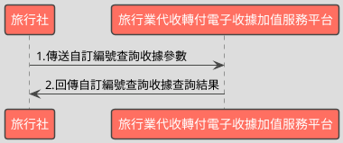

# 自訂編號查詢電子收據開立資料API

> 本文件包含 **AES256 加密、SHA256 簽章** 規格，詳見下方對應章節

---

## API 基本資訊

| 項目 | 內容 |
|:-----|:-----|
| 副標題 | 使用自訂編號來查詢收據開立資料 |
| 串接方式 | 幕後 |
| Content-Type | `application/x-www-form-urlencoded` |
| 加密方式 | AES256、SHA256 |
| 正式環境 URL | https://api.travelinvoice.com.tw/invoice_searchall |
| 測試環境 URL | https://capi.travelinvoice.com.tw/invoice_searchall |

---

## 欄位定義

### Post 參數（請求） [POST]

| 欄位名稱 | 中文說明 | 型別 | 長度 | 必填 | 預設值 | 允許值 | 可為空 | 範例 | 備註 |
|----------|----------|------|------|------|--------|--------|--------|------|------|
| MerchantID_ | 旅行社統一編號 | string | 8 | 必填 |  |  |  | 54352706 | 旅行社統一編號。 |
| SearchType_ | 搜尋種類 | int | 1 | 選填 |  | 4 |  | 4 | 固定帶4 |
| PostData_ | 加密資料 | array |  | 必填 |  |  |  |  | 字串欄位組合後做AES256加密，欄位說明如下表 |

### PostData_內含欄位（請求）　AES加密_字串

| 欄位名稱 | 中文說明 | 型別 | 長度 | 必填 | 預設值 | 允許值 | 可為空 | 範例 | 備註 |
|----------|----------|------|------|------|--------|--------|--------|------|------|
| Version | 串接程式版本 | string | 5 | 必填 |  | 2.0 |  | 2.0 | 固定帶 2.0 |
| TimeStamp | 時間戳記 | string | 30 | 必填 |  |  |  | 1400137200 | 自從 Unix 纪元（格林威治時間 1970 年1 月 1 日 00:00:00）到當前時間的秒數，若以 php 程式語言為例，即為呼叫time()函式所回傳的值。 例：2014-05-15 15:00:00 這個時間的時間，戳記為 1400137200，建議帶入當前時間 |
| InvoiceFrom | 收據來源 | int | 1 | 選填 |  | 0,1 |  | 1 | 0＝API 建立 1＝官網操作建立 |
| InvoiceStatus | 收據狀態 | int | 1 | 選填 |  | 0,1,2,3 |  | 1 | 0＝預約開立 1＝已開立 2= 取消預約開立 3＝已作廢 |
| AllowStatus | 折讓狀態 | int | 1 | 選填 |  | 0,1 |  | 1 | 0=已開立，並且未有折讓 1=已開立，且有折讓 當［InvoiceStatus］參數值為 1 時，［ AllowStatus］參數才會列入查詢條件。 |
| Category | 收據種類 | string | 5 | 選填 |  | B2B,B2C |  | B2B | 該張收據的種類。 B2B=買受人為營利事業單位(有統編) B2C=買受人為個人 空值表示不過濾 |
| SellerName | 經辦人名稱 | string | 50 | 選填 |  |  |  | 丁小雨 | 可過濾特定經辦人開立之作廢單。 為精確比對，需輸入完整無誤之經辦人 名稱，方可進行比對。 |
| StartDate | 查詢起始日期 | datetime |  | 必填 |  |  |  | 2016-09-25 00:00:01 | 1. 查詢區間起始（折讓單建立時間） 例：2016-09-25 2. 若已帶入收據號碼參數，查詢起始日 期與查詢結束日期建議留空，查詢時將 不考慮查詢區間。 3. 若已帶入收據號碼參數，同時也填入 查詢起始日期與查詢結束日期，將僅查 詢所設定時間區間內的資料。. 4. 若有填入查詢起始日期，則查詢結束 日期為必填。 |
| EndDate | 查詢結束日期 | datetime |  | 必填 |  |  |  | 2016-09-25 23:59:59 | 1.查詢區間結束（收據開立時間） 例：2016-02-25 2.查詢日期區間最長為 90 天，系統會抓 取當前日曆天進行天數計算 例 : 若查詢起始日期為 09-01，最長可接 受之查詢結束日期為 11-29-23:59:59 3. 若已帶入收據號碼參數，查詢起始日 期與查詢結束日期建議留空，查詢時將 不考慮查詢區間。 4. 若已帶入收據號碼參數，同時也填入 查詢起始日期與查詢結束日期，將僅查詢 所設定時間區間內的資料。 5. 若有輸入查詢結束日期，則查詢起始 日期為必填。 |

### 系統回應訊息（回應）

| 欄位名稱 | 中文說明 | 型別 | 長度 | 範例 | 必回傳 | 備註 |
|----------|----------|------|------|------|--------|------|
| Status | 回傳狀態 | int | 10 | SUCCESS | Y | 1.查詢成功，則回傳 SUCCESS 2.查詢失敗，則回傳錯誤代碼 |
| Message | 回傳訊息 | string | 30 | 查詢折讓資料成功 | Y | 文字，此次回傳狀態說明 |
| MerchantID | 旅行社統一編號 | string | 8 | 54352706 | Y | 旅行社統一編號。 |
| ReturnInvoice | 回傳的收據資料 | array |  |  | Y | 內容為 JSON 格式字串。查詢失敗此欄位回傳空值 |
| CheckCodeSearch | 檢查碼 | string | 150 | A791D7C1D64093962939B54CC1C07E8109EB8C454E0DC18F822BBA076EB38E66 | Y | 用來檢查此次資料回傳的合法性，串接時可以比對此參數資料，來檢核是否為平台所回傳，檢核方法請參考”SHA256加密說明”。如開立失敗則回傳空值。  CheckCodeSearch = 將MerchantID,StartDate,EndDate,TimeStamp依 SHA256 簽章規格計算所得之雜湊值  TimeStamp 為本次查詢送出之時間戳記。 |

### ReturnInvoice內含欄位（回應）

| 欄位名稱 | 中文說明 | 型別 | 長度 | 範例 | 必回傳 | 備註 |
|----------|----------|------|------|------|--------|------|
| InvoiceTransNo | 開立流水號 | string | 20 | 402832 |  | 收據開立時產生的系統流水號。 |
| MerchantOrderNo | 自訂編號 | string | 30 | 2ss0150413110119XX |  | 1. 旅行社於開立收據時輸入的自訂編號。 2. 若自訂編號為重覆多筆，則回傳相對應的收據資料。 |
| InvoiceNumber | 收據號碼 | string | 9 | T13743182 |  | 此次查詢的收據號碼。 |
| RandomNum | 收據防偽隨機碼 | string | 4 | 14673793 |  | 於開立收據時，所產生的 8 碼收據防偽隨機碼。 |
| BuyerName | 買受人名稱 | string | 60 | 王大 |  | 開立收據時的買受人名稱，個人姓名或營業人名稱。 |
| BuyerUBN | 買受人統一編號 | string | 10 | 54352706 |  | 1. 若為 B2B 收據，此欄位為買受人統一編號。 2. 若為 B2C 收據，此欄位為0。 |
| BuyerAddress | 買受人地址 | string | 200 | 台北市南港區南港路二段97號8樓 |  | 於開立收據時，該張收據的買受人地址。 |
| BuyerPhone | 買受人手機號碼 | string | 15 | 0922548754 |  | 於開立收據時，該張收據的買受人手機號碼。 |
| BuyerEmail | 買受人電子信箱 | string | 100 | abc@gmail.com |  | 於開立收據時，該張收據的買受人電子信箱。 |
| Category | 收據種類 | string | 5 | B2B |  | 收據的收據種類。 B2B=買受人為營利事業單位(有統編) B2C=買受人為個人 |
| TotalAmt | 收據金額 | int | 8 | 500 |  | 純數字，為收據總金額。 |
| CreateTime | 開立收據時間 | datetime |  | 2014-09-25 12:12:12 |  | 收據開立時間，例：2014-09-25 12:12:12。 |
| InvoiceStatus | 收據狀態 | int | 1 | 1 |  | 收據之收據狀態。 0＝預約開立 1＝已開立 2=取消預約開立 3＝已作廢 |
| ItemDetail | 商品明細 | text |  | [{\"ItemNum\":1,\"ItemName\":\"\\u6a5f\\u7968\",\"ItemCount\":\"1\",\"ItemWord\":\"\\u5f35\",\"ItemPrice\":\"2000\",\"ItemAmount\":\"2000\"}] |  | 收據開立時的商品資訊(JSON 格式)。 ItemNum = 品項序號 ItemName = 商品名稱 ItemCount = 數量 ItemWord = 單位 ItemPrice = 單價 ItemAmount = 小計 |
| TourName | 團名 | string | 200 | 北海道5日遊 |  | 收據的團名 |
| TourNo | 團號 | string | 50 | B284465 |  | 收據的團號 |
| TourDate | 預計出團日 | string | 8 | 2026-03-22 |  | 收據出團日,出團日當天會發提醒信至指定信箱 |
| TaxNoted | 申報註記 | int | 1 | 0 |  | 0=未申報 1=已申報 |

---

## 錯誤代碼

> 以下錯誤代碼均於 **HTTP 200** 回應中回傳，錯誤訊息包含於 response body。

| 代碼 | 說明 |
|------|------|
| KEY10001 | 非旅行社 API 串接 IP |
| KEY10002 | 資料解密錯誤 |
| KEY10003 | 版本錯誤 |
| KEY10004 | 資料不齊全 |
| KEY10006 | 旅行社未申請啟用電子收據 |
| KEY10007 | 頁面停留超過 30 分鐘 |
| KEY10009 | 取不到旅行社統一編號的資料 |
| KEY10010 | 旅行社統一編號空白 |
| KEY10011 | PostData_欄位空白 |
| KEY10012 | 資料傳遞錯誤 |
| KEY10013 | 資料空白 |
| KEY10014 | TimeOut。通常泛指 I/O 上的 time out |
| KEY10015 | 收據金額格式錯誤 |
| KEY10016 | 旅行社無申請郵遞列印加值服務 |
| KEY10017 | 郵遞列印加值服務可用數不足 |
| KEY10018 | 開立人欄位未填寫 |
| KEY10019 | 旅行社已被停權 |
| KEY10020 | SearchType_欄位空白 |
| KEY10021 | ReturnType_欄位空白 |
| INV20014 | 統一編號格式有誤 |
| INV70001 | 欄位資料格式錯誤 |
| WEB1002 | 日期格式有誤 |
| NOR10001 | 網路連線異常 |
| BS10001 | 查詢區間錯誤 |
| BS10002 | 收據來源錯誤（請確認所帶入的收據來源參數） |
| BS10003 | 收據狀態錯誤（請確認所帶入的收據來源參數） |
| BS10004 | 收據種類錯誤（請確認所帶入的收據來源參數） |
| BS10005 | 取得查詢收據資料失敗（請多嘗試幾次，若一直出現此錯誤請聯繫客服） |
| BS10006 | 查無收據資料 |
| BS10007 | 折讓狀態錯誤（請確認所帶入的收據來源參數） |
| BS10008 | 搜尋種類錯誤 |
| BS10009 | 折讓單來源錯誤 |
| BS10010 | 折讓單狀態錯誤 |
| BS10011 | 作廢單來源錯誤 |
| BS10012 | 作廢單狀態錯誤 |
| BS10013 | 日期區間有誤（最多查詢 90 日資料） |
| BS10014 | 日期區間有誤（起始日期不得大於結束日期） |

---

## 串接範例

### 請求範例

> 示範用 Key：`12345678901234567890123456789012`（32 bytes）　IV：`1234567890123456`（16 bytes）

> 外層請求參數組合格式：**String**，各必填欄位以 `欄位名稱=值` 形式，以 `&` 符號串接後傳送，簡單字串拼接 key=value&key=value，不做 URL encode

```http
POST https://api.travelinvoice.com.tw/invoice_searchall
Content-Type: application/x-www-form-urlencoded

MerchantID_=54352706&PostData_=78942f0afca77d7e464726ee053b1018da04ae2ecb132f4db2e693b79a1523d261c87ea6e713a2d528961375904af7a660f388b6fac737b62043ce1037f9ec98e9b94d80cb66bece77933349c41d17e6e7cef4658f4975467ecba841ddaca9c6
```

**PostData_（AES加密_字串）加密前明文（必填欄位）**

> 加密：AES-256-CBC，輸出：Hex，Key 與 IV 同上
> 欄位組合格式：**String**，各必填欄位以 `欄位名稱=值` 形式，以 `&` 符號串接後加密

```
Version=2.0&TimeStamp=1400137200&StartDate=2016-09-25 00:00:01&EndDate=2016-09-25 23:59:59
```

### 成功回應範例

> 回傳內容為 URL Encoded 字串，接收後請先進行 **URL Decode** 再解析。
> 注意：PHP 的 `parse_str()` 已內建 URL Decode；其他語言（Java、Python 等）請先手動 `urldecode` 後再逐欄解析。

> 外層回應格式：**JSON**，整體以 JSON 物件回傳

**系統回應**

```json
{
    "Status": "SUCCESS",
    "Message": "查詢折讓資料成功",
    "MerchantID": "54352706",
    "ReturnInvoice": "[]",
    "CheckCodeSearch": "A791D7C1D64093962939B54CC1C07E8109EB8C454E0DC18F822BBA076EB38E66",
    "InvoiceTransNo": "402832",
    "MerchantOrderNo": "2ss0150413110119XX",
    "InvoiceNumber": "T13743182",
    "RandomNum": "14673793",
    "BuyerName": "王大",
    "BuyerUBN": "54352706",
    "BuyerAddress": "台北市南港區南港路二段97號8樓",
    "BuyerPhone": "0922548754",
    "BuyerEmail": "abc@gmail.com",
    "Category": "B2B",
    "TotalAmt": "500",
    "CreateTime": "2014-09-25 12:12:12",
    "InvoiceStatus": "1",
    "ItemDetail": "[{\\\"ItemNum\\\":1,\\\"ItemName\\\":\\\"\\\\u6a5f\\\\u7968\\\",\\\"ItemCount\\\":\\\"1\\\",\\\"ItemWord\\\":\\\"\\\\u5f35\\\",\\\"ItemPrice\\\":\\\"2000\\\",\\\"ItemAmount\\\":\\\"2000\\\"}]",
    "TourName": "北海道5日遊",
    "TourNo": "B284465",
    "TourDate": "2026-03-22",
    "TaxNoted": "0"
}
```

> 本 API 回應無加密欄位，上方 JSON 即為完整明文。

### 失敗回應範例

> 回傳內容為 URL Encoded 字串，接收後請先進行 **URL Decode** 再解析。
> 注意：PHP 的 `parse_str()` 已內建 URL Decode；其他語言（Java、Python 等）請先手動 `urldecode` 後再逐欄解析。

**系統回應**

```json
{
    "Status": "KEY10001",
    "Message": "非旅行社 API 串接 IP",
    "MerchantID": "54352706",
    "ReturnInvoice": "[]",
    "CheckCodeSearch": "A791D7C1D64093962939B54CC1C07E8109EB8C454E0DC18F822BBA076EB38E66"
}
```

**解密後明文**

> 失敗回應無需解密。

---

## 串接目的

電子收據開立後，透過自訂資料參數，來進行該編號收據資料查詢及狀態

## 資料交換方式

1. 旅行社以「HTTP POST」方式傳送收據資料至電子收據平台進行開立。 
2. Content-Type 為 application/x-www-form-urlencoded。 
3. 編碼格式為 UTF-8。 
4. 電子收據平台回應格式化的字串。 
5. 各欄位計算單位為字元。中、英、數字、符號都算一個字元。 
6. 各欄位間以「&」作為連接符號，各欄位內不得含有此字元（U+0026）。

## 串接前置作業

（請先完成，否則程式必失敗）

 1. 取得 HashKey / HashIV
- 測試環境：登入測試區後台 → 基本資料 → API 串接設定 → 複製 HashKey 與 HashIV
- 正式環境：登入正式區後台 → 基本資料 → API 串接設定 → 複製 HashKey 與 HashIV

2. 申請 IP 白名單
- 申請窗口：於官網下載申請表單並填寫後，傳送後客服中心（傳真 / Email）
- 最多可設定 10 組 IP
- 需提供：伺服器對外 IP（非內網 IP，可至 https://ifconfig.me 查詢）
- 生效時間：通常 1-2 個工作天

3. 環境網址
-測試環境與正式環境是完全不同的設備，資料不共通，上線前務必要確認已經將串接網址切換至正式區網址

4. 常見「忘記做前置作業」的錯誤訊號
- `KEY10001 非旅行社 API 串接 IP` → IP 白名單未設定或設錯
- `KEY10002 資料解密錯誤` → HashKey / HashIV 不正確或仍是範例值
- `KEY10009 取不到旅行社統一編號的資料` → MerchantID 錯或未啟用

## 自訂編號查詢收據資料呼叫流程圖



---

---

## AES256 加密規格

### 加密演算法規格

| 項目 | 規格 |
|:-----|:-----|
| 演算法 | AES |
| 金鑰長度 | 256 bits（32 bytes） |
| 加密模式 | CBC |
| 填充方式 | 類 PKCS7（32-byte 邊界，非標準） |
| 輸出格式 | Hex 十六進位 |
| 輸入編碼 | UTF-8 |
| Key 長度 | 32 bytes |
| IV 長度 | 16 bytes |

> ⚠️ **注意：本 API 採用類 PKCS7 演算法，但以 32 bytes 為填充邊界（非 AES 標準的 16 bytes），必須特別處理**
>
> 標準 PKCS7 以 AES block size（**16 bytes**）為補齊單位；本 API 採用 **32 bytes** 作為填充邊界，屬類 PKCS7 的自訂規格。
> 各語言標準加密函式庫（PHP `openssl`、Node.js `crypto`、Python `pycryptodome`）的預設 PKCS7 均使用 16-byte 邊界，**直接呼叫內建 PKCS7 將產生錯誤的填充**，導致對方解密失敗。
> **實作時必須手動計算 32-byte 邊界填充，並停用函式庫的自動填充**（PHP：`OPENSSL_ZERO_PADDING`；Node.js：`cipher.setAutoPadding(false)`；Python：`pad(..., 32)`）。

### 適用欄位群組

- **PostData_內含欄位**（AES加密_字串）（請求）　傳送欄位名稱：`PostData_`

### 加密範例

> 以下為固定示範數值，**請勿用於正式環境**。
> 本範例已採用類 PKCS7（32-byte 邊界）填充計算，與標準 PKCS7（16-byte 邊界）結果**不同**。

| 項目 | 值 |
|:-----|:---|
| Key（ASCII，32 bytes） | `12345678901234567890123456789012` |
| IV（ASCII，16 bytes） | `1234567890123456` |
| 加密前字串（plaintext） | `Version=2.0&TimeStamp=1400137200&StartDate=2016-09-25 00:00:01&EndDate=2016-09-25 23:59:59` |
| 加密後（Hex 十六進位） | `78942f0afca77d7e464726ee053b1018da04ae2ecb132f4db2e693b79a1523d261c87ea6e713a2d528961375904af7a660f388b6fac737b62043ce1037f9ec98e9b94d80cb66bece77933349c41d17e6e7cef4658f4975467ecba841ddaca9c6` |

> 驗證方法：使用上述 Key / IV 對加密後字串解密，應還原為加密前字串。

---

## SHA256 簽章規格

### 簽章規格

| 項目 | 規格 |
|:-----|:-----|
| 演算法 | SHA-256 |
| 輸出格式 | 十六進位字串（大寫） |
| Key 欄位名稱 | `HashKey` |
| IV 欄位名稱 | `HashIV` |
| 字串組合方式 | **前IV後KEY** |
| 參與簽章欄位 | `MerchantID,StartDate,EndDate,TimeStamp` |

### 字串組合說明

組合方式：**前IV後KEY**

參與簽章的欄位（依下列順序排列）：`MerchantID`、`StartDate`、`EndDate`、`TimeStamp`

> **欄位順序**：組合字串時，請依照本文件設定的欄位清單順序排列，**不可任意調換**。

```
HashIV={IV值}&{欄位1}={值1}&...&HashKey={Key值}
```

以 `HashIV={iv}` 開頭，接各參與欄位（依序），最後以 `HashKey={key}` 結尾，各段以 `&` 分隔。

### 簽章範例

> 以下為固定示範數值，**請勿用於正式環境**。

| 項目 | 值 |
|:-----|:---|
| HashKey | `abc1234567890def` |
| HashIV | `xyz0987654321uvw` |
| MerchantID | `54352706` |
| StartDate | `2016-09-25 00:00:01` |
| EndDate | `2016-09-25 23:59:59` |
| TimeStamp | `1400137200` |
| **組合後字串** | `HashIV=xyz0987654321uvw&MerchantID=54352706&StartDate=2016-09-25 00:00:01&EndDate=2016-09-25 23:59:59&TimeStamp=1400137200&HashKey=abc1234567890def` |
| **SHA256 雜湊（大寫）** | `DC9AAA0909357BAC5A51FE6AA44FBDF942A727F98DBCA8E70BB0EF59D08BD23B` |

> 驗證方法：將上述組合後字串進行 SHA256 計算並轉大寫，應得到上方雜湊值。

---

## 程式碼範例

### PHP

```php
<?php
/**
 * IMPORTANT: Key and IV values differ between production and test environments — confirm you have obtained the correct credentials for the target environment before use;
 * Replace all placeholder constants (e.g. YOUR_HASH_KEY_HERE) with real values before running this code — the code will block and display an error if placeholders are detected
 */

// Define secure credential constants
define('MERCHANT_ID', 'YOUR_MERCHANT_ID_HERE');

// AES_KEY is 32 bytes (256 bits) — used for both AES-256 encryption and SHA256 signature (HashKey)
define('AES_KEY', 'YOUR_AES_KEY_HERE');

// AES_IV is 16 bytes — used for both AES-256 encryption and SHA256 signature (HashIV). 
// IV length is 16 bytes because the AES block size is fixed at 16 bytes.
define('AES_IV', 'YOUR_AES_IV_HERE');

// API Endpoint configuration
define('API_URL', 'https://capi.travelinvoice.com.tw/invoice_searchall'); // Use 'https://api.travelinvoice.com.tw/invoice_searchall' for Production

// Block execution immediately if credentials are still placeholders
$credentialError = false;
if (MERCHANT_ID === 'YOUR_MERCHANT_ID_HERE' || AES_KEY === 'YOUR_AES_KEY_HERE' || AES_IV === 'YOUR_AES_IV_HERE') {
    $credentialError = true;
}

/**
 * Verification
 *
 * Verifies the integrity of the API response by matching the received CheckCodeSearch signature.
 *
 * @param string $merchantId
 * @param string $startDate
 * @param string $endDate
 * @param string $timeStamp
 * @param string $hashKey
 * @param string $hashIv
 * @return string
 */
function verifyResponseSignature(string $merchantId, string $startDate, string $endDate, string $timeStamp, string $hashKey, string $hashIv): string {
    return strtoupper(hash('sha256', 'HashIV=' . $hashIv . '&EndDate=' . $endDate . '&MerchantID=' . $merchantId . '&StartDate=' . $startDate . '&TimeStamp=' . $timeStamp . '&HashKey=' . $hashKey));
}

$results = null;
$errorMsg = null;
$debugData = [];

if (!$credentialError && $_SERVER['REQUEST_METHOD'] === 'POST') {
    try {
        $startDate = trim($_POST['start_date'] ?? '');
        $endDate = trim($_POST['end_date'] ?? '');
        $category = trim($_POST['category'] ?? '');
        $invoiceStatus = trim($_POST['invoice_status'] ?? '');
        
        if (empty($startDate) || empty($endDate)) {
            throw new Exception('Start Date and End Date are required.');
        }

        $timeStamp = (string)time();

        // 1. Build plaintext query parameters for PostData_
        $postDataParams = [
            'Version' => '2.0',
            'TimeStamp' => $timeStamp,
            'StartDate' => $startDate,
            'EndDate' => $endDate
        ];

        if ($category !== '') {
            $postDataParams['Category'] = $category;
        }
        if ($invoiceStatus !== '') {
            $postDataParams['InvoiceStatus'] = (int)$invoiceStatus;
        }

        $plaintext = http_build_query($postDataParams);

        /* NON-STANDARD AES PADDING: PKCS7 with Block Size 32
         * Standard AES uses PKCS7 padding aligned to a 16-byte block size (AES native block size).
         * This API uses a non-standard variant where PKCS7 padding is aligned to 32 bytes.
         * paddingLen = 32 - (plaintext.length % 32), result is always in range 1–32.
         * Each padding byte value equals paddingLen.
         * Apply this padding manually; use the cipher's ZERO_PADDING / no-padding flag
         * to prevent the library from applying its own PKCS7 padding. */
        $blockSize = 32;
        $padLength = $blockSize - (strlen($plaintext) % $blockSize);
        $paddedPlaintext = $plaintext . str_repeat(chr($padLength), $padLength);

        // 2. Encrypt using AES-256-CBC with manually handled padding
        $encryptedRaw = openssl_encrypt($paddedPlaintext, 'AES-256-CBC', AES_KEY, OPENSSL_RAW_DATA | OPENSSL_ZERO_PADDING, AES_IV);
        if ($encryptedRaw === false) {
            $sslError = openssl_error_string();
            throw new Exception('AES Encryption failed: ' . ($sslError ? $sslError : 'Unknown OpenSSL Error'));
        }
        $hexEncrypted = bin2hex($encryptedRaw);

        // 3. Prepare payload for the POST transmission body
        $postBody = [
            'MerchantID_' => MERCHANT_ID,
            'SearchType_' => 4,
            'PostData_' => $hexEncrypted
        ];

        $debugData['Payload Sent'] = $postBody;
        $debugData['Decrypted Payload Query String'] = $plaintext;

        // 4. Send API query via cURL
        $ch = curl_init();
        curl_setopt($ch, CURLOPT_URL, API_URL);
        curl_setopt($ch, CURLOPT_POST, true);
        curl_setopt($ch, CURLOPT_POSTFIELDS, http_build_query($postBody));
        curl_setopt($ch, CURLOPT_RETURNTRANSFER, true);
        curl_setopt($ch, CURLOPT_HTTPHEADER, [
            'Content-Type: application/x-www-form-urlencoded'
        ]);
        curl_setopt($ch, CURLOPT_TIMEOUT, 30);

        $responseBody = curl_exec($ch);
        if ($responseBody === false) {
            throw new Exception('cURL Connection Failed: ' . curl_error($ch));
        }

        $httpCode = curl_getinfo($ch, CURLINFO_HTTP_CODE);
        if ($httpCode !== 200) {
            throw new Exception('API responded with abnormal HTTP Status Code: ' . $httpCode);
        }

        $responseJson = json_decode($responseBody, true);
        if (json_last_error() !== JSON_ERROR_NONE) {
            throw new Exception('Response parsing failed. Invalid JSON structure.');
        }

        $debugData['Response Received'] = $responseJson;

        $apiStatus = $responseJson['Status'] ?? '';
        $apiMessage = $responseJson['Message'] ?? '';

        if ($apiStatus !== 'SUCCESS') {
            throw new Exception('API Error (' . $apiStatus . '): ' . $apiMessage);
        }

        // 5. Verification of SHA256 Signature (CheckCodeSearch)
        $receivedCheckCode = $responseJson['CheckCodeSearch'] ?? '';
        $expectedCheckCode = verifyResponseSignature(MERCHANT_ID, $startDate, $endDate, $timeStamp, AES_KEY, AES_IV);

        if (empty($receivedCheckCode) || !hash_equals($expectedCheckCode, $receivedCheckCode)) {
            throw new Exception('Security Alert: CheckCodeSearch signature verification failed! The response may have been tampered with.');
        }

        // 6. Parse receipt return records
        $invoicesRaw = $responseJson['ReturnInvoice'] ?? '';
        $invoicesParsed = [];

        if (!empty($invoicesRaw)) {
            if (is_string($invoicesRaw)) {
                $invoicesParsed = json_decode($invoicesRaw, true) ?? [];
            } else {
                $invoicesParsed = $invoicesRaw;
            }
        }

        $results = [
            'message' => $apiMessage,
            'invoices' => $invoicesParsed
        ];

    } catch (Exception $e) {
        $errorMsg = $e->getMessage();
    }
}
?>
<!DOCTYPE html>
<html lang="en">
<head>
    <meta charset="UTF-8">
    <meta name="viewport" content="width=device-width, initial-scale=1.0">
    <title>Receipt Query Client (Merchant ID query via API)</title>
    <style>
        body {
            font-family: -apple-system, BlinkMacSystemFont, "Segoe UI", Roboto, Helvetica, Arial, sans-serif;
            background-color: #f5f7fb;
            color: #333;
            margin: 0;
            padding: 20px;
        }
        .container {
            max-width: 1000px;
            margin: 0 auto;
            background: #fff;
            padding: 30px;
            border-radius: 8px;
            box-shadow: 0 4px 6px rgba(0,0,0,0.05);
        }
        h1 {
            font-size: 24px;
            color: #1a365d;
            margin-bottom: 25px;
            border-bottom: 2px solid #edf2f7;
            padding-bottom: 10px;
        }
        .alert-danger {
            background-color: #fff5f5;
            color: #c53030;
            border: 1px solid #fed7d7;
            padding: 15px;
            border-radius: 6px;
            margin-bottom: 20px;
            font-weight: 500;
        }
        .alert-success {
            background-color: #f0fff4;
            color: #2f855a;
            border: 1px solid #c6f6d5;
            padding: 15px;
            border-radius: 6px;
            margin-bottom: 20px;
        }
        .form-grid {
            display: grid;
            grid-template-columns: repeat(auto-fit, minmax(220px, 1fr));
            gap: 20px;
            margin-bottom: 25px;
        }
        label {
            display: block;
            font-weight: 600;
            margin-bottom: 8px;
            font-size: 14px;
            color: #4a5568;
        }
        input, select {
            width: 100%;
            padding: 10px;
            border: 1px solid #cbd5e0;
            border-radius: 6px;
            font-size: 14px;
            box-sizing: border-box;
            background-color: #fff;
        }
        input:focus, select:focus {
            outline: none;
            border-color: #3182ce;
            box-shadow: 0 0 0 3px rgba(66, 153, 225, 0.15);
        }
        button {
            background-color: #3182ce;
            color: white;
            padding: 12px 24px;
            border: none;
            border-radius: 6px;
            font-size: 16px;
            font-weight: 600;
            cursor: pointer;
            transition: background 0.2s ease;
        }
        button:hover {
            background-color: #2b6cb0;
        }
        .result-table-container {
            overflow-x: auto;
            margin-top: 30px;
            border: 1px solid #e2e8f0;
            border-radius: 8px;
        }
        table {
            width: 100%;
            border-collapse: collapse;
            text-align: left;
            font-size: 14px;
        }
        th, td {
            padding: 12px 15px;
            border-bottom: 1px solid #e2e8f0;
        }
        th {
            background-color: #ebf8ff;
            color: #2b6cb0;
            font-weight: bold;
        }
        tr:hover {
            background-color: #f7fafc;
        }
        .badge {
            display: inline-block;
            padding: 4px 8px;
            font-size: 11px;
            font-weight: 700;
            border-radius: 4px;
            text-transform: uppercase;
        }
        .badge-b2b { background-color: #feebc8; color: #c05621; }
        .badge-b2c { background-color: #e2e8f0; color: #4a5568; }
        .badge-issued { background-color: #c6f6d5; color: #22543d; }
        .badge-void { background-color: #fed7d7; color: #742a2a; }
        .debug-panel {
            margin-top: 40px;
            background-color: #1a202c;
            color: #a0aec0;
            padding: 20px;
            border-radius: 8px;
            font-family: SFMono-Regular, Menlo, Monaco, Consolas, monospace;
            font-size: 12px;
            overflow-x: auto;
        }
        .debug-panel h3 {
            color: #f7fafc;
            margin-top: 0;
            font-size: 14px;
            border-bottom: 1px solid #4a5568;
            padding-bottom: 8px;
        }
    </style>
</head>
<body>

<div class="container">
    <h1>Custom Number Query Electronic Receipt</h1>

    <?php if ($credentialError): ?>
        <div class="alert-danger">
            <strong>System Error:</strong> Missing API Credentials. You must replace the placeholder values (<code>YOUR_MERCHANT_ID_HERE</code>, <code>YOUR_AES_KEY_HERE</code>, and <code>YOUR_AES_IV_HERE</code>) with real keys inside the PHP script before continuing.
        </div>
    <?php endif; ?>

    <?php if ($errorMsg): ?>
        <div class="alert-danger">
            <strong>Query Failed:</strong> <?php echo htmlspecialchars($errorMsg, ENT_QUOTES, 'UTF-8'); ?>
        </div>
    <?php endif; ?>

    <?php if ($results): ?>
        <div class="alert-success">
            <strong>Query Executed Successfully:</strong> <?php echo htmlspecialchars($results['message'], ENT_QUOTES, 'UTF-8'); ?>
        </div>
    <?php endif; ?>

    <form method="POST" action="">
        <div class="form-grid">
            <div>
                <label for="start_date">Start Date (UTC+8) <span style="color: red;">*</span></label>
                <input type="text" id="start_date" name="start_date" placeholder="YYYY-MM-DD 00:00:00" value="<?php echo htmlspecialchars($_POST['start_date'] ?? date('Y-m-d 00:00:00', strtotime('-7 days')), ENT_QUOTES, 'UTF-8'); ?>" required <?php echo $credentialError ? 'disabled' : ''; ?>>
            </div>
            <div>
                <label for="end_date">End Date (UTC+8) <span style="color: red;">*</span></label>
                <input type="text" id="end_date" name="end_date" placeholder="YYYY-MM-DD 23:59:59" value="<?php echo htmlspecialchars($_POST['end_date'] ?? date('Y-m-d 23:59:59'), ENT_QUOTES, 'UTF-8'); ?>" required <?php echo $credentialError ? 'disabled' : ''; ?>>
            </div>
            <div>
                <label for="category">Category</label>
                <select id="category" name="category" <?php echo $credentialError ? 'disabled' : ''; ?>>
                    <option value="">-- All Categories --</option>
                    <option value="B2B" <?php echo isset($_POST['category']) && $_POST['category'] === 'B2B' ? 'selected' : ''; ?>>B2B (Business)</option>
                    <option value="B2C" <?php echo isset($_POST['category']) && $_POST['category'] === 'B2C' ? 'selected' : ''; ?>>B2C (Individual)</option>
                </select>
            </div>
            <div>
                <label for="invoice_status">Status</label>
                <select id="invoice_status" name="invoice_status" <?php echo $credentialError ? 'disabled' : ''; ?>>
                    <option value="">-- All Statuses --</option>
                    <option value="0" <?php echo isset($_POST['invoice_status']) && $_POST['invoice_status'] === '0' ? 'selected' : ''; ?>>Reserved</option>
                    <option value="1" <?php echo isset($_POST['invoice_status']) && $_POST['invoice_status'] === '1' ? 'selected' : ''; ?>>Issued</option>
                    <option value="2" <?php echo isset($_POST['invoice_status']) && $_POST['invoice_status'] === '2' ? 'selected' : ''; ?>>Reservation Cancelled</option>
                    <option value="3" <?php echo isset($_POST['invoice_status']) && $_POST['invoice_status'] === '3' ? 'selected' : ''; ?>>Void / Cancelled</option>
                </select>
            </div>
        </div>
        <button type="submit" <?php echo $credentialError ? 'disabled' : ''; ?>>Query Invoices</button>
    </form>

    <?php if ($results && !empty($results['invoices'])): ?>
        <h2>Query Results</h2>
        <div class="result-table-container">
            <table>
                <thead>
                    <tr>
                        <th>Receipt No.</th>
                        <th>Custom No.</th>
                        <th>Buyer</th>
                        <th>Buyer Tax ID</th>
                        <th>Category</th>
                        <th>Total Amount</th>
                        <th>Status</th>
                        <th>Date Issued</th>
                    </tr>
                </thead>
                <tbody>
                    <?php foreach ($results['invoices'] as $invoice): ?>
                        <tr>
                            <td><strong><?php echo htmlspecialchars($invoice['InvoiceNumber'] ?? 'N/A', ENT_QUOTES, 'UTF-8'); ?></strong></td>
                            <td><?php echo htmlspecialchars($invoice['MerchantOrderNo'] ?? 'N/A', ENT_QUOTES, 'UTF-8'); ?></td>
                            <td><?php echo htmlspecialchars($invoice['BuyerName'] ?? 'N/A', ENT_QUOTES, 'UTF-8'); ?></td>
                            <td><?php echo htmlspecialchars($invoice['BuyerUBN'] ?? 'N/A', ENT_QUOTES, 'UTF-8'); ?></td>
                            <td>
                                <?php if (($invoice['Category'] ?? '') === 'B2B'): ?>
                                    <span class="badge badge-b2b">B2B</span>
                                <?php else: ?>
                                    <span class="badge badge-b2c">B2C</span>
                                <?php endif; ?>
                            </td>
                            <td>$<?php echo htmlspecialchars(number_format((float)($invoice['TotalAmt'] ?? 0)), ENT_QUOTES, 'UTF-8'); ?></td>
                            <td>
                                <?php 
                                $statusVal = (int)($invoice['InvoiceStatus'] ?? 1);
                                if ($statusVal === 1): ?>
                                    <span class="badge badge-issued">Issued</span>
                                <?php elseif ($statusVal === 3): ?>
                                    <span class="badge badge-void">Voided</span>
                                <?php else: ?>
                                    <span class="badge badge-b2c">Status: <?php echo $statusVal; ?></span>
                                <?php endif; ?>
                            </td>
                            <td><?php echo htmlspecialchars($invoice['CreateTime'] ?? 'N/A', ENT_QUOTES, 'UTF-8'); ?></td>
                        </tr>
                    <?php endforeach; ?>
                </tbody>
            </table>
        </div>
    <?php elseif ($results): ?>
        <p style="text-align: center; color: #718096; margin-top: 30px;">No transaction records found matching the chosen parameters.</p>
    <?php endif; ?>

    <?php if (!empty($debugData)): ?>
        <div class="debug-panel">
            <h3>Technical Trace Diagnostics</h3>
            <pre><?php echo htmlspecialchars(json_encode($debugData, JSON_PRETTY_PRINT | JSON_UNESCAPED_UNICODE), ENT_QUOTES, 'UTF-8'); ?></pre>
        </div>
    <?php endif; ?>
</div>

</body>
</html>
```

