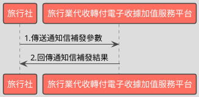

# 補發通知信API

> 本文件包含 **AES256 加密、SHA256 簽章** 規格，詳見下方對應章節

---

## API 基本資訊

| 項目 | 內容 |
|:-----|:-----|
| 副標題 | 補發收據開立、作廢單或折讓單 |
| 串接方式 | 幕後 |
| Content-Type | `application/x-www-form-urlencoded` |
| 加密方式 | AES256、SHA256 |
| 正式環境 URL | https://api.travelinvoice.com.tw/notification_resend |
| 測試環境 URL | https://capi.travelinvoice.com.tw/notification_resend |

---

## 欄位定義

### Post 參數（請求） [POST]

| 欄位名稱 | 中文說明 | 型別 | 長度 | 必填 | 預設值 | 允許值 | 可為空 | 範例 | 備註 |
|----------|----------|------|------|------|--------|--------|--------|------|------|
| MerchantID_ | 旅行社統一編號 | string | 8 | 必填 |  |  |  | 54352706 | 旅行社統一編號。 |
| PostData_ | 加密資料 | array |  | 必填 |  |  |  |  | 字串欄位組合後做AES256加密，欄位說明如下表 |

### PostData_內含欄位（請求）　AES加密_字串

| 欄位名稱 | 中文說明 | 型別 | 長度 | 必填 | 預設值 | 允許值 | 可為空 | 範例 | 備註 |
|----------|----------|------|------|------|--------|--------|--------|------|------|
| Version | 串接程式版本 | string | 5 | 必填 |  | 2.0 |  | 2.0 | 固定帶 2.0 |
| TimeStamp | 時間戳記 | string | 30 | 必填 |  |  |  | 1400137200 | 自從 Unix 纪元（格林威治時間 1970 年1 月 1 日 00:00:00）到當前時間的秒數，若以 php 程式語言為例，即為呼叫time()函式所回傳的值。 例：2014-05-15 15:00:00 這個時間的時間，戳記為 1400137200，建議帶入當前時間 |
| MailType | 發信類型 | int | 1 | 必填 |  | 1,2,3 |  | 1 | 依據所需發信的類型，給予對應參數。 1=開立信 2=折讓 3=作廢 |
| InvoiceNumber | 收據號碼 | string | 9 | 必填 |  |  |  | T13671008 | 此次查詢的收據號碼。 |
| SystemCorrespondNo | 折讓、作廢流水號 | string | 20 | 條件必填 |  |  |  | 8952 | 此次補發信的折讓單號或作廢單號。若 MailType 為 2 或 3 才需傳入 |
| BuyerEmail | 收件人 Email | string | 100 | 必填 |  |  |  | abc@gmail.com | 此次補發信的 Mail 信箱，可用半型逗號 區隔多信箱。 |

### 系統回應訊息（回應）

| 欄位名稱 | 中文說明 | 型別 | 長度 | 範例 | 必回傳 | 備註 |
|----------|----------|------|------|------|--------|------|
| Status | 回傳狀態 | int | 10 | SUCCESS | Y | 1.查詢成功，則回傳 SUCCESS 2.查詢失敗，則回傳錯誤代碼 |
| Message | 回傳訊息 | string | 30 | 成功 | Y | 文字，此次回傳狀態說明 |
| MerchantID | 旅行社統一編號 | string | 8 | 54352706 | Y | 旅行社統一編號。 |
| CheckCode | 檢查碼 | string | 150 | A791D7C1D64093962939B54CC1C07E8109EB8C454E0DC18F822BBA076EB38E66 |  | 用來檢查此次資料回傳的合法性，串接時可以比對此參數資料，來檢核是否為平台所回傳，檢核方法請參考”SHA256加密說明”。如開立失敗則回傳空值。  CheckCode = 將InvoiceTransNo,MerchantID,MerchantOrderNo,RandomNum,TotalAmt依 SHA256 簽章規格計算所得之雜湊值  InvoiceTransNo ,MerchantOrderNo, RandomNum, TotalAmt不含在此API回應欄位中，需讓程式由InvoiceNumber（收據號碼）於資料庫中來取得這4個欄位資料。 |
| EndStr | 字串結尾 | string | 2 | ## | Y | 固定回傳 ##，使用 String 方式接收資料的用戶，須 多判斷 EndStr=##，確保資料傳遞完整。 |

---

## 錯誤代碼

> 以下錯誤代碼均於 **HTTP 200** 回應中回傳，錯誤訊息包含於 response body。

| 代碼 | 說明 |
|------|------|
| KEY10001 | 非旅行社 API 串接 IP |
| KEY10002 | 資料解密錯誤 |
| KEY10003 | 版本錯誤 |
| KEY10004 | 資料不齊全 |
| KEY10006 | 旅行社未申請啟用電子收據 |
| KEY10007 | 頁面停留超過 30 分鐘 |
| KEY10009 | 取不到旅行社統一編號的資料 |
| KEY10010 | 旅行社統一編號空白 |
| KEY10011 | PostData_欄位空白 |
| KEY10012 | 資料傳遞錯誤 |
| KEY10013 | 資料空白 |
| KEY10014 | TimeOut。通常泛指 I/O 上的 time out |
| KEY10015 | 收據金額格式錯誤 |
| KEY10016 | 旅行社無申請郵遞列印加值服務 |
| KEY10017 | 郵遞列印加值服務可用數不足 |
| KEY10018 | 開立人欄位未填寫 |
| KEY10019 | 旅行社已被停權 |
| NOR10001 | 網路連線異常 |
| INV70001 | 欄位資料格式錯誤 |
| SM10001 | 發信種類錯誤（請檢查 MailType 欄位） |
| SM10002 | 通知信信箱錯誤（請檢查 BuyerEmail 欄位） |
| BS10006 | 查無收據資料 |
| BS10015 | 折讓單號未填寫 |
| BS10016 | 作廢單號未填寫 |
| BS10017 | 查無折讓單資料 |
| BS10018 | 查無作廢單資料 |

---

## 串接範例

### 請求範例

> 示範用 Key：`12345678901234567890123456789012`（32 bytes）　IV：`1234567890123456`（16 bytes）

> 外層請求參數組合格式：**String**，各必填欄位以 `欄位名稱=值` 形式，以 `&` 符號串接後傳送，簡單字串拼接 key=value&key=value，不做 URL encode

```http
POST https://api.travelinvoice.com.tw/notification_resend
Content-Type: application/x-www-form-urlencoded

MerchantID_=54352706&PostData_=78942f0afca77d7e464726ee053b1018da04ae2ecb132f4db2e693b79a1523d2fffc17dabe64c7f6db81d910d87713612a783397d05fcb4ae2ae1f4b2e810456b1648c307bbb25cc9ac6f3403735f51c906825714f2f18d6a0e746c55c088352
```

**PostData_（AES加密_字串）加密前明文（必填欄位）**

> 加密：AES-256-CBC，輸出：Hex，Key 與 IV 同上
> 欄位組合格式：**String**，各必填欄位以 `欄位名稱=值` 形式，以 `&` 符號串接後加密

```
Version=2.0&TimeStamp=1400137200&MailType=1&InvoiceNumber=T13671008&BuyerEmail=abc@gmail.com
```

### 成功回應範例

> 回傳內容為 URL Encoded 字串，接收後請先進行 **URL Decode** 再解析。
> 注意：PHP 的 `parse_str()` 已內建 URL Decode；其他語言（Java、Python 等）請先手動 `urldecode` 後再逐欄解析。

> 外層回應格式：**String**，各欄位以 `欄位名稱=值` 形式，以 `&` 符號串接後回傳

**系統回應**

```
Status=SUCCESS&Message=成功&MerchantID=54352706&CheckCode=A791D7C1D64093962939B54CC1C07E8109EB8C454E0DC18F822BBA076EB38E66&EndStr=##
```

> 本 API 回應無加密欄位，上方字串即為完整明文。

### 失敗回應範例

> 回傳內容為 URL Encoded 字串，接收後請先進行 **URL Decode** 再解析。
> 注意：PHP 的 `parse_str()` 已內建 URL Decode；其他語言（Java、Python 等）請先手動 `urldecode` 後再逐欄解析。

**系統回應**

```
Status=KEY10001&Message=非旅行社 API 串接 IP&MerchantID=54352706&EndStr=##
```

---

## 串接目的

1.提供旅行商業同業公會旗下會員，透過程式串接方式，來進行通知信補發。 
2.此 API 以發信類型(MailType)來區分要補發收據開立、作廢單或折讓單，並須指定 要補發的 EAMIL 信箱來達成通知信補發目的。 
3.本平台未提供媒體申報之相關機制與作業，旅行社請自行進行相關作業。

## 資料交換方式

1. 旅行社以「HTTP POST」方式傳送收據資料至電子收據平台進行開立。 
2. Content-Type 為 application/x-www-form-urlencoded。 
3. 編碼格式為 UTF-8。 
4. 電子收據平台回應格式化的字串。 
5. 各欄位計算單位為字元。中、英、數字、符號都算一個字元。 
6. 各欄位間以「&」作為連接符號，各欄位內不得含有此字元（U+0026）。

## 串接前置作業

（請先完成，否則程式必失敗）

 1. 取得 HashKey / HashIV
- 測試環境：登入測試區後台 → 基本資料 → API 串接設定 → 複製 HashKey 與 HashIV
- 正式環境：登入正式區後台 → 基本資料 → API 串接設定 → 複製 HashKey 與 HashIV

2. 申請 IP 白名單
- 申請窗口：於官網下載申請表單並填寫後，傳送後客服中心（傳真 / Email）
- 最多可設定 10 組 IP
- 需提供：伺服器對外 IP（非內網 IP，可至 https://ifconfig.me 查詢）
- 生效時間：通常 1-2 個工作天

3. 環境網址
-測試環境與正式環境是完全不同的設備，資料不共通，上線前務必要確認已經將串接網址切換至正式區網址

4. 常見「忘記做前置作業」的錯誤訊號
- `KEY10001 非旅行社 API 串接 IP` → IP 白名單未設定或設錯
- `KEY10002 資料解密錯誤` → HashKey / HashIV 不正確或仍是範例值
- `KEY10009 取不到旅行社統一編號的資料` → MerchantID 錯或未啟用

## 通知信補發呼叫流程圖



---

---

## AES256 加密規格

### 加密演算法規格

| 項目 | 規格 |
|:-----|:-----|
| 演算法 | AES |
| 金鑰長度 | 256 bits（32 bytes） |
| 加密模式 | CBC |
| 填充方式 | 類 PKCS7（32-byte 邊界，非標準） |
| 輸出格式 | Hex 十六進位 |
| 輸入編碼 | UTF-8 |
| Key 長度 | 32 bytes |
| IV 長度 | 16 bytes |

> ⚠️ **注意：本 API 採用類 PKCS7 演算法，但以 32 bytes 為填充邊界（非 AES 標準的 16 bytes），必須特別處理**
>
> 標準 PKCS7 以 AES block size（**16 bytes**）為補齊單位；本 API 採用 **32 bytes** 作為填充邊界，屬類 PKCS7 的自訂規格。
> 各語言標準加密函式庫（PHP `openssl`、Node.js `crypto`、Python `pycryptodome`）的預設 PKCS7 均使用 16-byte 邊界，**直接呼叫內建 PKCS7 將產生錯誤的填充**，導致對方解密失敗。
> **實作時必須手動計算 32-byte 邊界填充，並停用函式庫的自動填充**（PHP：`OPENSSL_ZERO_PADDING`；Node.js：`cipher.setAutoPadding(false)`；Python：`pad(..., 32)`）。

### 適用欄位群組

- **PostData_內含欄位**（AES加密_字串）（請求）　傳送欄位名稱：`PostData_`

### 加密範例

> 以下為固定示範數值，**請勿用於正式環境**。
> 本範例已採用類 PKCS7（32-byte 邊界）填充計算，與標準 PKCS7（16-byte 邊界）結果**不同**。

| 項目 | 值 |
|:-----|:---|
| Key（ASCII，32 bytes） | `12345678901234567890123456789012` |
| IV（ASCII，16 bytes） | `1234567890123456` |
| 加密前字串（plaintext） | `Version=2.0&TimeStamp=1400137200&MailType=1&InvoiceNumber=T13671008&BuyerEmail=abc@gmail.com` |
| 加密後（Hex 十六進位） | `78942f0afca77d7e464726ee053b1018da04ae2ecb132f4db2e693b79a1523d2fffc17dabe64c7f6db81d910d87713612a783397d05fcb4ae2ae1f4b2e810456b1648c307bbb25cc9ac6f3403735f51c906825714f2f18d6a0e746c55c088352` |

> 驗證方法：使用上述 Key / IV 對加密後字串解密，應還原為加密前字串。

---

## SHA256 簽章規格

### 簽章規格

| 項目 | 規格 |
|:-----|:-----|
| 演算法 | SHA-256 |
| 輸出格式 | 十六進位字串（大寫） |
| Key 欄位名稱 | `HashKey` |
| IV 欄位名稱 | `HashIV` |
| 字串組合方式 | **前IV後KEY** |
| 參與簽章欄位 | `InvoiceTransNo,MerchantID,MerchantOrderNo,RandomNum,TotalAmt` |

### 字串組合說明

組合方式：**前IV後KEY**

參與簽章的欄位（依下列順序排列）：`InvoiceTransNo`、`MerchantID`、`MerchantOrderNo`、`RandomNum`、`TotalAmt`

> **欄位順序**：組合字串時，請依照本文件設定的欄位清單順序排列，**不可任意調換**。

```
HashIV={IV值}&{欄位1}={值1}&...&HashKey={Key值}
```

以 `HashIV={iv}` 開頭，接各參與欄位（依序），最後以 `HashKey={key}` 結尾，各段以 `&` 分隔。

### 簽章範例

> 以下為固定示範數值，**請勿用於正式環境**。

| 項目 | 值 |
|:-----|:---|
| HashKey | `abc1234567890def` |
| HashIV | `xyz0987654321uvw` |
| InvoiceTransNo | `SampleValue` |
| MerchantID | `54352706` |
| MerchantOrderNo | `SampleValue` |
| RandomNum | `SampleValue` |
| TotalAmt | `SampleValue` |
| **組合後字串** | `HashIV=xyz0987654321uvw&InvoiceTransNo=SampleValue&MerchantID=54352706&MerchantOrderNo=SampleValue&RandomNum=SampleValue&TotalAmt=SampleValue&HashKey=abc1234567890def` |
| **SHA256 雜湊（大寫）** | `8D8A6A2370BB658300300B34E7FEB2DF6D1BE63B89A4E82A0F2CF867B971CDD5` |

> 驗證方法：將上述組合後字串進行 SHA256 計算並轉大寫，應得到上方雜湊值。

---

## 程式碼範例

### PHP

```php
<?php
/**
 * IMPORTANT: Key and IV values differ between production and test environments — confirm you have obtained the correct credentials for the target environment before use;
 * Replace all placeholder constants (e.g. YOUR_HASH_KEY_HERE) with real values before running this code — the code will block and display an error if placeholders are detected
 */

// Configuration Constants
define('MERCHANT_ID', 'YOUR_MERCHANT_ID_HERE');

// 32 bytes — used for both AES-256 encryption and SHA256 signature HashKey
define('API_KEY', 'YOUR_API_KEY_HERE');

// 16 bytes — used for both AES-256 IV and SHA256 signature HashIV. 
// IV length is 16 bytes because AES native block size is fixed at 16 bytes.
define('API_IV', 'YOUR_API_IV_HERE');

// Target Endpoint (Set to testing environment by default)
define('API_ENDPOINT', 'https://capi.travelinvoice.com.tw/notification_resend');

// Check if critical configurations are still set to placeholder values
$hasPlaceholder = (
    MERCHANT_ID === 'YOUR_MERCHANT_ID_HERE' ||
    API_KEY === 'YOUR_API_KEY_HERE' ||
    API_IV === 'YOUR_API_IV_HERE'
);

// Simulated database record used for validating the response CheckCode signature.
// In production, these variables must be pulled from the system database using the InvoiceNumber.
$mockDatabaseRecord = [
    'InvoiceTransNo'  => 'TX89101112',
    'MerchantOrderNo' => 'ORD20231024001',
    'RandomNum'       => '4321',
    'TotalAmt'        => '5000'
];

/**
 * Encrypts a plaintext string using AES-256-CBC with custom PKCS7 padding aligned to 32 bytes.
 *
 * @param string $plaintext The plaintext data string.
 * @param string $key The 32-byte encryption key.
 * @param string $iv The 16-byte initialization vector.
 * @throws Exception If encryption fails.
 * @return string Hexadecimal representation of encrypted string.
 */
function aes256_encrypt_pkcs7_b32($plaintext, $key, $iv) {
    /* NON-STANDARD AES PADDING: PKCS7 with Block Size 32
     * Standard AES uses PKCS7 padding aligned to a 16-byte block size (AES native block size).
     * This API uses a non-standard variant where PKCS7 padding is aligned to 32 bytes.
     * paddingLen = 32 - (plaintext.length % 32), result is always in range 1–32.
     * Each padding byte value equals paddingLen.
     * Apply this padding manually; use the cipher's ZERO_PADDING / no-padding flag
     * to prevent the library from applying its own PKCS7 padding. */
    $blockSize = 32;
    $plaintextLength = strlen($plaintext);
    $paddingLen = $blockSize - ($plaintextLength % $blockSize);
    $paddedPlaintext = $plaintext . str_repeat(chr($paddingLen), $paddingLen);

    $encryptedBytes = openssl_encrypt(
        $paddedPlaintext,
        'AES-256-CBC',
        $key,
        OPENSSL_RAW_DATA | OPENSSL_ZERO_PADDING,
        $iv
    );

    if ($encryptedBytes === false) {
        throw new Exception('OpenSSL encryption failed.');
    }

    return bin2hex($encryptedBytes);
}

/**
 * Verification
 *
 * Reconstructs the SHA256 signature string from the response parameters and simulated database records
 * to verify response validity. Keys and IVs are concatenated directly without URL encoding.
 *
 * @param string $iv IV parameter (HashIV)
 * @param string $invoiceTransNo Invoice transaction serial number
 * @param string $merchantId Travel agency tax ID
 * @param string $merchantOrderNo Unique merchant transaction ID
 * @param string $randomNum Validation random sequence
 * @param string $totalAmt Transaction amount
 * @param string $key Key parameter (HashKey)
 * @return string Upper-case hexadecimal SHA-256 checksum
 */
function verify_sha256_signature($iv, $invoiceTransNo, $merchantId, $merchantOrderNo, $randomNum, $totalAmt, $key) {
    $rawString = 'HashIV=' . $iv .
                 '&InvoiceTransNo=' . $invoiceTransNo .
                 '&MerchantID=' . $merchantId .
                 '&MerchantOrderNo=' . $merchantOrderNo .
                 '&RandomNum=' . $randomNum .
                 '&TotalAmt=' . $totalAmt .
                 '&HashKey=' . $key;

    return strtoupper(hash('sha256', $rawString));
}

// Variables to store form execution state
$apiResponse = null;
$validationStatus = '';
$processingError = '';

if ($_SERVER['REQUEST_METHOD'] === 'POST' && !$hasPlaceholder) {
    try {
        $mailType = isset($_POST['MailType']) ? (int)$_POST['MailType'] : 1;
        $invoiceNumber = isset($_POST['InvoiceNumber']) ? trim($_POST['InvoiceNumber']) : '';
        $buyerEmail = isset($_POST['BuyerEmail']) ? trim($_POST['BuyerEmail']) : '';
        $systemCorrespondNo = isset($_POST['SystemCorrespondNo']) ? trim($_POST['SystemCorrespondNo']) : '';

        if ($invoiceNumber === '' || $buyerEmail === '') {
            throw new Exception('Required input parameters are missing.');
        }

        if (($mailType === 2 || $mailType === 3) && $systemCorrespondNo === '') {
            throw new Exception('SystemCorrespondNo is required for Allowance (2) or Void (3) mail types.');
        }

        $innerFields = [
            'Version' => '2.0',
            'TimeStamp' => (string)time(),
            'MailType' => (string)$mailType,
            'InvoiceNumber' => $invoiceNumber,
            'BuyerEmail' => $buyerEmail
        ];

        if ($mailType === 2 || $mailType === 3) {
            $innerFields['SystemCorrespondNo'] = $systemCorrespondNo;
        }

        // Build key=value string without URL encoding elements
        $keyValuePairs = [];
        foreach ($innerFields as $key => $value) {
            $keyValuePairs[] = $key . '=' . $value;
        }
        $plaintextString = implode('&', $keyValuePairs);

        // Encrypt PostData_
        $encryptedPostData = aes256_encrypt_pkcs7_b32($plaintextString, API_KEY, API_IV);

        // Prepare raw POST body parameters
        $postBody = http_build_query([
            'MerchantID_' => MERCHANT_ID,
            'PostData_'   => $encryptedPostData
        ]);

        // Initialize cURL transfer
        $ch = curl_init();
        if ($ch === false) {
            throw new Exception('Failed to initialize cURL.');
        }

        curl_setopt($ch, CURLOPT_URL, API_ENDPOINT);
        curl_setopt($ch, CURLOPT_POST, true);
        curl_setopt($ch, CURLOPT_POSTFIELDS, $postBody);
        curl_setopt($ch, CURLOPT_RETURNTRANSFER, true);
        curl_setopt($ch, CURLOPT_HTTPHEADER, [
            'Content-Type: application/x-www-form-urlencoded'
        ]);

        $responseString = curl_exec($ch);

        if ($responseString === false) {
            $errorMsg = curl_error($ch);
            throw new Exception('cURL Request Error: ' . $errorMsg);
        }

        // curl_close() has no effect in PHP 8.0+ and is intentionally omitted.

        // Verify trailing characters structure
        $responseString = trim($responseString);
        if (substr($responseString, -2) !== '##') {
            throw new Exception('Malformed payload received from remote API (Missing correct termination sequence).');
        }

        // Parse standard string response format into associative values
        $sanitizedResponse = rtrim($responseString, '#');
        parse_str($sanitizedResponse, $apiResponse);

        $status = $apiResponse['Status'] ?? '';
        $checkCode = $apiResponse['CheckCode'] ?? '';

        if ($status === 'SUCCESS' && $checkCode !== '') {
            // Recompute SHA256 checksum using simulated database attributes and key configurations
            $expectedSignature = verify_sha256_signature(
                API_IV,
                $mockDatabaseRecord['InvoiceTransNo'],
                MERCHANT_ID,
                $mockDatabaseRecord['MerchantOrderNo'],
                $mockDatabaseRecord['RandomNum'],
                $mockDatabaseRecord['TotalAmt'],
                API_KEY
            );

            // Use timing attack safe hash_equals method for string comparisons
            if (hash_equals($expectedSignature, $checkCode)) {
                $validationStatus = 'VERIFIED';
            } else {
                $validationStatus = 'FAILED (Signature mismatch)';
            }
        } else {
            $validationStatus = 'SKIPPED (API responded with error)';
        }

    } catch (Exception $e) {
        $processingError = $e->getMessage();
    }
}
?>
<!DOCTYPE html>
<html lang="en">
<head>
    <meta charset="UTF-8">
    <meta name="viewport" content="width=device-width, initial-scale=1.0">
    <title>Resend Notification API Demo</title>
    <style>
        body {
            font-family: -apple-system, BlinkMacSystemFont, "Segoe UI", Roboto, Helvetica, Arial, sans-serif;
            line-height: 1.5;
            background-color: #f4f6f8;
            color: #333;
            margin: 0;
            padding: 20px;
        }
        .container {
            max-width: 800px;
            margin: 0 auto;
            background-color: #ffffff;
            padding: 30px;
            border-radius: 8px;
            box-shadow: 0 4px 6px rgba(0, 0, 0, 0.1);
        }
        h1, h2 {
            color: #0c2340;
            margin-top: 0;
        }
        .alert {
            background-color: #f8d7da;
            color: #721c24;
            border: 1px solid #f5c6cb;
            padding: 15px;
            border-radius: 4px;
            margin-bottom: 20px;
        }
        .form-group {
            margin-bottom: 15px;
        }
        label {
            display: block;
            font-weight: bold;
            margin-bottom: 5px;
        }
        input[type="text"], select {
            width: 100%;
            padding: 10px;
            border: 1px solid #ccc;
            border-radius: 4px;
            box-sizing: border-box;
            font-size: 14px;
        }
        button {
            background-color: #007bff;
            color: white;
            padding: 12px 20px;
            border: none;
            border-radius: 4px;
            cursor: pointer;
            font-size: 16px;
        }
        button:hover {
            background-color: #0056b3;
        }
        .result-box {
            background-color: #e9ecef;
            padding: 15px;
            border-radius: 4px;
            margin-top: 20px;
            word-break: break-all;
        }
        pre {
            white-space: pre-wrap;
            margin: 0;
            font-size: 13px;
        }
        .status-badge {
            display: inline-block;
            padding: 4px 8px;
            border-radius: 4px;
            font-size: 12px;
            font-weight: bold;
            color: #fff;
        }
        .badge-success { background-color: #28a745; }
        .badge-danger { background-color: #dc3545; }
        .badge-warning { background-color: #ffc107; color: #333; }
        .info-box {
            background-color: #e2f0d9;
            border: 1px solid #c5e0b4;
            color: #385723;
            padding: 10px 15px;
            border-radius: 4px;
            margin-bottom: 20px;
            font-size: 13px;
        }
    </style>
</head>
<body>

<div class="container">
    <h1>Resend Notification Client (PHP 7.4+ Compatibility Demo)</h1>

    <?php if ($hasPlaceholder): ?>
        <div class="alert">
            <strong>Security Protection:</strong> Integration credentials (MERCHANT_ID, API_KEY, or API_IV) have not been configured. 
            Please configure actual operational parameters inside the source code to run API tests.
        </div>
    <?php else: ?>

        <div class="info-box">
            <strong>Simulated Database Mapping:</strong> The verification subsystem uses mock credentials matching invoice <code>T13671008</code> to successfully trace SHA256 signatures. Ensure matching credentials in test runs.
        </div>

        <form method="POST" action="">
            <div class="form-group">
                <label for="MailType">MailType (Resend Type) *</label>
                <select name="MailType" id="MailType" required onchange="toggleCorrespondNo(this.value)">
                    <option value="1">1 - Issue Notification (開立信)</option>
                    <option value="2">2 - Allowance Notification (折讓單)</option>
                    <option value="3">3 - Void Notification (作廢單)</option>
                </select>
            </div>

            <div class="form-group">
                <label for="InvoiceNumber">Invoice Number *</label>
                <input type="text" name="InvoiceNumber" id="InvoiceNumber" value="T13671008" required maxlength="9">
            </div>

            <div class="form-group" id="correspondNoGroup" style="display: none;">
                <label for="SystemCorrespondNo">SystemCorrespondNo (Allowance / Void ID) *</label>
                <input type="text" name="SystemCorrespondNo" id="SystemCorrespondNo" value="8952" maxlength="20">
            </div>

            <div class="form-group">
                <label for="BuyerEmail">Buyer Email(s) * (comma separated for multiple entries)</label>
                <input type="text" name="BuyerEmail" id="BuyerEmail" value="abc@gmail.com" required maxlength="100">
            </div>

            <button type="submit">Send Resend Notification Request</button>
        </form>

        <?php if ($processingError !== ''): ?>
            <div class="result-box" style="border-left: 5px solid #dc3545;">
                <h3 style="color: #dc3545; margin-top:0;">Processing Exception Occurred</h3>
                <p><?php echo htmlspecialchars($processingError); ?></p>
            </div>
        <?php endif; ?>

        <?php if ($apiResponse !== null): ?>
            <div class="result-box">
                <h2>API Response Payload</h2>
                <table style="width:100%; border-collapse: collapse; margin-bottom: 15px;">
                    <tr>
                        <td style="padding: 8px; font-weight: bold; border-bottom: 1px solid #ddd;">Status Code:</td>
                        <td style="padding: 8px; border-bottom: 1px solid #ddd;">
                            <?php 
                            $respStatus = htmlspecialchars($apiResponse['Status'] ?? 'UNDEFINED');
                            if ($respStatus === 'SUCCESS'): ?>
                                <span class="status-badge badge-success">SUCCESS</span>
                            <?php else: ?>
                                <span class="status-badge badge-danger"><?php echo $respStatus; ?></span>
                            <?php endif; ?>
                        </td>
                    </tr>
                    <tr>
                        <td style="padding: 8px; font-weight: bold; border-bottom: 1px solid #ddd;">Response Message:</td>
                        <td style="padding: 8px; border-bottom: 1px solid #ddd;"><?php echo htmlspecialchars($apiResponse['Message'] ?? ''); ?></td>
                    </tr>
                    <tr>
                        <td style="padding: 8px; font-weight: bold; border-bottom: 1px solid #ddd;">MerchantID:</td>
                        <td style="padding: 8px; border-bottom: 1px solid #ddd;"><?php echo htmlspecialchars($apiResponse['MerchantID'] ?? ''); ?></td>
                    </tr>
                    <tr>
                        <td style="padding: 8px; font-weight: bold; border-bottom: 1px solid #ddd;">CheckCode Signature:</td>
                        <td style="padding: 8px; border-bottom: 1px solid #ddd; font-family: monospace; font-size:12px;"><?php echo htmlspecialchars($apiResponse['CheckCode'] ?? 'N/A'); ?></td>
                    </tr>
                    <tr>
                        <td style="padding: 8px; font-weight: bold; border-bottom: 1px solid #ddd;">Integrity Check (CheckCode):</td>
                        <td style="padding: 8px; border-bottom: 1px solid #ddd;">
                            <?php if ($validationStatus === 'VERIFIED'): ?>
                                <span class="status-badge badge-success">VERIFIED (Valid response signature origin)</span>
                            <?php elseif (substr($validationStatus, 0, 6) === 'FAILED'): ?>
                                <span class="status-badge badge-danger">FAILED (Checksum authentication failed)</span>
                            <?php else: ?>
                                <span class="status-badge badge-warning"><?php echo htmlspecialchars($validationStatus); ?></span>
                            <?php endif; ?>
                        </td>
                    </tr>
                </table>

                <h3>Raw Parsed Response Matrix:</h3>
                <pre><?php echo htmlspecialchars(print_r($apiResponse, true)); ?></pre>
            </div>
        <?php endif; ?>

    <?php endif; ?>
</div>

<script>
    function toggleCorrespondNo(val) {
        const group = document.getElementById('correspondNoGroup');
        const input = document.getElementById('SystemCorrespondNo');
        if (val === '2' || val === '3') {
            group.style.display = 'block';
            input.setAttribute('required', 'required');
        } else {
            group.style.display = 'none';
            input.removeAttribute('required');
        }
    }
    // Set initial display based on current selection
    document.addEventListener("DOMContentLoaded", function() {
        const select = document.getElementById('MailType');
        if(select) {
            toggleCorrespondNo(select.value);
        }
    });
</script>
</body>
</html>
```

