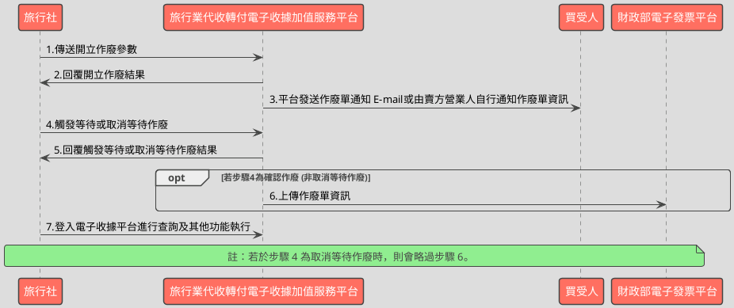

# 觸發或取消作廢資料API

> 本文件包含 **AES256 加密、SHA256 簽章** 規格，詳見下方對應章節

---

## API 基本資訊

| 項目 | 內容 |
|:-----|:-----|
| 副標題 | 觸發或取消作廢資料 |
| 串接方式 | 幕後 |
| Content-Type | `application/x-www-form-urlencoded` |
| 加密方式 | AES256、SHA256 |
| 正式環境 URL | https://api.travelinvoice.com.tw/invalid_touch_issue |
| 測試環境 URL | https://capi.travelinvoice.com.tw/invalid_touch_issue |

---

## 欄位定義

### Post 參數（請求） [POST]

| 欄位名稱 | 中文說明 | 型別 | 長度 | 必填 | 預設值 | 允許值 | 可為空 | 範例 | 備註 |
|----------|----------|------|------|------|--------|--------|--------|------|------|
| MerchantID_ | 旅行社統一編號 | string | 8 | 必填 |  |  |  | 54352706 | 旅行社統一編號。 |
| PostData_ | 加密資料 | array |  | 必填 |  |  |  |  | 字串欄位組合後做AES256加密，欄位說明如下表 |

### PostData_內含欄位（請求）　AES加密_字串

| 欄位名稱 | 中文說明 | 型別 | 長度 | 必填 | 預設值 | 允許值 | 可為空 | 範例 | 備註 |
|----------|----------|------|------|------|--------|--------|--------|------|------|
| Version | 串接程式版本 | string | 5 | 必填 |  | 1.0 |  | 1.0 | 固定帶 1.0 |
| TimeStamp | 時間戳記 | string | 30 | 必填 |  |  |  | 1400137200 | 自從 Unix 纪元（格林威治時間 1970 年1 月 1 日 00:00:00）到當前時間的秒數，若以 php 程式語言為例，即為呼叫 time()函式所回傳的值。 例：2014-05-15 15:00:00 這個時間的時間，戳記為 1400137200，建議帶入當前時間 |
| InvalidStatus | 觸發作廢狀態 | int | 1 | 必填 |  | 1,2 |  | 1 | 1 = 確認作廢。 2 = 取消作廢。 |
| InvalidNo | 作廢單流水號 | string | 20 | 必填 |  |  |  | 586 | 開立等待作廢時系統回應的作廢單流水 號。 |

### 系統回應訊息（回應）

| 欄位名稱 | 中文說明 | 型別 | 長度 | 範例 | 必回傳 | 備註 |
|----------|----------|------|------|------|--------|------|
| Status | 回傳狀態 | string | 10 | SUCCESS | Y | 1.作廢單開立成功，則回傳 SUCCESS 2.作廢單開立失敗，則回傳錯誤代碼 |
| Message | 回傳訊息 | string | 30 | 成功 | Y | 文字，此次回傳狀態說明 |
| MerchantID | 旅行社代號 | string | 8 | 70565326 |  | 旅行社統一編號 |
| InvalidNo | 作廢單流水號 | string | 20 | 8294 |  | 此次開立作廢或取消作廢的作廢單流水號。 |
| InvoiceNumber | 收據號碼 | string | 9 | T13671008 |  | 此次作廢收據或等待作廢的收據號碼。 |
| CheckCode | 檢查碼 | string | 150 | 12C6AC3A3EEDD074B01ECB3D5731579EB75D83FB8A31907F0D1C564468AD8C49 |  | 用來檢查此次資料回傳的合法性，串接時可以比對此參數資料，來檢核是否為平台所回傳，檢核方法請參考”SHA256加密說明”。如開立失敗則回傳空值。  CheckCode = 將 InvoiceTransNo, MerchantID, MerchantOrderNo, RandomNum, TotalAmt 依 SHA256 簽章規格計算所得之雜湊值  InvoiceTransNo ,MerchantOrderNo, RandomNum, TotalAmt不含在此API回應欄位中，需讓程式由InvoiceNumber（收據號碼）於資料庫中來取得這4個欄位資料。 |
| EndStr | 字串結尾 | string | 2 | ## | Y | 固定回傳 ##，使用 String 方式接收資料的用戶，須多判斷 EndStr=##，確保資料傳遞完整。 |

---

## 錯誤代碼

> 以下錯誤代碼均於 **HTTP 200** 回應中回傳，錯誤訊息包含於 response body。

| 代碼 | 說明 |
|------|------|
| KEY10001 | 非旅行社 API 串接 IP |
| KEY10002 | 資料解密錯誤 |
| KEY10003 | 版本錯誤 |
| KEY10004 | 資料不齊全 |
| KEY10006 | 旅行社未申請啟用電子收據 |
| KEY10007 | 頁面停留超過 30 分鐘 |
| KEY10009 | 取不到旅行社統一編號的資料 |
| KEY10010 | 旅行社統一編號空白 |
| KEY10011 | PostData_欄位空白 |
| KEY10012 | 資料傳遞錯誤 |
| KEY10013 | 資料空白 |
| KEY10014 | TimeOut。通常泛指 I/O 上的 time out |
| KEY10015 | 收據金額格式錯誤 |
| KEY10019 | 旅行社已被停權 |
| NOR10001 | 網路連線異常 |
| INV10015 | 欄位資料長度有誤 |
| LIB10001 | 該收據非開立成功的收據 |
| LIB10002 | 經辨名稱未填寫 |
| LIB10004 | 確認作廢方式有誤 |
| LIB10005 | 收據已作廢過 |
| LIB10006 | 觸發作廢狀態有誤 |
| LIB10007 | 該張收據已執行過收據折讓，無法作廢 |
| LIB10008 | 超過可作廢期限 |
| LIB10009 | 無此作廢資料 |
| LIB10010 | 該作廢資料已被取消作廢 |
| LIB10011 | 該作廢資料狀態為作廢失敗，不可再作廢 |

---

## 串接範例

### 請求範例

> 示範用 Key：`12345678901234567890123456789012`（32 bytes）　IV：`1234567890123456`（16 bytes）

> 外層請求參數組合格式：**String**，各必填欄位以 `欄位名稱=值` 形式，以 `&` 符號串接後傳送，簡單字串拼接 key=value&key=value，不做 URL encode

```http
POST https://api.travelinvoice.com.tw/invalid_touch_issue
Content-Type: application/x-www-form-urlencoded

MerchantID_=54352706&PostData_=672781a0cacae60a9e8bf6e0866d113f5b90725edbb2af54aea18d6b41f6d8f3f3ba6f1dac666afe5ebe7c64e5092289fe04c8b7735ea8624c35bc27b6a44c99
```

**PostData_（AES加密_字串）加密前明文（必填欄位）**

> 加密：AES-256-CBC，輸出：Hex，Key 與 IV 同上
> 欄位組合格式：**String**，各必填欄位以 `欄位名稱=值` 形式，以 `&` 符號串接後加密

```
Version=1.0&TimeStamp=1400137200&InvalidStatus=1&InvalidNo=586
```

### 成功回應範例

> 回傳內容為 URL Encoded 字串，接收後請先進行 **URL Decode** 再解析。
> 注意：PHP 的 `parse_str()` 已內建 URL Decode；其他語言（Java、Python 等）請先手動 `urldecode` 後再逐欄解析。

> 外層回應格式：**String**，各欄位以 `欄位名稱=值` 形式，以 `&` 符號串接後回傳

**系統回應**

```
Status=SUCCESS&Message=成功&MerchantID=70565326&InvalidNo=8294&InvoiceNumber=T13671008&CheckCode=12C6AC3A3EEDD074B01ECB3D5731579EB75D83FB8A31907F0D1C564468AD8C49&EndStr=##
```

> 本 API 回應無加密欄位，上方字串即為完整明文。

### 失敗回應範例

> 回傳內容為 URL Encoded 字串，接收後請先進行 **URL Decode** 再解析。
> 注意：PHP 的 `parse_str()` 已內建 URL Decode；其他語言（Java、Python 等）請先手動 `urldecode` 後再逐欄解析。

**系統回應**

```
Status=KEY10001&Message=非旅行社 API 串接 IP&EndStr=##
```

---

## 串接目的

1.串接前請先與客服中心聯繫申請 IP 設定，可設定之 IP 組數為： 10 組。
2.管理待確認的作廢資料，如直接確認作廢資料，或是取消這個待確認作廢資料

## 資料交換方式

1. 旅行社以「HTTP POST」方式傳送收據資料至電子收據平台進行作業。 
2. Content-Type 為 application/x-www-form-urlencoded。 
3. 編碼格式為 UTF-8。 
4. 電子收據平台回應格式化的字串。 
5. 各欄位計算單位為字元。中、英、數字、符號都算一個字元。 
6. 各欄位間以「&」作為連接符號，各欄位內不得含有此字元（U+0026）。

## 作業規範

1.如收據已經超過可作廢期限（開立後下一個單月15號前），那麼將無法執行直接確認的動作
2.已確認的作廢資料無法再一次確認
3.取消待確認作廢資料沒有期限問題

## 名詞定義

作廢單：每一次作廢收據，都會有一筆獨立的作廢記錄，稱之為作廢單或是作廢資料
等待作廢：等待消費者同意作廢前，收據仍是有效狀態，此時的作廢單稱為等待作廢

## 串接前置作業

（請先完成，否則程式必失敗）

 1. 取得 HashKey / HashIV
- 測試環境：登入測試區後台 → 基本資料 → API 串接設定 → 複製 HashKey 與 HashIV
- 正式環境：登入正式區後台 → 基本資料 → API 串接設定 → 複製 HashKey 與 HashIV

2. 申請 IP 白名單
- 申請窗口：於官網下載申請表單並填寫後，傳送後客服中心（傳真 / Email）
- 最多可設定 10 組 IP
- 需提供：伺服器對外 IP（非內網 IP，可至 https://ifconfig.me 查詢）
- 生效時間：通常 1-2 個工作天

3. 環境網址
-測試環境與正式環境是完全不同的設備，資料不共通，上線前務必要確認已經將串接網址切換至正式區網址

4. 常見「忘記做前置作業」的錯誤訊號
- `KEY10001 非旅行社 API 串接 IP` → IP 白名單未設定或設錯
- `KEY10002 資料解密錯誤` → HashKey / HashIV 不正確或仍是範例值
- `KEY10009 取不到旅行社統一編號的資料` → MerchantID 錯或未啟用

## 開立作廢流程－等待作廢



---

---

## AES256 加密規格

### 加密演算法規格

| 項目 | 規格 |
|:-----|:-----|
| 演算法 | AES |
| 金鑰長度 | 256 bits（32 bytes） |
| 加密模式 | CBC |
| 填充方式 | 類 PKCS7（32-byte 邊界，非標準） |
| 輸出格式 | Hex 十六進位 |
| 輸入編碼 | UTF-8 |
| Key 長度 | 32 bytes |
| IV 長度 | 16 bytes |

> ⚠️ **注意：本 API 採用類 PKCS7 演算法，但以 32 bytes 為填充邊界（非 AES 標準的 16 bytes），必須特別處理**
>
> 標準 PKCS7 以 AES block size（**16 bytes**）為補齊單位；本 API 採用 **32 bytes** 作為填充邊界，屬類 PKCS7 的自訂規格。
> 各語言標準加密函式庫（PHP `openssl`、Node.js `crypto`、Python `pycryptodome`）的預設 PKCS7 均使用 16-byte 邊界，**直接呼叫內建 PKCS7 將產生錯誤的填充**，導致對方解密失敗。
> **實作時必須手動計算 32-byte 邊界填充，並停用函式庫的自動填充**（PHP：`OPENSSL_ZERO_PADDING`；Node.js：`cipher.setAutoPadding(false)`；Python：`pad(..., 32)`）。

### 適用欄位群組

- **PostData_內含欄位**（AES加密_字串）（請求）　傳送欄位名稱：`PostData_`

### 加密範例

> 以下為固定示範數值，**請勿用於正式環境**。
> 本範例已採用類 PKCS7（32-byte 邊界）填充計算，與標準 PKCS7（16-byte 邊界）結果**不同**。

| 項目 | 值 |
|:-----|:---|
| Key（ASCII，32 bytes） | `12345678901234567890123456789012` |
| IV（ASCII，16 bytes） | `1234567890123456` |
| 加密前字串（plaintext） | `Version=1.0&TimeStamp=1400137200&InvalidStatus=1&InvalidNo=586` |
| 加密後（Hex 十六進位） | `672781a0cacae60a9e8bf6e0866d113f5b90725edbb2af54aea18d6b41f6d8f3f3ba6f1dac666afe5ebe7c64e5092289fe04c8b7735ea8624c35bc27b6a44c99` |

> 驗證方法：使用上述 Key / IV 對加密後字串解密，應還原為加密前字串。

---

## SHA256 簽章規格

### 簽章規格

| 項目 | 規格 |
|:-----|:-----|
| 演算法 | SHA-256 |
| 輸出格式 | 十六進位字串（大寫） |
| Key 欄位名稱 | `HashKey` |
| IV 欄位名稱 | `HashIV` |
| 字串組合方式 | **前IV後KEY** |
| 參與簽章欄位 | `InvoiceTransNo,MerchantID,MerchantOrderNo,RandomNum,TotalAmt` |

### 字串組合說明

組合方式：**前IV後KEY**

參與簽章的欄位（依下列順序排列）：`InvoiceTransNo`、`MerchantID`、`MerchantOrderNo`、`RandomNum`、`TotalAmt`

> **欄位順序**：組合字串時，請依照本文件設定的欄位清單順序排列，**不可任意調換**。

```
HashIV={IV值}&{欄位1}={值1}&...&HashKey={Key值}
```

以 `HashIV={iv}` 開頭，接各參與欄位（依序），最後以 `HashKey={key}` 結尾，各段以 `&` 分隔。

### 簽章範例

> 以下為固定示範數值，**請勿用於正式環境**。

| 項目 | 值 |
|:-----|:---|
| HashKey | `abc1234567890def` |
| HashIV | `xyz0987654321uvw` |
| InvoiceTransNo | `SampleValue` |
| MerchantID | `70565326` |
| MerchantOrderNo | `SampleValue` |
| RandomNum | `SampleValue` |
| TotalAmt | `SampleValue` |
| **組合後字串** | `HashIV=xyz0987654321uvw&InvoiceTransNo=SampleValue&MerchantID=70565326&MerchantOrderNo=SampleValue&RandomNum=SampleValue&TotalAmt=SampleValue&HashKey=abc1234567890def` |
| **SHA256 雜湊（大寫）** | `FC5DCE6E7581BEC6493F739C65A738AD8BAB203FBFAAFABA074D127E39D06D81` |

> 驗證方法：將上述組合後字串進行 SHA256 計算並轉大寫，應得到上方雜湊值。

---

## 程式碼範例

### PHP

```php
<?php
/**
 * IMPORTANT: Key and IV values differ between production and test environments — confirm you have obtained the correct credentials for the target environment before use.
 * Replace all placeholder constants (e.g. YOUR_API_KEY_HERE) with real values before running this code — the code will block and display an error if placeholders are detected.
 */

// 32 bytes — used for both AES-256 encryption and SHA256 signature (HashKey)
define('API_KEY', 'YOUR_API_KEY_HERE');
// 16 bytes — used for AES-256 encryption (AES IV) and SHA256 signature (HashIV). IV is 16 bytes because AES block size is fixed to 16 bytes.
define('API_IV', 'YOUR_API_IV_HERE');
define('MERCHANT_ID', 'YOUR_MERCHANT_ID_HERE');
define('API_URL', 'https://capi.travelinvoice.com.tw/invalid_touch_issue'); // Test environment endpoint

$setupError = null;
if (API_KEY === 'YOUR_API_KEY_HERE' || API_IV === 'YOUR_API_IV_HERE' || MERCHANT_ID === 'YOUR_MERCHANT_ID_HERE') {
    $setupError = 'Configuration Error: Please replace the placeholder values (API_KEY, API_IV, MERCHANT_ID) with your actual API credentials before running this script.';
}

/**
 * Encrypts the request data payload using AES-256-CBC with custom PKCS7 block size 32 padding.
 *
 * @param string $plaintext Query-string formatted plain text
 * @param string $key 32-byte AES key
 * @param string $iv 16-byte AES IV (fixed to 16 bytes due to AES block size)
 * @return string Hexadecimal encrypted string
 * @throws Exception If encryption fails
 */
function encryptPayload($plaintext, $key, $iv) {
    /* NON-STANDARD AES PADDING: PKCS7 with Block Size 32
     * Standard AES uses PKCS7 padding aligned to a 16-byte block size (AES native block size).
     * This API uses a non-standard variant where PKCS7 padding is aligned to 32 bytes.
     * paddingLen = 32 - (plaintext.length % 32), result is always in range 1–32.
     * Each padding byte value equals paddingLen.
     * Apply this padding manually; use the cipher's ZERO_PADDING / no-padding flag
     * to prevent the library from applying its own PKCS7 padding. */
    $blockSize = 32;
    $plaintextLen = strlen($plaintext);
    $paddingLen = $blockSize - ($plaintextLen % $blockSize);
    $paddedPlaintext = $plaintext . str_repeat(chr($paddingLen), $paddingLen);

    $encrypted = openssl_encrypt(
        $paddedPlaintext,
        'AES-256-CBC',
        $key,
        OPENSSL_RAW_DATA | OPENSSL_ZERO_PADDING,
        $iv
    );

    if ($encrypted === false) {
        throw new Exception('AES encryption failed via openssl_encrypt.');
    }

    return bin2hex($encrypted);
}

/**
 * Verification (驗證回應簽章)
 *
 * Calculates the SHA256 signature of the response data to verify authenticity.
 * Uses the parameters retrieved from the local database associated with the returned InvoiceNumber.
 *
 * @param string $invoiceTransNo Invoice Transaction Number from local database
 * @param string $merchantId Merchant Tax ID
 * @param string $merchantOrderNo Merchant Order Number from local database
 * @param string $randomNum Random Number from local database
 * @param string $totalAmt Total Amount from local database
 * @param string $hashIv Hash IV (same as API_IV)
 * @param string $hashKey Hash Key (same as API_KEY)
 * @return string Upper case hex SHA256 signature
 */
function verifyResponseSignature($invoiceTransNo, $merchantId, $merchantOrderNo, $randomNum, $totalAmt, $hashIv, $hashKey) {
    $rawString = 'HashIV=' . $hashIv .
                 '&InvoiceTransNo=' . $invoiceTransNo .
                 '&MerchantID=' . $merchantId .
                 '&MerchantOrderNo=' . $merchantOrderNo .
                 '&RandomNum=' . $randomNum .
                 '&TotalAmt=' . $totalAmt .
                 '&HashKey=' . $hashKey;

    return strtoupper(hash('sha256', $rawString));
}

$apiResult = null;
$errorMsg = null;
$signatureMatch = null;

if ($_SERVER['REQUEST_METHOD'] === 'POST' && !$setupError) {
    try {
        $invalidStatus = isset($_POST['invalid_status']) ? (int)$_POST['invalid_status'] : 1;
        $invalidNo = isset($_POST['invalid_no']) ? trim($_POST['invalid_no']) : '';

        if ($invalidNo === '') {
            throw new Exception('InvalidNo (作廢單流水號) is required.');
        }

        $postDataParams = [
            'Version' => '1.0',
            'TimeStamp' => (string)time(),
            'InvalidStatus' => (string)$invalidStatus,
            'InvalidNo' => $invalidNo
        ];

        $plaintextQuery = '';
        foreach ($postDataParams as $key => $val) {
            $plaintextQuery .= ($plaintextQuery === '' ? '' : '&') . $key . '=' . $val;
        }

        $encryptedPostData = encryptPayload($plaintextQuery, API_KEY, API_IV);

        $requestBody = [
            'MerchantID_' => MERCHANT_ID,
            'PostData_' => $encryptedPostData
        ];

        $ch = curl_init();
        curl_setopt($ch, CURLOPT_URL, API_URL);
        curl_setopt($ch, CURLOPT_POST, true);
        curl_setopt($ch, CURLOPT_POSTFIELDS, http_build_query($requestBody));
        curl_setopt($ch, CURLOPT_RETURNTRANSFER, true);
        curl_setopt($ch, CURLOPT_TIMEOUT, 30);
        curl_setopt($ch, CURLOPT_SSL_VERIFYPEER, true);

        $responseStr = curl_exec($ch);

        if ($responseStr === false) {
            throw new Exception('CURL Request failed: ' . curl_error($ch));
        }

        $httpCode = curl_getinfo($ch, CURLINFO_HTTP_CODE);
        if ($httpCode !== 200) {
            throw new Exception('API responded with non-200 HTTP status code: ' . $httpCode);
        }

        $isComplete = false;
        if (strlen($responseStr) >= 2 && substr($responseStr, -2) === '##') {
            $isComplete = true;
        }

        $cleanResponseStr = rtrim($responseStr, '#');
        $parsedResponse = [];
        $pairs = explode('&', $cleanResponseStr);
        foreach ($pairs as $pair) {
            $parts = explode('=', $pair, 2);
            if (count($parts) === 2) {
                $parsedResponse[urldecode($parts[0])] = urldecode($parts[1]);
            }
        }

        $apiResult = [
            'raw_response' => $responseStr,
            'is_complete' => $isComplete,
            'data' => $parsedResponse
        ];

        $receivedCheckCode = $parsedResponse['CheckCode'] ?? '';
        if ($receivedCheckCode !== '' && $receivedCheckCode !== 'null') {
            $dbInvoiceTransNo = isset($_POST['db_invoice_trans_no']) ? trim($_POST['db_invoice_trans_no']) : '';
            $dbMerchantOrderNo = isset($_POST['db_merchant_order_no']) ? trim($_POST['db_merchant_order_no']) : '';
            $dbRandomNum = isset($_POST['db_random_num']) ? trim($_POST['db_random_num']) : '';
            $dbTotalAmt = isset($_POST['db_total_amt']) ? trim($_POST['db_total_amt']) : '';

            $calculatedCheckCode = verifyResponseSignature(
                $dbInvoiceTransNo,
                MERCHANT_ID,
                $dbMerchantOrderNo,
                $dbRandomNum,
                $dbTotalAmt,
                API_IV,
                API_KEY
            );

            $signatureMatch = hash_equals($calculatedCheckCode, $receivedCheckCode);
            $apiResult['calculated_check_code'] = $calculatedCheckCode;
        }

    } catch (Exception $e) {
        $errorMsg = $e->getMessage();
    }
}
?>
<!DOCTYPE html>
<html lang="en">
<head>
    <meta charset="UTF-8">
    <meta name="viewport" content="width=device-width, initial-scale=1.0">
    <title>Trigger or Cancel Invalid Data API Client</title>
    <style>
        body { font-family: -apple-system, BlinkMacSystemFont, "Segoe UI", Roboto, Helvetica, Arial, sans-serif; line-height: 1.6; color: #333; max-width: 1000px; margin: 0 auto; padding: 20px; background-color: #f8f9fa; }
        h1 { border-bottom: 2px solid #0056b3; padding-bottom: 10px; color: #0056b3; }
        h2 { color: #333; margin-top: 30px; }
        .error-box { background-color: #f8d7da; color: #721c24; border: 1px solid #f5c6cb; padding: 15px; border-radius: 4px; margin-bottom: 20px; font-weight: bold; }
        .success-badge { background-color: #d4edda; color: #155724; border: 1px solid #c3e6cb; padding: 3px 8px; border-radius: 4px; display: inline-block; font-size: 0.9em; }
        .fail-badge { background-color: #f8d7da; color: #721c24; border: 1px solid #f5c6cb; padding: 3px 8px; border-radius: 4px; display: inline-block; font-size: 0.9em; }
        .grid { display: grid; grid-template-columns: 1fr 1fr; gap: 20px; }
        @media (max-width: 768px) { .grid { grid-template-columns: 1fr; } }
        .card { background: #fff; border: 1px solid #dee2e6; border-radius: 6px; padding: 20px; box-shadow: 0 2px 4px rgba(0,0,0,0.05); }
        .form-group { margin-bottom: 15px; }
        .form-group label { display: block; margin-bottom: 5px; font-weight: 600; font-size: 0.9em; color: #495057; }
        .form-group input, .form-group select { width: 100%; padding: 8px 12px; border: 1px solid #ced4da; border-radius: 4px; box-sizing: border-box; }
        .form-group .info-text { font-size: 0.8em; color: #6c757d; margin-top: 4px; }
        button { background-color: #0056b3; color: white; border: none; padding: 10px 20px; border-radius: 4px; cursor: pointer; font-size: 1em; width: 100%; font-weight: bold; }
        button:hover { background-color: #004085; }
        pre { background-color: #e9ecef; padding: 15px; border-radius: 4px; overflow-x: auto; font-size: 0.85em; }
        .field-table { width: 100%; border-collapse: collapse; margin-top: 10px; }
        .field-table th, .field-table td { border: 1px solid #dee2e6; padding: 8px; text-align: left; font-size: 0.9em; }
        .field-table th { background-color: #f1f3f5; }
    </style>
</head>
<body>

    <h1>Trigger or Cancel Invalid Data API Client</h1>

    <?php if ($setupError): ?>
        <div class="error-box">
            <?php echo htmlspecialchars($setupError); ?>
        </div>
    <?php endif; ?>

    <?php if ($errorMsg): ?>
        <div class="error-box">
            Execution Error: <?php echo htmlspecialchars($errorMsg); ?>
        </div>
    <?php endif; ?>

    <div class="grid">
        <div class="card">
            <h2>API Request Trigger</h2>
            <form action="" method="post">
                <div class="form-group">
                    <label for="invalid_status">InvalidStatus (觸發作廢狀態) *</label>
                    <select name="invalid_status" id="invalid_status" required>
                        <option value="1" <?php echo (isset($_POST['invalid_status']) && $_POST['invalid_status'] === '1') ? 'selected' : ''; ?>>1 = Confirm Invalid (確認作廢)</option>
                        <option value="2" <?php echo (isset($_POST['invalid_status']) && $_POST['invalid_status'] === '2') ? 'selected' : ''; ?>>2 = Cancel Invalid (取消作廢)</option>
                    </select>
                </div>

                <div class="form-group">
                    <label for="invalid_no">InvalidNo (作廢單流水號) *</label>
                    <input type="text" name="invalid_no" id="invalid_no" required value="<?php echo htmlspecialchars($_POST['invalid_no'] ?? '586'); ?>">
                    <span class="info-text">The Wait-for-invalid serial number returned during initialization.</span>
                </div>

                <h3 style="margin-top: 25px; border-top: 1px solid #dee2e6; padding-top: 15px;">Simulated Local DB Data (For CheckCode Verification)</h3>
                <p style="font-size: 0.85em; color: #6c757d;">Since verification data must match the record associated with the returned InvoiceNumber, input your local database records here to test SHA256 signature verification.</p>

                <div class="form-group">
                    <label for="db_invoice_trans_no">InvoiceTransNo (收據交易編號)</label>
                    <input type="text" name="db_invoice_trans_no" id="db_invoice_trans_no" value="<?php echo htmlspecialchars($_POST['db_invoice_trans_no'] ?? 'TXN123456'); ?>">
                </div>

                <div class="form-group">
                    <label for="db_merchant_order_no">MerchantOrderNo (商店訂單編號)</label>
                    <input type="text" name="db_merchant_order_no" id="db_merchant_order_no" value="<?php echo htmlspecialchars($_POST['db_merchant_order_no'] ?? 'ORD987654'); ?>">
                </div>

                <div class="form-group">
                    <label for="db_random_num">RandomNum (隨機碼)</label>
                    <input type="text" name="db_random_num" id="db_random_num" value="<?php echo htmlspecialchars($_POST['db_random_num'] ?? '5432'); ?>">
                </div>

                <div class="form-group">
                    <label for="db_total_amt">TotalAmt (總金額)</label>
                    <input type="number" name="db_total_amt" id="db_total_amt" value="<?php echo htmlspecialchars($_POST['db_total_amt'] ?? '1000'); ?>">
                </div>

                <button type="submit" <?php echo $setupError ? 'disabled' : ''; ?>>Execute Request</button>
            </form>
        </div>

        <div class="card">
            <h2>Execution Results</h2>
            <?php if ($apiResult): ?>
                <div style="margin-bottom: 15px;">
                    <strong>API Status Code:</strong> 
                    <?php 
                    $status = $apiResult['data']['Status'] ?? 'UNKNOWN';
                    if ($status === 'SUCCESS') {
                        echo '<span class="success-badge">SUCCESS</span>';
                    } else {
                        echo '<span class="fail-badge">' . htmlspecialchars($status) . '</span>';
                    }
                    ?>
                </div>

                <div style="margin-bottom: 15px;">
                    <strong>CheckCode Signature Status:</strong>
                    <?php if ($signatureMatch === null): ?>
                        <span class="fail-badge">No CheckCode returned or verification values missing</span>
                    <?php elseif ($signatureMatch === true): ?>
                        <span class="success-badge">VALID (Verified Authentic)</span>
                    <?php else: ?>
                        <span class="fail-badge">INVALID SIGNATURE MATCH</span>
                    <?php endif; ?>
                </div>

                <strong>Parsed Response Parameters:</strong>
                <table class="field-table">
                    <thead>
                        <tr>
                            <th>Parameter</th>
                            <th>Value</th>
                        </tr>
                    </thead>
                    <tbody>
                        <?php foreach ($apiResult['data'] as $k => $v): ?>
                            <tr>
                                <td><strong><?php echo htmlspecialchars($k); ?></strong></td>
                                <td><?php echo htmlspecialchars($v); ?></td>
                            </tr>
                        <?php endforeach; ?>
                        <tr>
                            <td><strong>Response Complete Indicator</strong></td>
                            <td><?php echo $apiResult['is_complete'] ? 'Verified (Ends in ##)' : 'Corrupted (No trailing ##)'; ?></td>
                        </tr>
                    </tbody>
                </table>

                <?php if (isset($apiResult['calculated_check_code'])): ?>
                    <div style="margin-top: 15px;">
                        <strong>Calculated Verification Code:</strong>
                        <pre style="word-break: break-all; white-space: pre-wrap; margin: 5px 0 0 0;"><?php echo htmlspecialchars($apiResult['calculated_check_code']); ?></pre>
                    </div>
                <?php endif; ?>

                <div style="margin-top: 15px;">
                    <strong>Raw Response Stream:</strong>
                    <pre style="word-break: break-all; white-space: pre-wrap; margin: 5px 0 0 0;"><?php echo htmlspecialchars($apiResult['raw_response']); ?></pre>
                </div>

            <?php else: ?>
                <p style="color: #6c757d;">Submit the form on the left to invoke the API and display real-time debug outputs here.</p>
            <?php endif; ?>
        </div>
    </div>

</body>
</html>
```

