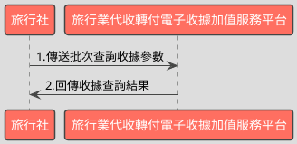

# 批次查詢收據開立資料API

> 本文件包含 **AES256 加密、SHA256 簽章** 規格，詳見下方對應章節

---

## API 基本資訊

| 項目 | 內容 |
|:-----|:-----|
| 副標題 | 批次查詢收據開立資料 |
| 串接方式 | 幕後 |
| Content-Type | `application/x-www-form-urlencoded` |
| 加密方式 | AES256、SHA256 |
| 正式環境 URL | https://api.travelinvoice.com.tw/invoice_searchall |
| 測試環境 URL | https://capi.travelinvoice.com.tw/invoice_searchall |

---

## 欄位定義

### Post 參數（請求） [POST]

| 欄位名稱 | 中文說明 | 型別 | 長度 | 必填 | 預設值 | 允許值 | 可為空 | 範例 | 備註 |
|----------|----------|------|------|------|--------|--------|--------|------|------|
| MerchantID_ | 旅行社統一編號 | string | 8 | 必填 |  |  |  | 54352706 | 旅行社統一編號。 |
| SearchType_ | 搜尋種類 | int | 1 | 選填 |  | 1 |  | 1 | 固定帶 1 |
| PostData_ | 加密資料 | array |  | 必填 |  |  |  |  | 字串欄位組合後做AES256加密，欄位說明如下表 |

### PostData_內含欄位（請求）　AES加密_字串

| 欄位名稱 | 中文說明 | 型別 | 長度 | 必填 | 預設值 | 允許值 | 可為空 | 範例 | 備註 |
|----------|----------|------|------|------|--------|--------|--------|------|------|
| Version | 串接程式版本 | string | 5 | 必填 |  | 2.0 |  | 2.0 | 固定帶 2.0 |
| TimeStamp | 時間戳記 | string | 30 | 必填 |  |  |  | 1400137200 | 自從 Unix 纪元（格林威治時間 1970 年1 月 1 日 00:00:00）到當前時間的秒數，若以 php 程式語言為例，即為呼叫time()函式所回傳的值。 例：2014-05-15 15:00:00 這個時間的時間，戳記為 1400137200，建議帶入當前時間 |
| InvoiceFrom | 收據來源 | int | 1 | 選填 |  | 0,1 |  | 1 | 0＝API 建立 1＝官網操作建立 |
| InvoiceStatus | 收據狀態 | int | 1 | 選填 |  | 0,1,2,3 |  | 1 | 0＝預約開立 1＝已開立 2= 取消預約開立 3＝已作廢 |
| AllowStatus | 折讓狀態 | int | 1 | 選填 |  | 0,1 |  | 0 | 0=已開立，並且未有折讓 1=已開立，且有折讓 （當［InvoiceStatus］參數值為 1 時，［AllowStatus］參數才會列入查詢條件） |
| Category | 收據種類 | string | 5 | 選填 |  | B2B, B2C |  | B2B | B2B=買受人為營利事業單位(有統編) B2C=買受人為個人 |
| SellerName | 經辦人名稱 | string | 50 | 選填 |  |  |  | 丁小雨 | 可過濾特定經辦人開立之收據。 為精確比對，需輸入完整無誤之經辦人名稱，方可進行比對。 |
| MerchantOrderNo | 自訂編號 | string | 30 | 選填 |  |  |  | 自訂編號 | 旅行社於開立收據時輸入的自訂編號 |
| StartDate | 查詢起始日期 | datetime |  | 必填 |  |  |  | 2016-02-25 | 查詢區間起始（收據開立時間）例：2016-02-25 |
| EndDate | 查詢結束日期 | datetime |  | 必填 |  |  |  | 2016-02-25 | 1.查詢區間結束（收據開立時間）例：2016-02-25 2.查詢日期區間最長為 90 天，系統會抓取當前日曆天進行天數計算。例 : 若查詢起始日期為 09-01，最長可接受之查詢結束日期為 11-29-23:59:59 |

### 系統回應訊息（回應）

| 欄位名稱 | 中文說明 | 型別 | 長度 | 範例 | 必回傳 | 備註 |
|----------|----------|------|------|------|--------|------|
| Status | 回傳狀態 | int | 10 | SUCCESS | Y | 1.查詢成功，則回傳 SUCCESS 2.查詢失敗，則回傳錯誤代碼 |
| Message | 回傳訊息 | string | 30 | 查詢開立收據成功 | Y | 文字，此次回傳狀態說明 |
| MerchantID | 旅行社統一編號 | string | 8 | 54352706 | Y | 旅行社統一編號。 |
| ReturnInvoice | 回傳的收據資料 | array |  |  | Y | 內容為 JSON 格式字串。查詢失敗此欄位回傳空值 |
| CheckCodeSearch | 檢查碼 | string | 150 | A791D7C1D64093962939B54CC1C07E8109EB8C454E0DC18F822BBA076EB38E66 | Y | 用來檢查此次資料回傳的合法性，串接時可以比對此參數資料，來檢核是否為平台所回傳，檢核方法請參考”SHA256加密說明”。如開立失敗則回傳空值。  CheckCodeSearch = 將MerchantID,StartDate,EndDate,TimeStamp 依 SHA256 簽章規格計算所得之雜湊值  TimeStamp 為本次查詢送出之時間戳記。 |

### ReturnInvoice內含欄位（回應）

| 欄位名稱 | 中文說明 | 型別 | 長度 | 範例 | 必回傳 | 備註 |
|----------|----------|------|------|------|--------|------|
| InvoiceTransNo | 開立流水號 | string | 20 | 193060 |  | 收據開立時產生的系統流水號。 |
| MerchantOrderNo | 自訂編號 | string | 30 | 202005010000008 |  | 1. 旅行社於開立收據時輸入的自訂編號。 2. 若自訂編號為重覆多筆，則回傳相對應的收據資料。 |
| InvoiceNumber | 收據號碼 | string | 9 | T13671008 |  | 此次查詢的收據號碼 |
| RandomNum | 收據防偽隨機碼 | string | 4 | 85767715 |  | 於開立收據時，所產生的 8 碼收據防偽隨機碼。 |
| BuyerName | 買受人名稱 | string | 60 | 藍新科技 |  | 開立收據時的買受人名稱，個人姓名或營業人名稱。 |
| BuyerUBN | 買受人統一編號 | string | 10 | 54352706 |  | 1. 若為 B2B 收據，此欄位為買受人統一編號。 2. 若為 B2C 收據，此欄位為0。 |
| BuyerAddress | 買受人地址 | string | 200 | 北市南港區南港路2段 |  | 於開立收據時，該張收據的買受人地址。 |
| BuyerPhone | 買受人手機號碼 | string | 15 | 0922548789 |  | 於開立收據時，該張收據的買受人手機號碼。 |
| BuyerEmail | 買受人電子信箱 | string | 100 | abc@gmail.com |  | 於開立收據時，該張收據的買受人電子信箱。 |
| Category | 收據種類 | string | 5 | B2B |  | 該張收據的收據種類。 B2B=買受人為營利事業單位(有統編) B2C=買受人為個人 |
| TotalAmt | 收據金額 | string | 8 | 500 |  | 純數字，為收據總金額。 |
| CreateTime | 開立收據時間 | datetime |  | 2014-09-25 12:12:12 |  | 該張收據開立時間，例：2014-09-25 12:12:12。 |
| InvoiceStatus | 收據狀態 | int | 1 | 1 |  | 該張收據之收據狀態。 0＝預約開立 1＝已開立 2=取消預約開立 3＝已作廢 |
| ItemDetail | 商品明細 | text |  | [{"ItemNum":1,"ItemName":"退票","ItemCount":"1","ItemWord":"張","ItemPrice":"-500","ItemAmount":"-500"},{"ItemNum":2,"ItemName":"車票","ItemCount":"1","ItemWord":"張","ItemPrice":"500","ItemAmount":"500"},{"ItemNum":3,"ItemName":"手續費","ItemCount":"1","ItemWord":"件","ItemPrice":"20","ItemAmount":"20"}] |  | 該張收據開立時的商品資訊(JSON 格式)。 ItemNum = 品項序號 ItemName = 商品名稱 ItemCount = 數量 ItemWord = 單位 ItemPrice = 單價 ItemAmount = 小計 |
| TourName | 團名 | string | 200 | 北海道5日 |  | 該張收據的團名 |
| TourNo | 團號 | string | 50 | B_025465 |  | 該張收據的團號 |
| TourDate | 預計出團日 | string | 8 | 2026-05-03 |  | 該張收據出團日,出團日當天會發提醒信至指定信箱 |
| TaxNoted | 申報註記 | string | 1 | 0 |  | 0=未申報 1=已申報 |

---

## 錯誤代碼

> 以下錯誤代碼均於 **HTTP 200** 回應中回傳，錯誤訊息包含於 response body。

| 代碼 | 說明 |
|------|------|
| KEY10001 | 非旅行社 API 串接 IP |
| KEY10002 | 資料解密錯誤 |
| KEY10003 | 版本錯誤 |
| KEY10004 | 資料不齊全 |
| KEY10006 | 旅行社未申請啟用電子收據 |
| KEY10007 | 頁面停留超過 30 分鐘 |
| KEY10009 | 取不到旅行社統一編號的資料 |
| KEY10010 | 旅行社統一編號空白 |
| KEY10011 | PostData_欄位空白 |
| KEY10012 | 資料傳遞錯誤 |
| KEY10013 | 資料空白 |
| KEY10014 | TimeOut。通常泛指 I/O 上的 time out |
| KEY10015 | 收據金額格式錯誤 |
| KEY10016 | 旅行社無申請郵遞列印加值服務 |
| KEY10017 | 郵遞列印加值服務可用數不足 |
| KEY10018 | 開立人欄位未填寫 |
| KEY10019 | 旅行社已被停權 |
| KEY10020 | SearchType_欄位空白 |
| KEY10021 | ReturnType_欄位空白 |
| INV20014 | 統一編號格式有誤 |
| INV70001 | 欄位資料格式錯誤 |
| WEB1002 | 日期格式有誤 |
| NOR10001 | 網路連線異常 |
| BS10001 | 查詢區間錯誤 |
| BS10002 | 收據來源錯誤（請確認所帶入的收據來源參數） |
| BS10003 | 收據狀態錯誤（請確認所帶入的收據來源參數） |
| BS10004 | 收據種類錯誤（請確認所帶入的收據來源參數） |
| BS10005 | 取得查詢收據資料失敗（請多嘗試幾次，若一直出現此錯誤請聯繫客服） |
| BS10006 | 查無收據資料 |
| BS10007 | 折讓狀態錯誤（請確認所帶入的折讓單狀態參數） |
| BS10008 | 搜尋種類錯誤 |
| BS10009 | 折讓單來源錯誤（請確認所帶入的折讓單來源參數） |
| BS10010 | 折讓單狀態錯誤（請確認所帶入的折讓單來源參數） |
| BS10011 | 作廢單來源錯誤 |
| BS10012 | 作廢單狀態錯誤 |
| BS10013 | 日期區間有誤（最多查詢 90 日資料） |
| BS10014 | 日期區間有誤（起始日期不得大於結束日期） |

---

## 串接範例

### 請求範例

> 示範用 Key：`12345678901234567890123456789012`（32 bytes）　IV：`1234567890123456`（16 bytes）

> 外層請求參數組合格式：**String**，各必填欄位以 `欄位名稱=值` 形式，以 `&` 符號串接後傳送，簡單字串拼接 key=value&key=value，不做 URL encode

```http
POST https://api.travelinvoice.com.tw/invoice_searchall
Content-Type: application/x-www-form-urlencoded

MerchantID_=54352706&PostData_=78942f0afca77d7e464726ee053b1018da04ae2ecb132f4db2e693b79a1523d261c87ea6e713a2d528961375904af7a6fedaff43f6fd97b2c3a101692dc8e3eed65b0342ece6416f797b87b4ad5db231569548ea58530d95ca55deee64988f01
```

**PostData_（AES加密_字串）加密前明文（必填欄位）**

> 加密：AES-256-CBC，輸出：Hex，Key 與 IV 同上
> 欄位組合格式：**String**，各必填欄位以 `欄位名稱=值` 形式，以 `&` 符號串接後加密

```
Version=2.0&TimeStamp=1400137200&StartDate=2016-02-25&EndDate=2016-02-25
```

### 成功回應範例

> 回傳內容為 URL Encoded 字串，接收後請先進行 **URL Decode** 再解析。
> 注意：PHP 的 `parse_str()` 已內建 URL Decode；其他語言（Java、Python 等）請先手動 `urldecode` 後再逐欄解析。

> 外層回應格式：**JSON**，整體以 JSON 物件回傳

**系統回應**

```json
{
    "Status": "SUCCESS",
    "Message": "查詢開立收據成功",
    "MerchantID": "54352706",
    "ReturnInvoice": [
        {
            "InvoiceTransNo": "193060",
            "MerchantOrderNo": "202005010000008",
            "InvoiceNumber": "T13671008",
            "RandomNum": "85767715",
            "BuyerName": "藍新科技",
            "BuyerUBN": "54352706",
            "BuyerAddress": "北市南港區南港路2段",
            "BuyerPhone": "0922548789",
            "BuyerEmail": "abc@gmail.com",
            "Category": "B2B",
            "TotalAmt": "500",
            "CreateTime": "2014-09-25 12:12:12",
            "InvoiceStatus": 1,
            "ItemDetail": [
                {
                    "ItemNum": 1,
                    "ItemName": "退票",
                    "ItemCount": "1",
                    "ItemWord": "張",
                    "ItemPrice": "-500",
                    "ItemAmount": "-500"
                },
                {
                    "ItemNum": 2,
                    "ItemName": "車票",
                    "ItemCount": "1",
                    "ItemWord": "張",
                    "ItemPrice": "500",
                    "ItemAmount": "500"
                },
                {
                    "ItemNum": 3,
                    "ItemName": "手續費",
                    "ItemCount": "1",
                    "ItemWord": "件",
                    "ItemPrice": "20",
                    "ItemAmount": "20"
                }
            ],
            "TourName": "北海道5日",
            "TourNo": "B_025465",
            "TourDate": "2026-05-03",
            "TaxNoted": "0"
        }
    ],
    "CheckCodeSearch": "A791D7C1D64093962939B54CC1C07E8109EB8C454E0DC18F822BBA076EB38E66"
}
```

> 本 API 回應無加密欄位，上方 JSON 即為完整明文。

### 失敗回應範例

> 回傳內容為 URL Encoded 字串，接收後請先進行 **URL Decode** 再解析。
> 注意：PHP 的 `parse_str()` 已內建 URL Decode；其他語言（Java、Python 等）請先手動 `urldecode` 後再逐欄解析。

**系統回應**

```json
{
    "Status": "KEY10001",
    "Message": "非旅行社 API 串接 IP",
    "MerchantID": "54352706",
    "ReturnInvoice": "[]",
    "CheckCodeSearch": "A791D7C1D64093962939B54CC1C07E8109EB8C454E0DC18F822BBA076EB38E66"
}
```

**解密後明文**

> 失敗回應無需解密。

---

## 串接目的

電子收據開立後，透過時間區間與電子收據狀態，來進行所設定期間內的收據資料查詢

## 資料交換方式

1. 旅行社以「HTTP POST」方式傳送收據資料至電子收據平台進行開立。 
2. Content-Type 為 application/x-www-form-urlencoded。 
3. 編碼格式為 UTF-8。 
4. 電子收據平台回應格式化的字串。 
5. 各欄位計算單位為字元。中、英、數字、符號都算一個字元。 
6. 各欄位間以「&」作為連接符號，各欄位內不得含有此字元（U+0026）。

## 串接前置作業

（請先完成，否則程式必失敗）

 1. 取得 HashKey / HashIV
- 測試環境：登入測試區後台 → 基本資料 → API 串接設定 → 複製 HashKey 與 HashIV
- 正式環境：登入正式區後台 → 基本資料 → API 串接設定 → 複製 HashKey 與 HashIV

2. 申請 IP 白名單
- 申請窗口：於官網下載申請表單並填寫後，傳送後客服中心（傳真 / Email）
- 最多可設定 10 組 IP
- 需提供：伺服器對外 IP（非內網 IP，可至 https://ifconfig.me 查詢）
- 生效時間：通常 1-2 個工作天

3. 環境網址
-測試環境與正式環境是完全不同的設備，資料不共通，上線前務必要確認已經將串接網址切換至正式區網址

4. 常見「忘記做前置作業」的錯誤訊號
- `KEY10001 非旅行社 API 串接 IP` → IP 白名單未設定或設錯
- `KEY10002 資料解密錯誤` → HashKey / HashIV 不正確或仍是範例值
- `KEY10009 取不到旅行社統一編號的資料` → MerchantID 錯或未啟用

## 批次查詢收據開立資料呼叫流程圖



---

---

## AES256 加密規格

### 加密演算法規格

| 項目 | 規格 |
|:-----|:-----|
| 演算法 | AES |
| 金鑰長度 | 256 bits（32 bytes） |
| 加密模式 | CBC |
| 填充方式 | 類 PKCS7（32-byte 邊界，非標準） |
| 輸出格式 | Hex 十六進位 |
| 輸入編碼 | UTF-8 |
| Key 長度 | 32 bytes |
| IV 長度 | 16 bytes |

> 本文件的「**Key**」即實際串接金鑰 **HashKey**；「**IV**」即 **HashIV**。

> ⚠️ **注意：本 API 採用類 PKCS7 演算法，但以 32 bytes 為填充邊界（非 AES 標準的 16 bytes），必須特別處理**
>
> 標準 PKCS7 以 AES block size（**16 bytes**）為補齊單位；本 API 採用 **32 bytes** 作為填充邊界，屬類 PKCS7 的自訂規格。
> 各語言標準加密函式庫（PHP `openssl`、Node.js `crypto`、Python `pycryptodome`）的預設 PKCS7 均使用 16-byte 邊界，**直接呼叫內建 PKCS7 將產生錯誤的填充**，導致對方解密失敗。
> **實作時必須手動計算 32-byte 邊界填充，並停用函式庫的自動填充**（PHP：`OPENSSL_ZERO_PADDING`；Node.js：`cipher.setAutoPadding(false)`；Python：`pad(..., 32)`）。

### 適用欄位群組

- **PostData_內含欄位**（AES加密_字串）（請求）　傳送欄位名稱：`PostData_`

### 加密範例

> 以下為固定示範數值，**請勿用於正式環境**。
> 本範例已採用類 PKCS7（32-byte 邊界）填充計算，與標準 PKCS7（16-byte 邊界）結果**不同**。

| 項目 | 值 |
|:-----|:---|
| Key（ASCII，32 bytes） | `12345678901234567890123456789012` |
| IV（ASCII，16 bytes） | `1234567890123456` |
| 加密前字串（plaintext） | `Version=2.0&TimeStamp=1400137200&StartDate=2016-02-25&EndDate=2016-02-25` |
| 加密後（Hex 十六進位） | `78942f0afca77d7e464726ee053b1018da04ae2ecb132f4db2e693b79a1523d261c87ea6e713a2d528961375904af7a6fedaff43f6fd97b2c3a101692dc8e3eed65b0342ece6416f797b87b4ad5db231569548ea58530d95ca55deee64988f01` |

> 驗證方法：使用上述 Key / IV 對加密後字串解密，應還原為加密前字串。

---

## SHA256 簽章規格

### 簽章規格

| 項目 | 規格 |
|:-----|:-----|
| 演算法 | SHA-256 |
| 輸出格式 | 十六進位字串（大寫） |
| Key 欄位名稱 | `HashKey` |
| IV 欄位名稱 | `HashIV` |
| 字串組合方式 | **前IV後KEY** |
| 參與簽章欄位 | `MerchantID,StartDate,EndDate,TimeStamp` |

### 字串組合說明

組合方式：**前IV後KEY**

參與簽章的欄位（依下列順序排列）：`MerchantID`、`StartDate`、`EndDate`、`TimeStamp`

> **欄位順序**：組合字串時，請依照本文件設定的欄位清單順序排列，**不可任意調換**。

```
HashIV={IV值}&{欄位1}={值1}&...&HashKey={Key值}
```

以 `HashIV={iv}` 開頭，接各參與欄位（依序），最後以 `HashKey={key}` 結尾，各段以 `&` 分隔。

### 簽章範例

> 以下為固定示範數值，**請勿用於正式環境**。

| 項目 | 值 |
|:-----|:---|
| HashKey | `abc1234567890def` |
| HashIV | `xyz0987654321uvw` |
| MerchantID | `54352706` |
| StartDate | `2016-02-25` |
| EndDate | `2016-02-25` |
| TimeStamp | `1400137200` |
| **組合後字串** | `HashIV=xyz0987654321uvw&MerchantID=54352706&StartDate=2016-02-25&EndDate=2016-02-25&TimeStamp=1400137200&HashKey=abc1234567890def` |
| **SHA256 雜湊（大寫）** | `0494E2C30143DE0C207C96B8BC207E1DA522D5BDABA68F521CA962F7892741A7` |

> 驗證方法：將上述組合後字串進行 SHA256 計算並轉大寫，應得到上方雜湊值。

